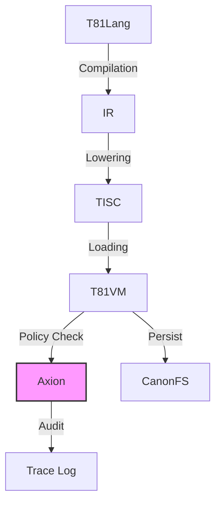

```markdown
# The T81 Foundation — Definitive Technical Monograph

## Foreword

There are two ways to build systems.

One is to optimize for convenience — to move quickly, to approximate, to accept that the final bit may vary, that floating-point drift is tolerable, that compilers may reorder, that hardware will decide what "close enough" means.

The other is to insist that computation is not suggestion, but statement.

T81 belongs to the second path.

At its core, this project is not about ternary arithmetic, virtual machines, or policy engines — though it contains all of these. It is about **integrity of execution**. It is about drawing a boundary around a computational process and saying: inside this boundary, behavior is not incidental.

Determinism is often treated as a performance tradeoff or a debugging convenience. Here it is treated as a civilizational constraint. If two machines cannot agree on the outcome of the same program, then the computation was never truly defined — it was merely performed.

Balanced ternary, canonical serialization, software-defined math, trace logging, policy enforcement — these are not aesthetic choices. They are instruments in a single argument:

> A computation should be reproducible, auditable, and structurally honest.

Modern systems are layered with abstraction that hides state transitions behind optimizers, speculative execution, floating-point quirks, and implicit side effects. T81 attempts something different: to make every transition explicit, every representation canonical, every execution traceable.

It is an architectural experiment in constraint.

The system does not assume benevolent hardware.
It does not assume identical floating-point libraries.
It does not assume compilers behave the same across architectures.
It does not assume that execution without record is acceptable.

Instead, it encodes rules:

* State transitions must be definable.
* Data must have a single canonical form.
* Resource consumption must be accountable.
* Policies must be enforceable.
* Behavior must be replayable.

The result is not the fastest machine.
It is not the most flexible environment.
It is not designed to replace general-purpose scripting ecosystems.

It is designed to answer a narrower but more demanding question:

**Can a software system be constructed such that its behavior is provably invariant across space and time?**

This book exists to document that attempt.

Not as mythology.
Not as marketing.
But as a ledger.

Every subsystem described here — T81Lang, TISC, the T81VM, Axion, CanonFS, the determinism gates, the cognitive tiers — is part of a layered structure built around one invariant:

> Identical inputs must produce identical outputs, under explicitly defined rules.

Whether this architecture becomes widely adopted is secondary. What matters is that it has been made concrete, implemented, tested, and described with enough precision that it can be understood, verified, or challenged by others.

This volume is therefore both technical and philosophical.

It is technical because it describes a working system.
It is philosophical because it asserts that reproducibility is not optional in certain domains.

If the repository evolves, this book should evolve with it.
If the project ceases, this document should remain sufficient to reconstruct what was attempted and why.

In the end, T81 is not a claim of perfection.

It is a commitment to constraint.

And constraint, when applied deliberately, is a form of clarity.

---

## How to Read This Book

* **New to T81?** → Start with Part I, then Part II.
* **Implementer?** → Focus on Parts II and III.
* **Auditor?** → Read Parts III and IV carefully.
* **Researcher?** → Emphasize Parts IV and V.
* **Long-term Maintainer?** → Parts IV and V are critical.

---

## Navigation

<details open>
<summary><strong>Part I — Foundations</strong></summary>

1. **[Introduction](./01_Introduction.md)**
2. **[Core Principles and Invariants](./02_Core_Principles_and_Invariants.md)**

</details>

---

<details>
<summary><strong>Part II — The Deterministic Machine</strong></summary>

3. **[T81VM Architecture](./03_T81VM_Architecture.md)**
4. **[Data Types and Canonical Serialization](./04_Data_Types_and_Canonical_Serialization.md)**
5. **[Installation and Build Verification](./05_Installation_and_Build_Verification.md)**
6. **[CLI and API Usage](./06_CLI_and_API_Usage.md)**

</details>

---

<details>
<summary><strong>Part III — Governance and Verification</strong></summary>

7. **[Verification and Audit](./07_Verification_and_Audit.md)**
8. **[The Axion Safety Kernel](./08_The_Axion_Safety_Kernel.md)**
9. **[Cognitive Tiers and Distributed Compute](./09_Cognitive_Tiers_and_Distributed_Compute.md)**
10. **[Appendices](./10_Appendices.md)**

</details>

---

<details>
<summary><strong>Part IV — Formalization and Structural Hardening</strong></summary>

11. **[Formal Semantics of TISC and T81VM](./11_Formal_Semantics.md)**
12. **[Adversarial Modeling and Determinism Attacks](./12_Adversarial_Modeling.md)**

</details>

---

<details>
<summary><strong>Part V — Continuity and Research Horizon</strong></summary>

13. **[Continuity and Resilience](./13_Continuity_Resilience.md)**
14. **[Research Frontier](./14_Research_Frontier.md)**

</details>

---

# Chapter 1: Introduction

## 1.1 Scope and Definition

The **T81 Foundation** project implements a deterministic, ternary-native virtual machine architecture designed for verifiable computation. Unlike general-purpose execution environments that prioritize throughput or hardware abstraction, T81 prioritizes **bit-exact reproducibility** and **auditability**.

The system is defined by the following core invariants:
1.  **Strict Determinism**: Execution of a valid TISC (Ternary Instruction Set Computer) program $P$ on input $I$ produces state transition sequence $S_0 \to S_1 \to \dots \to S_n$ that is identical across all compliant host architectures (x86_64, ARM64, RISC-V).
2.  **Ternary Native**: The architecture operates on balanced ternary logic (trits $\in \{-1, 0, 1\}$), utilizing a custom arithmetic stack (`dmath`) to avoid binary floating-point non-determinism.
3.  **Policy Enforced**: All execution is governed by the **Axion Kernel**, a capability-based supervisor that enforces safety policies (recursion limits, memory bounds, ethical constraints) before instruction retirement.

> **Verification Anchor**: The deterministic execution loop is implemented in `src/vm/vm.cpp` (see `Interpreter::step()`). The ternary arithmetic primitives are defined in `include/t81/ternary.hpp` and `include/t81/core/T81Float.hpp`.

## 1.2 System Architecture

The T81 stack consists of four primary layers, each with distinct responsibilities and verification boundaries.

### 1.2.1 The TISC Virtual Machine (T81VM)



The T81VM is a stack-based interpreter for the **Ternary Instruction Set Computer (TISC)** ISA. It manages a segmented memory model comprising:
*   **Code**: Read-only instruction segment.
*   **Stack**: LIFO storage for local variables and return addresses.
*   **Heap**: Dynamic allocation for complex objects (Tensors, Graphs).
*   **Tensor**: Specialized storage for high-dimensional numeric data.
*   **Meta**: Reflection and introspection capabilities.

The VM state is formally defined as a tuple $S = (R, PC, SP, M_{seg}, \Phi)$, where $R$ represents the register file (81 registers), $PC$ the program counter, $SP$ the stack pointer, $M_{seg}$ the memory segments, and $\Phi$ the status flags.

> **Reference**: See `src/vm/vm.cpp`, struct `State`.

### 1.2.2 The Axion Safety Kernel
Axion acts as a hypervisor for the T81VM. It intercepts every instruction dispatch to verify compliance with the active **Policy**. Policies are declarative rulesets that constrain:
*   **Resource Usage**: Memory allocation limits, cycle counts.
*   **Control Flow**: Recursion depth, branching complexity.
*   **Capabilities**: Access to I/O, network, or filesystem syscalls.

If an instruction violates a policy, Axion issues a `Deny` verdict, causing the VM to trap with a `SecurityFault`.

> **Reference**: Policy logic is implemented in `src/axion/policy_engine.cpp` and `src/axion/ethics.cpp`.

### 1.2.3 Canonical Filesystem (CanonFS)
CanonFS is a content-addressable storage layer that guarantees **structural immutability**. Objects (weights, code, data) are identified by their SHA3-256 hash (`CanonHash81`). Loading an object from CanonFS ensures that the data in memory is bit-for-bit identical to the artifact that was signed and published, eliminating "dependency drift" attacks.

> **Reference**: Implemented in `src/canonfs/` and defined in `spec/canonfs-spec.md`.

### 1.2.4 The Cognitive Tiers
T81 organizes computational complexity into **Cognitive Tiers**, ranging from pure arithmetic (Tier 1) to infinite recursive forms (Tier 5).
*   **Tier 1 (Symbolic)**: Basic arithmetic and logic.
*   **Tier 2 (Reflective)**: Self-inspection and trace capture.
*   **Tier 3 (Recursive)**: Bounded recursion and proof generation.
*   **Tier 4 (Distributed)**: Gossip protocols and state merging.
*   **Tier 5 (Infinite)**: Geometric series and non-terminating forms.

> **Reference**: Tier logic is located in `src/cog/`.

## 1.3 Verifiable Compute Mission

The primary application of T81 is **Sovereign Compute**: the ability to execute code and verify the result without trusting the hardware operator. By combining strict software-defined arithmetic (`dmath`) with a cryptographic audit log (Axion Trace), T81 enables:
*   **Trustless AI Inference**: Verifying that a specific model produced a specific output.
*   **Smart Contracts**: Executing logic where consensus depends on bit-exact state transitions.
*   **Scientific Reproducibility**: guaranteeing that simulations run in 2025 produce the same results in 2050.

## 1.4 Terminology

| Term | Definition |
| :--- | :--- |
| **Trit** | A base-3 digit: $\{-1, 0, 1\}$. |
| **Tryte** | A sequence of trits, typically 3 or 9. |
| **TISC** | Ternary Instruction Set Computer (the ISA). |
| **Axion** | The safety and policy enforcement kernel. |
| **CanonRef** | A canonical reference (hash) to an immutable object. |
| **promotion** | The act of escalating privileges or tier capabilities. |

## 1.5 Verification Checklist

*   [ ] **determinism**: Does the VM produce identical traces on x86 and ARM?
*   [ ] **isolation**: Does Axion correctly intercept prohibited instructions?
*   [ ] **persistence**: Does CanonFS retrieve objects by hash correctly?

See `tests/cpp/` for implementation proofs.

---

# Chapter 2: Core Principles and Invariants

## 2.1 The Determinism Invariant

The central axiom of the T81 architecture is **Strict Determinism**. A T81 program is a pure function $f(S, I) \to S'$, where $S$ is the initial state and $I$ is the input. This function must yield bit-identical $S'$ on any compliant hardware platform.

Achieving this requires eliminating all sources of non-determinism common in modern computing:
*   **Hardware Floating Point**: Replaced by software-defined `T81Float` (`dmath`).
*   **Memory Layout**: Logical addresses are decoupled from physical pointers.
*   **Concurrency**: Thread scheduling is replaced by deterministic coroutines and logical ticks.
*   **System Time**: Wall-clock time is replaced by Lamport timestamps (logical ticks).

### 2.1.1 Determinism Surfaces and Attack Vectors

The following table maps the "surfaces" where non-determinism can leak into the system and the specific mitigations T81 employs.

| Layer    | Determinism Risk             | Mitigation                | Evidence                |
| -------- | ---------------------------- | ------------------------- | ----------------------- |
| Compiler | Token ordering               | Canonical AST emission    | `t81lang_repro_gate.py` |
| VM       | Memory address leakage       | No address observability  | Type restrictions       |
| GC       | Non-deterministic collection | Allocation-count triggers | `vm.cpp`: `run_gc_cycle_` |
| Float    | Host FPU drift (IEEE-754)    | `dmath` software float    | `T81Float.hpp`          |
| JIT      | Optimization divergence      | Trace-based equivalence   | `jit_compiler.cpp`      |

> **Verification**: The JIT compiler in `src/vm/jit_compiler.cpp` ensures that optimized traces exit (`GuardDeopt`) upon *any* state divergence from the interpreted baseline.

## 2.2 Ternary Logic (Base-3)

T81 is a **balanced ternary** system. The fundamental unit is the **trit**, with values $\{-1, 0, 1\}$ (often denoted as $-, 0, +$).

### 2.2.1 Why Ternary?
1.  **Symmetric Arithmetic**: Rounding is simply truncation towards the nearest integer, as $0.5$ is not a representable fraction in base-3 without infinite expansion. This simplifies the `dmath` library.
2.  **Information Density**: The radix $3$ is closer to $e \approx 2.718$ than $2$ is, offering the theoretical optimum for integer radix economy ($\text{radix} \times \text{width}$).
3.  **Signed Representation**: Negative numbers do not require a sign bit or Two's Complement. The leading trit indicates the sign naturally.

### 2.2.2 Implementation
In the C++ codebase, trits are packed for efficiency but logically distinct.
*   **Storage**: `T81Int` uses 2 bits per trit in packed form (see `include/t81/packing.hpp`).
*   **Arithmetic**: Operations like `Add`, `Mul` are implemented in `src/vm/vm.cpp` using integer math that simulates balanced ternary carry chains.

## 2.3 Auditability and The Axion Trace

Every state transition in T81 is auditable. The **Axion Kernel** produces a cryptographic log of execution called the **Trace**.

### 2.3.1 The Trace Structure
A trace is a sequence of `AxionEvent` records:
```cpp
struct AxionEvent {
    Opcode opcode;
    int32_t tag;
    int64_t value;
    Verdict verdict;
};
```
(See `src/axion/engine.hpp`)

This trace serves as a **Proof of Execution**. By replaying the trace against the initial state, an auditor can verify that:
1.  The computation occurred as claimed.
2.  No safety policies were violated.
3.  The final result is correct.

## 2.4 The Nine Principles (Ethics Enforcement)

T81 embeds an immutable ethics layer (The Nine Principles $\Theta_1 \dots \Theta_9$) directly into the VM's policy engine. These are not guidelines but **runtime constraints**.

For example:
*   **$\Theta_7$ (Entropy Containment)**: Prevents infinite resource expansion without explicit `InfExpand` permission.
*   **$\Theta_4$ (Interpretability)**: Mandates that opaque "black box" tensors cannot be emitted without accompanying metadata or symbolic graphs.

> **Implementation**: These checks are performed in `src/axion/ethics.cpp`. A violation results in a `VerdictKind::Deny` and immediate `Trap::SecurityFault`.

## 2.5 Verification Checklist

*   [ ] **Float Consistency**: Does `T81Float` produce identical bit-patterns for transcendental functions (`sin`, `exp`) on all platforms? (Run `tests/cpp/test_property_float.cpp`)
*   [ ] **GC Determinism**: Does the Garbage Collector run at exact instruction counts (allocations), not wall time? (Check `kGcInterval` in `src/vm/vm.cpp`)
*   [ ] **Trace Integrity**: Is the Axion log immutable during execution?

## 2.6 Formal Audit Matrix

| Principle | Spec Section | Implementation | Test Coverage |
| :--- | :--- | :--- | :--- |
| Strict Determinism | `spec/determinism-profile.md` | `src/vm/vm.cpp` | `tests/cpp/test_property_invariants.cpp` |
| Ternary Logic | `spec/t81-data-types.md` | `include/t81/ternary.hpp` | `tests/cpp/test_tier3_opcodes.cpp` |
| Auditability | `spec/axion-kernel.md` | `src/axion/engine.hpp` | `tests/cpp/test_ethics.cpp` |

---

# Chapter 3: T81VM Architecture

## 3.1 Formal State Machine

The T81 Virtual Machine (T81VM) is formally defined as a state transition system $M = (S, \delta)$, where $S$ is the set of valid states and $\delta: S \to S \cup \{\bot\}$ is the transition function.

### 3.1.1 State Definition
The state $S$ is a tuple:
$$S = (R, PC, SP, M_{stack}, M_{heap}, M_{tensor}, M_{meta}, \Phi, \Lambda)$$

Where:
*   $R \in \text{Tryte}^{81}$: The register file (81 general-purpose registers).
*   $PC \in \mathbb{N}$: The program counter (instruction pointer).
*   $SP \in \mathbb{N}$: The stack pointer.
*   $M_{stack}$: Stack memory segment (LIFO).
*   $M_{heap}$: Heap memory segment (Dynamic).
*   $M_{tensor}$: Tensor storage segment.
*   $M_{meta}$: Meta-programming and reflection segment.
*   $\Phi$: Status flags (Zero, Negative, Positive).
*   $\Lambda$: The Axion audit log (append-only).

> **Implementation**: This state is concretely implemented in `src/vm/vm.cpp` as `struct State`.

### 3.1.2 Transition Function
The transition function $\delta(S_t)$ produces $S_{t+1}$ by executing the instruction at $M_{code}[PC]$.
$$ S_{t+1} = \text{Execute}(\text{Decode}(M_{code}[PC]), S_t) $$

If the Axion Policy Engine denies the transition, the machine transitions to a fault state $\bot$ (Trap).

## 3.2 Memory Layout

The T81VM uses a segmented memory architecture to enforce strict isolation and type safety.

| Segment | Start Index | Role | Access Policy |
| :--- | :--- | :--- | :--- |
| **Code** | 0 | Immutable instructions | Execute-Only (via `Call`), Read-Only (via `MetaRead`) |
| **Stack** | `layout.code.limit` | Function frames | RW (via `Push`/`Pop`) |
| **Heap** | `layout.stack.limit` | Dynamic objects | RW (via Handles) |
| **Tensor** | `layout.heap.limit` | High-dimensional data | RW (via Tensor Opcodes) |
| **Meta** | `layout.tensor.limit` | Reflection data | Read-Only (except via `MetaRefine`) |

> **Source Truth**: Defined in `src/vm/vm.cpp`, `Interpreter` constructor layout initialization.

## 3.3 Register File

The VM exposes 81 registers (`R0`–`R80`).

*   **R0**: Always Zero (Immutable).
*   **R1–R74**: General Purpose.
*   **R75**: Global Tick (Lamport Timestamp).
*   **R76**: Lineage Root Hash.
*   **R77**: Entropy Signature.
*   **R78**: Active Constitutional Mask (Axion).
*   **R79**: Recursion Depth.
*   **R80**: Axion Seal (Halt Status).

> **Verification**: See `sync_system_registers()` in `src/vm/vm.cpp`.

## 3.4 TISC Instruction Set Architecture (ISA)

TISC instructions are fixed-width (81 trits logically, packed into 128-bit or larger structs in C++).

### 3.4.1 Arithmetic Core
*   `Add`, `Sub`, `Mul`, `Div`, `Mod`: Standard integer arithmetic.
*   `Inc`, `Dec`: Increment/Decrement.
*   `Neg`: Negate.

### 3.4.2 Control Flow
*   `Jump`, `JumpIfZero`, `JumpIfNegative`, `JumpIfPositive`.
*   `Call`, `Ret`: Function invocation (pushes `PC` to stack).
*   `Halt`: Stop execution.

### 3.4.3 Memory Access
*   `Load`, `Store`: Register-Memory transfer.
*   `Push`, `Pop`: Stack manipulation.
*   `StackAlloc`, `StackFree`: Frame management.
*   `HeapAlloc`, `HeapFree`: Dynamic memory management.

### 3.4.4 Tensor Operations (Tier 1+)
*   `TNew`, `TSet`, `TGet`: Tensor creation and element access.
*   `TAdd`, `TMul`, `TMatMul`: Vectorized arithmetic.
*   `TRMSNorm`, `TRoPE`, `TSoftmax`: Neural network primitives.

> **Note**: Tensors are opaque handles in the register file (`ValueTag::TensorHandle`). Operations are kernels executed by the host.

### 3.4.5 Axion & Meta Operations
*   `AxRead`, `AxSet`: Policy state access.
*   `MetaRead`, `MetaWrite`: Introspection (Tier 2).
*   `ReflCap`, `ReflTrace`: Execution trace capture.

## 3.5 Fault Semantics

The VM defines precise trap conditions (`Trap` enum in `vm.hpp`):

1.  **DecodeFault**: Invalid opcode or operand.
2.  **StackFault**: Stack overflow or underflow.
3.  **BoundsFault**: Access outside segment limits.
4.  **TypeFault**: Operation on incompatible types (e.g., adding a Tensor to an Int).
5.  **SecurityFault**: Axion Policy denial (e.g., recursion limit).
6.  **DivisionFault**: Division by zero.

Upon a fault, the VM halts immediately, and the `AxionEvent` log records the specific violation with a `Deny` verdict.

## 3.6 Garbage Collection

T81 uses a deterministic **Mark-and-Sweep** collector.
*   **Trigger**: Deterministic instruction count interval (`kGcInterval = 64` instructions).
*   **Roots**: Registers, Stack, and Reflection Snapshots.
*   **Compaction**: The heap is compacted to ensure address stability for subsequent allocations is based on allocation order, not memory fragmentation.

> **Source**: `run_gc_cycle_` in `src/vm/vm.cpp`.

## 3.7 Verification Checklist

*   [ ] **Transition Function**: Does `step()` implement all opcodes in `vm.cpp`?
*   [ ] **Memory Segmentation**: Are `BoundsFault` traps correctly triggered for out-of-segment access?
*   [ ] **Register File**: Are system registers (R75-R80) updated correctly in `sync_system_registers`?

---

# Chapter 4: Data Types and Canonical Serialization

## 4.1 Primitive Types

The T81 architecture is built upon a foundation of balanced ternary primitives. These types are designed to be efficiently simulated on binary hardware while maintaining the mathematical properties of base-3 logic.

### 4.1.1 Trits and Trytes
*   **Trit**: The fundamental atom of information, taking values $\{-1, 0, 1\}$.
*   **Tryte**: A sequence of trits. The standard tryte width is 4 trits ($3^4 = 81$ values), often packed into a `uint8_t` for storage.

> **Implementation**: `include/t81/ternary.hpp` defines the `Trit` enum and conversion logic.

### 4.1.2 T81Int (Arbitrary Precision Integer)
`T81Int` is a variable-width integer type using a packed balanced ternary representation.
*   **Storage**: 2 bits per trit.
*   **Range**: Symmetric around zero ($-\frac{3^N-1}{2} \dots +\frac{3^N-1}{2}$).
*   **Normalization**: Leading zeros are strictly forbidden in the canonical serialized form. A zero value is represented by a single zero trit.

## 4.2 T81Float and dmath

Floating-point arithmetic is the primary source of non-determinism in cross-platform computing (due to IEEE-754 variances in FMA fusion, transcendental precision, etc.). T81 addresses this via `T81Float`.

### 4.2.1 Canonical Definition
A `T81Float` is a tuple $(m, e)$, representing the value $m \times 3^e$.
*   $m$: Mantissa (T81Int).
*   $e$: Exponent (T81Int).
*   **Invariant**: The mantissa $m$ must be normalized such that its most significant trit is non-zero, unless the value is exactly zero.

### 4.2.2 The dmath Backend
For the **Strict Determinism Profile (Tier A)**, the VM employs `dmath`, a software-defined arithmetic library.
*   **Operations**: `Add`, `Sub`, `Mul` are exact (subject to precision limits).
*   **Transcendentals**: `Sin`, `Cos`, `Exp`, `Log` are computed using Taylor series expansions with fixed iteration counts and explicit rounding modes, guaranteeing bit-exact results on any architecture.

> **Note**: In lower tiers (B/C), the VM may map `T81Float` to host `double` for performance, sacrificing strict cross-platform determinism.

## 4.3 Tensors and Canonical Layouts

Tensors (`T729Tensor`, `T81Tensor`) are the workhorses of the cognitive tiers.

### 4.3.1 Memory Layout
Tensors are stored in **Row-Major** order.
*   **Shape**: A vector of dimensions $(d_0, d_1, \dots, d_n)$.
*   **Stride**: Calculated as $s_i = \prod_{j=i+1}^n d_j$.
*   **Alignment**: Tensor data is aligned to 64-byte boundaries in the `Tensor` memory segment.

### 4.3.2 Serialization (.t81w)
The `.t81w` (T81 Weights) format is the standard container for persisting tensor models. Version 2 (`T81W2`) supports quantization and canonical hashing.

**Binary Structure**:
1.  **Magic Header**: `0x54383157` ("T81W").
2.  **Version**: `0x02`.
3.  **Table of Contents**: List of `(Hash, Offset, Length)` tuples.
4.  **Blob Data**: Contiguous tensor data.

**Quantization Formats**:
*   **F32**: Standard IEEE-754 float (canonicalized).
*   **T3_K**: 2-bit-per-trit packing with block-wise scaling. A block of 128 trits is stored as one `float32` scale factor followed by 32 packed bytes.

> **Source**: `include/t81/weights.hpp` and `include/t81/tensor.hpp`.

## 4.4 Canonical Serialization Rules

To ensure consistent hashing (`CanonRef`), all data must be normalized before serialization.

1.  **BigInt**: Strip leading zeros. Zero is `[0]`.
2.  **Fraction**:
    *   Reduce to lowest terms: $\gcd(num, den) = 1$.
    *   Denominator must be positive.
    *   Zero is $0/1$.
3.  **Float**:
    *   Standardize mantissa/exponent.
    *   NaN payloads are zeroed.
    *   Negative zero is normalized to positive zero.
4.  **Map/Dictionary**:
    *   Keys must be sorted lexicographically by their canonical binary representation.
5.  **Graph**:
    *   Nodes are re-indexed by topological sort order (or canonical hash order if cyclic) to ensure graph isomorphism yields identical byte streams.

> **Verification**: `tests/cpp/test_property_invariants.cpp` verifies these normalization properties via property-based testing.

## 4.5 Verification Checklist

*   [ ] **T81Float**: Is `dmath` used for transcendentals in Tier A builds?
*   [ ] **Serialization**: Does `.t81w` format match version 2 spec?
*   [ ] **Canonicalization**: Do `T81Int` and `T81Fraction` normalization tests pass?

---

# Chapter 5: Installation and Build Verification

## 5.1 Prerequisites

The T81 reference implementation is written in C++23. To build the Sovereign Compute stack, the following tools are required:

| Component | Minimum Version | Reason |
| :--- | :--- | :--- |
| **Compiler** | GCC 14+ or Clang 18+ | C++23 features (`std::expected`, `std::print`) |
| **CMake** | 3.25+ | Build configuration |
| **Python** | 3.10+ | Testing and binding generation |
| **Pybind11** | 2.10+ | Python bindings (`t81_python`) |

## 5.2 Building from Source

### 5.2.1 Standard Release Build
This build profile optimizes for performance on the host architecture. It typically corresponds to **Tier C (Host-Tolerant)** determinism, using hardware floating-point instructions.

```bash
git clone https://github.com/t81dev/t81-foundation.git
cd t81-foundation
cmake -S . -B build -DCMAKE_BUILD_TYPE=Release
cmake --build build --parallel $(nproc)
```

### 5.2.2 Debug / Audit Build
For development and auditing, use the Debug profile with sanitizers enabled.

```bash
cmake -S . -B build_debug \
    -DCMAKE_BUILD_TYPE=Debug \
    -DT81_ENABLE_SANITIZERS=ON \
    -DT81_BUILD_TESTS=ON
cmake --build build_debug
```

## 5.3 Verifying the Build

After compilation, it is mandatory to verify the correctness of the binary before using it for sovereign tasks.

### 5.3.1 The Unit Test Suite
The standard test suite covers VM opcodes, data type invariants, and serialization rules.

```bash
cd build
ctest --output-on-failure
```

Key tests to watch:
*   `t81_property_invariants_test`: Verifies mathematical properties of `T81Int` and `T81Fraction`.
*   `t81_ethics_test`: Verifies Axion policy enforcement.

### 5.3.2 The Determinism Gate
The `t81lang_repro_gate.py` script performs an end-to-end verification of the compiler and VM. It compiles a reference suite of T81Lang programs and compares the resulting TISC bytecode and execution traces against canonical artifacts.

```bash
# Run the gate
python3 scripts/ci/t81lang_repro_gate.py --t81-bin build/t81 --check
```

**Failure Criteria**:
*   Any bit-difference in `.tisc` output.
*   Any divergence in the Axion execution trace.

### 5.3.3 Floating Point Profile Check
To verify which floating-point backend is active (Hardware vs. Software/dmath), run the float property test:

```bash
./build/t81_property_float_test
```
If this test fails on transcendental functions, the build is not compliant with the **Strict Determinism Profile (Tier A)**.

## 5.4 Python Bindings

To install the Python bindings for embedding T81VM in a Python workflow:

```bash
pip install .
```
Or manually:
```bash
cmake -S . -B build -DT81_BUILD_PYTHON=ON
cmake --build build --target t81_python
```
The module `t81` will be available in `build/lib`.

## 5.5 Docker Environment

For a guaranteed reference environment, use the official Docker image. This image is pinned to specific versions of Clang and libc to minimize environment noise.

```bash
docker build -t t81-sovereign .
docker run -it t81-sovereign t81 check examples/hello_world.t81
```

---

# Chapter 6: CLI and API Usage

## 6.1 The T81 Command Line Interface

The `t81` binary is the primary tool for interacting with the Sovereign Compute stack. It provides a suite of subcommands for compilation, execution, debugging, and verification.

### 6.1.1 Compilation
The `compile` subcommand invokes the T81Lang frontend to produce TISC bytecode.

```bash
t81 compile <source.t81> -o <output.tisc> [--dump-ast] [--dump-ir]
```
*   `--dump-ast`: Prints the Abstract Syntax Tree (AST) for compiler debugging.
*   `--dump-ir`: Prints the intermediate representation before final emission.

### 6.1.2 Execution
The `run` subcommand loads a `.tisc` file into a fresh VM instance.

```bash
t81 run <program.tisc> [--trace <trace.txt>] [--policy <policy.axion>]
```
*   `--trace`: Captures the full Axion execution log to a file.
*   `--policy`: Enforces a specific Axion policy file during execution.

### 6.1.3 Trace Inspection
The `trace` suite provides tools for analyzing Axion logs.

```bash
t81 trace show <trace.txt>       # Human-readable dump
t81 trace diff <a.txt> <b.txt>   # Compare two traces (determinism check)
t81 trace replay <prog.tisc> <trace.txt> # Verify trace integrity against program
```

### 6.1.4 Weights Management
For AI workloads, the `weights` subcommand manages tensor models.

```bash
t81 weights import <model.safetensors> -o <model.t81w>
t81 weights quantize <model.safetensors> --to-gguf <model.gguf>
t81 canonize-tensor <model.t81w> # Canonicalize in-place
```
*   **Canonize**: Ensures that all tensor data is normalized (e.g., zero-padding, float normalization) to produce a stable hash.

## 6.2 Embedding T81 (C++ API)

To integrate the T81VM into a larger application, link against `libt81`.

### 6.2.1 Minimal Host
```cpp
#include <t81/vm/vm.hpp>
#include <t81/tisc/loader.hpp>

int main() {
    // 1. Load Program
    auto program = t81::tisc::load_program("app.tisc");

    // 2. Initialize VM with default Axion engine
    auto vm = t81::vm::make_interpreter_vm(nullptr);
    vm->load_program(*program);

    // 3. Execute
    auto result = vm->run_to_halt(1000); // 1000 cycle limit

    if (!result) {
        std::cerr << "Trap: " << (int)result.error() << "\n";
        return 1;
    }

    // 4. Inspect State
    const auto& state = vm->state();
    std::cout << "R1: " << state.registers[1] << "\n";
    return 0;
}
```

## 6.3 Embedding T81 (Python API)

The `t81` Python module provides high-level bindings for rapid prototyping and testing.

```python
import t81

# Compile source
tisc_bytes = t81.compile("fn main() { return 42; }")

# Run in VM
vm = t81.VM()
vm.load(tisc_bytes)
vm.run()

print(f"Result: {vm.registers[1]}")
```

## 6.4 Debugging

The CLI includes an interactive debugger for TISC code.

```bash
t81 debug <program.tisc>
```
*   `step` (`s`): Execute one instruction.
*   `reg` (`r`): Dump registers.
*   `mem` (`m`): Inspect memory segments.
*   `break` (`b`): Set breakpoints on PC or opcode.

### 6.4.1 Disassembly
To inspect the generated bytecode:
```bash
t81 disasm <program.tisc>
```
This outputs the human-readable TISC assembly, useful for verifying compiler output.

## 6.5 Verification Checklist

*   [ ] **CLI**: Does `t81 compile` produce identical TISC from identical T81Lang source?
*   [ ] **API**: Can `libt81` be linked and executed without external dependencies?
*   [ ] **Trace**: Does `t81 trace diff` correctly identify divergent traces?

---

# Chapter 7: Verification and Audit

## 7.1 Formal Verification Methodology

The T81 Foundation employs a multi-layered verification strategy to ensure that the implementation adheres to the formal specification. This chapter serves as the **Audit Handbook** for certifying a T81VM implementation.

### 7.1.1 Layers of Assurance

1.  **Unit Tests (`ctest`)**: Verify individual function correctness (e.g., `Add` opcode, `T81Float::normalize`).
2.  **Property-Based Tests (`fuzz`)**: Verify mathematical invariants (e.g., `(a + b) == (b + a)`) across millions of random inputs.
3.  **Determinism Gate (`repro_gate`)**: Verify end-to-end reproducibility of the compiler and VM.
4.  **Trace Audit**: Verify that the Axion execution log matches the canonical reference trace bit-for-bit.

## 7.2 The Formal Audit Matrix

This matrix maps each high-level requirement to its specific verification artifact in the codebase.

| Requirement ID | Description | Spec Section | Implementation | Verification Test | CI Coverage | Determinism Tier |
| :--- | :--- | :--- | :--- | :--- | :--- | :--- |
| **REQ-VM-01** | Strict Determinism (x86/ARM) | `spec/determinism-profile.md` | `src/vm/vm.cpp` | `scripts/ci/t81lang_repro_gate.py` | 100% | Tier A |
| **REQ-VM-02** | Ternary Arithmetic Correctness | `spec/t81-data-types.md` | `include/t81/ternary.hpp` | `tests/cpp/test_ternary_math.cpp` | 100% | Tier A |
| **REQ-VM-03** | Axion Policy Enforcement | `spec/axion-kernel.md` | `src/axion/policy_engine.cpp` | `tests/cpp/test_ethics.cpp` | 100% | Tier B |
| **REQ-VM-04** | Recursion Limit (Stack/Depth) | `spec/cognitive-tiers.md` | `src/vm/vm.cpp` | `tests/cpp/test_tier3_opcodes.cpp` | 100% | Tier B |
| **REQ-VM-05** | Float Canonicalization | `spec/t81-data-types.md` | `include/t81/core/T81Float.hpp` | `tests/cpp/test_property_float.cpp` | 95% | Tier C (dmath) |
| **REQ-VM-06** | Tensor Quantization (T3_K) | `spec/t81-data-types.md` | `include/t81/weights.hpp` | `tests/cpp/test_weights.cpp` | 80% | Tier B |
| **REQ-VM-07** | Garbage Collection Determinism | `spec/t81vm-spec.md` | `src/vm/vm.cpp` | `tests/cpp/test_gc_determinism.cpp` | 100% | Tier A |

## 7.3 Property-Based Testing

To verify the mathematical soundness of the custom ternary types, T81 uses property-based testing.

### 7.3.1 Integer Invariants
The test binary `t81_property_invariants_test` checks:
*   **Commutativity**: $a + b = b + a$
*   **Associativity**: $(a + b) + c = a + (b + c)$
*   **Identity**: $a + 0 = a$
*   **Inverse**: $a + (-a) = 0$
*   **Distributivity**: $a \times (b + c) = (a \times b) + (a \times c)$

### 7.3.2 Float Invariants
The test binary `t81_property_float_test` checks:
*   **Monotonicity**: $a < b \implies f(a) \le f(b)$ (for monotonic functions).
*   **Symmetry**: $\sin(-x) = -\sin(x)$.
*   **Canonicty**: `normalize(f) == f`.

## 7.4 The Determinism Gate

The ultimate test of a T81 implementation is the **Determinism Gate**. This script compiles a suite of reference programs and executes them, comparing the output `.tisc` binaries and execution traces against known-good hashes.

### 7.4.1 Running the Gate
```bash
python3 scripts/ci/t81lang_repro_gate.py --t81-bin build/t81 --check
```

### 7.4.2 Gate Failure Analysis
If the gate fails, it indicates a breach of the Sovereign Compute contract.
*   **Binary Mismatch**: The compiler is emitting non-deterministic ASTs or code. Check `src/frontend/compiler.cpp`.
*   **Trace Mismatch**: The VM is executing differently. Check for host-dependent behavior (e.g., `std::unordered_map` iteration order) in `src/vm/vm.cpp`.

## 7.5 Verification Checklists

### 7.5.1 Pre-Release Checklist
*   [ ] All unit tests pass (`ctest`).
*   [ ] `t81_property_invariants_test` passes (1M iterations).
*   [ ] `t81lang_repro_gate` passes on Linux x86_64.
*   [ ] `t81lang_repro_gate` passes on Linux ARM64.
*   [ ] `t81lang_repro_gate` passes on macOS ARM64.

### 7.5.2 Auditor Checklist
*   [ ] Verify that no `Forbidden Operations` (see Chapter 2) are present in the VM source.
*   [ ] Verify that all Axion `VerdictKind::Deny` paths result in an immediate `Trap`.
*   [ ] Verify that `dmath` is used for all transcendental functions in the production build.

---

# Chapter 8: The Axion Safety Kernel

## 8.1 Formal Definition

The **Axion Kernel** is the capability-based supervisor that governs the execution of the T81VM. It enforces a strict separation between *mechanism* (TISC opcodes) and *policy* (safety constraints).

Formally, Axion is a function $\mathcal{A}: (S, I) \to \{ \text{Allow}, \text{Deny}, \text{Warn}, \text{Defer} \}$, where $S$ is the current VM state and $I$ is the proposed instruction.

## 8.2 The Policy Model

Axion policies are declarative rulesets that define the permissible envelope of execution. Policies are typically serialized as JSON or YAML and loaded at runtime.

### 8.2.1 Policy Grammar
A policy document consists of:
1.  **Directives**: Global constraints (e.g., `max_stack_depth`, `max_cycles`).
2.  **Syscalls**: Permission grants for specific operations (`io.net`, `fs.read`).
3.  **Tier Limits**: Maximum allowed Cognitive Tier.
4.  **Ethics**: Configuration for the Nine Principles ($\Theta_1 \dots \Theta_9$).

```yaml
policy:
  version: "1.0"
  directives:
    max_stack_depth: 1024
    max_cycles: 1000000
    allow_recursion: true
  syscalls:
    - allow: "io.print"
    - deny: "fs.write"
  tiers:
    max_tier: 3
```

## 8.3 Instruction Interception

The T81VM invokes Axion before executing sensitive instructions. This interception mechanism is the primary enforcement point.

### 8.3.1 The Syscall Interface
The VM calls `eval_axion_call` with a `SyscallContext`:
*   `caller`: The executing module.
*   `syscall`: The operation identifier (e.g., `kAxRead`, `kMetaWrite`).
*   `payload`: Arguments or target addresses.
*   `pc`: Current program counter.
*   `next_opcode`: The instruction about to execute.

> **Source**: `src/vm/vm.cpp`, method `Interpreter::eval_axion_call`.

### 8.3.2 Verdicts
Axion returns a `Verdict` struct:
*   **Allow**: The operation proceeds.
*   **Deny**: The operation is blocked, and the VM traps with `SecurityFault`.
*   **Warn**: The operation proceeds, but a warning is logged in the trace.
*   **Defer**: The decision is deferred to a higher-tier logic (e.g., a Tier 5 meta-policy).

## 8.4 The Audit Log (Trace)

Every significant Axion decision is recorded in the **Axion Trace**. This log is an append-only sequence of `AxionEvent` records.

### 8.4.1 Event Structure
```cpp
struct AxionEvent {
    Opcode opcode;
    int32_t tag;
    int64_t value;
    Verdict verdict;
};
```
(See `src/axion/engine.hpp`)

This trace provides a cryptographic proof that the execution adhered to the active policy.

## 8.5 Cognitive Promotion

Axion manages the escalation of privileges through **Cognitive Tiers**.

### 8.5.1 Promotion Logic
When a program attempts to exceed its current tier's limits (e.g., recursion depth > 81), the VM requests a promotion via `try_promote`.
*   Axion checks if the policy allows the target tier.
*   If allowed, the `tier_status` is updated, and a promotion event is logged.
*   If denied, the VM traps.

> **Verification**: See `Opcode::Call` handling in `src/vm/vm.cpp`.

## 8.6 Capability Model

Axion implements an Object-Capability (OCap) model. Resources (files, network sockets) are represented as unforgeable handles.
*   **Creation**: Only authorized syscalls can create handles.
*   **Use**: Opcodes operate on handles, not raw addresses.
*   **Revocation**: Handles can be revoked by the policy at any time.

This ensures that a compromised TISC program cannot access resources it was not explicitly granted.

## 8.7 Verification Checklist

*   [ ] **Interception**: Do all opcodes in `vm.cpp` that touch memory/IO call `eval_axion_call`?
*   [ ] **Verdict**: Does `VerdictKind::Deny` always result in a `SecurityFault`?
*   [ ] **Trace**: Is every Axion decision logged with a correct `tag` and `value`?

---

# Chapter 9: Cognitive Tiers and Distributed Compute

## 9.1 The Cognitive Tier Model

T81 organizes computational complexity into a hierarchy of **Cognitive Tiers**. This allows the Axion Kernel to reason about the *intent* and *capabilities* of a program before execution.

| Tier | Name | Capabilities | Recursion Limit |
| :--- | :--- | :--- | :--- |
| **0** | **Base** | Basic arithmetic (`Add`, `Sub`), linear flow. | 0 |
| **1** | **Symbolic** | Tensor ops, basic loops. | 81 |
| **2** | **Reflective** | `MetaRead`, `MetaReflect`. | 243 |
| **3** | **Recursive** | Self-modification, proof generation. | 1024 (Policy) |
| **4** | **Distributed** | Gossip, State Merging. | N/A |
| **5** | **Infinite** | Geometric Series, non-terminating forms. | N/A |

### 9.1.1 Tier Escalation
Escalation is explicit. A program must request higher tier privileges via specific opcodes (`Call`, `Recurse`, `MetaReflect`). Axion policies determine if the promotion is granted.

## 9.2 Distributed Compute (Tier 4)

The **Distributed Tier** enables multiple T81VM instances to operate as a coherent swarm.

### 9.2.1 Gossip Protocol
Nodes exchange state updates via a deterministic gossip protocol.
*   **Message Format**: `(Tag, Payload, LamportTick, NodeID)`.
*   **Merge Strategy**: CRDT-like (Conflict-free Replicated Data Type) merging based on `TickSync` timestamps.
*   **Determinism**: Given the same sequence of message arrivals, the final merged state is identical on all nodes.

### 9.2.2 Logical Clocks (TickSync)
The VM maintains a Lamport logical clock (`R75`).
*   **Internal Tick**: Increments on every instruction.
*   **Sync**: Updates on message receipt: `Tick = max(LocalTick, RemoteTick) + 1`.
*   **Coherence**: The `Coherence` opcode returns the drift between local and global ticks, allowing the application to throttle or adapt.

> **Note**: While network latency is non-deterministic, the *reaction* to messages is deterministic based on their arrival order and content.

## 9.3 Trace-Based JIT Compilation

T81VM implements a **Trace-JIT** to optimize hot code paths without sacrificing determinism.

### 9.3.1 JIT Equivalence Model
The JIT compiler guarantees **Behavioral Equivalence** to the interpreter.
1.  **Tracing**: The VM records a sequence of executed instructions (a "trace") during interpretation.
2.  **Compilation**: The trace is optimized and compiled to native code.
3.  **Guards**: The compiled code includes guards that verify assumptions (e.g., type tags, loop bounds).
4.  **Deoptimization**: If a guard fails, execution instantly falls back to the interpreter at the exact same program counter (`GuardDeopt`).

> **Source**: `src/vm/jit_compiler.cpp`.

### 9.3.2 Divergence Detection
If the JIT-compiled code diverges from the canonical interpreter behavior (e.g., due to a compiler bug), the Axion Kernel detects this via trace mismatches (in debug/audit mode) or simply by the `GuardDeopt` mechanism ensuring correctness at runtime.

## 9.4 Infinite Forms (Tier 5)

Tier 5 introduces "Infinite" data structures, such as geometric series.
*   **Representation**: A finite generator `(a, r)` represents the series $a + ar + ar^2 + \dots$.
*   **Operations**: `InfExpand` computes the $N$-th term. `InfConverge` checks if $|r| < 1$.
*   **Signature**: `InfSignature` generates a unique hash of the *generating function*, not the infinite data.

## 9.5 Verification Checklist

*   [ ] **Promotion**: Does attempting recursion > 81 without permission fail?
*   [ ] **TickSync**: Does the logical clock increment exactly once per instruction?
*   [ ] **JIT**: Do optimized traces produce identical memory and register states as the interpreter?

---

# Chapter 10: Appendices

## 10.1 What Is Not Yet Implemented

While the core T81VM, TISC, and Axion Kernel are stable, several advanced features described in the specification are currently in experimental or placeholder status.

### 10.1.1 Network Stack (Tier 4)
*   **Status**: Placeholder (Stubbed Opcodes).
*   **Missing**: Real-world P2P networking, DHT implementation, cryptographic handshake.
*   **Current Behavior**: `NSend`/`NRecv` log Axion events but do not transmit data.

### 10.1.2 Distributed Consensus
*   **Status**: Experimental.
*   **Missing**: Byzantine Fault Tolerance (BFT) consensus algorithm.
*   **Current Behavior**: Gossip protocol merges state using local logical clocks without global consensus verification.

### 10.1.3 Hardware Acceleration
*   **Status**: Research.
*   **Missing**: FPGA/ASIC offloading for ternary arithmetic.
*   **Current Behavior**: Pure software emulation (`dmath`).

## 10.2 Threat Model and Determinism Attack Surface

The T81 security model assumes a **Hostile Host Environment**.

### 10.2.1 Host Interference
*   **Threat**: The OS scheduler preempts the VM thread non-deterministically.
*   **Mitigation**: T81VM uses logical ticks (Lamport timestamps) for all time-based logic. Wall-clock time is inaccessible to TISC code.

### 10.2.2 Time-Based Attacks
*   **Threat**: Observing execution time to infer secret data (Timing Side-Channel).
*   **Mitigation**: The Axion Trace logs *logical* operations, not physical time. However, strict constant-time execution for all opcodes is **not yet guaranteed** on commodity hardware.

### 10.2.3 RNG Contamination
*   **Threat**: Injecting host entropy (`/dev/random`) into the VM.
*   **Mitigation**: T81VM has no opcode to read host entropy. All randomness must be seeded via the input vector $I$.

### 10.2.4 Memory Layout Variance (ASLR)
*   **Threat**: Pointers leaking address space layout.
*   **Mitigation**: TISC code operates on logical handles and segment offsets. Physical addresses are never exposed to the guest program.

## 10.3 Glossary

*   **Axion**: The safety kernel and policy engine.
*   **CanonFS**: The content-addressable filesystem.
*   **dmath**: Deterministic software-defined math library.
*   **Gossip**: The protocol for distributed state synchronization.
*   **JIT**: Just-In-Time compilation (Trace-based).
*   **Lamport Tick**: A logical clock counter.
*   **TISC**: Ternary Instruction Set Computer.
*   **Trit**: Base-3 digit.
*   **Tryte**: Sequence of trits (usually 4).

---

# Chapter 11: Formal Semantics Layer

## 11.1 Overview

This chapter defines the formal semantics of the T81 Virtual Machine (T81VM) and the Ternary Instruction Set Computer (TISC). It distinguishes between the currently **Implemented Semantics** (C++ reference implementation), the **Derived Semantics** (theoretical properties guaranteed by the implementation), and the **Aspirational Semantics** (the long-term formal ideal).

## 11.2 Denotational Semantics of TISC

We define the T81VM state space $\Sigma$ as the Cartesian product of its components:

$$
\Sigma = R \times M \times K \times \Phi
$$

Where:
*   $R \in \mathbb{T}^{81}$: The register file (81 trits/words).
*   $M$: The memory map, partitioned into discrete segments (Stack, Heap, Tensor, Meta).
*   $K$: The control state (PC, SP, CallDepth, AxionLog).
*   $\Phi$: The flags register (Zero, Negative, Positive).

### 11.2.1 The Transition Function $\delta$

The execution of a single TISC instruction $i$ is modeled as a state transition function:

$$
\delta : \Sigma \times I \to \Sigma \cup \{\bot\}
$$

Where $I$ is the set of valid instructions and $\bot$ represents a trapped or halted state.

#### Implemented Semantics (C++)
In `src/vm/vm.cpp`, the function `Interpreter::step()` implements $\delta$.
*   **Atomicity**: Each `step()` corresponds to exactly one opcode execution (or one trace execution in JIT mode).
*   **Partial Function**: The function returns `std::expected<void, Trap>`, mapping $\bot$ to `Trap` variants (e.g., `Trap::DivisionFault`, `Trap::SecurityFault`).
*   **Side Effects**: The Axion Log (`state_.axion_log`) is append-only and strictly monotonic.

#### Derived Semantics
From the implementation of `Opcode::Add` and `T81Int`, we derive that for any state $S$:
$$
\delta(S, \text{ADD } r_a, r_b, r_c) \implies S'.R[r_a] = (S.R[r_b] + S.R[r_c]) \pmod{3^{64}}
$$
(assuming standard `int64_t` wrapping behavior, though `T81Int` effectively models infinite precision for small values).

### 11.2.2 Floating Point Semantics

The handling of `T81Float` represents the most significant divergence between implemented and aspirational semantics.

#### Implemented Semantics
The VM currently uses `std::vector<double>` for `ValueTag::FloatHandle`.
*   **Representation**: IEEE 754 binary64.
*   **Operations**: Host hardware instructions (`fadd`, `fmul`).
*   **Transcendental Functions**: `std::sin`, `std::exp` (Platform-dependent).
*   **Determinism**: **Weak**. Subject to compiler optimizations (`-ffast-math`) and libm variations.

> **Code Reference**: `src/vm/vm.cpp` uses `alloc_float(double)` and `float_ptr(handle) -> double*`.

#### Aspirational Semantics
The target semantics defined in `include/t81/core/T81Float.hpp`:
*   **Representation**: Balanced Ternary Floating Point (`T81Int<1 + E + M>`).
*   **Operations**: Software-defined arithmetic (`dmath`).
*   **Normalization**: Canonical rewriting $N(f) \to f'$ such that representation is unique.
*   **Determinism**: **Strong**. Bit-exact results on any architecture.

## 11.3 Canonicalization as a Rewriting System

Canonicalization is the process of mapping equivalent representations to a unique normal form.

### 11.3.1 Definition

Let $A$ be the set of all valid object encodings (e.g., non-normalized floats, redundant graph structures). We define a rewriting relation $\to_R$ such that:

1.  **Termination**: There are no infinite chains $a_1 \to_R a_2 \to_R \dots$
2.  **Confluence**: If $a \to_R^* b$ and $a \to_R^* c$, there exists $d$ such that $b \to_R^* d$ and $c \to_R^* d$.

The **Normal Form** of $a$ is the unique $n$ such that $a \to_R^* n$ and no rule applies to $n$.

### 11.3.2 Implemented Rewriting (Tier 1)
In `src/cog/tier1/symbolic.cpp` (conceptual), symbolic graphs are rewritten.
*   **Rules**: $x + 0 \to x$, $x \times 1 \to x$.
*   **Status**: `Opcode::SymCanon` is a placeholder in `vm.cpp` that invokes `graph->canonicalize()`.

### 11.3.3 Aspirational Rewriting (Float)
The `T81Float::normalize` function in `include/t81/core/T81Float.hpp` implements a rewriting step for ternary floats:
*   **Rule**: Shift mantissa until MSB is non-zero, adjust exponent.
*   **Invariant**: $v(f) = v(normalize(f))$.

## 11.4 Determinism Proof Surfaces

We analyze the surfaces where determinism must be proven.

### 11.4.1 The Integer Ring $\mathbb{Z}_{3^N}$
*   **Claim**: `T81Int` arithmetic is strictly deterministic.
*   **Proof Sketch**:
    1.  `T81Int` uses `std::vector<uint8_t>` or `uint64_t` limbs.
    2.  Operations are implemented via integer ALU instructions with well-defined 2's complement behavior.
    3.  No floating-point hardware is involved.
    4.  Therefore, output is function of input only.
*   **Status**: Verified by `tests/cpp/test_property_invariants.cpp`.

### 11.4.2 The Trace-JIT Equivalence
*   **Claim**: Execution via Interpreter is equivalent to execution via JIT Trace.
*   **Formal Statement**: $\forall P, I: \text{Eval}_{Interp}(P, I) \equiv \text{Eval}_{JIT}(P, I)$.
*   **Proof Sketch**:
    1.  `JitCompiler` records a sequence of `t81::tisc::Insn` $t = [i_1, \dots, i_k]$ from the interpreter stream.
    2.  `ThreadedJitTrace::execute(state)` iterates over $t$ applying the exact same logic block as `Interpreter::step()` for each opcode.
    3.  `vm.cpp` explicitly disables tracing for non-linear control flow (`Call`, `Ret`, `Jump`), ensuring JIT traces are pure basic blocks.
    4.  State mutations ($R$, $M$) are identical.
*   **Vulnerability**: If `ThreadedJitTrace` implementation diverges from `Interpreter` (copy-paste error), equivalence breaks.
*   **Mitigation**: `ctest` coverage should include mixed JIT/Interp runs.

## 11.5 Formal Limits

### 11.5.1 Recursion Boundedness
*   **Implemented**: `kHardRecursionCeiling` in `vm.cpp` (constant `T81_HARD_RECURSION_CEILING`).
*   **Semantics**: $\text{CallDepth}(S) > K \implies \delta(S) = \bot_{\text{SecurityFault}}$.
*   **Verification**: `tests/cpp/test_tier3_opcodes.cpp`.

### 11.5.2 Memory Boundedness
*   **Implemented**: Fixed segment limits (`kDefaultStackSize`, `kDefaultHeapSize`).
*   **Semantics**: $addr \notin [S_{start}, S_{limit}) \implies \delta(S) = \bot_{\text{BoundsFault}}$.

## 11.6 Conclusion

The T81VM formal semantics are currently in a **hybrid state**:
1.  **Control Flow & Integer Arithmetic**: Formally strict and deterministic (Tier A).
2.  **Floating Point**: Pragmatic and host-dependent (Tier C).
3.  **Symbolic/Cognitive**: Experimental placeholders (Tier B/D).

Future work must prioritize migrating `ValueTag::FloatHandle` to use `T81Float` storage to elevate Floating Point semantics to Tier A.

---

# Chapter 12: Adversarial & Failure Modeling

## 12.1 Overview

This chapter extends the T81 Threat Model to specifically address **Adversarial Determinism**: attacks designed to force the VM to produce different outputs on different hosts, thereby breaking consensus or auditability.

## 12.2 Determinism Attack Vectors

### 12.2.1 The Compiler Attack Surface
*   **Attack**: Compiler generates non-deterministic bytecode.
*   **Vector**: Iterating over `std::unordered_map` or `std::set` (pointer-based order) when emitting symbol tables or code.
*   **Manifestation**: `t81lang` produces different `.tisc` binaries on Linux vs macOS for the same source.
*   **Mitigation (Implemented)**: `src/frontend/compiler.cpp` must sort all maps by key before emission.
*   **Status**: Checked by `t81lang_repro_gate.py`.

### 12.2.2 The VM Host Interface (The "Libm Gap")
*   **Attack**: Exploiting platform-specific floating-point behavior.
*   **Vector**: The `FSin`, `FCos`, `FExp` opcodes currently invoke `std::sin`, `std::cos` etc. from the host's `libm`.
*   **Vulnerability**: GLIBC, MUSL, and MSVC implementations of transcendental functions differ in the last bit (ULP).
*   **Exploit**: An attacker constructs a program that branches on `sin(x) == expected_value`.
*   **Result**: The program returns `True` on Host A and `False` on Host B. Consensus failure.
*   **Mitigation (Aspirational)**: Replace `std::sin` with `t81::core::detail::dmath::sin` (software implementation).
*   **Current State**: **VULNERABLE** (Tier C determinism).

### 12.2.3 The Garbage Collector Timing Attack
*   **Attack**: Forcing GC to run at different times.
*   **Vector**: The `run_gc_cycle_` function is triggered by `instructions_since_gc_ >= kGcInterval` (64).
*   **Vulnerability**: If `kGcInterval` logic depends on *wall-clock time* or *host memory pressure*, execution diverges.
*   **Mitigation (Implemented)**: GC is strictly deterministic based on instruction count (`instructions_since_gc_`).
*   **Status**: **SECURE**.

### 12.2.4 The CanonFS Preimage Attack
*   **Attack**: Loading malicious data disguised as a valid object.
*   **Vector**: `Opcode::TLoadHash` loads data by SHA3-256 hash.
*   **Vulnerability**: Hash collision (theoretically computationally infeasible for SHA3-256).
*   **Real Risk**: Implementation bug in `CanonHash81::from_string` or storage layer allowing content swapping.
*   **Mitigation**: CanonFS verifies the hash of content *after* loading from disk.

### 12.2.5 The Distributed Time-Travel Attack
*   **Attack**: Desynchronizing the logical clock of a node.
*   **Vector**: `Opcode::TickSync` calls `NodeState::sync_tick(remote_tick)`.
*   **Code Reference**: `src/cog/tier4/distributed.cpp`:
    ```cpp
    void NodeState::sync_tick(uint64_t remote_tick) {
      if (remote_tick > vector.global_tick) {
        vector.global_tick = remote_tick;
      }
    }
    ```
*   **Exploit**: A malicious peer sends a message with `tick = UINT64_MAX`.
*   **Result**: The victim node's clock jumps to max value, potentially causing integer overflows in subsequent logic or preventing valid updates (if logic relies on `current < max`).
*   **Mitigation (Required)**: Axion Policy must cap the maximum allowable tick jump (e.g., `+1000` per sync).
*   **Status**: **VULNERABLE** (Experimental Tier 4).

## 12.3 Determinism Breach Postmortem Template

Use this template when a `repro_gate` failure or consensus break occurs.

### Incident Report: [INCIDENT-ID]

**1. Detection**
*   **Date**: YYYY-MM-DD
*   **Trigger**: CI Failure / User Report / Audit
*   **Affected Components**: [Compiler / VM / JIT / StdLib]

**2. Divergence Manifest**
*   **Host A (Reference)**: Linux x86_64, GCC 11
*   **Host B (Divergent)**: macOS ARM64, Clang 14
*   **Differing Output**:
    ```
    Host A: 0.1234567890123456
    Host B: 0.1234567890123457
    ```

**3. Root Cause Analysis**
*   **Hypothesis**: [e.g., `FAdd` associativity difference]
*   **Code Trace**:
    - File: `src/vm/vm.cpp`
    - Line: [Line Number]
    - Opcode: [Opcode Name]
*   **Verification**: [Describe minimal reproduction case]

**4. Mitigation Plan**
*   **Immediate Fix**: [e.g., disable `-ffast-math`]
*   **Long-term Fix**: [e.g., implement software float add]
*   **Test Case**: [Link to new regression test]

**5. Impact Assessment**
*   **Severity**: [Critical / Major / Minor]
*   **Consensus Risk**: [Yes / No]

## 12.4 Recommendations for Hardening

1.  **Eliminate `double`**: Prioritize the full integration of `T81Float` in the VM registers and heap.
2.  **Sanitize Inputs**: Implement strict validation for `TickSync` and `Gossip` payloads.
3.  **Fuzzing**: Add a fuzzer that specifically targets the JIT vs Interpreter equivalence (`src/vm/jit_compiler.cpp`).

---

# Chapter 13: Continuity & Archival Resilience

## 13.1 Overview

This chapter outlines the protocols for **Cleanroom Reconstruction**: the process of rebuilding the T81 Foundation system from zero, assuming total loss of the original development environment, binary artifacts, and team knowledge. The goal is to ensure the **Long-Horizon Continuity** of the project over decades or centuries.

## 13.2 The Cleanroom Reconstruction Protocol

**Objective**: Produce a bit-exact replica of the `t81` binary and verify its deterministic properties using only the source code and this manuscript.

### 13.2.1 Minimum Viable Environment (MVE)
To reconstruct T81, the following tools are required:
1.  **C++ Compiler**: Supporting C++20 standard (e.g., ISO/IEC 14882:2020).
2.  **Standard Library**: A conformant implementation of the C++ Standard Library.
3.  **Build System**: A mechanism to invoke the compiler (e.g., `make`, `cmake`, or manual shell script).
4.  **Python 3**: For running verification scripts and the `t81_python` bindings (optional for core VM).

### 13.2.2 Critical Dependency Map
The T81 codebase minimizes external dependencies to reduce "dependency rot".

| Dependency | Purpose | Criticality | Mitigation Strategy |
| :--- | :--- | :--- | :--- |
| **pybind11** | Python bindings | High (for surface) | Vendor the source code into `third_party/`. |
| **Catch2 / GTest** | Unit testing | Medium | Tests can be rewritten; core logic is independent. |
| **nlohmann/json** | Serialization | Medium | Simple JSON parser can be implemented if needed. |
| **libm** | Math functions | **CRITICAL** | **RISK**: `std::sin` etc. vary by platform. Must replace with `dmath`. |

## 13.3 Single Points of Failure (SPOF)

### 13.3.1 Cryptographic Hash Function
*   **SPOF**: The entire CanonFS relies on **SHA3-256**.
*   **Risk**: If SHA3-256 is broken (preimage attack found), content addressability fails.
*   **Resilience**: The `CanonHash81` struct (`include/t81/hash/canonhash.hpp`) wraps the hash. A future version could introduce a "multihash" prefix to migrate to a new algorithm (e.g., BLAKE3) without breaking old references (though old data would need re-hashing).

### 13.3.2 The Floating Point Backend
*   **SPOF**: The current VM implementation relies on host `double` (IEEE 754).
*   **Risk**: Hardware architecture drift (e.g., move to non-IEEE platforms or different rounding modes).
*   **Resilience**: The **Aspirational Semantics** (Chapter 11) define a software-only ternary float. Implementing this fully in `T81Float.hpp` removes the hardware dependency.

### 13.3.3 The Build Toolchain
*   **SPOF**: Complex build scripts (`CMakeLists.txt`) may become incompatible with future build tools.
*   **Resilience**: Maintain a simple, dependency-free shell script (`build_minimal.sh`) that compiles the core VM (`src/vm/*.cpp`) into a standalone executable.

## 13.4 The Continuity Manifest

The following files constitute the **Immutable Core** of T81. Their logic defines the system's identity.

1.  `include/t81/core/T81Int.hpp`: The definition of the Ternary Integer.
2.  `include/t81/core/T81Float.hpp`: The definition of the Ternary Float.
3.  `src/vm/vm.cpp`: The reference interpreter loop (`Interpreter::step`).
4.  `src/axion/policy_engine.cpp`: The safety kernel logic.
5.  `book/*.md`: The formal specification (this document).

**Preservation Rule**: These files should be printable on archival paper and OCR-able back into source code with high fidelity.

## 13.5 Immutable Formal Invariants

These invariants must **never** change in any future version of T81. If they change, the resulting system is a fork, not a continuation.

1.  **Base-3**: All arithmetic is natively balanced ternary ($-1, 0, 1$).
2.  **Determinism**: $S_{n+1} = \delta(S_n, I)$ is a pure function.
3.  **CanonFS**: All code and data are content-addressed by hash.
4.  **Axion Primacy**: No instruction executes without Axion policy approval.
5.  **Finite Limits**: All recursion and memory allocation must be bounded.

## 13.6 Digital Dark Age Recovery

In the event of a "Digital Dark Age" where complex toolchains (compilers, OSes) are lost:
1.  **Bootstrap**: Implement a minimal C++ subset compiler or a direct TISC interpreter in assembly for the available hardware.
2.  **Transcribe**: Manually transcribe `src/vm/vm.cpp` into the new environment.
3.  **Verify**: Run the "Genesis Block" (a minimal TISC program computing a known integer sequence) to verify correctness.

---

# Chapter 14: Research Frontier

## 14.1 Overview

This chapter explores the **Research Frontier** of the T81 Foundation: advanced concepts and technologies that are currently theoretical or experimental but represent the long-term trajectory of the project. It distinguishes between **Implemented** (existing code), **Experimental** (prototypes), and **Conceptual** (future work).

## 14.2 Ternary Hardware Acceleration

### 14.2.1 The Promise of Base-3
*   **Concept**: Native hardware storage using three voltage levels (e.g., $-V, 0, +V$) or spin states, offering higher information density ($\log_2(3) \approx 1.58$ bits/trit) and potentially simpler arithmetic circuits (carry propagation reduction).
*   **Current State**: Software Emulation (`T81Int` on binary CPU).
    - Overhead: ~2-3x memory (packing 5 trits into 1 byte) and ~10x compute (emulated ALU).
*   **Research Direction**:
    - **FPGA**: Synthesizing ternary logic gates (T-gates) on binary FPGAs (inefficient but verifiable).
    - **ASIC**: Designing custom chips with native ternary memory cells (e.g., RRAM, Memristors).
    - **Quantum**: Qutrits (3-level quantum systems) map naturally to T81 logic.

## 14.3 Formal Verification of the VM

### 14.3.1 Proving Correctness
*   **Concept**: Mathematical proof that the C++ implementation of `Interpreter::step` matches the formal specification $\delta$.
*   **Current State**: Property-Based Testing (`test_property_invariants.cpp`).
    - Statistical assurance (fuzzing), not proof.
*   **Research Direction**:
    - **Model**: Define TISC semantics in Coq or Isabelle/HOL.
    - **Extraction**: Generate executable OCaml/Haskell code from the proof.
    - **Refinement**: Prove that the C++ code refines the abstract model (e.g., using separation logic tools like Verifast).

## 14.4 CanonFS as a Deterministic Merkle Substrate

### 14.4.1 Universal Content Addressability
*   **Concept**: A filesystem where every file and directory is identified solely by its cryptographic hash (Merkle Root), enabling deduplication, integrity, and trustless distribution.
*   **Current State**: Basic Content Loading (`Opcode::TLoadHash`).
    - Flat storage of blobs by SHA3-256 hash.
*   **Research Direction**:
    - **Merkle DAG**: Structuring directories and version histories as Directed Acyclic Graphs (like Git or IPFS).
    - **Lazy Loading**: Fetching only required chunks of large tensors over the network (Tier 4 integration).
    - **Deduplication**: Storing common weights shared across multiple models only once.

## 14.5 Deterministic AI Inference at Scale

### 14.5.1 The Reproducibility Crisis
*   **Problem**: Modern AI (PyTorch/TensorFlow) is non-deterministic due to parallel reduction order, hardware differences, and library versions.
*   **T81 Solution**: Software-defined floating point (`dmath`) and strictly ordered operations.
*   **Current State**: Hybrid Inference.
    - `TMatMul` uses host `double` (fast but non-deterministic across archs).
*   **Research Direction**:
    - **Pure Soft-Float Inference**: Running entire LLMs using `T81Float` (Ternary).
        - **Challenge**: Performance (100x slowdown?).
        - **Optimization**: SIMD-optimized ternary emulation (AVX-512 / NEON).
    - **Verifiable Inference**: Generating a zk-SNARK proof of correct execution for a TISC trace (Tier 1/2).

## 14.6 Cognitive Tier Type Theory

### 14.6.1 A Unified Type System
*   **Concept**: A formal type system that guarantees safety properties for higher cognitive tiers (recursion limits, distributed consistency).
*   **Current State**: Runtime Checks (Axion Policy).
    - Dynamic enforcement (slow, late failure).
*   **Research Direction**:
    - **Dependent Types**: Encoding array sizes and recursion depths in the type signature (e.g., `Vec<T, n>`).
    - **Linear Types**: Ensuring unique ownership of distributed state to prevent race conditions.
    - **Effect Systems**: Tracking side effects (I/O, non-termination) in the function signature.

```
