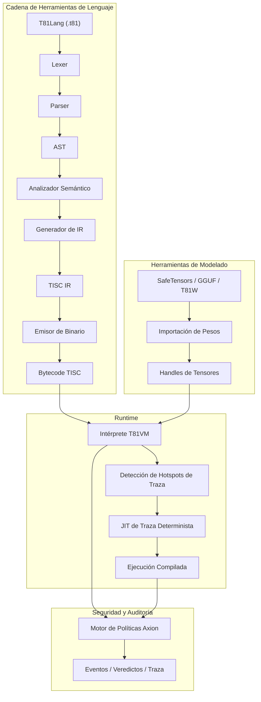

# T81 Foundation

<p align="center">
<strong>Pila de computación nativa en ternario y determinista que presenta tipos de datos base-81, el conjunto de instrucciones TISC, T81VM, T81Lang, el motor de seguridad/optimización Axion y niveles de cognición recursivos — diseñada para una ejecución bit-exacta, auditable y reproducible en IA, criptografía y computación científica.</strong>
</p>

<p align="center">
  <a href="https://github.com/t81dev/t81-foundation/stargazers"></a>
  <a href="https://github.com/t81dev/t81-foundation/network/members"></a>
  <a href="https://github.com/t81dev/t81-foundation/actions/workflows/ci.yml"></a>
  <a href="https://github.com/t81dev/t81-foundation/commits/main"></a>
  <a href="https://opensource.org/licenses/MIT"></a>
  <a href="https://en.cppreference.com/w/cpp/23"></a>
</p>

<p align="center">
  <a href="README.md"></a>
  <a href="README.zh-CN.md"></a>
  <a href="README.es.md"></a>
  <a href="README.ru.md"></a>
  <a href="README.pt-BR.md"></a>
</p>

T81 es una pila de computación soberana diseñada para eliminar el no-determinismo del punto flotante y permitir una ejecución totalmente auditable. Al aprovechar la **lógica ternaria equilibrada** y los **tipos de datos base-81**, T81 garantiza una **reproducibilidad bit-exacta** en todas las arquitecturas compatibles (x86/ARM, macOS/Linux). Cuenta con la **T81VM**, el **motor de seguridad Axion** y un sistema de niveles recursivos para escalar desde la lógica simbólica simple hasta formas infinitas distribuidas.

> 💡 **Por qué es importante:** En seguridad de IA, modelado financiero y criptografía, lo "casi correcto" no es suficiente. T81 proporciona la certeza matemática de que su código se ejecuta exactamente de la misma manera, en cualquier lugar, en todo momento.

## Índice

* [Características](https://www.google.com/search?q=%23caracter%C3%ADsticas)
* [Arquitectura](https://www.google.com/search?q=%23arquitectura)
* [Inicio Rápido](https://www.google.com/search?q=%23inicio-r%C3%A1pido)
* [Plataformas Compatibles](https://www.google.com/search?q=%23plataformas-compatibles)
* [Ejemplos de CLI](https://www.google.com/search?q=%23ejemplos-de-cli)
* [Capturas de Pantalla y Demo](https://www.google.com/search?q=%23capturas-de-pantalla-y-demo)
* [Mapa del Repositorio](https://www.google.com/search?q=%23mapa-del-repositorio)
* [Mapa de Autoridad de Documentos](https://www.google.com/search?q=%23mapa-de-autoridad-de-documentos)
* [Compatibilidad y No-Objetivos](https://www.google.com/search?q=%23compatibilidad-y-no-objetivos)
* [Configuración y Axion](https://www.google.com/search?q=%23configuraci%C3%B3n-y-axion)
* [Contribuciones](https://www.google.com/search?q=%23contribuciones)
* [Historial de Cambios](https://www.google.com/search?q=%23historial-de-cambios)
* [Agradecimientos](https://www.google.com/search?q=%23agradecimientos)
* [Licencia](https://www.google.com/search?q=%23licencia)

## Características

| Característica | Estado | Descripción |
| --- | --- | --- |
| **Ejecución Determinista** | ✨ Estable | Resultados bit-exactos en x86/ARM/Apple Silicon mediante `dmath` y FP personalizado. |
| **Tipos Nativos Ternarios** | ✨ Estable | Enteros y flotantes ternarios equilibrados base-81 (sin bit de signo, acarreo reducido). |
| **T81VM y TISC** | ✨ Estable | VM de 81 registros con intérprete determinista y Trace-JIT. |
| **Motor Axion** | ✨ Estable | Motor de políticas en tiempo de ejecución, seguridad, ética y optimización con trazas de auditoría. |
| **Herramientas de Modelado** | ✨ Estable | Importación/Inspección de SafeTensors, GGUF, T81W; soporte de cuantización. |
| **Puerta de Reproducibilidad** | ✨ Estable | `t81lang_repro_gate.py` forzado por CI asegura 100% de determinismo. |
| **Niveles Cognitivos** | 🚧 Beta | Capas de ejecución recursivas (Simbólico → Distribuido → Infinito). |
| **Trace-JIT** | 🚧 Exp. | Optimización de puntos calientes preservando un determinismo estricto. |
| **Docs Multilingües** | 📚 En vivo | Especificaciones completas en inglés, chino, español, portugués y ruso. |

## Arquitectura



## Inicio Rápido

Pase de cero a una ejecución verificable en menos de 60 segundos.

### 1. Compilar (Build)

```bash
cmake -S . -B build -DCMAKE_BUILD_TYPE=Release
cmake --build build --parallel

```

### 2. Compilar y Ejecutar Hello World

```bash
# Compilar fuente T81 a bytecode TISC
./build/t81 compile examples/hello_world.t81 -o hello.tisc

# Ejecutar el bytecode
./build/t81 run hello.tisc

```

### 3. Verificar Determinismo (La "Puerta de Repro")

Demuestre que su compilación cumple con la exactitud de bits:

```bash
python3 scripts/ci/t81lang_repro_gate.py --t81-bin build/t81 --check
# Salida: ✅  Todos los controles de determinismo aprobados.

```

## Plataformas Compatibles

Todas las plataformas a continuación pasan la **Puerta de Determinismo** con hashes de salida idénticos.

| Plataforma | Arq | Compilador | Estado |
| --- | --- | --- | --- |
| **Linux** | x86_64 | Clang 18+, GCC 14+ | ✅ Verificado |
| **Linux** | ARM64 | Clang 18+ | ✅ Verificado |
| **macOS** | Intel | Apple Clang / GCC | ✅ Verificado |
| **macOS** | Apple Silicon | Apple Clang | ✅ Verificado |

## Ejemplos de CLI

La CLI de `t81` es su interfaz principal para desarrollo, depuración y auditoría.

```bash
# 🛠️ Desarrollo
t81 compile src.t81 -o out.tisc      # Compilar
t81 run out.tisc                     # Ejecutar
t81 disasm out.tisc                  # Desensamblar bytecode

# 🐞 Depuración y Auditoría
t81 debug out.tisc                   # Depurador interactivo
t81 trace show trace.txt             # Inspeccionar traza de ejecución
t81 repro-hash tests/fixtures/       # Calcular hash de determinismo

# 🤖 IA / Tensores
t81 weights import model.safetensors -o model.t81w
t81 weights quantize model.safetensors --to-gguf model.gguf

```

## Capturas de Pantalla y Demo

*(Marcador visual: Imagine una elegante ventana de terminal que muestra un registro de traza de T81 con coincidencia exacta de hash)*

Para ver la VM en acción con una demo visual:

```bash
./build/t81_demo

```

## Mapa del Repositorio

Directorios clave en el código fuente:

* **`src/`**: Código fuente principal en C++ (VM, Axion, TISC, CanonFS).
* **`include/t81/`**: Cabeceras públicas.
* **`book/book-en/`**: La Monografía Técnica Definitiva (Documentación).
* **`scripts/ci/`**: Integración Continua y Puertas de Reproducibilidad.
* **`examples/`**: Programas de ejemplo `.t81` y ejemplos de integración en C++.
* **`tests/`**: Suite exhaustiva de pruebas unitarias y de integración.
* **`spec/`**: Especificaciones normativas (TISC, Tipos de Datos).
* **`tools/`**: Scripts de utilidad y ayudantes para la extensión de VSCode.

## Mapa de Autoridad de Documentos

La **Monografía Técnica Definitiva** es la única fuente de verdad para T81. Se mantiene en `book/book-en/` y se traduce a varios idiomas.

<details>
<summary><strong>Parte I — Fundamentos</strong></summary>

1. **[Introducción](https://www.google.com/search?q=book/book-en/01_Introduction.md)**
2. **[Principios Básicos e Invariantes](https://www.google.com/search?q=book/book-en/02_Principles.md)**

</details>

<details>
<summary><strong>Parte II — La Máquina Determinista</strong></summary>

3. **[Arquitectura T81VM](https://www.google.com/search?q=book/book-en/03_Architecture.md)**
4. **[Tipos de Datos y Serialización Canónica](https://www.google.com/search?q=book/book-en/04_Data_Types_and_Serialization.md)**
5. **[Instalación y Verificación de Compilación](https://www.google.com/search?q=book/book-en/05_Installation.md)**
6. **[Uso de CLI y API](https://www.google.com/search?q=book/book-en/06_Usage.md)**
7. **[Programación en T81Lang](https://www.google.com/search?q=book/book-en/07_Programming_in_T81Lang.md)**

</details>

<details>
<summary><strong>Parte III — Gobernanza y Verificación</strong></summary>

8. **[Verificación y Auditoría](https://www.google.com/search?q=book/book-en/08_Verification_and_Audit.md)**
9. **[El Núcleo de Seguridad Axion](https://www.google.com/search?q=book/book-en/09_The_Axion_Kernel.md)**
10. **[Niveles Cognitivos y Computación Distribuida](https://www.google.com/search?q=book/book-en/10_Cognitive_Tiers_and_Distributed_Compute.md)**
11. **[Apéndices](https://www.google.com/search?q=book/book-en/11_Appendices.md)**

</details>

<details>
<summary><strong>Parte IV — Formalización y Endurecimiento Estructural</strong></summary>

12. **[Semántica Formal de TISC y T81VM](https://www.google.com/search?q=book/book-en/12_Formal_Semantics.md)**
13. **[Modelado Adversario y Ataques al Determinismo](https://www.google.com/search?q=book/book-en/13_Adversarial_Modeling.md)**

</details>

<details>
<summary><strong>Parte V — Continuidad y Horizonte de Investigación</strong></summary>

14. **[Continuidad y Resiliencia](https://www.google.com/search?q=book/book-en/14_Continuity_Resilience.md)**
15. **[Frontera de Investigación](https://www.google.com/search?q=book/book-en/15_Research_Frontier.md)**

</details>

> 📚 **Lea la monografía completa aquí:** [book/book-es/LEEME.md](LEEME)

## Compatibilidad y No-Objetivos

### Garantías

* **Bytecode TISC:** Compatibilidad hacia adelante dentro de versiones mayores.
* **Determinismo:** Prioridad absoluta. Romper el determinismo se trata como un error crítico de seguridad.

### No-Objetivos

* **Velocidad bruta a toda costa:** No sacrificaremos la exactitud de bits por optimizaciones de matemáticas rápidas específicas del hardware.
* **Reemplazo de Propósito General:** T81 está especializado para cómputo verificable, no para reemplazar C++ o Python en scripting general.

## Configuración y Axion

El motor **Axion** impone políticas en tiempo de ejecución. La configuración se maneja mediante archivos de política o flags de ejecución.

* **Seguridad:** Límites de memoria, profundidad de recursión (Niveles Cognitivos).
* **Ética:** Principios codificados como restricciones en tiempo de ejecución.
* **Optimización:** Seguimiento de puntos calientes y umbrales JIT.

Consulte `src/axion/` para detalles de implementación.

## Contribuciones

¡Damos la bienvenida a las contribuciones! Por favor, consulte [CONTRIBUTING.md](CONTRIBUTING) para detalles sobre:

* Estilo de código (Clang-Format).
* Proceso de Pull Request.
* Requisitos de verificación de determinismo.

## Historial de Cambios

Consulte [Releases](https://github.com/t81dev/t81-foundation/releases) para el historial completo.

* **v1.0.0-Sovereign**: Primer lanzamiento listo para producción. VM, TISC y Axion estables.

## Licencia

Este proyecto está bajo la **Licencia MIT**. Consulte [LICENSE](LICENSE) para más detalles.
