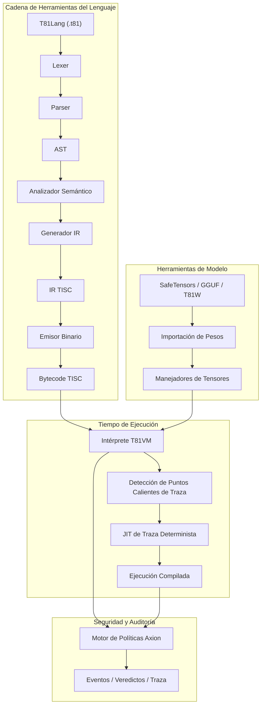

# Fundación T81

<p align="center">
  <strong>Pila de computación nativa ternaria determinista que presenta tipos de datos de base 81, conjunto de instrucciones TISC, T81VM, T81Lang, motor de seguridad/optimización Axion y niveles de cognición recursiva — construida para una ejecución exacta bit a bit, auditable y reproducible en IA, criptografía y computación científica.</strong>
</p>

<p align="center">
  <a href="https://github.com/t81dev/t81-foundation/stargazers"></a>
  <a href="https://github.com/t81dev/t81-foundation/network/members"></a>
  <a href="https://github.com/t81dev/t81-foundation/actions/workflows/ci.yml"></a>
  <a href="https://github.com/t81dev/t81-foundation/commits/main"></a>
  <a href="https://opensource.org/licenses/MIT"></a>
  <a href="https://en.cppreference.com/w/cpp/23"></a>
</p>

<p align="center">
  <a href="README.md"></a>
  <a href="README.zh-CN.md"></a>
  <a href="README.es.md"></a>
  <a href="README.ru.md"></a>
  <a href="README.pt-BR.md"></a>
</p>

---

T81 es una pila de computación soberana diseñada para eliminar el no determinismo de punto flotante y permitir una ejecución totalmente auditable. Aprovechando la **lógica ternaria equilibrada** y los **tipos de datos de base 81**, T81 busca reproducibilidad bit a bit en superficies verificadas y acotadas por el registro de determinismo. Cuenta con la **T81VM**, el **motor de seguridad Axion** y un sistema de niveles recursivos para escalar desde la lógica simbólica simple hasta formas infinitas distribuidas.

> 💡 **Por qué es importante:** En seguridad de IA, modelado financiero y criptografía, "casi correcto" no es suficiente. T81 prioriza garantías deterministas explícitas en superficies verificadas.

## Tabla de Contenidos

- [Características](#características)
- [Arquitectura](#arquitectura)
- [Inicio Rápido](#inicio-rápido)
- [Plataformas Soportadas](#plataformas-soportadas)
- [Ejemplos CLI](#ejemplos-cli)
- [Capturas de Pantalla y Demo](#capturas-de-pantalla-y-demo)
- [Mapa del Repositorio](#mapa-del-repositorio)
- [Mapa de Autoridad Documental](#mapa-de-autoridad-documental)
- [Compatibilidad y No-Objetivos](#compatibilidad-y-no-objetivos)
- [Configuración y Axion](#configuración-y-axion)
- [Contribuyendo](#contribuyendo)
- [Registro de Cambios](#registro-de-cambios)
- [Agradecimientos](#agradecimientos)
- [Licencia](#licencia)

## Características

| Característica | Estado | Descripción |
| :--- | :--- | :--- |
| **Ejecución Determinista** | ✨ Estable | Resultados bit a bit en superficies verificadas y delimitadas por el registro de determinismo. |
| **Tipos Nativos Ternarios** | ✨ Estable | Enteros y flotantes ternarios equilibrados de base 81 (sin bit de signo, acarreo reducido). |
| **T81VM y TISC** | 🚧 Beta | Superficie de ejecución activa bajo verificación continua. |
| **Motor Axion** | ⚠️ Alpha | Motor de políticas activo con cobertura parcial sobre superficies en borrador. |
| **Herramientas de Modelo** | ✨ Estable | Importar/Inspeccionar SafeTensors, GGUF, T81W; soporte de cuantización. |
| **Puerta de Reproducibilidad** | ✨ Estable | `t81lang_repro_gate.py` forzado por CI detecta regresiones de reproducibilidad en superficies verificadas. |
| **Niveles Cognitivos** | 🚧 Beta | Capas de ejecución recursiva (Simbólica → Distribuida → Infinita). |
| **Trace-JIT** | 🚧 Experimental | Optimización de puntos calientes preservando determinismo estricto. |
| **Documentación Multilingüe** | 📚 En vivo | Especificaciones completas en Inglés, Chino, Español, Portugués, Ruso. |

## Arquitectura



## Inicio Rápido

Vaya de cero a ejecución verificable en menos de 60 segundos.

### 1. Construir
```bash
cmake -S . -B build -DCMAKE_BUILD_TYPE=Release
cmake --build build --parallel
```

### 2. Compilar y Ejecutar Hello World
```bash
# Compilar fuente T81 a bytecode TISC
./build/t81 compile examples/hello_world.t81 -o hello.tisc

# Ejecutar el bytecode
./build/t81 run hello.tisc
```

### 3. Verificar Determinismo (La "Puerta de Reproducción")
Demuestre que su compilación cumple con la exactitud bit a bit:
```bash
python3 scripts/ci/t81lang_repro_gate.py --t81-bin build/t81 --check
# Salida: ✅  All determinism checks passed.
```

## Plataformas Soportadas

Todas las plataformas a continuación pasan la **Puerta de Determinismo** con hashes de salida idénticos.

| Plataforma | Arq | Compilador | Estado |
| :--- | :--- | :--- | :--- |
| **Linux** | x86_64 | Clang 18+, GCC 14+ | ✅ Verificado |
| **Linux** | ARM64 | Clang 18+ | ✅ Verificado |
| **macOS** | Intel | Apple Clang / GCC | ✅ Verificado |
| **macOS** | Apple Silicon | Apple Clang | ✅ Verificado |

## Ejemplos CLI

La CLI `t81` es su interfaz principal para desarrollo, depuración y auditoría.

```bash
# 🛠️ Desarrollo
t81 compile src.t81 -o out.tisc      # Compilar
t81 run out.tisc                     # Ejecutar
t81 disasm out.tisc                  # Desensamblar bytecode

# 🐞 Depuración y Auditoría
t81 debug out.tisc                   # Depurador interactivo
t81 trace show trace.txt             # Inspeccionar traza de ejecución
t81 repro-hash tests/fixtures/       # Calcular hash de determinismo

# 🤖 IA / Tensores
t81 weights import model.safetensors -o model.t81w
t81 weights quantize model.safetensors --to-gguf model.gguf
```

## Capturas de Pantalla y Demo

*(Marcador visual: Imagine una elegante ventana de terminal mostrando un registro de traza T81 con coincidencia exacta de hash)*

Para ver la VM en acción con una demo visual:
```bash
./build/t81_demo
```

## Mapa del Repositorio

Directorios clave en la base de código:

- **`src/`**: Fuente principal C++ (VM, Axion, TISC, CanonFS).
- **`include/t81/`**: Encabezados públicos.
- **`book/book-en/`**: La Monografía Técnica Definitiva (Documentación).
- **`scripts/ci/`**: Integración Continua y Puertas de Reproducibilidad.
- **`examples/`**: Programas de muestra `.t81` y ejemplos de integración C++.
- **`tests/`**: Suite completa de pruebas unitarias y de integración.
- **`spec/`**: Especificaciones normativas (TISC, Tipos de Datos).
- **`tools/`**: Scripts de utilidad y ayudas para extensiones de VSCode.

## Mapa de Autoridad Documental

La **Monografía Técnica Definitiva** es la única fuente de verdad para T81. Se mantiene en `book/book-en/` y se traduce a múltiples idiomas.

<details>
<summary><strong>Parte I — Fundamentos</strong></summary>

1. **[Introducción](book/book-es/01_Introduccion.md)**

   * [1.1 Alcance y Definición](book/book-es/01_Introduccion.md#11-alcance-y-definición)
   * [1.2 Arquitectura del Sistema](book/book-es/01_Introduccion.md#12-arquitectura-del-sistema)
   * [1.3 Misión de Cómputo Verificable](book/book-es/01_Introduccion.md#13-misión-de-cómputo-verificable)

2. **[Principios Básicos e Invariantes](book/book-es/02_Principios.md)**

   * [2.1 El Invariante de Determinismo](book/book-es/02_Principios.md#21-el-invariante-de-determinismo)
   * [2.1.1 Superficies de Determinismo y Vectores de Ataque](book/book-es/02_Principios.md#211-superficies-de-determinismo-y-vectores-de-ataque)
   * [2.2 Lógica Ternaria (Base-3)](book/book-es/02_Principios.md#22-lógica-ternaria-base-3)
   * [2.3 Auditabilidad y la Traza Axion](book/book-es/02_Principios.md#23-auditabilidad-y-la-traza-axion)
   * [2.4 Los Nueve Principios (Aplicación Ética)](book/book-es/02_Principios.md#24-los-nueve-principios-aplicación-ética)

</details>

<details>
<summary><strong>Parte II — La Máquina Determinista</strong></summary>

3. **[Arquitectura T81VM](book/book-es/03_Arquitectura.md)**

   * [3.1 Visión General](book/book-es/03_Arquitectura.md#31-visión-general)
   * [3.1.1 La Tubería de Ejecución](book/book-es/03_Arquitectura.md#311-la-tubería-de-ejecución)
   * [3.2 El Límite del Tiempo de Ejecución](book/book-es/03_Arquitectura.md#32-el-límite-del-tiempo-de-ejecución)
   * [3.3 Modelo de Memoria](book/book-es/03_Arquitectura.md#33-modelo-de-memoria)
   * [3.3.1 Definición Formal del Estado](book/book-es/03_Arquitectura.md#331-definición-formal-del-estado)
   * [3.4 El Conjunto de Instrucciones (TISC)](book/book-es/03_Arquitectura.md#34-el-conjunto-de-instrucciones-tisc)
   * [3.5 Compilación JIT (Trace-JIT)](book/book-es/03_Arquitectura.md#35-compilación-jit-trace-jit)

4. **[Tipos de Datos y Serialización Canónica](book/book-es/04_Tipos_de_Datos_y_Serializacion.md)**

   * [4.1 Tipos Primitivos](book/book-es/04_Tipos_de_Datos_y_Serializacion.md#41-tipos-primitivos)
   * [4.2 T81Float y dmath](book/book-es/04_Tipos_de_Datos_y_Serializacion.md#42-t81float-y-dmath)
   * [4.3 Tensores y Diseños Canónicos](book/book-es/04_Tipos_de_Datos_y_Serializacion.md#43-tensores-y-diseños-canónicos)
   * [4.4 Reglas de Serialización Canónica](book/book-es/04_Tipos_de_Datos_y_Serializacion.md#44-reglas-de-serialización-canónica)

5. **[Instalación y Verificación de Compilación](book/book-es/05_Instalacion.md)**

   * [5.1 Prerrequisitos](book/book-es/05_Instalacion.md#51-prerrequisitos)
   * [5.2 Construyendo desde la Fuente](book/book-es/05_Instalacion.md#52-construyendo-desde-la-fuente)
   * [5.3 Verificando la Compilación](book/book-es/05_Instalacion.md#53-verificando-la-compilación)

6. **[Uso de CLI y API](book/book-es/06_Uso.md)**

   * [6.1 Interfaz de Línea de Comandos](book/book-es/06_Uso.md#61-interfaz-de-línea-de-comandos)
   * [6.2 Integrando T81 (API C++)](book/book-es/06_Uso.md#62-integrando-t81-api-c)
   * [6.3 Integrando T81 (API Python)](book/book-es/06_Uso.md#63-integrando-t81-api-python)
   * [6.4 Depuración](book/book-es/06_Uso.md#64-depuración)

7. **[Programación en T81Lang](book/book-es/07_Programacion_en_T81Lang.md)**

   * [7.1 Filosofía de Diseño](book/book-es/07_Programacion_en_T81Lang.md#71-filosofía-de-diseño)
   * [7.2 Conceptos Básicos de Sintaxis](book/book-es/07_Programacion_en_T81Lang.md#72-conceptos-básicos-de-sintaxis)
   * [7.3 Tipos de Datos](book/book-es/07_Programacion_en_T81Lang.md#73-tipos-de-datos)
   * [7.4 Flujo de Control](book/book-es/07_Programacion_en_T81Lang.md#74-flujo-de-control)
   * [7.5 Funciones](book/book-es/07_Programacion_en_T81Lang.md#75-funciones)
   * [7.6 Integración con Axion](book/book-es/07_Programacion_en_T81Lang.md#76-integración-con-axion)
   * [7.7 Ejemplos](book/book-es/07_Programacion_en_T81Lang.md#77-ejemplos)

</details>

<details>
<summary><strong>Parte III — Gobernanza y Verificación</strong></summary>

8. **[Verificación y Auditoría](book/book-es/08_Verificacion_y_Auditoria.md)**

   * [8.1 Metodología de Verificación Formal](book/book-es/08_Verificacion_y_Auditoria.md#81-metodología-de-verificación-formal)
   * [8.2 La Matriz de Auditoría Formal](book/book-es/08_Verificacion_y_Auditoria.md#82-la-matriz-de-auditoría-formal)
   * [8.3 Pruebas Basadas en Propiedades](book/book-es/08_Verificacion_y_Auditoria.md#83-pruebas-basadas-en-propiedades)
   * [8.4 La Puerta de Determinismo](book/book-es/08_Verificacion_y_Auditoria.md#84-la-puerta-de-determinismo)

9. **[El Kernel de Seguridad Axion](book/book-es/09_El_Kernel_Axion.md)**

   * [9.1 Definición Formal](book/book-es/09_El_Kernel_Axion.md#91-definición-formal)
   * [9.2 El Modelo de Política](book/book-es/09_El_Kernel_Axion.md#92-el-modelo-de-política)
   * [9.3 Intercepción de Instrucciones](book/book-es/09_El_Kernel_Axion.md#93-intercepción-de-instrucciones)
   * [9.4 El Registro de Auditoría (Traza)](book/book-es/09_El_Kernel_Axion.md#94-el-registro-de-auditoría-traza)
   * [9.5 Promoción Cognitiva](book/book-es/09_El_Kernel_Axion.md#95-promoción-cognitiva)

10. **[Niveles Cognitivos y Cómputo Distribuido](book/book-es/10_Niveles_Cognitivos_y_Computo_Distribuido.md)**

   * [10.1 El Modelo de Nivel Cognitivo](book/book-es/10_Niveles_Cognitivos_y_Computo_Distribuido.md#101-el-modelo-de-nivel-cognitivo)
   * [10.2 Cómputo Distribuido (Nivel 4)](book/book-es/10_Niveles_Cognitivos_y_Computo_Distribuido.md#102-cómputo-distribuido-nivel-4)
   * [10.3 Compilación JIT Basada en Trazas](book/book-es/10_Niveles_Cognitivos_y_Computo_Distribuido.md#103-compilación-jit-basada-en-trazas)
   * [10.4 Formas Infinitas (Nivel 5)](book/book-es/10_Niveles_Cognitivos_y_Computo_Distribuido.md#104-formas-infinitas-nivel-5)

11. **[Apéndices](book/book-es/11_Apendices.md)**

* [11.1 Lo Que Aún No Está Implementado](book/book-es/11_Apendices.md#111-lo-que-aún-no-está-implementado)
* [11.2 Glosario](book/book-es/11_Apendices.md#112-glosario)
* [11.3 Enlaces Útiles](book/book-es/11_Apendices.md#113-enlaces-útiles)

</details>

<details>
<summary><strong>Parte IV — Formalización y Endurecimiento Estructural</strong></summary>

12. **[Semántica Formal de TISC y T81VM](book/book-es/12_Semantica_Formal.md)**

* [12.1 Semántica Operacional](book/book-es/12_Semantica_Formal.md#121-semántica-operacional)
* [12.1.1 La Función de Transición δ](book/book-es/12_Semantica_Formal.md#1211-la-función-de-transición)
* [12.2 Función de Transición Algebraica](book/book-es/12_Semantica_Formal.md#122-función-de-transición-algebraica)
* [12.3 Sistema de Reescritura de Canonicalización](book/book-es/12_Semantica_Formal.md#123-sistema-de-reescritura-de-canonicalización)
* [12.4 Bosquejos de Prueba de Determinismo](book/book-es/12_Semantica_Formal.md#124-bosquejos-de-prueba-de-determinismo)
* [12.5 Equivalencia Intérprete vs Trace-JIT](book/book-es/12_Semantica_Formal.md#125-equivalencia-intérprete-vs-trace-jit)

13. **[Modelado Adversarial y Ataques de Determinismo](book/book-es/13_Modelado_Adversarial.md)**

* [13.1 Modelo de Amenaza](book/book-es/13_Modelado_Adversarial.md#131-modelo-de-amenaza)
* [13.2 Ataques a Nivel de Compilador](book/book-es/13_Modelado_Adversarial.md#132-ataques-a-nivel-de-compilador)
* [13.3 Vectores de Ataque VM y GC](book/book-es/13_Modelado_Adversarial.md#133-vectores-de-ataque-vm-y-gc)
* [13.4 CanonFS y Ataques de Hash](book/book-es/13_Modelado_Adversarial.md#134-canonfs-y-ataques-de-hash)
* [13.5 Ataque de Viaje en el Tiempo de Nivel Distribuido](book/book-es/13_Modelado_Adversarial.md#135-ataque-de-viaje-en-el-tiempo-de-nivel-distribuido)
* [13.6 Plantilla Postmortem de Violación de Determinismo](book/book-es/13_Modelado_Adversarial.md#136-plantilla-postmortem-de-violación-de-determinismo)

</details>

<details>
<summary><strong>Parte V — Continuidad y Horizonte de Investigación</strong></summary>

14. **[Continuidad y Resiliencia](book/book-es/14_Continuidad_Resiliencia.md)**

* [14.1 El Protocolo de Sala Limpia](book/book-es/14_Continuidad_Resiliencia.md#141-el-protocolo-de-sala-limpia)
* [14.2 Puntos Únicos de Falla](book/book-es/14_Continuidad_Resiliencia.md#142-puntos-únicos-de-falla)
* [14.3 Manifiesto de Continuidad](book/book-es/14_Continuidad_Resiliencia.md#143-manifiesto-de-continuidad)
* [14.4 Invariantes Formales Inmutables](book/book-es/14_Continuidad_Resiliencia.md#144-invariantes-formales-inmutables)

15. **[Frontera de Investigación](book/book-es/15_Frontera_de_Investigacion.md)**

* [15.1 Aceleración de Hardware Ternario](book/book-es/15_Frontera_de_Investigacion.md#151-aceleración-de-hardware-ternario)
* [15.2 Rutas de Verificación Formal](book/book-es/15_Frontera_de_Investigacion.md#152-rutas-de-verificación-formal)
* [15.3 CanonFS como Sustrato Merkle](book/book-es/15_Frontera_de_Investigacion.md#153-canonfs-como-sustrato-merkle)
* [15.4 Inferencia de IA Determinista a Escala](book/book-es/15_Frontera_de_Investigacion.md#154-inferencia-de-ia-determinista-a-escala)

</details>

> 📚 **Lea la monografía completa aquí:** [book/book-es/LEEME.md](book/book-es/LEEME.md)

## Compatibilidad y No-Objetivos

### Garantías
- **Bytecode TISC:** Compatible hacia adelante dentro de versiones mayores.
- **Determinismo:** Prioridad absoluta. Romper el determinismo se trata como un error de seguridad crítico.

### No-Objetivos
- **Velocidad Bruta a toda costa:** No sacrificaremos la exactitud bit a bit por optimizaciones matemáticas rápidas específicas de hardware.
- **Reemplazo de Propósito General:** T81 está especializado para cómputo verificable, no para reemplazar C++ o Python para scripts generales.

## Configuración y Axion

El motor **Axion** impone políticas en tiempo de ejecución. La configuración se maneja a través de archivos de política o banderas de tiempo de ejecución.

- **Seguridad:** Límites de memoria, profundidad de recursión (Niveles Cognitivos).
- **Ética:** Principios codificados como restricciones de tiempo de ejecución.
- **Optimización:** Rastreo de puntos calientes y umbrales JIT.

Ver `kernel/axion/` para detalles de implementación o ejecutar ejemplos de `axion_policy_runner`.

## Contribuyendo

¡Damos la bienvenida a las contribuciones! Consulte [CONTRIBUTING.md](CONTRIBUTING.md) para detalles sobre:
- Estilo de código (Clang-Format).
- Proceso de Pull Request.
- Requisitos de verificación de determinismo.

## Registro de Cambios

Ver [Releases](https://github.com/t81dev/t81-foundation/releases) para el historial completo de versiones.
- **v1.0.0-Sovereign**: Primera versión lista para producción. VM estable, TISC y Axion.

## Agradecimientos

Gracias a la comunidad de código abierto, específicamente a los contribuyentes de `LLVM`, `fmt` y los primeros investigadores en lógica de computación ternaria.

## Licencia

Este proyecto está licenciado bajo la **Licencia MIT**. Ver [LICENSE](LICENSE) para detalles.
