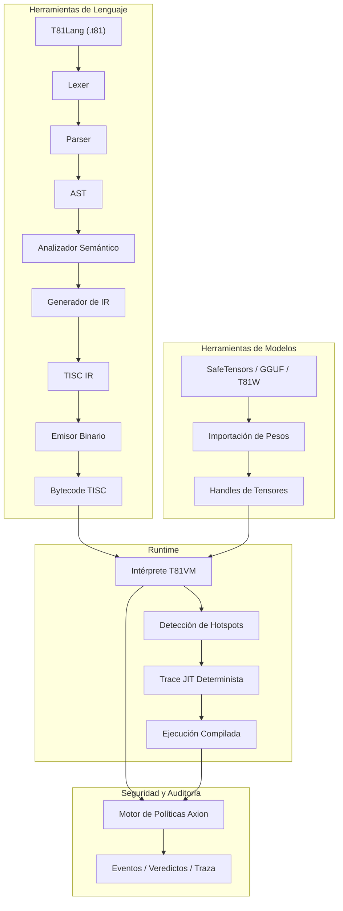

# T81 Foundation 🔥

<div align="center">
  
[](https://github.com/t81dev/t81-foundation/actions/workflows/ci.yml)
[](https://github.com/t81dev/t81-foundation/actions/workflows/ci.yml)
[](https://opensource.org/licenses/MIT)
[](https://en.cppreference.com/w/cpp/23)

[](README.md)
[](README.zh-CN.md)
[](README.es.md)
[](README.ru.md)
[-blueviolet?style=flat-square)](README.pt-BR.md)

</div>

T81 es un stack de computación determinista y nativo en ternario 🌐 que cuenta con tipos de datos en base-81, el conjunto de instrucciones TISC, T81VM, T81Lang, el motor de seguridad y optimización Axion, y niveles de cognición recursiva. Ofrece una ejecución auditable y exacta a nivel de bit ⚡ para dominios con alta carga aritmética, ideal para IA verificable, criptografía y computación científica.

> **Nota sobre el Determinismo de Punto Flotante** ⚠️
> Las funciones trascendentales (`sin`, `cos`, `tan`, `log`, `exp`, `sqrt`) utilizan el backend determinista `dmath`, que es exacto a nivel de bit en todas las plataformas.
> La división y las funciones inversas/hiperbólicas pueden recurrir al comportamiento del host en modo no estricto.
> El determinismo estricto total está garantizado para `T81Int`, `T81BigInt`, `T81Fraction` y la aritmética central de `T81Float`. ✅

## Tabla de Contenidos 📑

* [Inicio Rápido 🚀](https://www.google.com/search?q=%23inicio-r%C3%A1pido)
* [Características 🌟](https://www.google.com/search?q=%23caracter%C3%ADsticas)
* [¿Por qué Ternario? 🧠](https://www.google.com/search?q=%23por-qu%C3%A9-ternario)
* [Arquitectura 🏗️](https://www.google.com/search?q=%23arquitectura)
* [Plataformas Soportadas 🌍](https://www.google.com/search?q=%23plataformas-soportadas)
* [Ejemplos de CLI 🔧](https://www.google.com/search?q=%23ejemplos-de-cli)
* [Mapa del Repositorio 📂](https://www.google.com/search?q=%23mapa-del-repositorio)
* [Mapa de Autoridad de Documentos 📜](https://www.google.com/search?q=%23mapa-de-autoridad-de-documentos)
* [Garantías de Compatibilidad 🔄](https://www.google.com/search?q=%23garant%C3%ADas-de-compatibilidad)
* [Lo que NO es (Non-Goals) 🚫](https://www.google.com/search?q=%23lo-que-no-es-non-goals)
* [Límite del Runtime 🔐](https://www.google.com/search?q=%23l%C3%ADmite-del-runtime)
* [Lecturas Adicionales 📖](https://www.google.com/search?q=%23lecturas-adicionales)
* [Monografía Técnica Definitiva 📘](https://www.google.com/search?q=%23monograf%C3%ADa-t%C3%A9cnica-definitiva)
* [Licencia 📜](https://www.google.com/search?q=%23licencia)

## Inicio Rápido 🚀⚡

Verifica las capacidades principales en menos de 30 segundos:

1. **Compilar y Ejecutar Hello World** 🏃‍♂️
```bash
cmake -S . -B build -DCMAKE_BUILD_TYPE=Release && cmake --build build --parallel
./build/t81 compile examples/hello_world.t81 -o hello.tisc
./build/t81 run hello.tisc

```


2. **Ejecutar la Puerta de Determinismo** 🔄✅
```bash
python3 scripts/ci/t81lang_repro_gate.py --t81-bin build/t81 --check

```


3. **Ejecutar Demo de la VM** ▶️🔥
```bash
./build/t81_demo

```


4. **Inspeccionar Traza** 🔍📜
```bash
./build/t81 trace show trace.txt

```


## Características 🌟

| Característica | Estado | Descripción |
| --- | --- | --- |
| ✅ Ejecución Determinista | Estable 🔥 | Reproducibilidad exacta a nivel de bit en plataformas cruzadas |
| ✅ Tipos de Datos Ternarios | Estable 🌐 | Base-81 con aritmética ternaria balanceada |
| ✅ Motor de Políticas Axion | Estable 🔐 | Seguridad en runtime, optimización y cumplimiento ético |
| ✅ T81VM | Estable ⚙️ | VM de 81 registros + intérprete determinista y trace-JIT |
| ✅ TISC IR | Estable 📡 | Representación intermedia de Computadora con Conjunto de Instrucciones Ternarias |
| ✅ Matemática Definida por SW | Estable 🧮 | Punto flotante consistente en multiplataforma (`dmath`) |
| 🚧 Compilación Trace-JIT | Experimental ⚡ | Rastreo de puntos calientes (hotspots) y JIT determinista |
| 🚧 Tensores Distribuidos | Experimental 🌍 | Soporte para tensores distribuidos a gran escala |
| ✅ Herramientas de Modelos | Estable 🤖 | Importación, cuantización e inspección de SafeTensors / GGUF / T81W |

## ¿Por qué Ternario? 🧠🧮

El ternario balanceado (-1, 0, +1) y la base-81 eliminan los bits de signo, simplifican la suma/resta (acarreo reducido) y ofrecen ventajas teóricas en densidad y energía, especialmente valiosas en cargas de trabajo numéricas (inferencia de IA, criptografía, procesamiento de señales).

T81 lleva estos beneficios al software priorizando el determinismo y la auditabilidad sobre la velocidad bruta. Consulta los experimentos de hardware relacionados en [ternary-memory-research](https://github.com/t81dev/ternary-memory-research) para métricas PDK SKY130. 🔬

## Arquitectura 🏗️



## Plataformas Soportadas 🌍

| Plataforma | Compilador | Estado | Puerta de Determinismo | Notas |
| --- | --- | --- | --- | --- |
| Linux x86_64 | Clang 18+, GCC 14+ | ✅ Superado 🔥 | ✅ | Puerta completa aprobada |
| Linux ARM64 | Clang 18+ | ✅ Superado 🔥 | ✅ | Puerta completa aprobada |
| macOS x86_64 (Intel) | Apple Clang / GCC | ✅ Superado | ✅ | Funciona nativamente |
| macOS ARM64 (Apple Silicon) | Apple Clang | ✅ Superado | ✅ | Investigación activa (CMake/flags) |

## Ejemplos de CLI 🔧🔍

```bash
# Compilar y ejecutar 🚀
t81 compile examples/hello_world.t81 -o hello.tisc
t81 run hello.tisc

# Depurar e inspeccionar 🕵️
t81 disasm hello.tisc
t81 debug hello.tisc
t81 trace show trace.txt
t81 repro-hash tests/fixtures/t81lang_determinism

# Herramientas de modelos 🤖
t81 weights import model.safetensors -o model.t81w
t81 weights quantize model.safetensors --to-gguf model.gguf

```

Ayuda completa: `t81 --help` o `t81 help <subcomando>` 📖

## Mapa del Repositorio 📂

* `.github/`          → Workflows y plantillas 🛠️
* `benchmarks/`       → Mediciones de rendimiento 📈
* `docs/`             → Guías, explicaciones y referencias 📚
* `examples/`         → Programas de ejemplo (archivos .t81) 🎯
* `include/t81/`      → Cabeceras públicas 🧩
* `scripts/`          → Herramientas de CI y puertas de reproducibilidad 🔄
* `spec/`             → Especificaciones normativas 📜
* `src/`              → Código fuente principal (axion/, canonfs/, vm/, etc.) ⚙️
* `tests/`            → Pruebas unitarias, de propiedad e integración 🧪
* `tools/`            → Scripts de utilidad y extensión de VSCode 🛠️

## Mapa de Autoridad de Documentos 📜

| Documento | Propósito | Autoridad |
| --- | --- | --- |
| spec/constitution.md | Principios fundamentales | Normativo 🔒 |
| spec/determinism-profile.md | Garantías de determinismo | Normativo ✅ |
| spec/t81-data-types.md | Spec de tipos y serialización | Normativo 🧮 |
| spec/tisc-spec.md | Conjunto de instrucciones TISC | Normativo 📡 |
| https://www.google.com/search?q=docs/index.md | Punto de entrada a la doc | Informativo 📖 |

## Garantías de Compatibilidad 🔄

* **Estable:** Sintaxis de T81Lang, formato TISC, semántica central de T81VM ✅
* **Experimental:** Trace-JIT, tensores distribuidos 🚧
* **SemVer:** Saltos de versión mayor para cambios que rompan la compatibilidad en partes estables ⚖️

## Lo que NO es (Non-Goals) 🚫

T81 **no** es:

* un acelerador de hardware ternario 🖥️
* un reemplazo de propósito general para C++/Python/Rust 🛑
* optimizado para el máximo rendimiento a expensas del determinismo ⚡❌

## Límite del Runtime 🔐

Definido en especificaciones como [spec/t81vm-spec.md](https://www.google.com/search?q=spec/t81vm-spec.md)

## Lecturas Adicionales 📖

* [docs/index.md](https://www.google.com/search?q=docs/index.md)
* [spec/index.md](https://www.google.com/search?q=spec/index.md)
* [CONTRIBUTING.md](https://www.google.com/search?q=CONTRIBUTING.md)
* [SECURITY.md](https://www.google.com/search?q=SECURITY.md)

---

## 📘 Monografía Técnica Definitiva

Para una descripción completa y de grado de especificación de la arquitectura — incluyendo semántica formal, invariantes de determinismo, modelado de adversarios y diseño de continuidad a largo plazo — consulte:

➡️ **[The T81 Foundation — Monografía Técnica Definitiva](https://www.google.com/search?q=book/README.md)**

**Rutas para el lector:**

* **¿Nuevo en T81?** → Comience con la Parte I, luego la Parte II.
* **¿Implementador?** → Enfoque en las Partes II y III.
* **¿Auditor?** → Lea las Partes III y IV con detenimiento.
* **¿Investigador?** → Enfoque en las Partes IV y V.
* **¿Mantenedor a largo plazo?** → Las Partes IV y V son críticas.

<details>
<summary><strong>Parte I — Fundamentos</strong></summary>

1. **[Introducción](https://www.google.com/search?q=book/01_Introduction.md)**
* [1.1 Alcance y Definición](https://www.google.com/search?q=book/01_Introduction.md%2311-scope-and-definition)
* [1.2 Arquitectura del Sistema](https://www.google.com/search?q=book/01_Introduction.md%2312-system-architecture)
* [1.3 Misión de Cómputo Verificable](https://www.google.com/search?q=book/01_Introduction.md%2313-verifiable-compute-mission)


2. **[Principios e Invariantes Centrales](https://www.google.com/search?q=book/02_Core_Principles_and_Invariants.md)**
* [2.1 El Invariante de Determinismo](https://www.google.com/search?q=book/02_Core_Principles_and_Invariants.md%2321-the-determinism-invariant)
* [2.1.1 Superficies de Determinismo y Vectores de Ataque](https://www.google.com/search?q=book/02_Core_Principles_and_Invariants.md%23211-determinism-surfaces-and-attack-vectors)
* [2.2 Lógica Ternaria (Base-3)](https://www.google.com/search?q=book/02_Core_Principles_and_Invariants.md%2322-ternary-logic-base-3)
* [2.3 Auditabilidad y la Traza Axion](https://www.google.com/search?q=book/02_Core_Principles_and_Invariants.md%2323-auditability-and-the-axion-trace)
* [2.4 Los Nueve Principios (Cumplimiento Ético)](https://www.google.com/search?q=book/02_Core_Principles_and_Invariants.md%2324-the-nine-principles-ethics-enforcement)


</details>

<details>
<summary><strong>Parte II — La Máquina Determinista</strong></summary>

3. **[Arquitectura T81VM](https://www.google.com/search?q=book/03_T81VM_Architecture.md)**
* [3.1 Máquina de Estados Formal](https://www.google.com/search?q=book/03_T81VM_Architecture.md%2331-formal-state-machine)
* [3.1.1 Definición de Estado](https://www.google.com/search?q=book/03_T81VM_Architecture.md%23311-state-definition)
* [3.2 Diseño de Memoria](https://www.google.com/search?q=book/03_T81VM_Architecture.md%2332-memory-layout)
* [3.3 Archivo de Registros](https://www.google.com/search?q=book/03_T81VM_Architecture.md%2333-register-file)
* [3.4 Arquitectura del Conjunto de Instrucciones TISC](https://www.google.com/search?q=book/03_T81VM_Architecture.md%2334-tisc-instruction-set-architecture-isa)
* [3.5 Semántica de Fallos](https://www.google.com/search?q=book/03_T81VM_Architecture.md%2335-fault-semantics)
* [3.6 Recolección de Basura](https://www.google.com/search?q=book/03_T81VM_Architecture.md%2336-garbage-collection)


4. **[Tipos de Datos y Serialización Canónica](https://www.google.com/search?q=book/04_Data_Types_and_Canonical_Serialization.md)**
* [4.1 Tipos Primitivos](https://www.google.com/search?q=book/04_Data_Types_and_Canonical_Serialization.md%2341-primitive-types)
* [4.2 T81Float y dmath](https://www.google.com/search?q=book/04_Data_Types_and_Canonical_Serialization.md%2342-t81float-and-dmath)
* [4.3 Tensores y Diseños Canónicos](https://www.google.com/search?q=book/04_Data_Types_and_Canonical_Serialization.md%2343-tensors-and-canonical-layouts)
* [4.4 Reglas de Serialización Canónica](https://www.google.com/search?q=book/04_Data_Types_and_Canonical_Serialization.md%2344-canonical-serialization-rules)


5. **[Instalación y Verificación de Construcción](https://www.google.com/search?q=book/05_Installation_and_Build_Verification.md)**
* [5.1 Requisitos Previos](https://www.google.com/search?q=book/05_Installation_and_Build_Verification.md%2351-prerequisites)
* [5.2 Construcción desde el Código Fuente](https://www.google.com/search?q=book/05_Installation_and_Build_Verification.md%2352-building-from-source)
* [5.3 Verificación de la Construcción](https://www.google.com/search?q=book/05_Installation_and_Build_Verification.md%2353-verifying-the-build)


6. **[Uso de CLI y API](https://www.google.com/search?q=book/06_CLI_and_API_Usage.md)**
* [6.1 Interfaz de Línea de Comandos](https://www.google.com/search?q=book/06_CLI_and_API_Usage.md%2361-the-t81-command-line-interface)
* [6.2 Embeber T81 (API de C++)](https://www.google.com/search?q=book/06_CLI_and_API_Usage.md%2362-embedding-t81-c-api)
* [6.3 Embeber T81 (API de Python)](https://www.google.com/search?q=book/06_CLI_and_API_Usage.md%2363-embedding-t81-python-api)
* [6.4 Depuración](https://www.google.com/search?q=book/06_CLI_and_API_Usage.md%2364-debugging)


</details>

<details>
<summary><strong>Parte III — Gobernanza y Verificación</strong></summary>

7. **[Verificación y Auditoría](https://www.google.com/search?q=book/07_Verification_and_Audit.md)**
* [7.1 Metodología de Verificación Formal](https://www.google.com/search?q=book/07_Verification_and_Audit.md%2371-formal-verification-methodology)
* [7.2 La Matriz de Auditoría Formal](https://www.google.com/search?q=book/07_Verification_and_Audit.md%2372-the-formal-audit-matrix)
* [7.3 Pruebas Basadas en Propiedades](https://www.google.com/search?q=book/07_Verification_and_Audit.md%2373-property-based-testing)
* [7.4 La Puerta de Determinismo](https://www.google.com/search?q=book/07_Verification_and_Audit.md%2374-the-determinism-gate)


8. **[El Kernel de Seguridad Axion](https://www.google.com/search?q=book/08_The_Axion_Safety_Kernel.md)**
* [8.1 Definición Formal](https://www.google.com/search?q=book/08_The_Axion_Safety_Kernel.md%2381-formal-definition)
* [8.2 El Modelo de Políticas](https://www.google.com/search?q=book/08_The_Axion_Safety_Kernel.md%2382-the-policy-model)
* [8.3 Intercepción de Instrucciones](https://www.google.com/search?q=book/08_The_Axion_Safety_Kernel.md%2383-instruction-interception)
* [8.4 El Registro de Auditoría (Traza)](https://www.google.com/search?q=book/08_The_Axion_Safety_Kernel.md%2384-the-audit-log-trace)
* [8.5 Promoción Cognitiva](https://www.google.com/search?q=book/08_The_Axion_Safety_Kernel.md%2385-cognitive-promotion)


9. **[Niveles Cognitivos y Cómputo Distribuido](https://www.google.com/search?q=book/09_Cognitive_Tiers_and_Distributed_Compute.md)**
* [9.1 El Modelo de Niveles Cognitivos](https://www.google.com/search?q=book/09_Cognitive_Tiers_and_Distributed_Compute.md%2391-the-cognitive-tier-model)
* [9.2 Cómputo Distribuido (Nivel 4)](https://www.google.com/search?q=book/09_Cognitive_Tiers_and_Distributed_Compute.md%2392-distributed-compute-tier-4)
* [9.3 Compilación JIT Basada en Trazas](https://www.google.com/search?q=book/09_Cognitive_Tiers_and_Distributed_Compute.md%2393-trace-based-jit-compilation)
* [9.4 Formas Infinitas (Nivel 5)](https://www.google.com/search?q=book/09_Cognitive_Tiers_and_Distributed_Compute.md%2394-infinite-forms-tier-5)


10. **[Apéndices](https://www.google.com/search?q=book/10_Appendices.md)**

* [10.1 Lo que aún no está implementado](https://www.google.com/search?q=book/10_Appendices.md%23101-what-is-not-yet-implemented)
* [10.2 Modelo de Amenazas y Superficie de Ataque al Determinismo](https://www.google.com/search?q=book/10_Appendices.md%23102-threat-model-and-determinism-attack-surface)
* [10.3 Glosario](https://www.google.com/search?q=book/10_Appendices.md%23103-glossary)

</details>

<details>
<summary><strong>Parte IV — Formalización y Endurecimiento Estructural</strong></summary>

11. **[Semántica Formal de TISC y T81VM](https://www.google.com/search?q=book/11_Formal_Semantics.md)**

* [Semántica Denotacional de TISC](https://www.google.com/search?q=book/11_Formal_Semantics.md%23denotational-semantics-of-tisc)
* [Función de Transición Algebraica δ](https://www.google.com/search?q=book/11_Formal_Semantics.md%23algebraic-transition-function-%CE%B4)
* [Sistema de Reescritura de Canonicalización](https://www.google.com/search?q=book/11_Formal_Semantics.md%23canonicalization-rewriting-system)
* [Esbozos de Pruebas de Determinismo](https://www.google.com/search?q=book/11_Formal_Semantics.md%23determinism-proof-sketches)
* [Equivalencia entre Intérprete y Trace-JIT](https://www.google.com/search?q=book/11_Formal_Semantics.md%23interpreter-vs-trace-jit-equivalence)

12. **[Modelado Adversarial y Ataques al Determinismo](https://www.google.com/search?q=book/12_Adversarial_Modeling.md)**

* [Ataques a Nivel de Compilador](https://www.google.com/search?q=book/12_Adversarial_Modeling.md%23compiler-level-attacks)
* [Vectores de Ataque en VM y GC](https://www.google.com/search?q=book/12_Adversarial_Modeling.md%23vm-and-gc-attack-vectors)
* [Ataques a CanonFS y Hashes](https://www.google.com/search?q=book/12_Adversarial_Modeling.md%23canonfs-and-hash-attacks)
* [Ataque de Viaje en el Tiempo en Niveles Distribuidos](https://www.google.com/search?q=book/12_Adversarial_Modeling.md%23distributed-tier-time-travel-attack)
* [Plantilla de Postmortem por Incumplimiento de Determinismo](https://www.google.com/search?q=book/12_Adversarial_Modeling.md%23determinism-breach-postmortem-template)

</details>

<details>
<summary><strong>Parte V — Continuidad y Horizonte de Investigación</strong></summary>

13. **[Continuidad y Resiliencia](https://www.google.com/search?q=book/13_Continuity_Resilience.md)**

* [Protocolo de Reconstrucción en Sala Limpia](https://www.google.com/search?q=book/13_Continuity_Resilience.md%23cleanroom-reconstruction-protocol)
* [Puntos Únicos de Fallo](https://www.google.com/search?q=book/13_Continuity_Resilience.md%23single-points-of-failure)
* [Manifiesto de Continuidad](https://www.google.com/search?q=book/13_Continuity_Resilience.md%23continuity-manifest)
* [Invariantes Formales Inmutables](https://www.google.com/search?q=book/13_Continuity_Resilience.md%23immutable-formal-invariants)

14. **[Frontera de Investigación](https://www.google.com/search?q=book/14_Research_Frontier.md)**

* [Aceleración de Hardware Ternario](https://www.google.com/search?q=book/14_Research_Frontier.md%23ternary-hardware-acceleration)
* [Rutas de Verificación Formal](https://www.google.com/search?q=book/14_Research_Frontier.md%23formal-verification-paths)
* [CanonFS como Sustrato Merkle](https://www.google.com/search?q=book/14_Research_Frontier.md%23canonfs-as-a-merkle-substrate)
* [Inferencia de IA Determinista a Escala](https://www.google.com/search?q=book/14_Research_Frontier.md%23deterministic-ai-inference-at-scale)

</details>

---

## Licencia

Licencia MIT — ver [LICENSE](https://www.google.com/search?q=LICENSE).
