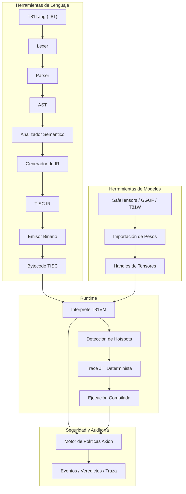

# T81 Foundation 🔥

<div align="center">
  
[](https://github.com/t81dev/t81-foundation/actions/workflows/ci.yml)
[](https://github.com/t81dev/t81-foundation/actions/workflows/ci.yml)
[](https://opensource.org/licenses/MIT)
[](https://en.cppreference.com/w/cpp/23)

[](README.md)
[](README.zh-CN.md)
[](README.es.md)
[](README.ru.md)
[-blueviolet?style=flat-square)](README.pt-BR.md)

</div>

T81 es un stack de computación determinista y nativo en ternario 🌐 que cuenta con tipos de datos en base-81, el conjunto de instrucciones TISC, T81VM, T81Lang, el motor de seguridad y optimización Axion, y niveles de cognición recursiva. Ofrece una ejecución auditable y exacta a nivel de bit ⚡ para dominios con alta carga aritmética, ideal para IA verificable, criptografía y computación científica.

> **Nota sobre el Determinismo de Punto Flotante** ⚠️
> Las funciones trascendentales (`sin`, `cos`, `tan`, `log`, `exp`, `sqrt`) utilizan el backend determinista `dmath`, que es exacto a nivel de bit en todas las plataformas.
> La división y las funciones inversas/hiperbólicas pueden recurrir al comportamiento del host en modo no estricto.
> El determinismo estricto total está garantizado para `T81Int`, `T81BigInt`, `T81Fraction` y la aritmética central de `T81Float`. ✅

## Tabla de Contenidos 📑

* [Inicio Rápido 🚀](https://www.google.com/search?q=%23inicio-r%C3%A1pido)
* [Características 🌟](https://www.google.com/search?q=%23caracter%C3%ADsticas)
* [¿Por qué Ternario? 🧠](https://www.google.com/search?q=%23por-qu%C3%A9-ternario)
* [Arquitectura 🏗️](https://www.google.com/search?q=%23arquitectura)
* [Plataformas Soportadas 🌍](https://www.google.com/search?q=%23plataformas-soportadas)
* [Ejemplos de CLI 🔧](https://www.google.com/search?q=%23ejemplos-de-cli)
* [Mapa del Repositorio 📂](https://www.google.com/search?q=%23mapa-del-repositorio)
* [Mapa de Autoridad de Documentos 📜](https://www.google.com/search?q=%23mapa-de-autoridad-de-documentos)
* [Garantías de Compatibilidad 🔄](https://www.google.com/search?q=%23garant%C3%ADas-de-compatibilidad)
* [Lo que NO es (Non-Goals) 🚫](https://www.google.com/search?q=%23lo-que-no-es-non-goals)
* [Límite del Runtime 🔐](https://www.google.com/search?q=%23l%C3%ADmite-del-runtime)
* [Lecturas Adicionales 📖](https://www.google.com/search?q=%23lecturas-adicionales)
* [Monografía Técnica Definitiva 📘](https://www.google.com/search?q=%23monograf%C3%ADa-t%C3%A9cnica-definitiva)
* [Licencia 📜](https://www.google.com/search?q=%23licencia)

## Inicio Rápido 🚀⚡

Verifica las capacidades principales en menos de 30 segundos:

1. **Compilar y Ejecutar Hello World** 🏃‍♂️
```bash
cmake -S . -B build -DCMAKE_BUILD_TYPE=Release && cmake --build build --parallel
./build/t81 compile examples/hello_world.t81 -o hello.tisc
./build/t81 run hello.tisc

```


2. **Ejecutar la Puerta de Determinismo** 🔄✅
```bash
python3 scripts/ci/t81lang_repro_gate.py --t81-bin build/t81 --check

```


3. **Ejecutar Demo de la VM** ▶️🔥
```bash
./build/t81_demo

```


4. **Inspeccionar Traza** 🔍📜
```bash
./build/t81 trace show trace.txt

```


## Características 🌟

| Característica | Estado | Descripción |
| --- | --- | --- |
| ✅ Ejecución Determinista | Estable 🔥 | Reproducibilidad exacta a nivel de bit en plataformas cruzadas |
| ✅ Tipos de Datos Ternarios | Estable 🌐 | Base-81 con aritmética ternaria balanceada |
| ✅ Motor de Políticas Axion | Estable 🔐 | Seguridad en runtime, optimización y cumplimiento ético |
| ✅ T81VM | Estable ⚙️ | VM de 81 registros + intérprete determinista y trace-JIT |
| ✅ TISC IR | Estable 📡 | Representación intermedia de Computadora con Conjunto de Instrucciones Ternarias |
| ✅ Matemática Definida por SW | Estable 🧮 | Punto flotante consistente en multiplataforma (`dmath`) |
| 🚧 Compilación Trace-JIT | Experimental ⚡ | Rastreo de puntos calientes (hotspots) y JIT determinista |
| 🚧 Tensores Distribuidos | Experimental 🌍 | Soporte para tensores distribuidos a gran escala |
| ✅ Herramientas de Modelos | Estable 🤖 | Importación, cuantización e inspección de SafeTensors / GGUF / T81W |

## ¿Por qué Ternario? 🧠🧮

El ternario balanceado (-1, 0, +1) y la base-81 eliminan los bits de signo, simplifican la suma/resta (acarreo reducido) y ofrecen ventajas teóricas en densidad y energía, especialmente valiosas en cargas de trabajo numéricas (inferencia de IA, criptografía, procesamiento de señales).

T81 lleva estos beneficios al software priorizando el determinismo y la auditabilidad sobre la velocidad bruta. Consulta los experimentos de hardware relacionados en [ternary-memory-research](https://github.com/t81dev/ternary-memory-research) para métricas PDK SKY130. 🔬

## Arquitectura 🏗️



## Plataformas Soportadas 🌍

| Plataforma | Compilador | Estado | Puerta de Determinismo | Notas |
| --- | --- | --- | --- | --- |
| Linux x86_64 | Clang 18+, GCC 14+ | ✅ Superado 🔥 | ✅ | Puerta completa aprobada |
| Linux ARM64 | Clang 18+ | ✅ Superado 🔥 | ✅ | Puerta completa aprobada |
| macOS x86_64 (Intel) | Apple Clang / GCC | ✅ Superado | ✅ | Funciona nativamente |
| macOS ARM64 (Apple Silicon) | Apple Clang | ✅ Superado | ✅ | Investigación activa (CMake/flags) |

## Ejemplos de CLI 🔧🔍

```bash
# Compilar y ejecutar 🚀
t81 compile examples/hello_world.t81 -o hello.tisc
t81 run hello.tisc

# Depurar e inspeccionar 🕵️
t81 disasm hello.tisc
t81 debug hello.tisc
t81 trace show trace.txt
t81 repro-hash tests/fixtures/t81lang_determinism

# Herramientas de modelos 🤖
t81 weights import model.safetensors -o model.t81w
t81 weights quantize model.safetensors --to-gguf model.gguf

```

Ayuda completa: `t81 --help` o `t81 help <subcomando>` 📖

## Mapa del Repositorio 📂

* `.github/`          → Workflows y plantillas 🛠️
* `benchmarks/`       → Mediciones de rendimiento 📈
* `docs/`             → Guías, explicaciones y referencias 📚
* `examples/`         → Programas de ejemplo (archivos .t81) 🎯
* `include/t81/`      → Cabeceras públicas 🧩
* `scripts/`          → Herramientas de CI y puertas de reproducibilidad 🔄
* `spec/`             → Especificaciones normativas 📜
* `src/`              → Código fuente principal (axion/, canonfs/, vm/, etc.) ⚙️
* `tests/`            → Pruebas unitarias, de propiedad e integración 🧪
* `tools/`            → Scripts de utilidad y extensión de VSCode 🛠️

## Mapa de Autoridad de Documentos 📜

| Documento | Propósito | Autoridad |
| --- | --- | --- |
| spec/constitution.md | Principios fundamentales | Normativo 🔒 |
| spec/determinism-profile.md | Garantías de determinismo | Normativo ✅ |
| spec/t81-data-types.md | Spec de tipos y serialización | Normativo 🧮 |
| spec/tisc-spec.md | Conjunto de instrucciones TISC | Normativo 📡 |
| https://www.google.com/search?q=docs/index.md | Punto de entrada a la doc | Informativo 📖 |

## Garantías de Compatibilidad 🔄

* **Estable:** Sintaxis de T81Lang, formato TISC, semántica central de T81VM ✅
* **Experimental:** Trace-JIT, tensores distribuidos 🚧
* **SemVer:** Saltos de versión mayor para cambios que rompan la compatibilidad en partes estables ⚖️

## Lo que NO es (Non-Goals) 🚫

T81 **no** es:

* un acelerador de hardware ternario 🖥️
* un reemplazo de propósito general para C++/Python/Rust 🛑
* optimizado para el máximo rendimiento a expensas del determinismo ⚡❌

## Límite del Runtime 🔐

Definido en especificaciones como [spec/t81vm-spec.md](https://www.google.com/search?q=spec/t81vm-spec.md)

## Lecturas Adicionales 📖

* [docs/index.md](https://www.google.com/search?q=docs/index.md)
* [spec/index.md](https://www.google.com/search?q=spec/index.md)
* [CONTRIBUTING.md](https://www.google.com/search?q=CONTRIBUTING.md)
* [SECURITY.md](https://www.google.com/search?q=SECURITY.md)

---

## 📘 Monografía Técnica Definitiva

Para una descripción completa y de grado de especificación de la arquitectura — incluyendo semántica formal, invariantes de determinismo, modelado de adversarios y diseño de continuidad a largo plazo — consulte:

➡️ **[The T81 Foundation — Monografía Técnica Definitiva](book-es/LEEME.md)**

**Rutas para el lector:**

* **¿Nuevo en T81?** → Comience con la Parte I, luego la Parte II.
* **¿Implementador?** → Enfoque en las Partes II y III.
* **¿Auditor?** → Lea las Partes III y IV con detenimiento.
* **¿Investigador?** → Enfoque en las Partes IV y V.
* **¿Mantenedor a largo plazo?** → Las Partes IV y V son críticas.

<details>
<summary><strong>Parte I — Fundamentos</strong></summary>

1. **[Introducción](book-es/01_Introduccion.md)**
   * [1.1 Alcance y Definición](book-es/01_Introduccion.md#11-alcance-y-definición)
   * [1.2 Arquitectura del Sistema](book-es/01_Introduccion.md#12-arquitectura-del-sistema)
   * [1.3 Misión de Cómputo Verificable](book-es/01_Introduccion.md#13-misión-de-cómputo-verificable)
   * [1.4 Terminología](book-es/01_Introduccion.md#14-terminología)
   * [1.5 Lista de Verificación](book-es/01_Introduccion.md#15-lista-de-verificación)

2. **[Principios e Invariantes Centrales](book-es/02_Principios.md)**
   * [2.1 El Invariante de Determinismo](book-es/02_Principios.md#21-el-invariante-de-determinismo)
   * [2.2 Lógica Ternaria (Base-3)](book-es/02_Principios.md#22-lógica-ternaria-base-3)
   * [2.3 Auditabilidad y la Traza Axion](book-es/02_Principios.md#23-auditabilidad-y-la-traza-axion)
   * [2.4 Los Nueve Principios (Cumplimiento Ético)](book-es/02_Principios.md#24-los-nueve-principios-cumplimiento-ético)
   * [2.5 Lista de Verificación](book-es/02_Principios.md#25-lista-de-verificación)
   * [2.6 Matriz de Auditoría Formal](book-es/02_Principios.md#26-matriz-de-auditoría-formal)

</details>

<details>
<summary><strong>Parte II — La Máquina Determinista</strong></summary>

3. **[Arquitectura T81VM](book-es/03_Arquitectura.md)**
   * [3.1 Visión General](book-es/03_Arquitectura.md#31-visión-general)
   * [3.2 El Límite del Runtime](book-es/03_Arquitectura.md#32-el-límite-del-runtime)
   * [3.3 Modelo de Memoria](book-es/03_Arquitectura.md#33-modelo-de-memoria)
   * [3.4 El Conjunto de Instrucciones (TISC)](book-es/03_Arquitectura.md#34-el-conjunto-de-instrucciones-tisc)
   * [3.5 Compilación JIT (Trace-JIT)](book-es/03_Arquitectura.md#35-compilación-jit-trace-jit)

4. **[Tipos de Datos y Serialización Canónica](book-es/04_Tipos_de_Datos_y_Serializacion.md)**
   * [4.1 Tipos Primitivos](book-es/04_Tipos_de_Datos_y_Serializacion.md#41-tipos-primitivos)
   * [4.2 T81Float y dmath](book-es/04_Tipos_de_Datos_y_Serializacion.md#42-t81float-y-dmath)
   * [4.3 Tensores y Diseños Canónicos](book-es/04_Tipos_de_Datos_y_Serializacion.md#43-tensores-y-diseños-canónicos)
   * [4.4 Reglas de Serialización Canónica](book-es/04_Tipos_de_Datos_y_Serializacion.md#44-reglas-de-serialización-canónica)

5. **[Instalación y Verificación de Construcción](book-es/05_Instalacion.md)**
   * [5.1 Requisitos Previos](book-es/05_Instalacion.md#51-requisitos-previos)
   * [5.2 Procedimiento de Construcción](book-es/05_Instalacion.md#52-procedimiento-de-construcción)
   * [5.3 Puerta de Determinismo](book-es/05_Instalacion.md#53-puerta-de-determinismo)

6. **[Uso de CLI y API](book-es/06_Uso.md)**
   * [6.1 La CLI Unificada](book-es/06_Uso.md#61-la-cli-unificada)

</details>

<details>
<summary><strong>Parte III — Gobernanza y Verificación</strong></summary>

7. **[Verificación y Auditoría](book-es/07_Verificacion_y_Auditoria.md)**
   * [7.1 El Stack de Verificación](book-es/07_Verificacion_y_Auditoria.md#71-el-stack-de-verificación)
   * [7.2 Puerta de Determinismo](book-es/07_Verificacion_y_Auditoria.md#72-puerta-de-determinismo)
   * [7.3 Verificación de Traza](book-es/07_Verificacion_y_Auditoria.md#73-verificación-de-traza)

8. **[El Kernel de Seguridad Axion](book-es/08_El_Kernel_Axion.md)**
   * [8.1 Definición Formal](book-es/08_El_Kernel_Axion.md#81-definición-formal)
   * [8.2 El Modelo de Políticas](book-es/08_El_Kernel_Axion.md#82-el-modelo-de-políticas)
   * [8.3 Intercepción de Instrucciones](book-es/08_El_Kernel_Axion.md#83-intercepción-de-instrucciones)
   * [8.4 El Registro de Auditoría (Traza)](book-es/08_El_Kernel_Axion.md#84-el-registro-de-auditoría-traza)
   * [8.5 Promoción Cognitiva](book-es/08_El_Kernel_Axion.md#85-promoción-cognitiva)
   * [8.6 Modelo de Capacidades](book-es/08_El_Kernel_Axion.md#86-modelo-de-capacidades)
   * [8.7 Lista de Verificación](book-es/08_El_Kernel_Axion.md#87-lista-de-verificación)

9. **[Niveles Cognitivos y Cómputo Distribuido](book-es/09_Niveles_Cognitivos_y_Computo_Distribuido.md)**
   * [9.1 El Modelo de Niveles Cognitivos](book-es/09_Niveles_Cognitivos_y_Computo_Distribuido.md#91-el-modelo-de-niveles-cognitivos)
   * [9.2 Cómputo Distribuido (Nivel 4)](book-es/09_Niveles_Cognitivos_y_Computo_Distribuido.md#92-cómputo-distribuido-nivel-4)
   * [9.3 Formas Infinitas (Nivel 5)](book-es/09_Niveles_Cognitivos_y_Computo_Distribuido.md#93-formas-infinitas-nivel-5)
   * [9.4 Lista de Verificación](book-es/09_Niveles_Cognitivos_y_Computo_Distribuido.md#94-lista-de-verificación)

10. **[Apéndices](book-es/10_Apendices.md)**
    * [10.1 Lo Que Aún No Está Implementado](book-es/10_Apendices.md#101-lo-que-aún-no-está-implementado)
    * [10.2 Códigos de Error](book-es/10_Apendices.md#102-códigos-de-error)
    * [10.3 Enlaces Útiles](book-es/10_Apendices.md#103-enlaces-útiles)

</details>

<details>
<summary><strong>Parte IV — Formalización y Endurecimiento Estructural</strong></summary>

11. **[Semántica Formal de TISC y T81VM](book-es/11_Semantica_Formal.md)**
    * [11.1 Semántica Operacional](book-es/11_Semantica_Formal.md#111-semántica-operacional)
    * [11.2 Semántica de Memoria](book-es/11_Semantica_Formal.md#112-semántica-de-memoria)

12. **[Modelado Adversarial y Ataques al Determinismo](book-es/12_Modelado_Adversarial.md)**
    * [12.1 Modelo de Amenazas](book-es/12_Modelado_Adversarial.md#121-modelo-de-amenazas)
    * [12.2 Resiliencia a Canales Laterales](book-es/12_Modelado_Adversarial.md#122-resiliencia-a-canales-laterales)

</details>

<details>
<summary><strong>Parte V — Continuidad y Horizonte de Investigación</strong></summary>

13. **[Continuidad y Resiliencia](book-es/13_Continuidad_Resiliencia.md)**
    * [13.1 El Protocolo de Sala Limpia](book-es/13_Continuidad_Resiliencia.md#131-el-protocolo-de-sala-limpia)
    * [13.2 Archivo a Largo Plazo](book-es/13_Continuidad_Resiliencia.md#132-archivo-a-largo-plazo)

14. **[Frontera de Investigación](book-es/14_Frontera_de_Investigacion.md)**
    * [Historial de Versiones](book-es/14_Frontera_de_Investigacion.md#historial-de-versiones)

</details>

---

## Licencia

Licencia MIT — ver [LICENSE](https://www.google.com/search?q=LICENSE).
