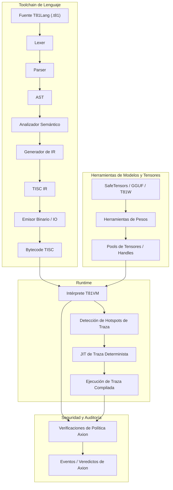

# T81 Foundation

[](https://github.com/t81dev/t81-foundation/actions/workflows/ci.yml)
[](https://github.com/t81dev/t81-foundation/actions/workflows/ci.yml)
[](https://opensource.org/licenses/MIT)
[](https://en.cppreference.com/w/cpp/23)

[](README.md)
[](README.zh-CN.md)
[](README.es.md)
[](README.ru.md)
[-blueviolet?style=flat-square)](README.pt-BR.md)

T81: un stack de computación determinista y nativo en ternario que cuenta con tipos de datos en base-81, el conjunto de instrucciones TISC, T81VM, T81Lang, seguridad/optimización Axion y niveles completos de cognición recursiva.

T81 ofrece una ejecución de bits exactos y auditable en dominios con alta carga aritmética, combinando tipos nativos ternarios con una gobernanza estricta en tiempo de ejecución — ideal para IA verificable, criptografía y computación científica.

> **Nota sobre el determinismo de punto flotante:** > Las funciones trascendentales de `T81Float` (`sin`, `cos`, `tan`, `log`, `exp`, `sqrt`) se implementan a través de un backend definido por software determinista (`dmath`) y se garantiza que son de bits exactos en todas las plataformas.
> La división de `T81Float` y las funciones trigonométricas inversas/hiperbólicas (`asin`, `sinh`, etc.) pueden depender del comportamiento de la plataforma anfitriona en modos no estrictos.
> El determinismo estricto de bits exactos está garantizado para `T81Int`, `T81BigInt`, `T81Fraction` (canónico) y las operaciones principales de `T81Float`.

## Tabla de Contenidos

* [Inicio Rápido](https://www.google.com/search?q=%23inicio-r%C3%A1pido)
* [Características](https://www.google.com/search?q=%23caracter%C3%ADsticas)
* [¿Por qué Ternario?](https://www.google.com/search?q=%23por-qu%C3%A9-ternario)
* [Arquitectura](https://www.google.com/search?q=%23arquitectura)
* [Plataformas Soportadas](https://www.google.com/search?q=%23plataformas-soportadas)
* [Ejemplos de CLI](https://www.google.com/search?q=%23ejemplos-de-cli)
* [Mapa del Repositorio](https://www.google.com/search?q=%23mapa-del-repositorio)
* [Mapa de Autoridad de Documentos](https://www.google.com/search?q=%23mapa-de-autoridad-de-documentos)
* [Garantías de Compatibilidad](https://www.google.com/search?q=%23garant%C3%ADas-de-compatibilidad)
* [No-Objetivos](https://www.google.com/search?q=%23no-objetivos)
* [Límite del Runtime](https://www.google.com/search?q=%23l%C3%ADmite-del-runtime)
* [Lecturas Adicionales](https://www.google.com/search?q=%23lecturas-adicionales)
* [Licencia](https://www.google.com/search?q=%23licencia)

## Inicio Rápido

Verifica las capacidades clave en menos de 30 segundos:

1. **Compilar y Ejecutar Hello World** ```bash
cmake -S . -B build -DCMAKE_BUILD_TYPE=Release && cmake --build build --parallel
./build/t81 compile https://www.google.com/search?q=examples/hello_world.t81 -o hello.tisc
./build/t81 run hello.tisc
```


```


2. **Ejecutar Gate de Determinismo** ```bash
python3 https://www.google.com/search?q=scripts/ci/t81lang_repro_gate.py --t81-bin build/t81 --check
```


```


3. **Ejecutar una Demo de la VM** ```bash
./build/t81_demo
```


```


4. **Inspeccionar un Artefacto de Traza (Trace)** ```bash
./build/t81 trace show trace.txt
```


```


## Características

| Característica | Estado | Descripción |
| --- | --- | --- |
| **Ejecución Determinista** | ✅ Estable | Reproducibilidad de bits exactos multiplataforma mediante T81Lang → TISC → T81VM. |
| **Tipos de Datos Ternarios** | ✅ Estable | Tipos base-81 con aritmética ternaria balanceada para cálculos eficientes. |
| **Motor de Políticas Axion** | ✅ Estable | Aplicación de seguridad en runtime y políticas de optimización. |
| **T81VM** | ✅ Estable | Máquina virtual de 81 registros con interpretación determinista y trace-JIT. |
| **TISC IR** | ✅ Estable | Representación intermedia de Computadora con Conjunto de Instrucciones Ternarias. |
| **Matemáticas por Software** | ✅ Estable | Backend `dmath` para operaciones de punto flotante consistentes entre plataformas. |
| **Compilación Trace-JIT** | 🚧 Experimental | Detección de puntos calientes (hotspots) y JIT determinista para mejora de rendimiento. |
| **Tensores Distribuidos** | 🚧 Experimental | Soporte para operaciones de tensores a gran escala en entornos distribuidos. |
| **Herramientas de Modelos** | ✅ Estable | Importación de pesos, cuantización e inspección para integraciones de ML (SafeTensors, GGUF). |

## ¿Por qué Ternario?

El ternario balanceado (usando dígitos -1, 0, +1) y los tipos de datos base-81 () optimizan las cargas de trabajo intensivas en aritmética como el procesamiento de señales, la inferencia de IA y la criptografía. A diferencia del binario, el ternario balanceado elimina los bits de signo separados, simplifica la suma/resta sin una propagación extensa de acarreo y ofrece una eficiencia energética potencial en hardware especializado.

T81 emula estas ventajas en software para entornos deterministas y auditables. Complementa los sistemas binarios en configuraciones de base mixta, proporcionando ganancias en densidad y energía en sustratos numéricos (por ejemplo, motores cuantizados, núcleos tensoriales). El ternario no es un reemplazo universal, sino una cuña dirigida a dominios donde la sobrecarga es mínima y los beneficios son claros.

Para información técnica sobre hardware, consulte las simulaciones SPICE recientes en el repositorio relacionado [ternary-memory-research](https://github.com/t81dev/ternary-memory-research), que muestran métricas reales de energía/retraso para puertas ternarias en el PDK SKY130.

## Arquitectura

T81 impone una separación estricta entre la compilación y la ejecución, gobernada por contratos explícitos de determinismo y seguridad.



## Plataformas Soportadas

| Plataforma | Compilador | Estado |
| --- | --- | --- |
| Linux (x86_64) | Clang 18+, GCC 14+ | ✅ Gate Determinismo |
| Linux (ARM64) | Clang 18+ | ✅ Gate Determinismo |
| macOS (ARM64) | Apple Clang | ✅ Soportado |

## Ejemplos de CLI

La CLI de `t81` proporciona una interfaz unificada para compilación, ejecución y diagnóstico.

* **Compilar y Ejecutar** ```bash
t81 compile https://www.google.com/search?q=examples/hello_world.t81 -o build/hello.tisc
t81 run build/hello.tisc
```


```


* **Depurar e Inspeccionar** ```bash
t81 disasm build/hello.tisc
t81 debug build/hello.tisc
t81 check https://www.google.com/search?q=examples/hello_world.t81
```


```


* **Traza y Reproducibilidad** ```bash
t81 trace show trace.txt
t81 trace diff trace_a.txt trace_b.txt
t81 trace replay build/hello.tisc trace.txt
t81 repro-hash https://www.google.com/search?q=tests/fixtures/t81lang_determinism
```


```


* **Gestión de Modelos** ```bash
t81 weights import model.safetensors -o model.t81w
t81 weights info model.t81w
t81 weights quantize model.safetensors --to-gguf model.gguf
```


```


Uso completo: *`t81 help`*

## Mapa del Repositorio

* [.github/](https://www.google.com/search?q=.github/) : Workflows, plantillas de issues.
* [benchmarks/](https://www.google.com/search?q=benchmarks/) : Scripts y datos de rendimiento.
* [contracts/](https://www.google.com/search?q=contracts/) : Contratos de runtime (ej., [runtime-contract.json](https://www.google.com/search?q=contracts/runtime-contract.json)).
* [docs/](https://www.google.com/search?q=docs/) : Centro de documentación con subdirectorios como explanation/, how-to/, policies/, reference/, roadmaps-plans/.
* [examples/](https://www.google.com/search?q=examples/) : Ejemplos como hello_world.t81, tensor_demo.t81; subdirectorios system-integration/, tisc/.
* [include/t81/](https://www.google.com/search?q=include/t81/) : Cabeceras públicas.
* [scripts/](https://www.google.com/search?q=scripts/) : Herramientas de CI, gates de reproducibilidad.
* [spec/](https://www.google.com/search?q=spec/) : Especificaciones normativas (ej., [t81-data-types.md](https://www.google.com/search?q=spec/t81-data-types.md), [tisc-spec.md](https://www.google.com/search?q=spec/tisc-spec.md)).
* [src/](https://www.google.com/search?q=src/) : Implementación principal (subdirectorios: axion/, bigint/, canonfs/, cli/, frontend/, tisc/, vm/, etc.).
* [tests/](https://www.google.com/search?q=tests/) : Suites de pruebas (subdirectorios: ci/, cpp/, fixtures/, etc.).

## Mapa de Autoridad de Documentos

| Documento | Propósito | Alcance de Autoridad |
| --- | --- | --- |
| **[spec/constitution.md](https://www.google.com/search?q=spec/constitution.md)** | Principios fundamentales | Normativo |
| **[spec/determinism-profile.md](https://www.google.com/search?q=spec/determinism-profile.md)** | Garantías de determinismo | Normativo |
| **[spec/index.md](https://www.google.com/search?q=spec/index.md)** | Índice de especificaciones | Normativo |
| **[docs/index.md](https://www.google.com/search?q=docs/index.md)** | Entrada de documentación | Informativo |
| **[CONTRIBUTING.md](https://www.google.com/search?q=CONTRIBUTING.md)** | Guías de contribución | Operativo |

## Garantías de Compatibilidad

* **Estable:** Sintaxis de T81Lang, formato TISC, semántica de T81VM.
* **Experimental:** Trace-JIT, tensores distribuidos.
* **SemVer:** Versiones mayores para cambios disruptivos en componentes estables.

## No-Objetivos

🚫 T81 **no** es:

* Un acelerador ternario de hardware (enfoque de software en determinismo).
* Un lenguaje de propósito general para reemplazar C++ o Python.
* Rendimiento-a-toda-costa (rechaza optimizaciones que rompan el determinismo).

## Límite del Runtime

Definido en [contracts/runtime-contract.json](https://www.google.com/search?q=contracts/runtime-contract.json) y detallado en especificaciones como [spec/t81vm-spec.md](https://www.google.com/search?q=spec/t81vm-spec.md).

## Lecturas Adicionales

* [docs/index.md](https://www.google.com/search?q=docs/index.md)
* [spec/t81-overview.md](https://www.google.com/search?q=spec/t81-overview.md)
* [CONTRIBUTING.md](https://www.google.com/search?q=CONTRIBUTING.md)
* [SECURITY.md](https://www.google.com/search?q=SECURITY.md)
* [CHANGELOG.md](https://www.google.com/search?q=CHANGELOG.md) (si está disponible vía commits)

## Licencia

Licencia MIT — ver [LICENSE](https://www.google.com/search?q=LICENSE).

---

¿Te gustaría que adapte alguna sección específica o que genere un archivo `.es.md` listo para subir a tu repositorio?
