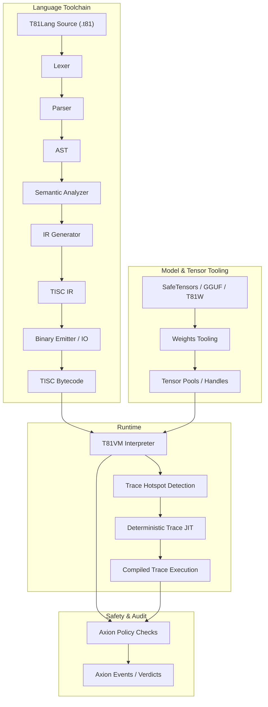

# T81 Foundation

[](https://github.com/t81dev/t81-foundation/actions/workflows/ci.yml)
[](https://github.com/t81dev/t81-foundation/actions/workflows/ci.yml)
[](https://opensource.org/licenses/MIT)
[](https://en.cppreference.com/w/cpp/23)

[](README.md)
[](README.zh-CN.md)
[](README.es.md)
[](README.ru.md)
[-blueviolet?style=flat-square)](README.pt-BR.md)

T81: a deterministic, ternary-native computing stack featuring base-81 data types, the TISC instruction set, T81VM, T81Lang, Axion safety/optimization, and the full recursive cognition tiers.

T81 delivers bit-exact, auditable execution in arithmetic-heavy domains by combining ternary-native types with strict runtime governance — ideal for verifiable AI, cryptography, and scientific computing.

> **Note on Floating Point Determinism:**  
> T81Float transcendental functions (`sin`, `cos`, `tan`, `log`, `exp`, `sqrt`) are implemented via a deterministic software-defined backend (`dmath`) and are guaranteed bit-exact across platforms.  
> T81Float division and inverse/hyperbolic trigonometric functions (`asin`, `sinh`, etc.) may rely on host-platform behavior in non-strict modes.  
> Strict bit-exact determinism is guaranteed for `T81Int`, `T81BigInt`, `T81Fraction` (canonical), and core `T81Float` operations.

## Table of Contents

- [Quick Start](#quick-start)
- [Features](#features)
- [Why Ternary?](#why-ternary)
- [Architecture](#architecture)
- [Supported Platforms](#supported-platforms)
- [CLI Examples](#cli-examples)
- [Repository Map](#repository-map)
- [Document Authority Map](#document-authority-map)
- [Compatibility Guarantees](#compatibility-guarantees)
- [Non-Goals](#non-goals)
- [Runtime Boundary](#runtime-boundary)
- [Further Reading](#further-reading)
- [Definitive Technical Monograph](#-definitive-technical-monograph)
- [License](#license)

## Quick Start

Verify key claims in under 30 seconds:

1. **Build & Run Hello World**  
   ```bash
   cmake -S . -B build -DCMAKE_BUILD_TYPE=Release && cmake --build build --parallel
   ./build/t81 compile examples/hello_world.t81 -o hello.tisc
   ./build/t81 run hello.tisc
   ```

2. **Run Determinism Gate**

   ```bash
   python3 scripts/ci/t81lang_repro_gate.py --t81-bin build/t81 --check
   ```

3. **Run a VM Demo**

   ```bash
   ./build/t81_demo
   ```

4. **Inspect a Trace Artifact**

   ```bash
   ./build/t81 trace show trace.txt
   ```

## Features

| Feature                       | Status          | Description                                                                           |
| ----------------------------- | --------------- | ------------------------------------------------------------------------------------- |
| **Deterministic Execution**   | ✅ Stable        | Bit-exact reproducibility across platforms via T81Lang → TISC → T81VM pipeline.       |
| **Ternary-Native Data Types** | ✅ Stable        | Base-81 types with balanced ternary arithmetic for efficient computations.            |
| **Axion Policy Engine**       | ✅ Stable        | Runtime safety enforcement and optimization policies.                                 |
| **T81VM**                     | ✅ Stable        | 81-register virtual machine with deterministic interpretation and trace-JIT.          |
| **TISC IR**                   | ✅ Stable        | Ternary Instruction Set Computer intermediate representation.                         |
| **Software-Defined Math**     | ✅ Stable        | `dmath` backend for cross-platform consistent floating-point operations.              |
| **Trace-JIT Compilation**     | 🚧 Experimental | Hotspot detection and deterministic JIT for performance gains.                        |
| **Distributed Tensors**       | 🚧 Experimental | Support for large-scale tensor operations in distributed environments.                |
| **Model Tooling**             | ✅ Stable        | Weights import, quantization, and inspection for ML integrations (SafeTensors, GGUF). |

## Why Ternary?

Balanced ternary (using digits -1, 0, +1) and base-81 (3⁴) data types optimize arithmetic-intensive workloads such as signal processing, AI inference, and cryptography. Unlike binary, balanced ternary eliminates separate sign bits, simplifies addition/subtraction without extensive carry propagation, and offers potential energy efficiency in specialized hardware.

T81 emulates these advantages in software for deterministic, auditable environments. It complements binary systems in mixed-radix setups, providing density and energy wins in numerical substrates (e.g., quantized engines, tensor cores). Ternary is not a universal replacement but a targeted wedge for domains where overhead is minimal and benefits are clear.

For hardware insights, see recent SPICE simulations in the related repository [ternary-memory-research](https://github.com/t81dev/ternary-memory-research), showing real energy/delay metrics for ternary gates in the SKY130 PDK.

## Architecture

T81 enforces a strict separation between compilation and execution, governed by explicit contracts for determinism and safety.



## Supported Platforms

| Platform       | Compiler           | Status             |
| -------------- | ------------------ | ------------------ |
| Linux (x86_64) | Clang 18+, GCC 14+ | ✅ Determinism Gate |
| Linux (ARM64)  | Clang 18+          | ✅ Determinism Gate |
| macOS (ARM64)  | Apple Clang        | ✅ Supported        |

## CLI Examples

The `t81` CLI provides a unified interface for compilation, execution, and diagnostics.

* **Compile & Run**

  ```bash
  t81 compile examples/hello_world.t81 -o build/hello.tisc
  t81 run build/hello.tisc
  ```

* **Debug & Inspect**

  ```bash
  t81 disasm build/hello.tisc
  t81 debug build/hello.tisc
  t81 check examples/hello_world.t81
  ```

* **Trace & Reproducibility**

  ```bash
  t81 trace show trace.txt
  t81 trace diff trace_a.txt trace_b.txt
  t81 trace replay build/hello.tisc trace.txt
  t81 repro-hash tests/fixtures/t81lang_determinism
  ```

* **Model Management**

  ```bash
  t81 weights import model.safetensors -o model.t81w
  t81 weights info model.t81w
  t81 weights quantize model.safetensors --to-gguf model.gguf
  t81 canonize-tensor model.t81w
  ```

Full usage: *`t81 help`*

## Repository Map

* [.github/](.github/) : Workflows, issue templates.
* [benchmarks/](benchmarks/) : Performance scripts and data.
* [contracts/](contracts/) : Runtime contracts (e.g., [runtime-contract.json](contracts/runtime-contract.json)).
* [docs/](docs/) : Documentation hub with subdirs like explanation/, how-to/, policies/, reference/, roadmaps-plans/.
* [examples/](examples/) : Samples like hello_world.t81, tensor_demo.t81; subdirs system-integration/, tisc/.
* [include/t81/](include/t81/) : Public headers.
* [scripts/](scripts/) : CI tools, reproducibility gates.
* [spec/](spec/) : Normative specs (e.g., [t81-data-types.md](spec/t81-data-types.md), [tisc-spec.md](spec/tisc-spec.md)).
* [src/](src/) : Core implementation (subdirs: axion/, bigint/, canonfs/, cli/, frontend/, tisc/, vm/, etc.).
* [tests/](tests/) : Test suites (subdirs: ci/, cpp/, fixtures/, etc.).

## Document Authority Map

| Document                                                       | Purpose                 | Authority Scope |
| -------------------------------------------------------------- | ----------------------- | --------------- |
| **[spec/constitution.md](spec/constitution.md)**               | Foundational principles | Normative       |
| **[spec/determinism-profile.md](spec/determinism-profile.md)** | Determinism guarantees  | Normative       |
| **[spec/index.md](spec/index.md)**                             | Core specs index        | Normative       |
| **[docs/index.md](docs/index.md)**                             | Documentation entry     | Informational   |
| **[CONTRIBUTING.md](CONTRIBUTING.md)**                         | Contribution guidelines | Operational     |

## Compatibility Guarantees

* **Stable:** T81Lang syntax, TISC format, T81VM semantics.
* **Experimental:** Trace-JIT, distributed tensors.
* **SemVer:** Major versions for breaking changes in stable components.

## Non-Goals

🚫 T81 is **not**:

* A hardware ternary accelerator (software focus on determinism).
* A general-purpose language replacing C++ or Python.
* Performance-at-all-costs (rejects optimizations breaking determinism).

## Runtime Boundary

Defined in [contracts/runtime-contract.json](contracts/runtime-contract.json) and detailed in specs such as [spec/t81vm-spec.md](spec/t81vm-spec.md).

## Further Reading

* [docs/index.md](docs/index.md)
* [spec/t81-overview.md](spec/t81-overview.md)
* [CONTRIBUTING.md](CONTRIBUTING.md)
* [SECURITY.md](SECURITY.md)
* [CHANGELOG.md](docs/reference/CHANGELOG.md) (if available via commits)

## 📘 Definitive Technical Monograph

For a comprehensive, specification-grade description of the architecture — including formal semantics, determinism invariants, adversarial modeling, and long-term continuity design — see:

➡️ **[The T81 Foundation — Definitive Technical Monograph](book/README.md)**

**Reader paths:**

* **New to T81?** → Start with Part I, then Part II.
* **Implementer?** → Focus on Parts II and III.
* **Auditor?** → Read Parts III and IV carefully.
* **Researcher?** → Emphasize Parts IV and V.
* **Long-term Maintainer?** → Parts IV and V are critical.

<details open>
<summary><strong>Part I — Foundations</strong></summary>

1. **[Introduction](book/01_Introduction.md)**

   * [1.1 Scope and Definition](book/01_Introduction.md#11-scope-and-definition)
   * [1.2 System Architecture](book/01_Introduction.md#12-system-architecture)
   * [1.3 Verifiable Compute Mission](book/01_Introduction.md#13-verifiable-compute-mission)

2. **[Core Principles and Invariants](book/02_Core_Principles_and_Invariants.md)**

   * [2.1 The Determinism Invariant](book/02_Core_Principles_and_Invariants.md#21-the-determinism-invariant)
   * [2.1.1 Determinism Surfaces and Attack Vectors](book/02_Core_Principles_and_Invariants.md#211-determinism-surfaces-and-attack-vectors)
   * [2.2 Ternary Logic (Base-3)](book/02_Core_Principles_and_Invariants.md#22-ternary-logic-base-3)
   * [2.3 Auditability and the Axion Trace](book/02_Core_Principles_and_Invariants.md#23-auditability-and-the-axion-trace)
   * [2.4 The Nine Principles (Ethics Enforcement)](book/02_Core_Principles_and_Invariants.md#24-the-nine-principles-ethics-enforcement)

</details>

<details>
<summary><strong>Part II — The Deterministic Machine</strong></summary>

3. **[T81VM Architecture](book/03_T81VM_Architecture.md)**

   * [3.1 Formal State Machine](book/03_T81VM_Architecture.md#31-formal-state-machine)
   * [3.1.1 State Definition](book/03_T81VM_Architecture.md#311-state-definition)
   * [3.2 Memory Layout](book/03_T81VM_Architecture.md#32-memory-layout)
   * [3.3 Register File](book/03_T81VM_Architecture.md#33-register-file)
   * [3.4 TISC Instruction Set Architecture](book/03_T81VM_Architecture.md#34-tisc-instruction-set-architecture-isa)
   * [3.5 Fault Semantics](book/03_T81VM_Architecture.md#35-fault-semantics)
   * [3.6 Garbage Collection](book/03_T81VM_Architecture.md#36-garbage-collection)

4. **[Data Types and Canonical Serialization](book/04_Data_Types_and_Canonical_Serialization.md)**

   * [4.1 Primitive Types](book/04_Data_Types_and_Canonical_Serialization.md#41-primitive-types)
   * [4.2 T81Float and dmath](book/04_Data_Types_and_Canonical_Serialization.md#42-t81float-and-dmath)
   * [4.3 Tensors and Canonical Layouts](book/04_Data_Types_and_Canonical_Serialization.md#43-tensors-and-canonical-layouts)
   * [4.4 Canonical Serialization Rules](book/04_Data_Types_and_Canonical_Serialization.md#44-canonical-serialization-rules)

5. **[Installation and Build Verification](book/05_Installation_and_Build_Verification.md)**

   * [5.1 Prerequisites](book/05_Installation_and_Build_Verification.md#51-prerequisites)
   * [5.2 Building from Source](book/05_Installation_and_Build_Verification.md#52-building-from-source)
   * [5.3 Verifying the Build](book/05_Installation_and_Build_Verification.md#53-verifying-the-build)

6. **[CLI and API Usage](book/06_CLI_and_API_Usage.md)**

   * [6.1 Command Line Interface](book/06_CLI_and_API_Usage.md#61-the-t81-command-line-interface)
   * [6.2 Embedding T81 (C++ API)](book/06_CLI_and_API_Usage.md#62-embedding-t81-c-api)
   * [6.3 Embedding T81 (Python API)](book/06_CLI_and_API_Usage.md#63-embedding-t81-python-api)
   * [6.4 Debugging](book/06_CLI_and_API_Usage.md#64-debugging)

</details>

<details>
<summary><strong>Part III — Governance and Verification</strong></summary>

7. **[Verification and Audit](book/07_Verification_and_Audit.md)**

   * [7.1 Formal Verification Methodology](book/07_Verification_and_Audit.md#71-formal-verification-methodology)
   * [7.2 The Formal Audit Matrix](book/07_Verification_and_Audit.md#72-the-formal-audit-matrix)
   * [7.3 Property-Based Testing](book/07_Verification_and_Audit.md#73-property-based-testing)
   * [7.4 The Determinism Gate](book/07_Verification_and_Audit.md#74-the-determinism-gate)

8. **[The Axion Safety Kernel](book/08_The_Axion_Safety_Kernel.md)**

   * [8.1 Formal Definition](book/08_The_Axion_Safety_Kernel.md#81-formal-definition)
   * [8.2 The Policy Model](book/08_The_Axion_Safety_Kernel.md#82-the-policy-model)
   * [8.3 Instruction Interception](book/08_The_Axion_Safety_Kernel.md#83-instruction-interception)
   * [8.4 The Audit Log (Trace)](book/08_The_Axion_Safety_Kernel.md#84-the-audit-log-trace)
   * [8.5 Cognitive Promotion](book/08_The_Axion_Safety_Kernel.md#85-cognitive-promotion)

9. **[Cognitive Tiers and Distributed Compute](book/09_Cognitive_Tiers_and_Distributed_Compute.md)**

   * [9.1 The Cognitive Tier Model](book/09_Cognitive_Tiers_and_Distributed_Compute.md#91-the-cognitive-tier-model)
   * [9.2 Distributed Compute (Tier 4)](book/09_Cognitive_Tiers_and_Distributed_Compute.md#92-distributed-compute-tier-4)
   * [9.3 Trace-Based JIT Compilation](book/09_Cognitive_Tiers_and_Distributed_Compute.md#93-trace-based-jit-compilation)
   * [9.4 Infinite Forms (Tier 5)](book/09_Cognitive_Tiers_and_Distributed_Compute.md#94-infinite-forms-tier-5)

10. **[Appendices](book/10_Appendices.md)**

* [10.1 What Is Not Yet Implemented](book/10_Appendices.md#101-what-is-not-yet-implemented)
* [10.2 Threat Model and Determinism Attack Surface](book/10_Appendices.md#102-threat-model-and-determinism-attack-surface)
* [10.3 Glossary](book/10_Appendices.md#103-glossary)

</details>

<details>
<summary><strong>Part IV — Formalization and Structural Hardening</strong></summary>

11. **[Formal Semantics of TISC and T81VM](book/11_Formal_Semantics.md)**

* [Denotational Semantics of TISC](book/11_Formal_Semantics.md#denotational-semantics-of-tisc)
* [Algebraic Transition Function δ](book/11_Formal_Semantics.md#algebraic-transition-function-δ)
* [Canonicalization Rewriting System](book/11_Formal_Semantics.md#canonicalization-rewriting-system)
* [Determinism Proof Sketches](book/11_Formal_Semantics.md#determinism-proof-sketches)
* [Interpreter vs Trace-JIT Equivalence](book/11_Formal_Semantics.md#interpreter-vs-trace-jit-equivalence)

12. **[Adversarial Modeling and Determinism Attacks](book/12_Adversarial_Modeling.md)**

* [Compiler-Level Attacks](book/12_Adversarial_Modeling.md#compiler-level-attacks)
* [VM and GC Attack Vectors](book/12_Adversarial_Modeling.md#vm-and-gc-attack-vectors)
* [CanonFS and Hash Attacks](book/12_Adversarial_Modeling.md#canonfs-and-hash-attacks)
* [Distributed Tier Time-Travel Attack](book/12_Adversarial_Modeling.md#distributed-tier-time-travel-attack)
* [Determinism Breach Postmortem Template](book/12_Adversarial_Modeling.md#determinism-breach-postmortem-template)

</details>

<details>
<summary><strong>Part V — Continuity and Research Horizon</strong></summary>

13. **[Continuity and Resilience](book/13_Continuity_Resilience.md)**

* [Cleanroom Reconstruction Protocol](book/13_Continuity_Resilience.md#cleanroom-reconstruction-protocol)
* [Single Points of Failure](book/13_Continuity_Resilience.md#single-points-of-failure)
* [Continuity Manifest](book/13_Continuity_Resilience.md#continuity-manifest)
* [Immutable Formal Invariants](book/13_Continuity_Resilience.md#immutable-formal-invariants)

14. **[Research Frontier](book/14_Research_Frontier.md)**

* [Ternary Hardware Acceleration](book/14_Research_Frontier.md#ternary-hardware-acceleration)
* [Formal Verification Paths](book/14_Research_Frontier.md#formal-verification-paths)
* [CanonFS as a Merkle Substrate](book/14_Research_Frontier.md#canonfs-as-a-merkle-substrate)
* [Deterministic AI Inference at Scale](book/14_Research_Frontier.md#deterministic-ai-inference-at-scale)

</details>

---

## License

MIT License — see [LICENSE](LICENSE).
