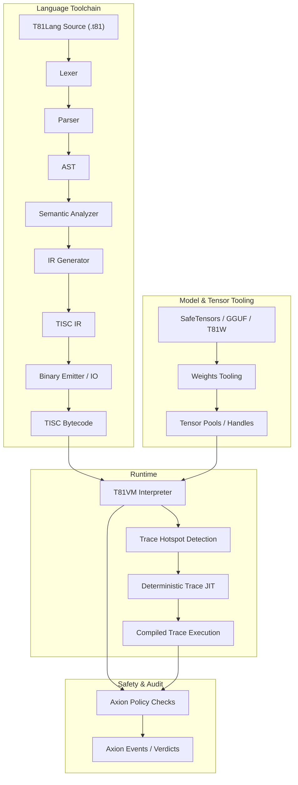

# T81 Foundation

[](https://github.com/t81dev/t81-foundation/actions/workflows/ci.yml)
[](https://opensource.org/licenses/MIT)
[](https://en.cppreference.com/w/cpp/23)

[](README.md)
[](README.zh-CN.md)
[](README.es.md)
[](README.ru.md)
[-blueviolet?style=flat-square)](README.pt-BR.md)

T81: a deterministic, ternary-native computing stack featuring base-81 data types, the TISC instruction set, T81VM, T81Lang, Axion safety/optimization, and the full recursive cognition tiers.

T81 delivers bit-exact, auditable execution in arithmetic-heavy domains by combining ternary-native types with strict runtime governance — ideal for verifiable AI, cryptography, and scientific computing.

> **Note on Floating Point Determinism:**  
> T81Float transcendental functions (`sin`, `cos`, `tan`, `log`, `exp`, `sqrt`) are implemented via a deterministic software-defined backend (`dmath`) and are guaranteed bit-exact across platforms.  
> T81Float division and inverse/hyperbolic trigonometric functions (`asin`, `sinh`, etc.) may rely on host-platform behavior in non-strict modes.  
> Strict bit-exact determinism is guaranteed for `T81Int`, `T81BigInt`, `T81Fraction` (canonical), and core `T81Float` operations.

## Table of Contents

- [Quick Start](#quick-start)
- [Features](#features)
- [Why Ternary?](#why-ternary)
- [Architecture](#architecture)
- [Supported Platforms](#supported-platforms)
- [CLI Examples](#cli-examples)
- [Repository Map](#repository-map)
- [Document Authority Map](#document-authority-map)
- [Compatibility Guarantees](#compatibility-guarantees)
- [Non-Goals](#non-goals)
- [Runtime Boundary](#runtime-boundary)
- [Further Reading](#further-reading)
- [License](#license)

## Quick Start

Verify key claims in under 30 seconds:

1. **Build & Run Hello World**  
   ```bash
   cmake -S . -B build -DCMAKE_BUILD_TYPE=Release && cmake --build build --parallel
   ./build/t81 compile examples/hello_world.t81 -o hello.tisc
   ./build/t81 run hello.tisc
   ```

2. **Run Determinism Gate**  
   ```bash
   python3 scripts/ci/t81lang_repro_gate.py --t81-bin build/t81 --check
   ```

3. **Run a VM Demo**  
   ```bash
   ./build/t81_demo
   ```

4. **Inspect a Trace Artifact**  
   ```bash
   ./build/t81 trace show trace.txt
   ```

## Features

| Feature                  | Status       | Description                                                                 |
|--------------------------|--------------|-----------------------------------------------------------------------------|
| **Deterministic Execution** | ✅ Stable   | Bit-exact reproducibility across platforms via T81Lang → TISC → T81VM pipeline. |
| **Ternary-Native Data Types** | ✅ Stable | Base-81 types with balanced ternary arithmetic for efficient computations.  |
| **Axion Policy Engine** | ✅ Stable    | Runtime safety enforcement and optimization policies.                       |
| **T81VM**                | ✅ Stable    | 81-register virtual machine with deterministic interpretation and trace-JIT. |
| **TISC IR**              | ✅ Stable    | Ternary Instruction Set Computer intermediate representation.               |
| **Software-Defined Math** | ✅ Stable   | `dmath` backend for cross-platform consistent floating-point operations.    |
| **Trace-JIT Compilation** | 🚧 Experimental | Hotspot detection and deterministic JIT for performance gains.              |
| **Distributed Tensors**  | 🚧 Experimental | Support for large-scale tensor operations in distributed environments.      |
| **Model Tooling**        | ✅ Stable    | Weights import, quantization, and inspection for ML integrations (SafeTensors, GGUF). |

## Why Ternary?

Balanced ternary (using digits -1, 0, +1) and base-81 (3⁴) data types optimize arithmetic-intensive workloads such as signal processing, AI inference, and cryptography. Unlike binary, balanced ternary eliminates separate sign bits, simplifies addition/subtraction without extensive carry propagation, and offers potential energy efficiency in specialized hardware.

T81 emulates these advantages in software for deterministic, auditable environments. It complements binary systems in mixed-radix setups, providing density and energy wins in numerical substrates (e.g., quantized engines, tensor cores). Ternary is not a universal replacement but a targeted wedge for domains where overhead is minimal and benefits are clear.

For hardware insights, see recent SPICE simulations in the related repository [ternary-memory-research](https://github.com/t81dev/ternary-memory-research), showing real energy/delay metrics for ternary gates in the SKY130 PDK.

## Architecture

T81 enforces a strict separation between compilation and execution, governed by explicit contracts for determinism and safety.



## Supported Platforms

| Platform          | Compiler       | Status              |
|-------------------|----------------|---------------------|
| Linux (x86_64)    | Clang 18+, GCC 14+ | ✅ Determinism Gate |
| Linux (ARM64)     | Clang 18+      | ✅ Determinism Gate |
| macOS (ARM64)     | Apple Clang    | ✅ Supported        |

## CLI Examples

The `t81` CLI provides a unified interface for compilation, execution, and diagnostics.

- **Compile & Run**  
  ```bash
  t81 compile examples/hello_world.t81 -o build/hello.tisc
  t81 run build/hello.tisc
  ```

- **Debug & Inspect**  
  ```bash
  t81 disasm build/hello.tisc
  t81 debug build/hello.tisc
  t81 check examples/hello_world.t81
  ```

- **Trace & Reproducibility**  
  ```bash
  t81 trace show trace.txt
  t81 trace diff trace_a.txt trace_b.txt
  t81 trace replay build/hello.tisc trace.txt
  t81 repro-hash tests/fixtures/t81lang_determinism
  ```

- **Model Management**  
  ```bash
  t81 weights import model.safetensors -o model.t81w
  t81 weights info model.t81w
  t81 weights quantize model.safetensors --to-gguf model.gguf
  ```

Full usage: *`t81 help`*

## Repository Map

- [.github/](.github/) : Workflows, issue templates.
- [benchmarks/](benchmarks/) : Performance scripts and data.
- [contracts/](contracts/) : Runtime contracts (e.g., [runtime-contract.json](contracts/runtime-contract.json)).
- [docs/](docs/) : Documentation hub with subdirs like explanation/, how-to/, policies/, reference/, roadmaps-plans/.
- [examples/](examples/) : Samples like hello_world.t81, tensor_demo.t81; subdirs system-integration/, tisc/.
- [include/t81/](include/t81/) : Public headers.
- [scripts/](scripts/) : CI tools, reproducibility gates.
- [spec/](spec/) : Normative specs (e.g., [t81-data-types.md](spec/t81-data-types.md), [tisc-spec.md](spec/tisc-spec.md)).
- [src/](src/) : Core implementation (subdirs: axion/, bigint/, canonfs/, cli/, frontend/, tisc/, vm/, etc.).
- [tests/](tests/) : Test suites (subdirs: ci/, cpp/, fixtures/, etc.).

## Document Authority Map

| Document                  | Purpose                  | Authority Scope |
|---------------------------|--------------------------|-----------------|
| **[spec/constitution.md](spec/constitution.md)** | Foundational principles | Normative       |
| **[spec/determinism-profile.md](spec/determinism-profile.md)** | Determinism guarantees | Normative       |
| **[spec/index.md](spec/index.md)** | Core specs index        | Normative       |
| **[docs/index.md](docs/index.md)** | Documentation entry     | Informational   |
| **[CONTRIBUTING.md](CONTRIBUTING.md)** | Contribution guidelines | Operational     |

## Compatibility Guarantees

- **Stable:** T81Lang syntax, TISC format, T81VM semantics.
- **Experimental:** Trace-JIT, distributed tensors.
- **SemVer:** Major versions for breaking changes in stable components.

## Non-Goals

🚫 T81 is **not**:
- A hardware ternary accelerator (software focus on determinism).
- A general-purpose language replacing C++ or Python.
- Performance-at-all-costs (rejects optimizations breaking determinism).

## Runtime Boundary

Defined in [contracts/runtime-contract.json](contracts/runtime-contract.json) and detailed in specs such as [spec/t81vm-spec.md](spec/t81vm-spec.md).

## Further Reading

- [docs/index.md](docs/index.md)
- [spec/t81-overview.md](spec/t81-overview.md)
- [CONTRIBUTING.md](CONTRIBUTING.md)
- [SECURITY.md](SECURITY.md)
- [CHANGELOG.md](CHANGELOG.md) (if available via commits)

## License

MIT License — see [LICENSE](LICENSE).
