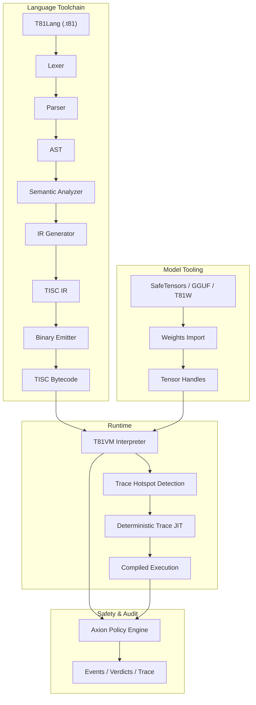

# T81 Foundation

<p align="center">
  <strong>Deterministic ternary-native computing stack featuring base-81 data types, TISC instruction set, T81VM, T81Lang, Axion safety/optimization engine, and recursive cognition tiers — built for bit-exact, auditable, reproducible execution in AI, cryptography, and scientific computing.</strong>
</p>

<p align="center">
  <a href="https://github.com/t81dev/t81-foundation/stargazers"></a>
  <a href="https://github.com/t81dev/t81-foundation/network/members"></a>
  <a href="https://github.com/t81dev/t81-foundation/actions/workflows/ci.yml"></a>
  <a href="https://github.com/t81dev/t81-foundation/commits/main"></a>
  <a href="https://opensource.org/licenses/MIT"></a>
  <a href="https://en.cppreference.com/w/cpp/23"></a>
</p>

<p align="center">
  <a href="README.md"></a>
  <a href="README.zh-CN.md"></a>
  <a href="README.es.md"></a>
  <a href="README.ru.md"></a>
  <a href="README.pt-BR.md"></a>
</p>

---

T81 is a sovereign computing stack designed to eliminate floating-point non-determinism and enable fully auditable execution. By leveraging **balanced ternary logic** and **base-81 data types**, T81 guarantees **bit-exact reproducibility** across all supported architectures (x86/ARM, macOS/Linux). It features the **T81VM**, the **Axion safety engine**, and a recursive tier system for scaling from simple symbolic logic to distributed infinite forms.

> 💡 **Why it matters:** In AI safety, financial modeling, and cryptography, "mostly correct" isn't enough. T81 provides mathematical certainty that your code executes exactly the same way, everywhere, every time.

## Table of Contents

- [Features](#features)
- [Architecture](#architecture)
- [Quick Start](#quick-start)
- [Supported Platforms](#supported-platforms)
- [CLI Examples](#cli-examples)
- [Screenshots & Demo](#screenshots--demo)
- [Repository Map](#repository-map)
- [Document Authority Map](#document-authority-map)
- [Compatibility & Non-Goals](#compatibility--non-goals)
- [Configuration & Axion](#configuration--axion)
- [Contributing](#contributing)
- [Changelog](#changelog)
- [Acknowledgments](#acknowledgments)
- [License](#license)

## Features

| Feature | Status | Description |
| :--- | :--- | :--- |
| **Deterministic Execution** | ✨ Stable | Bit-exact results across x86/ARM/Apple Silicon via `dmath` & custom FP. |
| **Ternary-Native Types** | ✨ Stable | Base-81 balanced ternary integers & floats (no sign bit, reduced carry). |
| **T81VM & TISC** | ✨ Stable | 81-register VM with deterministic interpreter & Trace-JIT. |
| **Axion Engine** | ✨ Stable | Runtime policy, safety, ethics, and optimization engine with audit traces. |
| **Model Tooling** | ✨ Stable | Import/Inspect SafeTensors, GGUF, T81W; quantization support. |
| **Reproducibility Gate** | ✨ Stable | CI-enforced `t81lang_repro_gate.py` ensures 100% determinism. |
| **Cognitive Tiers** | 🚧 Beta | Recursive execution layers (Symbolic → Distributed → Infinite). |
| **Trace-JIT** | 🚧 Experimental | Hotspot optimization preserving strict determinism. |
| **Multilingual Docs** | 📚 Live | Full specs in English, Chinese, Spanish, Portuguese, Russian. |

## Architecture



## Quick Start

Go from zero to verifiable execution in under 60 seconds.

### 1. Build
```bash
cmake -S . -B build -DCMAKE_BUILD_TYPE=Release
cmake --build build --parallel
```

### 2. Compile & Run Hello World
```bash
# Compile T81 source to TISC bytecode
./build/t81 compile examples/hello_world.t81 -o hello.tisc

# Run the bytecode
./build/t81 run hello.tisc
```

### 3. Verify Determinism (The "Repro Gate")
Prove that your build is bit-exact compliant:
```bash
python3 scripts/ci/t81lang_repro_gate.py --t81-bin build/t81 --check
# Output: ✅  All determinism checks passed.
```

## Supported Platforms

All platforms below pass the **Determinism Gate** with identical output hashes.

| Platform | Arch | Compiler | Status |
| :--- | :--- | :--- | :--- |
| **Linux** | x86_64 | Clang 18+, GCC 14+ | ✅ Verified |
| **Linux** | ARM64 | Clang 18+ | ✅ Verified |
| **macOS** | Intel | Apple Clang / GCC | ✅ Verified |
| **macOS** | Apple Silicon | Apple Clang | ✅ Verified |

## CLI Examples

The `t81` CLI is your primary interface for development, debugging, and auditing.

```bash
# 🛠️ Development
t81 compile src.t81 -o out.tisc      # Compile
t81 run out.tisc                     # Execute
t81 disasm out.tisc                  # Disassemble bytecode

# 🐞 Debugging & Audit
t81 debug out.tisc                   # Interactive debugger
t81 trace show trace.txt             # Inspect execution trace
t81 repro-hash tests/fixtures/       # Calculate determinism hash

# 🤖 AI / Tensors
t81 weights import model.safetensors -o model.t81w
t81 weights quantize model.safetensors --to-gguf model.gguf
```

## Screenshots & Demo

*(Visual placeholder: Imagine a sleek terminal window showing a T81 trace log with exact hash matching)*

To see the VM in action with a visual demo:
```bash
./build/t81_demo
```

## Repository Map

Key directories in the codebase:

- **`src/`**: Core C++ source (VM, Axion, TISC, CanonFS).
- **`include/t81/`**: Public headers.
- **`book/book-en/`**: The Definitive Technical Monograph (Documentation).
- **`scripts/ci/`**: Continuous Integration & Reproducibility Gates.
- **`examples/`**: Sample `.t81` programs and C++ embedding examples.
- **`tests/`**: Comprehensive unit and integration test suite.
- **`spec/`**: Normative specifications (TISC, Data Types).
- **`tools/`**: Utility scripts and VSCode extension helpers.

## Document Authority Map

The **Definitive Technical Monograph** is the single source of truth for T81. It is maintained in `book/book-en/` and translated into multiple languages.

<details>
<summary><strong>Part I — Foundations</strong></summary>

1. **[Introduction](book/book-en/01_Introduction.md)**

   * [1.1 Scope and Definition](book/book-en/01_Introduction.md#11-scope-and-definition)
   * [1.2 System Architecture](book/book-en/01_Introduction.md#12-system-architecture)
   * [1.3 Verifiable Compute Mission](book/book-en/01_Introduction.md#13-verifiable-compute-mission)

2. **[Core Principles and Invariants](book/book-en/02_Principles.md)**

   * [2.1 The Determinism Invariant](book/book-en/02_Principles.md#21-the-determinism-invariant)
   * [2.1.1 Determinism Surfaces and Attack Vectors](book/book-en/02_Principles.md#211-determinism-surfaces-and-attack-vectors)
   * [2.2 Ternary Logic (Base-3)](book/book-en/02_Principles.md#22-ternary-logic-base-3)
   * [2.3 Auditability and the Axion Trace](book/book-en/02_Principles.md#23-auditability-and-the-axion-trace)
   * [2.4 The Nine Principles (Ethics Enforcement)](book/book-en/02_Principles.md#24-the-nine-principles-ethics-enforcement)

</details>

<details>
<summary><strong>Part II — The Deterministic Machine</strong></summary>

3. **[T81VM Architecture](book/book-en/03_Architecture.md)**

   * [3.1 Overview](book/book-en/03_Architecture.md#31-overview)
   * [3.1.1 The Execution Pipeline](book/book-en/03_Architecture.md#311-the-execution-pipeline)
   * [3.2 The Runtime Boundary](book/book-en/03_Architecture.md#32-the-runtime-boundary)
   * [3.3 Memory Model](book/book-en/03_Architecture.md#33-memory-model)
   * [3.3.1 Formal State Definition](book/book-en/03_Architecture.md#331-formal-state-definition)
   * [3.4 The Instruction Set (TISC)](book/book-en/03_Architecture.md#34-the-instruction-set-tisc)
   * [3.5 JIT Compilation (Trace-JIT)](book/book-en/03_Architecture.md#35-jit-compilation-trace-jit)

4. **[Data Types and Canonical Serialization](book/book-en/04_Data_Types_and_Serialization.md)**

   * [4.1 Primitive Types](book/book-en/04_Data_Types_and_Serialization.md#41-primitive-types)
   * [4.2 T81Float and dmath](book/book-en/04_Data_Types_and_Serialization.md#42-t81float-and-dmath)
   * [4.3 Tensors and Canonical Layouts](book/book-en/04_Data_Types_and_Serialization.md#43-tensors-and-canonical-layouts)
   * [4.4 Canonical Serialization Rules](book/book-en/04_Data_Types_and_Serialization.md#44-canonical-serialization-rules)

5. **[Installation and Build Verification](book/book-en/05_Installation.md)**

   * [5.1 Prerequisites](book/book-en/05_Installation.md#51-prerequisites)
   * [5.2 Building from Source](book/book-en/05_Installation.md#52-building-from-source)
   * [5.3 Verifying the Build](book/book-en/05_Installation.md#53-verifying-the-build)

6. **[CLI and API Usage](book/book-en/06_Usage.md)**

   * [6.1 Command Line Interface](book/book-en/06_Usage.md#61-the-t81-command-line-interface)
   * [6.2 Embedding T81 (C++ API)](book/book-en/06_Usage.md#62-embedding-t81-c-api)
   * [6.3 Embedding T81 (Python API)](book/book-en/06_Usage.md#63-embedding-t81-python-api)
   * [6.4 Debugging](book/book-en/06_Usage.md#64-debugging)

7. **[Programming in T81Lang](book/book-en/07_Programming_in_T81Lang.md)**

   * [7.1 Design Philosophy](book/book-en/07_Programming_in_T81Lang.md#71-design-philosophy)
   * [7.2 Syntax Basics](book/book-en/07_Programming_in_T81Lang.md#72-syntax-basics)
   * [7.3 Data Types](book/book-en/07_Programming_in_T81Lang.md#73-data-types)
   * [7.4 Control Flow](book/book-en/07_Programming_in_T81Lang.md#74-control-flow)
   * [7.5 Functions](book/book-en/07_Programming_in_T81Lang.md#75-functions)
   * [7.6 Axion Integration](book/book-en/07_Programming_in_T81Lang.md#76-axion-integration)
   * [7.7 Examples](book/book-en/07_Programming_in_T81Lang.md#77-examples)

</details>

<details>
<summary><strong>Part III — Governance and Verification</strong></summary>

8. **[Verification and Audit](book/book-en/08_Verification_and_Audit.md)**

   * [8.1 Formal Verification Methodology](book/book-en/08_Verification_and_Audit.md#71-formal-verification-methodology)
   * [8.2 The Formal Audit Matrix](book/book-en/08_Verification_and_Audit.md#72-the-formal-audit-matrix)
   * [8.3 Property-Based Testing](book/book-en/08_Verification_and_Audit.md#73-property-based-testing)
   * [8.4 The Determinism Gate](book/book-en/08_Verification_and_Audit.md#74-the-determinism-gate)

9. **[The Axion Safety Kernel](book/book-en/09_The_Axion_Kernel.md)**

   * [9.1 Formal Definition](book/book-en/09_The_Axion_Kernel.md#81-formal-definition)
   * [9.2 The Policy Model](book/book-en/09_The_Axion_Kernel.md#82-the-policy-model)
   * [9.3 Instruction Interception](book/book-en/09_The_Axion_Kernel.md#83-instruction-interception)
   * [9.4 The Audit Log (Trace)](book/book-en/09_The_Axion_Kernel.md#84-the-audit-log-trace)
   * [9.5 Cognitive Promotion](book/book-en/09_The_Axion_Kernel.md#85-cognitive-promotion)

10. **[Cognitive Tiers and Distributed Compute](book/book-en/10_Cognitive_Tiers_and_Distributed_Compute.md)**

   * [10.1 The Cognitive Tier Model](book/book-en/10_Cognitive_Tiers_and_Distributed_Compute.md#91-the-cognitive-tier-model)
   * [10.2 Distributed Compute (Tier 4)](book/book-en/10_Cognitive_Tiers_and_Distributed_Compute.md#92-distributed-compute-tier-4)
   * [10.3 Trace-Based JIT Compilation](book/book-en/10_Cognitive_Tiers_and_Distributed_Compute.md#93-trace-based-jit-compilation)
   * [10.4 Infinite Forms (Tier 5)](book/book-en/10_Cognitive_Tiers_and_Distributed_Compute.md#94-infinite-forms-tier-5)

11. **[Appendices](book/book-en/11_Appendices.md)**

* [11.1 What Is Not Yet Implemented](book/book-en/11_Appendices.md#101-what-is-not-yet-implemented)
* [11.2 Glossary](book/book-en/11_Appendices.md#102-glossary)
* [11.3 Useful Links](book/book-en/11_Appendices.md#103-useful-links)

</details>

<details>
<summary><strong>Part IV — Formalization and Structural Hardening</strong></summary>

12. **[Formal Semantics of TISC and T81VM](book/book-en/12_Formal_Semantics.md)**

* [12.1 Operational Semantics](book/book-en/12_Formal_Semantics.md#111-operational-semantics)
* [12.1.1 The Transition Function δ](book/book-en/12_Formal_Semantics.md#1111-the-transition-function)
* [12.2 Algebraic Transition Function](book/book-en/12_Formal_Semantics.md#112-algebraic-transition-function)
* [12.3 Canonicalization Rewriting System](book/book-en/12_Formal_Semantics.md#113-canonicalization-rewriting-system)
* [12.4 Determinism Proof Sketches](book/book-en/12_Formal_Semantics.md#114-determinism-proof-sketches)
* [12.5 Interpreter vs Trace-JIT Equivalence](book/book-en/12_Formal_Semantics.md#115-interpreter-vs-trace-jit-equivalence)

13. **[Adversarial Modeling and Determinism Attacks](book/book-en/13_Adversarial_Modeling.md)**

* [13.1 Threat Model](book/book-en/13_Adversarial_Modeling.md#121-threat-model)
* [13.2 Compiler-Level Attacks](book/book-en/13_Adversarial_Modeling.md#122-compiler-level-attacks)
* [13.3 VM and GC Attack Vectors](book/book-en/13_Adversarial_Modeling.md#123-vm-and-gc-attack-vectors)
* [13.4 CanonFS and Hash Attacks](book/book-en/13_Adversarial_Modeling.md#124-canonfs-and-hash-attacks)
* [13.5 Distributed Tier Time-Travel Attack](book/book-en/13_Adversarial_Modeling.md#125-distributed-tier-time-travel-attack)
* [13.6 Determinism Breach Postmortem Template](book/book-en/13_Adversarial_Modeling.md#126-determinism-breach-postmortem-template)

</details>

<details>
<summary><strong>Part V — Continuity and Research Horizon</strong></summary>

14. **[Continuity and Resilience](book/book-en/14_Continuity_Resilience.md)**

* [14.1 The Cleanroom Protocol](book/book-en/14_Continuity_Resilience.md#131-the-cleanroom-protocol)
* [14.2 Single Points of Failure](book/book-en/14_Continuity_Resilience.md#132-single-points-of-failure)
* [14.3 Continuity Manifest](book/book-en/14_Continuity_Resilience.md#133-continuity-manifest)
* [14.4 Immutable Formal Invariants](book/book-en/14_Continuity_Resilience.md#134-immutable-formal-invariants)

15. **[Research Frontier](book/book-en/15_Research_Frontier.md)**

* [15.1 Ternary Hardware Acceleration](book/book-en/15_Research_Frontier.md#141-ternary-hardware-acceleration)
* [15.2 Formal Verification Paths](book/book-en/15_Research_Frontier.md#142-formal-verification-paths)
* [15.3 CanonFS as a Merkle Substrate](book/book-en/15_Research_Frontier.md#143-canonfs-as-a-merkle-substrate)
* [15.4 Deterministic AI Inference at Scale](book/book-en/15_Research_Frontier.md#144-deterministic-ai-inference-at-scale)

</details>

> 📚 **Read the full monograph here:** [book/book-en/README.md](book/book-en/README.md)

## Compatibility & Non-Goals

### Guarantees
- **TISC Bytecode:** Forward compatible within major versions.
- **Determinism:** Absolute priority. Breaking determinism is treated as a critical security bug.

### Non-Goals
- **Raw Speed at all costs:** We will not sacrifice bit-exactness for hardware-specific fast-math optimizations.
- **General Purpose Replacement:** T81 is specialized for verifiable compute, not to replace C++ or Python for general scripting.

## Configuration & Axion

The **Axion** engine enforces runtime policies. Configuration is handled via policy files or runtime flags.

- **Safety:** Memory limits, recursion depth (Cognitive Tiers).
- **Ethics:** Principles encoded as runtime constraints.
- **Optimization:** Hotspot tracing and JIT thresholds.

See `src/axion/` for implementation details or run `axion_policy_runner` examples.

## Contributing

We welcome contributions! Please see [CONTRIBUTING.md](CONTRIBUTING.md) for details on:
- Code style (Clang-Format).
- Pull Request process.
- Determinism verification requirements.

## Changelog

See [Releases](https://github.com/t81dev/t81-foundation/releases) for the full version history.
- **v1.0.0-Sovereign**: First production-ready release. Stable VM, TISC, and Axion.

## Acknowledgments

Thanks to the open-source community, specifically the contributors to `LLVM`, `fmt`, and the early researchers in ternary computing logic.

## License

This project is licensed under the **MIT License**. See [LICENSE](LICENSE) for details.
