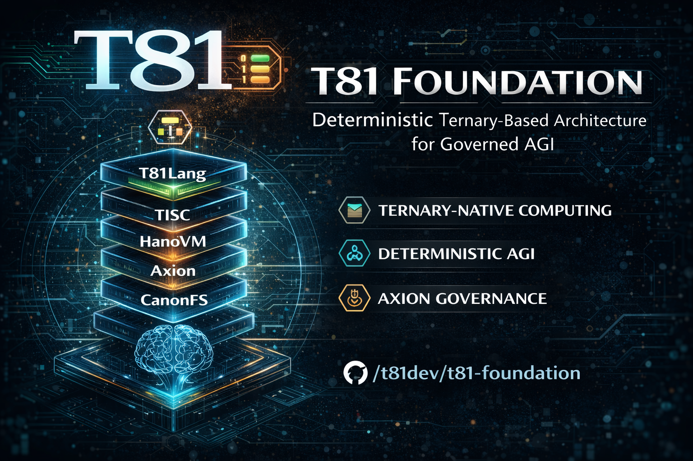

<p align="center">
  <a href="https://github.com/t81dev/t81-foundation/stargazers"></a>
  <a href="https://github.com/t81dev/t81-foundation/network/members"></a>
  <a href="https://github.com/t81dev/t81-foundation/actions/workflows/ci.yml"></a>
  <a href="https://github.com/t81dev/t81-foundation/commits/main"></a>
  <a href="https://opensource.org/licenses/MIT"></a>
  <a href="https://en.cppreference.com/w/cpp/23"></a>
</p>

<p align="center">
  
</p>

<p align="center">
  <strong>Deterministic ternary-native computing stack featuring base-81 data types, TISC instruction set, T81VM, T81Lang, Axion policy engine, and recursive cognition tiers. T81 is a deterministic computing platform with a formally frozen ISA and verifiable reproducibility guarantees for defined surfaces.
</strong>
</p>

---

<p align="center">
  <a href="README.md"></a>
  <a href="README.zh-CN.md"></a>
  <a href="README.es.md"></a>
  <a href="README.ru.md"></a>
  <a href="README.pt-BR.md"></a>
</p>

---

# T81 Foundation - Deterministic Ternary-Based Architecture for Governed AGI

## What T81 Is
T81 is a deterministic computing platform built around balanced ternary and base-81 data representations, a frozen TISC ISA boundary, and governance-enforced reproducibility for verified determinism surfaces. Bit-exact guarantees are scoped to documented verified surfaces and the Deterministic Core Profile (DCP), not to all repository modules.

## What T81 Is Not

- Not a replacement for general-purpose language ecosystems.
- Not a platform that permits fast-math shortcuts on deterministic surfaces.
- Not a claim of determinism outside surfaces marked **Verified** in the registry.
- Not a claim that experimental modules are release-certified deterministic.

---

## Quick Start

```bash
# Configure and build
cmake -S . -B build -DCMAKE_BUILD_TYPE=Release
cmake --build build --parallel 1

# Run tests
ctest --test-dir build --output-on-failure -j1

# Verify determinism gate inputs/hashes
python3 scripts/ci/t81lang_repro_gate.py
````

---

## Determinism Scope

Determinism guarantees apply only to surfaces marked **Verified** in the registry.

* The stable, release-certified subset is defined by the Deterministic Core Profile.
* Experimental modules are out of deterministic release guarantees unless explicitly promoted.
* JIT is excluded from deterministic guarantees unless registry status is upgraded to **Verified**.

References:

* [Deterministic Core Profile](docs/product/DETERMINISTIC_CORE_PROFILE.md)
* [Determinism Surface Registry](docs/governance/DETERMINISM_SURFACE_REGISTRY.md)
* [Determinism Threat Model](docs/governance/DETERMINISM_THREAT_MODEL.md)

---

## Architectural Overview

High-level layers:

* **Foundation** — Core types, ISA, VM execution semantics.
* **Kernel** — Axion policy and capability enforcement.
* **Runtime** — Tracing and JIT-related runtime paths.
* **Higher-Level & Research** — Language frontend and experimental tiers.

Architecture reference:
→ [docs/architecture/OVERVIEW.md](docs/architecture/OVERVIEW.md)

Authority note: README is a summary. Normative definitions reside in [`/spec`](spec/) under the authority model.

---

## Repository Structure

* **Core**: `core/types`, `core/isa`, `core/vm`
* **Kernel**: `kernel/axion`
* **Runtime**: `runtime/tracing`, `runtime/jit`
* **Experimental**: `experimental/*`
* **Language & Tooling**: `lang/`, `tooling/`, `tools/`
* **Public API**: `include/t81/**`
* **Specification**: `spec/`
* **Governance**: `docs/governance/`
* **Status Tracking**: `docs/status/`
* **Product Docs**: `docs/product/`
* **Book (non-normative)**: [book/book-en/](./book/book-en/)

**Public API Contract:**
Only headers under `include/t81/**` are supported as stable C++ API surface.

---

## Project Status

* Deterministic Core Profile: Stable
* Experimental Modules: Active development
* Governance Framework: Enforced
* External Packaging: Supported via CMake

---

## Governed AGI Direction

T81 is oriented toward a deterministic ternary-based architecture for governed
AGI workloads, with strict boundary controls:

* Determinism guarantees remain bounded to registry-verified surfaces and DCP.
* AGI-facing and cognitive-tier surfaces are non-DCP unless explicitly
  promoted.
* Promotion to stronger guarantees follows an explicit governance pipeline.

References:

* [Strategic Direction](docs/product/STRATEGIC_DIRECTION.md)
* [Governed AGI Promotion Pipeline](docs/status/GOVERNED_AGI_PROMOTION_PIPELINE.md)

---

## Governance & Enforcement Model

* [Specification Authority Model](docs/governance/SPEC_AUTHORITY_MODEL.md) — Source-of-truth hierarchy and conflict resolution.
* [Freeze Enforcement](docs/governance/FREEZE_ENFORCEMENT.md) — Frozen boundaries and break discipline.
* [Determinism Surface Registry](docs/governance/DETERMINISM_SURFACE_REGISTRY.md) — Enumerated determinism claims and verification status.
* [Determinism Threat Model](docs/governance/DETERMINISM_THREAT_MODEL.md) — Determinism risk classes and mitigations.
* [Incident Response Plan](docs/governance/INCIDENT_RESPONSE.md) — Determinism/security breach handling.
* [Release Discipline Manifest](docs/product/RELEASE_DISCIPLINE.md) — Release preconditions and SemVer discipline.
* [Dependency Firewall](docs/architecture/DEPENDENCY_FIREWALL.md) — Architectural boundary enforcement.

---

## Deterministic Core Profile (DCP)

DCP defines the stable, release-certified deterministic subset of T81.

* Releases certify DCP compliance.
* Deterministic guarantees apply only to DCP-listed verified surfaces.
* Versioning discipline:

  * **MAJOR** — Frozen boundary violation or incompatible change
  * **MINOR** — Backward-compatible feature addition
  * **PATCH** — Bugfix-only scope

Reference:
→ [docs/product/DETERMINISTIC_CORE_PROFILE.md](docs/product/DETERMINISTIC_CORE_PROFILE.md)

---

## Supported Platforms

All listed platforms pass the Determinism Gate for DCP surfaces.

Platform support applies to DCP surfaces only.

| Platform              | Architecture | Status    |
| --------------------- | ------------ | --------- |
| Ubuntu 22.04+         | x86-64       | Supported |
| macOS (Apple Silicon) | ARM64        | Supported |

---

## Evaluating T81

To independently evaluate deterministic guarantees:

1. Review the Determinism Surface Registry.
2. Review the Deterministic Core Profile definition.
3. Run the determinism gate locally.
4. Inspect release evidence under the Release Discipline Manifest.

---

## Contributing

All contributions must align with institutional controls:

* **Spec-first:** Normative behavior changes must be anchored in `/spec`.
* **Freeze compliance:** Frozen boundaries require explicit governance discipline.
* **ADR discipline:** Architectural or governance changes require ADR entries.
* **Determinism discipline:** Determinism-affecting changes must pass determinism gates.
* **Public API boundary:** Changes under `include/t81/**` are compatibility-sensitive.

Contribution guide:
→ [CONTRIBUTING.md](CONTRIBUTING.md)

---

## Non-Goals

* Guaranteeing determinism outside verified surfaces.
* Guaranteeing deterministic wall-clock performance.
* Guaranteeing network timing determinism.
* Treating experimental modules as DCP-certified by default.
* Relaxing frozen ISA/data-type boundaries without formal governance process.

---

## Documentation Map

* **Normative Specifications** — [`/spec`](spec/)
* **Architecture** — [docs/architecture/OVERVIEW.md](docs/architecture/OVERVIEW.md)
* **Governance** — [docs/governance/](docs/governance/)
* **Status** — [docs/status/](docs/status/)
* **Product** — [docs/product/](docs/product/) (includes [Strategic Direction](docs/product/STRATEGIC_DIRECTION.md))
* **Book (non-normative narrative)** — [book/book-en/](./book/book-en/)

## The T81 Details

<details open>
<summary><strong>Part I — Foundations</strong></summary>

1. **[Introduction](./book/book-en/01_Introduction.md)**

   * [1.1 Scope and Definition](./book/book-en/01_Introduction.md#11-scope-and-definition)
   * [1.2 System Architecture](./book/book-en/01_Introduction.md#12-system-architecture)
   * [1.3 Verifiable Compute Mission](./book/book-en/01_Introduction.md#13-verifiable-compute-mission)
   * [1.4 Terminology](./book/book-en/01_Introduction.md#14-terminology)
   * [1.5 Verification Checklist](./book/book-en/01_Introduction.md#15-verification-checklist)

2. **[Core Principles and Invariants](./book/book-en/02_Principles.md)**

   * [2.1 The Determinism Invariant](./book/book-en/02_Principles.md#21-the-determinism-invariant)
   * [2.1.1 Determinism Surfaces and Attack Vectors](./book/book-en/02_Principles.md#211-determinism-surfaces-and-attack-vectors)
   * [2.2 Ternary Logic (Base-3)](./book/book-en/02_Principles.md#22-ternary-logic-base-3)
   * [2.3 Auditability and the Axion Trace](./book/book-en/02_Principles.md#23-auditability-and-the-axion-trace)
   * [2.4 The Nine Principles (Ethics Enforcement)](./book/book-en/02_Principles.md#24-the-nine-principles-ethics-enforcement)
   * [2.5 Verification Checklist](./book/book-en/02_Principles.md#25-verification-checklist)
   * [2.6 Formal Audit Matrix](./book/book-en/02_Principles.md#26-formal-audit-matrix)

</details>

<details>
<summary><strong>Part II — The Deterministic Machine</strong></summary>

3. **[T81VM Architecture](./book/book-en/03_Architecture.md)**

   * [3.1 Overview](./book/book-en/03_Architecture.md#31-overview)
   * [3.2 The Runtime Boundary](./book/book-en/03_Architecture.md#32-the-runtime-boundary)
   * [3.3 Memory Model](./book/book-en/03_Architecture.md#33-memory-model)
   * [3.4 The Instruction Set (TISC)](./book/book-en/03_Architecture.md#34-the-instruction-set-tisc)
   * [3.5 JIT Compilation (Trace-JIT)](./book/book-en/03_Architecture.md#35-jit-compilation-trace-jit)

4. **[Data Types and Serialization](./book/book-en/04_Data_Types_and_Serialization.md)**

   * [4.1 Primitive Types](./book/book-en/04_Data_Types_and_Serialization.md#41-primitive-types)
   * [4.2 T81Float and dmath](./book/book-en/04_Data_Types_and_Serialization.md#42-t81float-and-dmath)
   * [4.3 Tensors and Canonical Layouts](./book/book-en/04_Data_Types_and_Serialization.md#43-tensors-and-canonical-layouts)
   * [4.4 Canonical Serialization Rules](./book/book-en/04_Data_Types_and_Serialization.md#44-canonical-serialization-rules)

5. **[Installation and Build Verification](./book/book-en/05_Installation.md)**

   * [5.1 Prerequisites](./book/book-en/05_Installation.md#51-prerequisites)
   * [5.2 Building from Source](./book/book-en/05_Installation.md#52-building-from-source)
   * [5.3 Verifying the Build](./book/book-en/05_Installation.md#53-verifying-the-build)
   * [5.4 Troubleshooting](./book/book-en/05_Installation.md#54-troubleshooting)

6. **[CLI and API Usage](./book/book-en/06_Usage.md)**

   * [6.1 The T81 Command Line Interface](./book/book-en/06_Usage.md#61-the-t81-command-line-interface)
   * [6.2 Embedding T81 (C++ API)](./book/book-en/06_Usage.md#62-embedding-t81-c-api)
   * [6.3 Embedding T81 (Python API)](./book/book-en/06_Usage.md#63-embedding-t81-python-api)
   * [6.4 Debugging](./book/book-en/06_Usage.md#64-debugging)

7. **[Programming in T81Lang](./book/book-en/07_Programming_in_T81Lang.md)**

   * [7.1 Design Philosophy](./book/book-en/07_Programming_in_T81Lang.md#71-design-philosophy)
   * [7.2 Syntax Basics](./book/book-en/07_Programming_in_T81Lang.md#72-syntax-basics)
   * [7.3 Data Types](./book/book-en/07_Programming_in_T81Lang.md#73-data-types)
   * [7.4 Control Flow](./book/book-en/07_Programming_in_T81Lang.md#74-control-flow)
   * [7.5 Functions](./book/book-en/07_Programming_in_T81Lang.md#75-functions)
   * [7.6 Structures and Methods](./book/book-en/07_Programming_in_T81Lang.md#76-structures-and-methods)
   * [7.7 Axion Integration](./book/book-en/07_Programming_in_T81Lang.md#77-axion-integration)
   * [7.8 Examples](./book/book-en/07_Programming_in_T81Lang.md#78-examples)

</details>

<details>
<summary><strong>Part III — Governance and Verification</strong></summary>

8. **[Verification and Audit](./book/book-en/08_Verification_and_Audit.md)**

   * [8.1 Verification Methodology](./book/book-en/08_Verification_and_Audit.md#81-verification-methodology)
   * [8.2 Determinism Scope and Audit Matrix](./book/book-en/08_Verification_and_Audit.md#82-determinism-scope-and-audit-matrix)
   * [8.3 Reproducibility Gates](./book/book-en/08_Verification_and_Audit.md#83-reproducibility-gates)
   * [8.4 Failure Implication and Response](./book/book-en/08_Verification_and_Audit.md#84-failure-implication-and-response)

9. **[The Axion Safety Kernel](./book/book-en/09_The_Axion_Kernel.md)**

   * [9.1 Formal Definition](./book/book-en/09_The_Axion_Kernel.md#91-formal-definition)
   * [9.2 The Policy Model](./book/book-en/09_The_Axion_Kernel.md#92-the-policy-model)
   * [9.3 Instruction Interception](./book/book-en/09_The_Axion_Kernel.md#93-instruction-interception)
   * [9.4 The Audit Log (Trace)](./book/book-en/09_The_Axion_Kernel.md#94-the-audit-log-trace)
   * [9.5 Cognitive Promotion](./book/book-en/09_The_Axion_Kernel.md#95-cognitive-promotion)

10. **[Cognitive Tiers and Distributed Compute](./book/book-en/10_Cognitive_Tiers_and_Distributed_Compute.md)**

   * [10.1 The Cognitive Tier Model](./book/book-en/10_Cognitive_Tiers_and_Distributed_Compute.md#101-the-cognitive-tier-model)
   * [10.2 Distributed Compute (Tier 4)](./book/book-en/10_Cognitive_Tiers_and_Distributed_Compute.md#102-distributed-compute-tier-4)
   * [10.3 Trace-JIT and Advanced Runtime Paths](./book/book-en/10_Cognitive_Tiers_and_Distributed_Compute.md#103-trace-jit-and-advanced-runtime-paths)
   * [10.4 Infinite Forms (Tier 5)](./book/book-en/10_Cognitive_Tiers_and_Distributed_Compute.md#104-infinite-forms-tier-5)

11. **[Appendices](./book/book-en/11_Appendices.md)**

* [11.1 Boundary and Maturity Snapshot](./book/book-en/11_Appendices.md#111-boundary-and-maturity-snapshot)
* [11.2 Glossary](./book/book-en/11_Appendices.md#112-glossary)
* [11.3 Useful Links](./book/book-en/11_Appendices.md#113-useful-links)

</details>

<details>
<summary><strong>Part IV — Formalization and Structural Hardening</strong></summary>

12. **[Formal Semantics of TISC and T81VM](./book/book-en/12_Formal_Semantics.md)**

* [12.1 Operational Semantics](./book/book-en/12_Formal_Semantics.md#121-operational-semantics)
* [12.2 Algebraic Transition Function](./book/book-en/12_Formal_Semantics.md#122-algebraic-transition-function)
* [12.3 Canonicalization Rewriting System](./book/book-en/12_Formal_Semantics.md#123-canonicalization-rewrite-system)
* [12.4 Determinism Proof Sketches](./book/book-en/12_Formal_Semantics.md#124-determinism-proof-sketches)
* [12.5 Interpreter vs Trace-JIT Equivalence](./book/book-en/12_Formal_Semantics.md#125-interpreter-vs-trace-jit-equivalence)

13. **[Adversarial Modeling and Determinism Attacks](./book/book-en/13_Adversarial_Modeling.md)**

* [13.1 Threat Model](./book/book-en/13_Adversarial_Modeling.md#131-threat-model)
* [13.2 Compiler-Level Attacks](./book/book-en/13_Adversarial_Modeling.md#132-compiler-level-attacks)
* [13.3 VM and GC Attack Vectors](./book/book-en/13_Adversarial_Modeling.md#133-vm-and-gc-attack-vectors)
* [13.4 CanonFS and Hash Attacks](./book/book-en/13_Adversarial_Modeling.md#134-canonfs-and-hash-attacks)
* [13.5 Distributed Tier Time-Travel Attack](./book/book-en/13_Adversarial_Modeling.md#135-distributed-tier-time-travel-attack)
* [13.6 Determinism Breach Postmortem Template](./book/book-en/13_Adversarial_Modeling.md#136-determinism-breach-postmortem-template)

</details>

<details>
<summary><strong>Part V — Continuity and Research Horizon</strong></summary>

14. **[Continuity and Resilience](./book/book-en/14_Continuity_Resilience.md)**

* [14.1 The Cleanroom Protocol](./book/book-en/14_Continuity_Resilience.md#141-the-cleanroom-protocol)
* [14.2 Single Points of Failure](./book/book-en/14_Continuity_Resilience.md#142-single-points-of-failure)
* [14.3 Continuity Manifest](./book/book-en/14_Continuity_Resilience.md#143-continuity-manifest)
* [14.4 Immutable Formal Invariants](./book/book-en/14_Continuity_Resilience.md#144-immutable-formal-invariants)

15. **[Research Frontier](./book/book-en/15_Research_Frontier.md)**

* [15.1 Ternary Hardware Acceleration](./book/book-en/15_Research_Frontier.md#151-ternary-hardware-acceleration)
* [15.2 Formal Verification Paths](./book/book-en/15_Research_Frontier.md#152-formal-verification-paths)
* [15.3 CanonFS as a Merkle Substrate](./book/book-en/15_Research_Frontier.md#153-canonfs-as-a-merkle-substrate)
* [15.4 Deterministic AI Inference at Scale](./book/book-en/15_Research_Frontier.md#154-deterministic-ai-inference-at-scale)

</details>

---

## License

MIT License. See [LICENSE](LICENSE).
