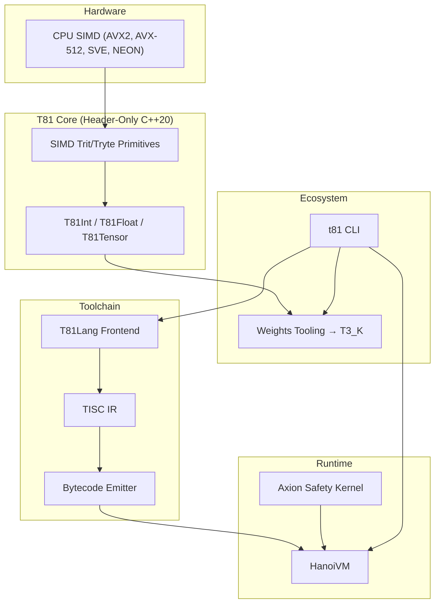

# T81 Foundation – Ternary-Native Deterministic Computing

[](https://github.com/t81dev/t81-foundation/actions/workflows/ci.yml)
[](https://opensource.org/licenses/MIT)
[](https://en.cppreference.com/w/cpp/20)

**Solve the AI reproducibility crisis** with canonical balanced-ternary numerics, deterministic VM execution, Axion overflow trapping, and full SHA3-512 tensor provenance.

> We turn the AI reproducibility crisis into a deterministic ledger. T81 is a production-ready stack that proves every model, tensor, and trace can be audited, replayed, and trusted.

## Core Guarantees
- **Bit-for-bit reproducible** models, traces, and execution paths.
- **No silent overflow/underflow** via Axion safety hooks.
- **Audit-ready execution** with replayable bytecode and SHA3-512 provenance.

## Quick Start (30 seconds)
```bash
git clone https://github.com/t81dev/t81-foundation.git
cd t81-foundation
mkdir build && cd build
cmake .. -DCMAKE_BUILD_TYPE=Release
make -j$(nproc)
ctest --output-on-failure
```

## Why T81?

Standard IEEE 754 floating-point paths often diverge across environments, leading to drift in AI models. T81 enforces **canonical balanced-ternary** numerics where every operation is deterministic and verifiable.

| Feature | Standard Binary (FP32/64) | T81 Foundation |
| :--- | :--- | :--- |
| **Reproducibility** | Environment-dependent (drift) | Bit-identical across all platforms |
| **Overflow** | Silent or `inf`/`NaN` | Axion deterministic trap |
| **Auditability** | Opaque binary blobs | SHA3-512 provenance & traces |
| **Numerics** | Binary Floating Point | Balanced Ternary (Base-81) |

```cpp
// Axion Guarantee
t81::axion::Context axion;
auto value = t81::T81Int<81>::kMaxValue;
auto result = value + t81::T81Int<81>(1); // Axion traps overflow before corruption
```

## Try an Example
Check out `examples/` or run a minimal T81Lang snippet:

**Hello T81 (`examples/hello_world.t81`)**
```rust
fn main() {
  let msg = T81String("Hello, World!")
  stdout << msg
}
```

Run a benchmark:
```bash
./build/t81 benchmark matmul --size=1024
```

Run the canonical ecosystem consumer path:
```bash
scripts/run-canonical-runtime-demo.sh
```

## Architecture


## Repository Map

| Compass | Purpose |
| :--- | :--- |
| [`spec/`](spec/) | Constitutional governance; normative semantics only change through RFCs. |
| [`include/t81/`](include/t81/) | Public `t81::v1` headers; add APIs here with Axion-safe guarantees. |
| [`src/`](src/) | Implementation of compiler, HanoiVM, tensor tooling, and benchmarks. |
| [`tests/`](tests/) | Automated proofs of determinism; every API change gets coverage. |
| [`benchmarks/`](benchmarks/) | Benchmark generators and runners that power `docs/benchmarks.md`. |
| [`docs/`](docs/) | Manifest insights, benchmark reports, onboarding guides, and system status. |
| [`examples/`](examples/) | Canonical T81Lang demos and deployment snippets. |

[→ Full documentation](docs/) · [Specification](spec/) · [Whitepaper](WHITEPAPER.md) · [Roadmap](ROADMAP.md)

## Ecosystem Runtime Boundary

- Runtime marker: `contracts/runtime-contract.json`
- Boundary policy: `docs/runtime-semantics-boundary.md`
- Sync check: `python3 scripts/check-runtime-contract-sync.py`
- Canonical consumer examples: `../t81-examples` (`runtime-v0.5` e2e bundle)
- Foundation `examples/`: reference/research demos (not the primary contract promotion lane)

### Release v1.0 Resources
- **[Researcher's Guide](./docs/research-guide.md)**: Deep dive into balanced ternary and cognitive tiers.
- **[Secure Deployment Tutorial](./docs/guides/secure-deployment-tutorial.md)**: End-to-end guide for verified apps.
- **[Ecosystem Tools](./tools/axion_policy_validator.py)**: Policy validation and audit tooling.
