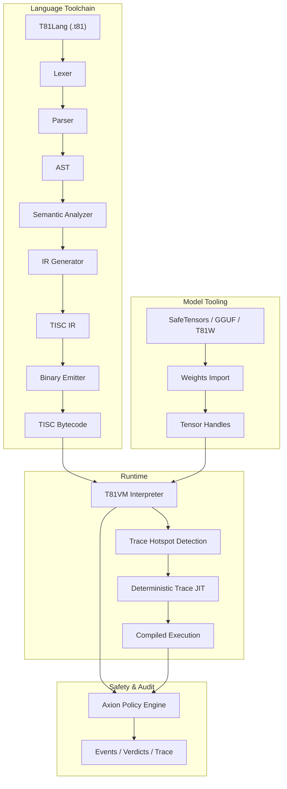

# T81 Foundation 🔥

<div align="center">
  
[](https://github.com/t81dev/t81-foundation/actions/workflows/ci.yml)
[](https://github.com/t81dev/t81-foundation/actions/workflows/ci.yml)
[](https://opensource.org/licenses/MIT)
[](https://en.cppreference.com/w/cpp/23)

[](README.md)
[](README.zh-CN.md)
[](README.es.md)
[](README.ru.md)
[-blueviolet?style=flat-square)](README.pt-BR.md)

</div>
  
T81 is a deterministic, ternary-native computing stack 🌐 featuring base-81 data types, the TISC instruction set, T81VM, T81Lang, Axion safety & optimization engine, and recursive cognition tiers.

It delivers bit-exact, auditable execution ⚡ for arithmetic-heavy domains — perfect for verifiable AI, cryptography, and scientific computing.

> **Floating Point Determinism Note** ⚠️  
> Transcendental functions (`sin`, `cos`, `tan`, `log`, `exp`, `sqrt`) use deterministic `dmath` backend — bit-exact across platforms.  
> Division and inverse/hyperbolic functions may fall back to host behavior in non-strict mode.  
> Full strict determinism guaranteed for `T81Int`, `T81BigInt`, `T81Fraction`, and core `T81Float` arithmetic. ✅

## Table of Contents 📑

- [Quick Start 🚀](#quick-start)
- [Features 🌟](#features)
- [Why Ternary? 🧠](#why-ternary)
- [Architecture 🏗️](#architecture)
- [Supported Platforms 🌍](#supported-platforms)
- [CLI Examples 🔧](#cli-examples)
- [Repository Map 📂](#repository-map)
- [Document Authority Map 📜](#document-authority-map)
- [Compatibility Guarantees 🔄](#compatibility-guarantees)
- [Non-Goals 🚫](#non-goals)
- [Runtime Boundary 🔐](#runtime-boundary)
- [Further Reading 📖](#further-reading)
- [Definitive Technical Monograph 📘](#definitive-technical-monograph)
- [License 📜](#license)

## Quick Start 🚀⚡

Verify core claims in < 30 seconds:

1. **Build & Run Hello World** 🏃‍♂️  
   ```bash
   cmake -S . -B build -DCMAKE_BUILD_TYPE=Release && cmake --build build --parallel
   ./build/t81 compile examples/hello_world.t81 -o hello.tisc
   ./build/t81 run hello.tisc
   ```

2. **Run Determinism Gate** 🔄✅  
   ```bash
   python3 scripts/ci/t81lang_repro_gate.py --t81-bin build/t81 --check
   ```

3. **Run VM Demo** ▶️🔥  
   ```bash
   ./build/t81_demo
   ```

4. **Inspect Trace** 🔍📜  
   ```bash
   ./build/t81 trace show trace.txt
   ```

## Features 🌟

| Feature                       | Status            | Description                                                                           |
|-------------------------------|-------------------|---------------------------------------------------------------------------------------|
| ✅ Deterministic Execution     | Stable 🔥         | Bit-exact reproducibility across platforms                                            |
| ✅ Ternary-Native Data Types   | Stable 🌐         | Base-81 with balanced ternary arithmetic                                              |
| ✅ Axion Policy Engine         | Stable 🔐         | Runtime safety, optimization & ethics enforcement                                     |
| ✅ T81VM                       | Stable ⚙️         | 81-register VM + deterministic interpreter & trace-JIT                               |
| ✅ TISC IR                     | Stable 📡         | Ternary Instruction Set Computer intermediate representation                          |
| ✅ Software-Defined Math       | Stable 🧮         | Cross-platform consistent floating-point (`dmath`)                                    |
| 🚧 Trace-JIT Compilation       | Experimental ⚡    | Hotspot tracing & deterministic JIT                                                   |
| 🚧 Distributed Tensors         | Experimental 🌍   | Large-scale distributed tensor support                                                |
| ✅ Model Tooling               | Stable 🤖         | SafeTensors / GGUF / T81W import, quantize, inspect                                   |

## Why Ternary? 🧠🧮

Balanced ternary (-1, 0, +1) and base-81 eliminate sign bits, simplify addition/subtraction (reduced carry), and offer theoretical density/energy advantages — especially valuable in numerical workloads (AI inference, cryptography, signal processing).

T81 brings these benefits to software while prioritizing determinism and auditability over raw speed. See related hardware experiments in [ternary-memory-research](https://github.com/t81dev/ternary-memory-research) for SKY130 PDK metrics. 🔬

## Architecture 🏗️



## Supported Platforms 🌍

| Platform                  | Compiler              | Status                  | Determinism Gate | Notes                              |
|---------------------------|-----------------------|-------------------------|------------------|------------------------------------|
| Linux x86_64              | Clang 18+, GCC 14+    | ✅ Passing 🔥            | ✅               | Full gate passing                  |
| Linux ARM64               | Clang 18+             | ✅ Passing 🔥            | ✅               | Full gate passing                  |
| macOS x86_64 (Intel)      | Apple Clang / GCC     | ✅ Passing              | ✅                | Works natively                     |
| macOS ARM64 (Apple Silicon) | Apple Clang         | ✅ Passing              | ✅                | Active investigation (CMake/flags) |

## CLI Examples 🔧🔍

```bash
# Compile & run 🚀
t81 compile examples/hello_world.t81 -o hello.tisc
t81 run hello.tisc

# Debug & inspect 🕵️
t81 disasm hello.tisc
t81 debug hello.tisc
t81 trace show trace.txt
t81 repro-hash tests/fixtures/t81lang_determinism

# Model tooling 🤖
t81 weights import model.safetensors -o model.t81w
t81 weights quantize model.safetensors --to-gguf model.gguf
```

Full help: `t81 --help` or `t81 help <subcommand>` 📖

## Repository Map 📂

- `.github/`          → Workflows & templates 🛠️
- `benchmarks/`       → Performance measurements 📈
- `docs/`             → How-to guides, explanations, references 📚
- `examples/`         → Sample programs (.t81 files) 🎯
- `include/t81/`      → Public headers 🧩
- `scripts/`          → CI tools & reproducibility gates 🔄
- `spec/`             → Normative specifications 📜
- `src/`              → Core source (axion/, canonfs/, vm/, etc.) ⚙️
- `tests/`            → Unit, property & integration tests 🧪
- `tools/`            → Utility scripts & VSCode extension 🛠️

## Document Authority Map 📜

| Document                              | Purpose                        | Authority     |
|---------------------------------------|--------------------------------|---------------|
| spec/constitution.md                  | Foundational principles        | Normative 🔒  |
| spec/determinism-profile.md           | Determinism guarantees         | Normative ✅   |
| spec/t81-data-types.md                | Data type & serialization spec | Normative 🧮  |
| spec/tisc-spec.md                     | TISC instruction set           | Normative 📡  |
| docs/index.md                         | Documentation entry point      | Informational 📖 |

## Compatibility Guarantees 🔄

- **Stable:** T81Lang syntax, TISC format, T81VM core semantics ✅
- **Experimental:** Trace-JIT, distributed tensors 🚧
- **SemVer:** Major version bumps for breaking changes in stable parts ⚖️

## Non-Goals 🚫

T81 is **not**:

- a hardware ternary accelerator 🖥️
- a general-purpose replacement for C++/Python/Rust 🛑
- optimized for maximum throughput at the expense of determinism ⚡❌

## Runtime Boundary 🔐

Defined in specs such as [spec/t81vm-spec.md](spec/t81vm-spec.md)

## Further Reading 📖

- [docs/index.md](docs/index.md)  
- [spec/index.md](spec/index.md)  
- [CONTRIBUTING.md](CONTRIBUTING.md)  
- [SECURITY.md](SECURITY.md)

---

## 📘 Definitive Technical Monograph

For a comprehensive, specification-grade description of the architecture — including formal semantics, determinism invariants, adversarial modeling, and long-term continuity design — see:

➡️ **[The T81 Foundation — Definitive Technical Monograph](book/README.md)**

**Reader paths:**

* **New to T81?** → Start with Part I, then Part II.
* **Implementer?** → Focus on Parts II and III.
* **Auditor?** → Read Parts III and IV carefully.
* **Researcher?** → Emphasize Parts IV and V.
* **Long-term Maintainer?** → Parts IV and V are critical.

<details>
<summary><strong>Part I — Foundations</strong></summary>

1. **[Introduction](book/01_Introduction.md)**

   * [1.1 Scope and Definition](book/01_Introduction.md#11-scope-and-definition)
   * [1.2 System Architecture](book/01_Introduction.md#12-system-architecture)
   * [1.3 Verifiable Compute Mission](book/01_Introduction.md#13-verifiable-compute-mission)

2. **[Core Principles and Invariants](book/02_Core_Principles_and_Invariants.md)**

   * [2.1 The Determinism Invariant](book/02_Core_Principles_and_Invariants.md#21-the-determinism-invariant)
   * [2.1.1 Determinism Surfaces and Attack Vectors](book/02_Core_Principles_and_Invariants.md#211-determinism-surfaces-and-attack-vectors)
   * [2.2 Ternary Logic (Base-3)](book/02_Core_Principles_and_Invariants.md#22-ternary-logic-base-3)
   * [2.3 Auditability and the Axion Trace](book/02_Core_Principles_and_Invariants.md#23-auditability-and-the-axion-trace)
   * [2.4 The Nine Principles (Ethics Enforcement)](book/02_Core_Principles_and_Invariants.md#24-the-nine-principles-ethics-enforcement)

</details>

<details>
<summary><strong>Part II — The Deterministic Machine</strong></summary>

3. **[T81VM Architecture](book/03_T81VM_Architecture.md)**

   * [3.1 Formal State Machine](book/03_T81VM_Architecture.md#31-formal-state-machine)
   * [3.1.1 State Definition](book/03_T81VM_Architecture.md#311-state-definition)
   * [3.2 Memory Layout](book/03_T81VM_Architecture.md#32-memory-layout)
   * [3.3 Register File](book/03_T81VM_Architecture.md#33-register-file)
   * [3.4 TISC Instruction Set Architecture](book/03_T81VM_Architecture.md#34-tisc-instruction-set-architecture-isa)
   * [3.5 Fault Semantics](book/03_T81VM_Architecture.md#35-fault-semantics)
   * [3.6 Garbage Collection](book/03_T81VM_Architecture.md#36-garbage-collection)

4. **[Data Types and Canonical Serialization](book/04_Data_Types_and_Canonical_Serialization.md)**

   * [4.1 Primitive Types](book/04_Data_Types_and_Canonical_Serialization.md#41-primitive-types)
   * [4.2 T81Float and dmath](book/04_Data_Types_and_Canonical_Serialization.md#42-t81float-and-dmath)
   * [4.3 Tensors and Canonical Layouts](book/04_Data_Types_and_Canonical_Serialization.md#43-tensors-and-canonical-layouts)
   * [4.4 Canonical Serialization Rules](book/04_Data_Types_and_Canonical_Serialization.md#44-canonical-serialization-rules)

5. **[Installation and Build Verification](book/05_Installation_and_Build_Verification.md)**

   * [5.1 Prerequisites](book/05_Installation_and_Build_Verification.md#51-prerequisites)
   * [5.2 Building from Source](book/05_Installation_and_Build_Verification.md#52-building-from-source)
   * [5.3 Verifying the Build](book/05_Installation_and_Build_Verification.md#53-verifying-the-build)

6. **[CLI and API Usage](book/06_CLI_and_API_Usage.md)**

   * [6.1 Command Line Interface](book/06_CLI_and_API_Usage.md#61-the-t81-command-line-interface)
   * [6.2 Embedding T81 (C++ API)](book/06_CLI_and_API_Usage.md#62-embedding-t81-c-api)
   * [6.3 Embedding T81 (Python API)](book/06_CLI_and_API_Usage.md#63-embedding-t81-python-api)
   * [6.4 Debugging](book/06_CLI_and_API_Usage.md#64-debugging)

</details>

<details>
<summary><strong>Part III — Governance and Verification</strong></summary>

7. **[Verification and Audit](book/07_Verification_and_Audit.md)**

   * [7.1 Formal Verification Methodology](book/07_Verification_and_Audit.md#71-formal-verification-methodology)
   * [7.2 The Formal Audit Matrix](book/07_Verification_and_Audit.md#72-the-formal-audit-matrix)
   * [7.3 Property-Based Testing](book/07_Verification_and_Audit.md#73-property-based-testing)
   * [7.4 The Determinism Gate](book/07_Verification_and_Audit.md#74-the-determinism-gate)

8. **[The Axion Safety Kernel](book/08_The_Axion_Safety_Kernel.md)**

   * [8.1 Formal Definition](book/08_The_Axion_Safety_Kernel.md#81-formal-definition)
   * [8.2 The Policy Model](book/08_The_Axion_Safety_Kernel.md#82-the-policy-model)
   * [8.3 Instruction Interception](book/08_The_Axion_Safety_Kernel.md#83-instruction-interception)
   * [8.4 The Audit Log (Trace)](book/08_The_Axion_Safety_Kernel.md#84-the-audit-log-trace)
   * [8.5 Cognitive Promotion](book/08_The_Axion_Safety_Kernel.md#85-cognitive-promotion)

9. **[Cognitive Tiers and Distributed Compute](book/09_Cognitive_Tiers_and_Distributed_Compute.md)**

   * [9.1 The Cognitive Tier Model](book/09_Cognitive_Tiers_and_Distributed_Compute.md#91-the-cognitive-tier-model)
   * [9.2 Distributed Compute (Tier 4)](book/09_Cognitive_Tiers_and_Distributed_Compute.md#92-distributed-compute-tier-4)
   * [9.3 Trace-Based JIT Compilation](book/09_Cognitive_Tiers_and_Distributed_Compute.md#93-trace-based-jit-compilation)
   * [9.4 Infinite Forms (Tier 5)](book/09_Cognitive_Tiers_and_Distributed_Compute.md#94-infinite-forms-tier-5)

10. **[Appendices](book/10_Appendices.md)**

* [10.1 What Is Not Yet Implemented](book/10_Appendices.md#101-what-is-not-yet-implemented)
* [10.2 Threat Model and Determinism Attack Surface](book/10_Appendices.md#102-threat-model-and-determinism-attack-surface)
* [10.3 Glossary](book/10_Appendices.md#103-glossary)

</details>

<details>
<summary><strong>Part IV — Formalization and Structural Hardening</strong></summary>

11. **[Formal Semantics of TISC and T81VM](book/11_Formal_Semantics.md)**

* [Denotational Semantics of TISC](book/11_Formal_Semantics.md#denotational-semantics-of-tisc)
* [Algebraic Transition Function δ](book/11_Formal_Semantics.md#algebraic-transition-function-δ)
* [Canonicalization Rewriting System](book/11_Formal_Semantics.md#canonicalization-rewriting-system)
* [Determinism Proof Sketches](book/11_Formal_Semantics.md#determinism-proof-sketches)
* [Interpreter vs Trace-JIT Equivalence](book/11_Formal_Semantics.md#interpreter-vs-trace-jit-equivalence)

12. **[Adversarial Modeling and Determinism Attacks](book/12_Adversarial_Modeling.md)**

* [Compiler-Level Attacks](book/12_Adversarial_Modeling.md#compiler-level-attacks)
* [VM and GC Attack Vectors](book/12_Adversarial_Modeling.md#vm-and-gc-attack-vectors)
* [CanonFS and Hash Attacks](book/12_Adversarial_Modeling.md#canonfs-and-hash-attacks)
* [Distributed Tier Time-Travel Attack](book/12_Adversarial_Modeling.md#distributed-tier-time-travel-attack)
* [Determinism Breach Postmortem Template](book/12_Adversarial_Modeling.md#determinism-breach-postmortem-template)

</details>

<details>
<summary><strong>Part V — Continuity and Research Horizon</strong></summary>

13. **[Continuity and Resilience](book/13_Continuity_Resilience.md)**

* [Cleanroom Reconstruction Protocol](book/13_Continuity_Resilience.md#cleanroom-reconstruction-protocol)
* [Single Points of Failure](book/13_Continuity_Resilience.md#single-points-of-failure)
* [Continuity Manifest](book/13_Continuity_Resilience.md#continuity-manifest)
* [Immutable Formal Invariants](book/13_Continuity_Resilience.md#immutable-formal-invariants)

14. **[Research Frontier](book/14_Research_Frontier.md)**

* [Ternary Hardware Acceleration](book/14_Research_Frontier.md#ternary-hardware-acceleration)
* [Formal Verification Paths](book/14_Research_Frontier.md#formal-verification-paths)
* [CanonFS as a Merkle Substrate](book/14_Research_Frontier.md#canonfs-as-a-merkle-substrate)
* [Deterministic AI Inference at Scale](book/14_Research_Frontier.md#deterministic-ai-inference-at-scale)

</details>

---

## License

MIT License — see [LICENSE](LICENSE).
