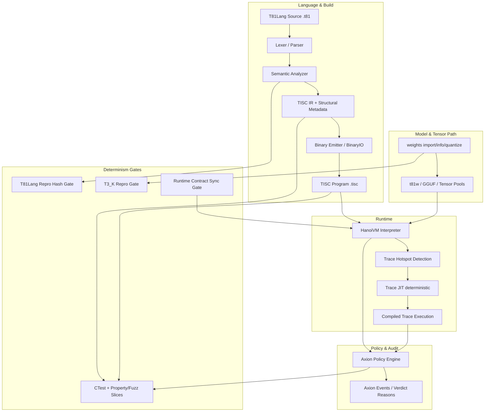

# T81 Foundation

[](https://github.com/t81dev/t81-foundation/actions/workflows/ci.yml)
[](https://opensource.org/licenses/MIT)
[](https://en.cppreference.com/w/cpp/23)

Deterministic ternary-native computing stack for auditable compilation and execution:

`T81Lang -> TISC -> HanoiVM (+ Axion policy/traces)`

The project is in a **post-v1.0 hardening and scaling phase**.

## What T81 Focuses On
- Deterministic compile and runtime behavior
- Metadata-preserving language/toolchain pipeline
- Reproducibility gates and traceability in CI
- Policy-aware runtime execution (Axion)

## Core Guarantees
- **Deterministic pipeline:** stable semantics from source to VM execution
- **Auditable artifacts:** TISC binaries, policy text, and trace surfaces are inspectable
- **Reproducibility enforcement:** CI gates for T81Lang/T3_K and runtime-contract sync
- **Safety hooks:** Axion policy engine and deterministic trap/trace behavior

## Architecture (High-Level)


For the authoritative, detailed architecture: [`ARCHITECTURE.md`](ARCHITECTURE.md).

## Quick Start
```bash
git clone https://github.com/t81dev/t81-foundation.git
cd t81-foundation
cmake -S . -B build -DCMAKE_BUILD_TYPE=Release
cmake --build build --parallel
ctest --test-dir build --output-on-failure
```

Single-threaded safe mode:
```bash
cmake --build build --parallel 1
ctest --test-dir build --output-on-failure -j1
```

## CLI Surface
Common workflows:
```bash
# Compile / run
t81 compile examples/hello_world.t81 -o build/hello.tisc
t81 run build/hello.tisc

# Inspect / debug
t81 disasm build/hello.tisc
t81 debug build/hello.tisc

# Diagnostics / reproducibility
t81 check examples/hello_world.t81
t81 repro-hash tests/fixtures/t81lang_determinism

# Trace workflows
t81 trace show trace.txt
t81 trace diff trace_a.txt trace_b.txt
t81 trace replay build/hello.tisc trace.txt
```

Model tooling:
```bash
t81 weights import model.safetensors -o model.t81w
t81 weights info model.t81w
t81 weights quantize model.safetensors --to-gguf model.gguf
```

See full command help:
```bash
t81 help
```

## Determinism & CI Gates
Primary gate surfaces:
- Full build/test matrix in `.github/workflows/ci.yml`
- T81Lang reproducibility gate (`scripts/ci/t81lang_repro_gate.py`)
- T3_K reproducibility gate (`scripts/ci/t3k_repro_gate.py`)
- Runtime contract sync (`scripts/check-runtime-contract-sync.py`)
- Architecture target-table sync (`scripts/ci/check_architecture_targets.py`)

Reference docs:
- [`docs/ci.md`](docs/ci.md)
- [`docs/system-integration.md`](docs/system-integration.md)
- [`STATUS.md`](STATUS.md)
- [`TASKS.md`](TASKS.md)
- [`ROADMAP.md`](ROADMAP.md)

## Repository Map
- [`include/t81/`](include/t81/): public API headers
- [`src/`](src/): frontend, TISC, VM, Axion, CanonFS, CLI implementation
- [`tests/`](tests/): conformance, determinism, VM/e2e, property slices
- [`docs/`](docs/): guides, status, benchmarks, runtime boundary docs
- [`spec/`](spec/): normative semantics and governance inputs
- [`examples/`](examples/): runnable samples and demos

## Runtime Boundary
T81 uses an explicit runtime boundary contract:
- Marker: [`contracts/runtime-contract.json`](contracts/runtime-contract.json)
- Boundary policy: [`docs/runtime-semantics-boundary.md`](docs/runtime-semantics-boundary.md)

## Further Reading
- [`ARCHITECTURE.md`](ARCHITECTURE.md)
- [`docs/system-integration.md`](docs/system-integration.md)
- [`ANALYSIS.md`](ANALYSIS.md)
- [`CHANGELOG.md`](CHANGELOG.md)
- [`docs/research-guide.md`](docs/research-guide.md)
- [`docs/ai-quickstart.md`](docs/ai-quickstart.md)

## License
This repository is licensed under MIT (see [`LICENSE`](LICENSE)).
