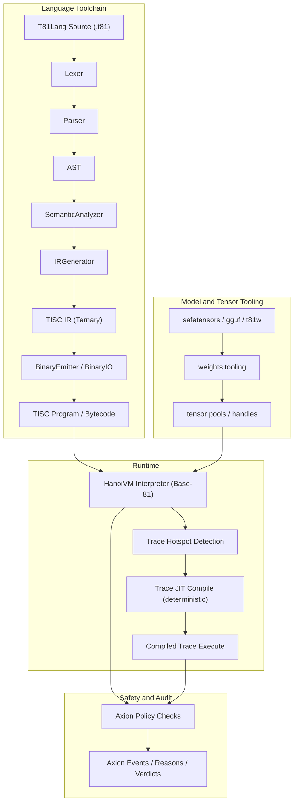

# T81 Foundation

[](https://github.com/t81dev/t81-foundation/actions/workflows/ci.yml)
[](https://github.com/t81dev/t81-foundation/actions/workflows/ci.yml)
[](https://opensource.org/licenses/MIT)
[](https://en.cppreference.com/w/cpp/23)

[](/README.md)
[](/README.zh-CN.md)
[](/README.es.md)
[](/README.ru.md)
[-blueviolet?style=flat-square)](/README.pt-BR.md)

---

**Deterministic, governed balanced ternary runtime stack for auditable computing.**

T81 is a compilation and execution pipeline (`T81Lang -> TISC -> HanoiVM`) built on **balanced ternary** logic. It prioritizes auditability, policy enforcement (Axion), and reproducibility over raw hardware speed. The system implements a software-defined ternary computer with 81 registers and a Base-81 architecture, providing a distinct foundation for high-assurance logic.

> **Note on Floating Point Determinism:** `T81Float` transcendental functions (`sin`, `cos`, `tan`, `log`, `exp`, `sqrt`) are implemented via a deterministic software-defined backend (`dmath`) and are guaranteed bit-exact across platforms. Strict bit-exact determinism is guaranteed for `T81Int`, `T81BigInt`, `T81Fraction` (canonical), and core `T81Float` operations.

---

## ⚡ 30-Second Quick Start

Verify the claims yourself in 4 steps:

1.  **Build & Run Hello World**
    ```bash
    cmake -S . -B build -DCMAKE_BUILD_TYPE=Release && cmake --build build --parallel
    ./build/t81 compile examples/hello_world.t81 -o hello.tisc
    ./build/t81 run hello.tisc
    ```

2.  **Run Determinism Gate**
    ```bash
    # Verify cross-architecture reproducibility hash
    python3 scripts/ci/t81lang_repro_gate.py --t81-bin build/t81 --check
    ```

3.  **Run a VM Demo**
    ```bash
    ./build/t81_demo
    ```

4.  **Inspect a Trace Artifact**
    ```bash
    ./build/t81 trace show trace.txt
    ```

---

## 📖 Table of Contents

- [Quick Start](#-30-second-quick-start)
- [Architecture](#-architecture)
- [Key Features](#-key-features)
- [Platform Support](#-platform-support)
- [CLI Reference](#-cli-reference)
- [Repository Structure](#-repository-structure)
- [Documentation & Governance](#-documentation--governance)

---

## 🏗 Architecture

T81 enforces a strict boundary between the Language/Compiler and the Execution Runtime, governed by explicit contracts. The entire stack operates on **balanced ternary principles**, from the TISC instruction set to the HanoiVM's trits and trytes.



[**View Detailed Architecture**](docs/explanation/ARCHITECTURE.md) | [**View Runtime Contract**](contracts/runtime-contract.json)

---

## ✨ Key Features

| Feature | Status | Description |
| :--- | :--- | :--- |
| **Balanced Ternary** | ✅ Core | Native support for trits (-1, 0, 1) and Base-81 arithmetic. |
| **HanoiVM** | ✅ Stable | 81-register virtual machine executing TISC bytecode. |
| **Deterministic Runtime** | ✅ Stable | Bit-exact execution across x86_64 and ARM64. |
| **Axion Policy Engine** | ✅ Stable | Enforce safety policies at the bytecode level. |
| **TISC IR** | ✅ Stable | **Ternary Instruction Set Computer** intermediate representation. |
| **Software Floats** | ✅ Stable | `dmath` backend ensures cross-platform float consistency. |
| **Trace-JIT** | 🚧 Experimental | Hotspot detection and compilation for performance. |

---

## 🖥 Platform Support

| Platform | Compiler | Status |
| :--- | :--- | :--- |
| **Linux (x86_64)** | Clang 18+, GCC 14+ | ✅ Determinism Gate |
| **Linux (ARM64)** | Clang 18+ | ✅ Determinism Gate |
| **macOS (ARM64)** | Apple Clang | ✅ Supported |

---

## 💻 CLI Reference

Common workflows for the `t81` command-line tool:

### Compilation & Execution
```bash
# Compile source to TISC bytecode
t81 compile examples/hello_world.t81 -o build/hello.tisc

# Run the bytecode
t81 run build/hello.tisc
```

### Debugging & Inspection
```bash
# Disassemble bytecode
t81 disasm build/hello.tisc

# Debug with step execution
t81 debug build/hello.tisc

# Check syntax and semantics
t81 check examples/hello_world.t81
```

### Trace & Reproducibility
```bash
# Show execution trace
t81 trace show trace.txt

# Compare two traces
t81 trace diff trace_a.txt trace_b.txt

# Replay a trace
t81 trace replay build/hello.tisc trace.txt

# Verify reproducibility hash
t81 repro-hash tests/fixtures/t81lang_determinism
```

### Model Management
```bash
# Import model weights
t81 weights import model.safetensors -o model.t81w

# Inspect weights info
t81 weights info model.t81w

# Quantize weights
t81 weights quantize model.safetensors --to-gguf model.gguf
```

Run `t81 help` for a full list of commands.

---

## 📂 Repository Structure

| Directory | Description |
| :--- | :--- |
| [`include/t81/`](include/t81/) | Public API headers. |
| [`src/`](src/) | Implementation of Frontend, TISC, VM, Axion, CanonFS, CLI. |
| [`tests/`](tests/) | Conformance, determinism, VM/e2e tests. |
| [`docs/`](docs/) | Guides, status, benchmarks, architectural docs. |
| [`spec/`](spec/) | Normative semantics and governance inputs (Constitution). |
| [`examples/`](examples/) | Runnable samples and demos. |
| [`contracts/`](contracts/) | Runtime boundary definitions. |

---

## 📚 Documentation & Governance

### Document Authority Map

| Document | Purpose | Authority Scope |
| :--- | :--- | :--- |
| **[STATUS.md](docs/reference/STATUS.md)** | What is true *today* | Operational Truth |
| **[ROADMAP.md](docs/roadmaps-plans/ROADMAP.md)** | Forward plan | Strategic |
| **[VERSIONING.md](docs/reference/VERSIONING.md)** | Compatibility rules | Normative |
| **[spec/](spec/)** | Behavioral definition | Normative |
| **[docs/EVIDENCE.md](docs/policies/EVIDENCE.md)** | Proof of claims | Verification |

### Further Reading

- [**Documentation Hub**](docs/index.md): Central entry point for all docs.
- [**Architecture Overview**](docs/explanation/ARCHITECTURE.md): Detailed system design.
- [**Research Guide**](docs/how-to/research-guide.md): Mathematical foundations of balanced ternary.
- [**Runtime Semantics Boundary**](docs/explanation/runtime-semantics-boundary.md): Policy on runtime ownership.
- [**Contributing Guide**](CONTRIBUTING.md): How to contribute.

---

## 🚫 Non-Goals

To save your time, here is what T81 is **NOT**:

*   **NOT a hardware accelerator:** T81 does not claim ternary hardware speedups. This is a software runtime for deterministic correctness.
*   **NOT a general-purpose replacement:** T81 focuses on high-stakes, auditable logic, not replacing C++ or Python for general tasks.
*   **NOT "fast and loose":** If a performance optimization breaks trace determinism, T81 rejects it.

---

## License

This repository is licensed under MIT (see [`LICENSE`](LICENSE)).
