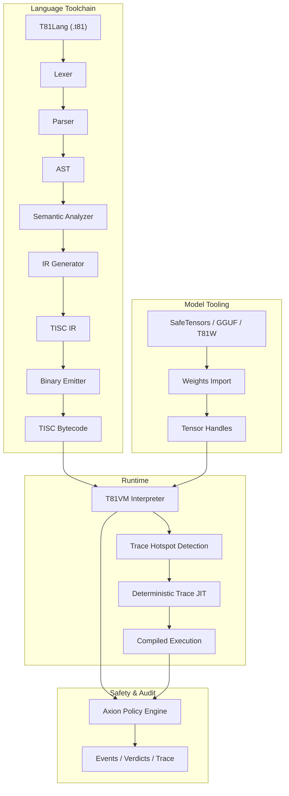

# T81 Foundation

<p align="center">
  <strong>Deterministic ternary-native computing stack featuring base-81 data types, TISC instruction set, T81VM, T81Lang, Axion safety/optimization engine, and recursive cognition tiers — built for bit-exact, auditable, reproducible execution in AI, cryptography, and scientific computing.</strong>
</p>

<p align="center">
  <a href="https://github.com/t81dev/t81-foundation/stargazers"></a>
  <a href="https://github.com/t81dev/t81-foundation/network/members"></a>
  <a href="https://github.com/t81dev/t81-foundation/actions/workflows/ci.yml"></a>
  <a href="https://github.com/t81dev/t81-foundation/commits/main"></a>
  <a href="https://opensource.org/licenses/MIT"></a>
  <a href="https://en.cppreference.com/w/cpp/23"></a>
</p>

---

T81 is a sovereign computing stack designed to eliminate floating-point non-determinism and enable fully auditable execution. By leveraging **balanced ternary logic** and **base-81 data types**, T81 guarantees **bit-exact reproducibility** across all supported architectures (x86/ARM, macOS/Linux). It features the **T81VM**, the **Axion safety engine**, and a recursive tier system for scaling from simple symbolic logic to distributed infinite forms.

> 💡 **Why it matters:** In AI safety, financial modeling, and cryptography, "mostly correct" isn't enough. T81 provides mathematical certainty that your code executes exactly the same way, everywhere, every time.

## Table of Contents

- [Features](#features)
- [Architecture](#architecture)
- [Quick Start](#quick-start)
- [Supported Platforms](#supported-platforms)
- [CLI Examples](#cli-examples)
- [Screenshots & Demo](#screenshots--demo)
- [Repository Map](#repository-map)
- [Document Authority Map](#document-authority-map)
- [Compatibility & Non-Goals](#compatibility--non-goals)
- [Configuration & Axion](#configuration--axion)
- [Contributing](#contributing)
- [Changelog](#changelog)
- [Acknowledgments](#acknowledgments)
- [License](#license)

## Features

| Feature | Status | Description |
| :--- | :--- | :--- |
| **Deterministic Execution** | ✨ Stable | Bit-exact results across x86/ARM/Apple Silicon via `dmath` & custom FP. |
| **Ternary-Native Types** | ✨ Stable | Base-81 balanced ternary integers & floats (no sign bit, reduced carry). |
| **T81VM & TISC** | ✨ Stable | 81-register VM with deterministic interpreter & Trace-JIT. |
| **Axion Engine** | ✨ Stable | Runtime policy, safety, ethics, and optimization engine with audit traces. |
| **Model Tooling** | ✨ Stable | Import/Inspect SafeTensors, GGUF, T81W; quantization support. |
| **Reproducibility Gate** | ✨ Stable | CI-enforced `t81lang_repro_gate.py` ensures 100% determinism. |
| **Cognitive Tiers** | 🚧 Beta | Recursive execution layers (Symbolic → Distributed → Infinite). |
| **Trace-JIT** | 🚧 Experimental | Hotspot optimization preserving strict determinism. |
| **Multilingual Docs** | 📚 Live | Full specs in English, Chinese, Spanish, Portuguese, Russian. |

## Architecture



## Quick Start

Go from zero to verifiable execution in under 60 seconds.

### 1. Build
```bash
cmake -S . -B build -DCMAKE_BUILD_TYPE=Release
cmake --build build --parallel
```

### 2. Compile & Run Hello World
```bash
# Compile T81 source to TISC bytecode
./build/t81 compile examples/hello_world.t81 -o hello.tisc

# Run the bytecode
./build/t81 run hello.tisc
```

### 3. Verify Determinism (The "Repro Gate")
Prove that your build is bit-exact compliant:
```bash
python3 scripts/ci/t81lang_repro_gate.py --t81-bin build/t81 --check
# Output: ✅  All determinism checks passed.
```

## Supported Platforms

All platforms below pass the **Determinism Gate** with identical output hashes.

| Platform | Arch | Compiler | Status |
| :--- | :--- | :--- | :--- |
| **Linux** | x86_64 | Clang 18+, GCC 14+ | ✅ Verified |
| **Linux** | ARM64 | Clang 18+ | ✅ Verified |
| **macOS** | Intel | Apple Clang / GCC | ✅ Verified |
| **macOS** | Apple Silicon | Apple Clang | ✅ Verified |

## CLI Examples

The `t81` CLI is your primary interface for development, debugging, and auditing.

```bash
# 🛠️ Development
t81 compile src.t81 -o out.tisc      # Compile
t81 run out.tisc                     # Execute
t81 disasm out.tisc                  # Disassemble bytecode

# 🐞 Debugging & Audit
t81 debug out.tisc                   # Interactive debugger
t81 trace show trace.txt             # Inspect execution trace
t81 repro-hash tests/fixtures/       # Calculate determinism hash

# 🤖 AI / Tensors
t81 weights import model.safetensors -o model.t81w
t81 weights quantize model.safetensors --to-gguf model.gguf
```

## Screenshots & Demo

*(Visual placeholder: Imagine a sleek terminal window showing a T81 trace log with exact hash matching)*

To see the VM in action with a visual demo:
```bash
./build/t81_demo
```

## Repository Map

Key directories in the codebase:

- **`src/`**: Core C++ source (VM, Axion, TISC, CanonFS).
- **`include/t81/`**: Public headers.
- **`book/`**: The Definitive Technical Monograph (Documentation).
- **`scripts/ci/`**: Continuous Integration & Reproducibility Gates.
- **`examples/`**: Sample `.t81` programs and C++ embedding examples.
- **`tests/`**: Comprehensive unit and integration test suite.
- **`spec/`**: Normative specifications (TISC, Data Types).
- **`tools/`**: Utility scripts and VSCode extension helpers.

## Document Authority Map

The **Definitive Technical Monograph** is the single source of truth for T81. It is maintained in `book/` and translated into multiple languages.

| Section | Content | Link |
| :--- | :--- | :--- |
| **I. Foundations** | Scope, Principles, Ethics | [Part I](book/01_Introduction.md) |
| **II. The Machine** | VM, TISC, Data Types | [Part II](book/03_Architecture.md) |
| **III. Verification** | Audit, Axion Kernel | [Part III](book/07_Verification_and_Audit.md) |
| **IV. Formalization** | Semantics, Adversarial Models | [Part IV](book/11_Formal_Semantics.md) |
| **V. Research** | Continuity, Future Hardware | [Part V](book/13_Continuity_Resilience.md) |

> 📚 **Read the full monograph here:** [book/README.md](book/README.md)

## Compatibility & Non-Goals

### Guarantees
- **TISC Bytecode:** Forward compatible within major versions.
- **Determinism:** Absolute priority. Breaking determinism is treated as a critical security bug.

### Non-Goals
- **Raw Speed at all costs:** We will not sacrifice bit-exactness for hardware-specific fast-math optimizations.
- **General Purpose Replacement:** T81 is specialized for verifiable compute, not to replace C++ or Python for general scripting.

## Configuration & Axion

The **Axion** engine enforces runtime policies. Configuration is handled via policy files or runtime flags.

- **Safety:** Memory limits, recursion depth (Cognitive Tiers).
- **Ethics:** Principles encoded as runtime constraints.
- **Optimization:** Hotspot tracing and JIT thresholds.

See `src/axion/` for implementation details or run `axion_policy_runner` examples.

## Contributing

We welcome contributions! Please see [CONTRIBUTING.md](CONTRIBUTING.md) for details on:
- Code style (Clang-Format).
- Pull Request process.
- Determinism verification requirements.

## Changelog

See [Releases](https://github.com/t81dev/t81-foundation/releases) for the full version history.
- **v1.0.0-Sovereign**: First production-ready release. Stable VM, TISC, and Axion.

## Acknowledgments

Thanks to the open-source community, specifically the contributors to `LLVM`, `fmt`, and the early researchers in ternary computing logic.

## License

This project is licensed under the **MIT License**. See [LICENSE](LICENSE) for details.
