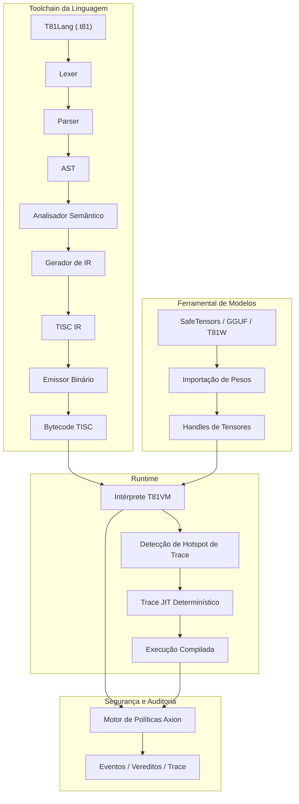

# T81 Foundation 🔥

<div align="center">
  
[](https://github.com/t81dev/t81-foundation/actions/workflows/ci.yml)
[](https://github.com/t81dev/t81-foundation/actions/workflows/ci.yml)
[](https://opensource.org/licenses/MIT)
[](https://en.cppreference.com/w/cpp/23)

[](README.md)
[](README.zh-CN.md)
[](README.es.md)
[](README.ru.md)
[-blueviolet?style=flat-square)](README.pt-BR.md)

</div>

O T81 é uma stack de computação nativa ternária e determinística 🌐 que apresenta tipos de dados de base-81, o conjunto de instruções TISC, T81VM, T81Lang, o motor de segurança e otimização Axion e níveis de cognição recursiva. Ele entrega uma execução auditável e com precisão de bit (bit-exact) ⚡ para domínios com alta carga aritmética — ideal para IA verificável, criptografia e computação científica.

> **Nota sobre Determinismo de Ponto Flutuante** ⚠️
> Funções transcendentais (`sin`, `cos`, `tan`, `log`, `exp`, `sqrt`) utilizam o backend determinístico `dmath` — bit-exact entre plataformas.
> Divisões e funções inversas/hiperbólicas podem retornar ao comportamento do hospedeiro em modo não estrito.
> O determinismo estrito total é garantido para `T81Int`, `T81BigInt`, `T81Fraction` e aritmética principal de `T81Float`. ✅

## Sumário 📑

* [Início Rápido 🚀](https://www.google.com/search?q=%23in%C3%ADcio-r%C3%A1pido-)
* [Recursos 🌟](https://www.google.com/search?q=%23recursos-)
* [Por que Ternário? 🧠](https://www.google.com/search?q=%23por-que-tern%C3%A1rio-)
* [Arquitetura 🏗️](https://www.google.com/search?q=%23arquitetura-%EF%B8%8F)
* [Plataformas Suportadas 🌍](https://www.google.com/search?q=%23plataformas-suportadas-)
* [Exemplos de CLI 🔧](https://www.google.com/search?q=%23exemplos-de-cli-)
* [Mapa do Repositório 📂](https://www.google.com/search?q=%23mapa-do-reposit%C3%B3rio-)
* [Mapa de Autoridade de Documentos 📜](https://www.google.com/search?q=%23mapa-de-autoridade-de-documentos-)
* [Garantias de Compatibilidade 🔄](https://www.google.com/search?q=%23garantias-de-compatibilidade-)
* [Não-Objetivos 🚫](https://www.google.com/search?q=%23n%C3%A3o-objetivos-)
* [Limite de Runtime 🔐](https://www.google.com/search?q=%23limite-de-runtime-)
* [Leitura Adicional 📖](https://www.google.com/search?q=%23leitura-adicional-)
* [Monografia Técnica Definitiva 📘](https://www.google.com/search?q=%23monografia-t%C3%A9cnica-definitiva-)
* [Licença 📜](https://www.google.com/search?q=%23licen%C3%A7a-)

## Início Rápido 🚀⚡

Verifique as principais funcionalidades em < 30 segundos:

1. **Compilar e Executar Hello World** 🏃‍♂️
```bash
cmake -S . -B build -DCMAKE_BUILD_TYPE=Release && cmake --build build --parallel
./build/t81 compile examples/hello_world.t81 -o hello.tisc
./build/t81 run hello.tisc

```


2. **Executar o Determinism Gate** 🔄✅
```bash
python3 scripts/ci/t81lang_repro_gate.py --t81-bin build/t81 --check

```


3. **Executar Demo da VM** ▶️🔥
```bash
./build/t81_demo

```


4. **Inspecionar Rastro (Trace)** 🔍📜
```bash
./build/t81 trace show trace.txt

```


## Recursos 🌟

| Recurso | Status | Descrição |
| --- | --- | --- |
| ✅ Execução Determinística | Estável 🔥 | Reprodutibilidade bit-exact entre plataformas |
| ✅ Tipos de Dados Nativo-Ternários | Estável 🌐 | Base-81 com aritmética ternária balanceada |
| ✅ Motor de Políticas Axion | Estável 🔐 | Segurança em tempo de execução, otimização e aplicação de ética |
| ✅ T81VM | Estável ⚙️ | VM de 81 registradores + intérprete determinístico e trace-JIT |
| ✅ TISC IR | Estável 📡 | Representação intermediária do Computador de Conjunto de Instruções Ternárias |
| ✅ Matemática Definida por Software | Estável 🧮 | Ponto flutuante consistente entre plataformas (`dmath`) |
| 🚧 Compilação Trace-JIT | Experimental ⚡ | Rastreamento de hotspots e JIT determinístico |
| 🚧 Tensores Distribuídos | Experimental 🌍 | Suporte a tensores distribuídos em larga escala |
| ✅ Ferramental de Modelos | Estável 🤖 | Importação, quantização e inspeção de SafeTensors / GGUF / T81W |

## Por que Ternário? 🧠🧮

O ternário balanceado (-1, 0, +1) e a base-81 eliminam bits de sinal, simplificam a adição/subtração (carry reduzido) e oferecem vantagens teóricas de densidade/energia — especialmente valiosas em cargas de trabalho numéricas (inferência de IA, criptografia, processamento de sinais).

O T81 traz esses benefícios para o software, priorizando o determinismo e a auditabilidade em detrimento da velocidade bruta. Veja experimentos de hardware relacionados em [ternary-memory-research](https://github.com/t81dev/ternary-memory-research) para métricas PDK SKY130. 🔬

## Arquitetura 🏗️



## Plataformas Suportadas 🌍

| Plataforma | Compilador | Status | Determinism Gate | Notas |
| --- | --- | --- | --- | --- |
| Linux x86_64 | Clang 18+, GCC 14+ | ✅ Passando 🔥 | ✅ | Portão completo passando |
| Linux ARM64 | Clang 18+ | ✅ Passando 🔥 | ✅ | Portão completo passando |
| macOS x86_64 (Intel) | Apple Clang / GCC | ✅ Passando | ✅ | Funciona nativamente |
| macOS ARM64 (Apple Silicon) | Apple Clang | ✅ Passando | ✅ | Investigação ativa (CMake/flags) |

## Exemplos de CLI 🔧🔍

```bash
# Compilar e rodar 🚀
t81 compile examples/hello_world.t81 -o hello.tisc
t81 run hello.tisc

# Depurar e inspecionar 🕵️
t81 disasm hello.tisc
t81 debug hello.tisc
t81 trace show trace.txt
t81 repro-hash tests/fixtures/t81lang_determinism

# Ferramental de modelos 🤖
t81 weights import model.safetensors -o model.t81w
t81 weights quantize model.safetensors --to-gguf model.gguf

```

Ajuda completa: `t81 --help` ou `t81 help <subcomando>` 📖

## Mapa do Repositório 📂

* `.github/`          → Workflows e templates 🛠️
* `benchmarks/`       → Medições de performance 📈
* `docs/`             → Guias de como fazer, explicações, referências 📚
* `examples/`         → Programas de exemplo (arquivos .t81) 🎯
* `include/t81/`      → Headers públicos 🧩
* `scripts/`          → Ferramentas de CI e portões de reprodutibilidade 🔄
* `spec/`             → Especificações normativas 📜
* `src/`              → Código principal (axion/, canonfs/, vm/, etc.) ⚙️
* `tests/`            → Testes unitários, de propriedade e integração 🧪
* `tools/`            → Scripts de utilidade e extensão do VSCode 🛠️

## Mapa de Autoridade de Documentos 📜

| Documento | Propósito | Autoridade |
| --- | --- | --- |
| spec/constitution.md | Princípios fundamentais | Normativo 🔒 |
| spec/determinism-profile.md | Garantias de determinismo | Normativo ✅ |
| spec/t81-data-types.md | Spec de tipos de dados e serialização | Normativo 🧮 |
| spec/tisc-spec.md | Conjunto de instruções TISC | Normativo 📡 |
| https://www.google.com/search?q=docs/index.md | Ponto de entrada da documentação | Informativo 📖 |

## Garantias de Compatibilidade 🔄

* **Estável:** Sintaxe T81Lang, formato TISC, semântica central T81VM ✅
* **Experimental:** Trace-JIT, tensores distribuídos 🚧
* **SemVer:** Mudanças na versão Major para alterações que quebrem a compatibilidade em partes estáveis ⚖️

## Não-Objetivos 🚫

O T81 **não** é:

* um acelerador de hardware ternário 🖥️
* um substituto de propósito geral para C++/Python/Rust 🛑
* otimizado para throughput máximo às custas do determinismo ⚡❌

## Limite de Runtime 🔐

Definido em especificações como [spec/t81vm-spec.md](https://www.google.com/search?q=spec/t81vm-spec.md)

## Leitura Adicional 📖

* [docs/index.md](https://www.google.com/search?q=docs/index.md)
* [spec/index.md](https://www.google.com/search?q=spec/index.md)
* [CONTRIBUTING.md](https://www.google.com/search?q=CONTRIBUTING.md)
* [SECURITY.md](https://www.google.com/search?q=SECURITY.md)

---

## 📘 Monografia Técnica Definitiva

Para uma descrição abrangente e em nível de especificação da arquitetura — incluindo semântica formal, invariantes de determinismo, modelagem adversária e design de continuidade a longo prazo — consulte:

➡️ **[A Fundação T81 — Monografia Técnica Definitiva](https://www.google.com/search?q=book/README.md)**

**Caminhos para o leitor:**

* **Novo no T81?** → Comece pela Parte I, depois Parte II.
* **Implementador?** → Foque nas Partes II e III.
* **Auditor?** → Leia as Partes III e IV cuidadosamente.
* **Pesquisador?** → Dê ênfase às Partes IV e V.
* **Mantenedor de longo prazo?** → As Partes IV e V são críticas.

<details>
<summary><strong>Parte I — Fundamentos</strong></summary>

1. **[Introdução](https://www.google.com/search?q=book/01_Introduction.md)**
* [1.1 Escopo e Definição](https://www.google.com/search?q=book/01_Introduction.md%2311-scope-and-definition)
* [1.2 Arquitetura do Sistema](https://www.google.com/search?q=book/01_Introduction.md%2312-system-architecture)
* [1.3 Missão de Computação Verificável](https://www.google.com/search?q=book/01_Introduction.md%2313-verifiable-compute-mission)


2. **[Princípios Centrais e Invariantes](https://www.google.com/search?q=book/02_Core_Principles_and_Invariants.md)**
* [2.1 O Invariante de Determinismo](https://www.google.com/search?q=book/02_Core_Principles_and_Invariants.md%2321-the-determinism-invariant)
* [2.1.1 Superfícies de Determinismo e Vetores de Ataque](https://www.google.com/search?q=book/02_Core_Principles_and_Invariants.md%23211-determinism-surfaces-and-attack-vectors)
* [2.2 Lógica Ternária (Base-3)](https://www.google.com/search?q=book/02_Core_Principles_and_Invariants.md%2322-ternary-logic-base-3)
* [2.3 Auditabilidade e o Trace Axion](https://www.google.com/search?q=book/02_Core_Principles_and_Invariants.md%2323-auditability-and-the-axion-trace)
* [2.4 Os Nove Princípios (Aplicação de Ética)](https://www.google.com/search?q=book/02_Core_Principles_and_Invariants.md%2324-the-nine-principles-ethics-enforcement)


</details>

<details>
<summary><strong>Parte II — A Máquina Determinística</strong></summary>

3. **[Arquitetura T81VM](https://www.google.com/search?q=book/03_T81VM_Architecture.md)**
* [3.1 Máquina de Estados Formal](https://www.google.com/search?q=book/03_T81VM_Architecture.md%2331-formal-state-machine)
* [3.1.1 Definição de Estado](https://www.google.com/search?q=book/03_T81VM_Architecture.md%23311-state-definition)
* [3.2 Layout de Memória](https://www.google.com/search?q=book/03_T81VM_Architecture.md%2332-memory-layout)
* [3.3 Arquivo de Registradores](https://www.google.com/search?q=book/03_T81VM_Architecture.md%2333-register-file)
* [3.4 Arquitetura do Conjunto de Instruções TISC (ISA)](https://www.google.com/search?q=book/03_T81VM_Architecture.md%2334-tisc-instruction-set-architecture-isa)
* [3.5 Semântica de Falhas](https://www.google.com/search?q=book/03_T81VM_Architecture.md%2335-fault-semantics)
* [3.6 Coleta de Lixo (Garbage Collection)](https://www.google.com/search?q=book/03_T81VM_Architecture.md%2336-garbage-collection)


4. **[Tipos de Dados e Serialização Canônica](https://www.google.com/search?q=book/04_Data_Types_and_Canonical_Serialization.md)**
* [4.1 Tipos Primitivos](https://www.google.com/search?q=book/04_Data_Types_and_Canonical_Serialization.md%2341-primitive-types)
* [4.2 T81Float e dmath](https://www.google.com/search?q=book/04_Data_Types_and_Canonical_Serialization.md%2342-t81float-and-dmath)
* [4.3 Tensores e Layouts Canônicos](https://www.google.com/search?q=book/04_Data_Types_and_Canonical_Serialization.md%2343-tensors-and-canonical-layouts)
* [4.4 Regras de Serialização Canônica](https://www.google.com/search?q=book/04_Data_Types_and_Canonical_Serialization.md%2344-canonical-serialization-rules)


5. **[Instalação e Verificação de Build](https://www.google.com/search?q=book/05_Installation_and_Build_Verification.md)**
* [5.1 Pré-requisitos](https://www.google.com/search?q=book/05_Installation_and_Build_Verification.md%2351-prerequisites)
* [5.2 Compilando a partir da Fonte](https://www.google.com/search?q=book/05_Installation_and_Build_Verification.md%2352-building-from-source)
* [5.3 Verificando o Build](https://www.google.com/search?q=book/05_Installation_and_Build_Verification.md%2353-verifying-the-build)


6. **[Uso de CLI e API](https://www.google.com/search?q=book/06_CLI_and_API_Usage.md)**
* [6.1 Interface de Linha de Comando](https://www.google.com/search?q=book/06_CLI_and_API_Usage.md%2361-the-t81-command-line-interface)
* [6.2 Embarcando T81 (API C++)](https://www.google.com/search?q=book/06_CLI_and_API_Usage.md%2362-embedding-t81-c-api)
* [6.3 Embarcando T81 (API Python)](https://www.google.com/search?q=book/06_CLI_and_API_Usage.md%2363-embedding-t81-python-api)
* [6.4 Depuração](https://www.google.com/search?q=book/06_CLI_and_API_Usage.md%2364-debugging)


</details>

<details>
<summary><strong>Parte III — Governança e Verificação</strong></summary>

7. **[Verificação e Auditoria](https://www.google.com/search?q=book/07_Verification_and_Audit.md)**
* [7.1 Metodologia de Verificação Formal](https://www.google.com/search?q=book/07_Verification_and_Audit.md%2371-formal-verification-methodology)
* [7.2 A Matriz de Auditoria Formal](https://www.google.com/search?q=book/07_Verification_and_Audit.md%2372-the-formal-audit-matrix)
* [7.3 Testes Baseados em Propriedades](https://www.google.com/search?q=book/07_Verification_and_Audit.md%2373-property-based-testing)
* [7.4 O Portão de Determinismo (Determinism Gate)](https://www.google.com/search?q=book/07_Verification_and_Audit.md%2374-the-determinism-gate)


8. **[O Kernel de Segurança Axion](https://www.google.com/search?q=book/08_The_Axion_Safety_Kernel.md)**
* [8.1 Definição Formal](https://www.google.com/search?q=book/08_The_Axion_Safety_Kernel.md%2381-formal-definition)
* [8.2 O Modelo de Política](https://www.google.com/search?q=book/08_The_Axion_Safety_Kernel.md%2382-the-policy-model)
* [8.3 Interceptação de Instruções](https://www.google.com/search?q=book/08_The_Axion_Safety_Kernel.md%2383-instruction-interception)
* [8.4 O Log de Auditoria (Trace)](https://www.google.com/search?q=book/08_The_Axion_Safety_Kernel.md%2384-the-audit-log-trace)
* [8.5 Promoção Cognitiva](https://www.google.com/search?q=book/08_The_Axion_Safety_Kernel.md%2385-cognitive-promotion)


9. **[Níveis Cognitivos e Computação Distribuída](https://www.google.com/search?q=book/09_Cognitive_Tiers_and_Distributed_Compute.md)**
* [9.1 O Modelo de Nível Cognitivo](https://www.google.com/search?q=book/09_Cognitive_Tiers_and_Distributed_Compute.md%2391-the-cognitive-tier-model)
* [9.2 Computação Distribuída (Nível 4)](https://www.google.com/search?q=book/09_Cognitive_Tiers_and_Distributed_Compute.md%2392-distributed-compute-tier-4)
* [9.3 Compilação JIT Baseada em Trace](https://www.google.com/search?q=book/09_Cognitive_Tiers_and_Distributed_Compute.md%2393-trace-based-jit-compilation)
* [9.4 Formas Infinitas (Nível 5)](https://www.google.com/search?q=book/09_Cognitive_Tiers_and_Distributed_Compute.md%2394-infinite-forms-tier-5)


10. **[Apêndices](https://www.google.com/search?q=book/10_Appendices.md)**

* [10.1 O Que Ainda Não Foi Implementado](https://www.google.com/search?q=book/10_Appendices.md%23101-what-is-not-yet-implemented)
* [10.2 Modelo de Ameaça e Superfície de Ataque ao Determinismo](https://www.google.com/search?q=book/10_Appendices.md%23102-threat-model-and-determinism-attack-surface)
* [10.3 Glossário](https://www.google.com/search?q=book/10_Appendices.md%23103-glossary)

</details>

<details>
<summary><strong>Parte IV — Formalização e Endurecimento Estrutural</strong></summary>

11. **[Semântica Formal de TISC e T81VM](https://www.google.com/search?q=book/11_Formal_Semantics.md)**

* [Semântica Denotacional de TISC](https://www.google.com/search?q=book/11_Formal_Semantics.md%23denotational-semantics-of-tisc)
* [Função de Transição Algébrica δ](https://www.google.com/search?q=book/11_Formal_Semantics.md%23algebraic-transition-function-%CE%B4)
* [Sistema de Reescrita de Canonicalização](https://www.google.com/search?q=book/11_Formal_Semantics.md%23canonicalization-rewriting-system)
* [Esboços de Prova de Determinismo](https://www.google.com/search?q=book/11_Formal_Semantics.md%23determinism-proof-sketches)
* [Equivalência entre Intérprete e Trace-JIT](https://www.google.com/search?q=book/11_Formal_Semantics.md%23interpreter-vs-trace-jit-equivalence)

12. **[Modelagem Adversária e Ataques ao Determinismo](https://www.google.com/search?q=book/12_Adversarial_Modeling.md)**

* [Ataques ao Nível do Compilador](https://www.google.com/search?q=book/12_Adversarial_Modeling.md%23compiler-level-attacks)
* [Vetores de Ataque em VM e GC](https://www.google.com/search?q=book/12_Adversarial_Modeling.md%23vm-and-gc-attack-vectors)
* [Ataques a CanonFS e Hash](https://www.google.com/search?q=book/12_Adversarial_Modeling.md%23canonfs-and-hash-attacks)
* [Ataque de Viagem no Tempo em Nível Distribuído](https://www.google.com/search?q=book/12_Adversarial_Modeling.md%23distributed-tier-time-travel-attack)
* [Template de Post-mortem de Violação de Determinismo](https://www.google.com/search?q=book/12_Adversarial_Modeling.md%23determinism-breach-postmortem-template)

</details>

<details>
<summary><strong>Parte V — Continuidade e Horizonte de Pesquisa</strong></summary>

13. **[Continuidade e Resiliência](https://www.google.com/search?q=book/13_Continuity_Resilience.md)**

* [Protocolo de Reconstrução em Ambiente Limpo (Cleanroom)](https://www.google.com/search?q=book/13_Continuity_Resilience.md%23cleanroom-reconstruction-protocol)
* [Pontos Únicos de Falha](https://www.google.com/search?q=book/13_Continuity_Resilience.md%23single-points-of-failure)
* [Manifesto de Continuidade](https://www.google.com/search?q=book/13_Continuity_Resilience.md%23continuity-manifest)
* [Invariantes Formais Imutáveis](https://www.google.com/search?q=book/13_Continuity_Resilience.md%23immutable-formal-invariants)

14. **[Fronteira de Pesquisa](https://www.google.com/search?q=book/14_Research_Frontier.md)**

* [Aceleração de Hardware Ternário](https://www.google.com/search?q=book/14_Research_Frontier.md%23ternary-hardware-acceleration)
* [Caminhos de Verificação Formal](https://www.google.com/search?q=book/14_Research_Frontier.md%23formal-verification-paths)
* [CanonFS como Substrato Merkle](https://www.google.com/search?q=book/14_Research_Frontier.md%23canonfs-as-a-merkle-substrate)
* [Inferência de IA Determinística em Escala](https://www.google.com/search?q=book/14_Research_Frontier.md%23deterministic-ai-inference-at-scale)

</details>

---

## Licença

Licença MIT — veja [LICENSE](https://www.google.com/search?q=LICENSE).
