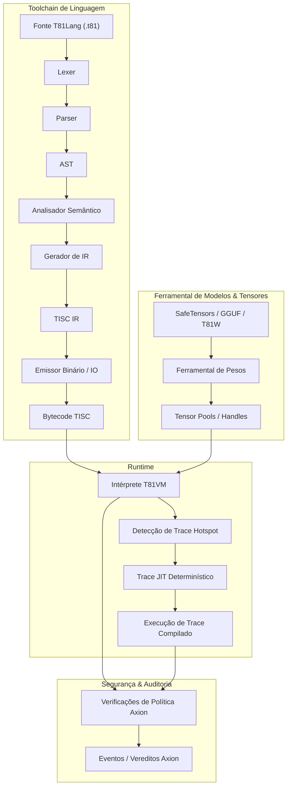

# Fundação T81

[](https://github.com/t81dev/t81-foundation/actions/workflows/ci.yml)
[](https://github.com/t81dev/t81-foundation/actions/workflows/ci.yml)
[](https://opensource.org/licenses/MIT)
[](https://en.cppreference.com/w/cpp/23)

[](/README.md)
[](/README.zh-CN.md)
[](/README.es.md)
[](/README.ru.md)
[-blueviolet?style=flat-square)](/README.pt-BR.md)

---

T81: uma stack de computação determinística nativa em ternário, apresentando tipos de dados base-81, o conjunto de instruções TISC, T81VM, T81Lang, segurança/otimização Axion e camadas completas de cognição recursiva.

O T81 entrega uma execução bit-exact e auditável em domínios de aritmética intensiva, combinando tipos nativos ternários com governança estrita de tempo de execução — ideal para IA verificável, criptografia e computação científica.

> **Nota sobre Determinismo de Ponto Flutuante:** > As funções transcendentais do `T81Float` (`sin`, `cos`, `tan`, `log`, `exp`, `sqrt`) são implementadas via um backend definido por software determinístico (`dmath`) e possuem garantia bit-exact entre plataformas.
> A divisão `T81Float` e funções trigonométricas inversas/hiperbólicas (`asin`, `sinh`, etc.) podem depender do comportamento da plataforma hospedeira em modos não-estritos.
> O determinismo estrito bit-exact é garantido para `T81Int`, `T81BigInt`, `T81Fraction` (canônico) e operações centrais de `T81Float`.

## Sumário

* [Início Rápido](https://www.google.com/search?q=%23in%C3%ADcio-r%C3%A1pido)
* [Recursos](https://www.google.com/search?q=%23recursos)
* [Por que Ternário?](https://www.google.com/search?q=%23por-que-tern%C3%A1rio)
* [Arquitetura](https://www.google.com/search?q=%23arquitetura)
* [Plataformas Suportadas](https://www.google.com/search?q=%23plataformas-suportadas)
* [Exemplos de CLI](https://www.google.com/search?q=%23exemplos-de-cli)
* [Mapa do Repositório](https://www.google.com/search?q=%23mapa-do-reposit%C3%B3rio)
* [Mapa de Autoridade de Documentos](https://www.google.com/search?q=%23mapa-de-autoridade-de-documentos)
* [Garantias de Compatibilidade](https://www.google.com/search?q=%23garantias-de-compatibilidade)
* [Não-Objetivos](https://www.google.com/search?q=%23n%C3%A3o-objetivos)
* [Limite do Runtime](https://www.google.com/search?q=%23limite-do-runtime)
* [Leitura Adicional](https://www.google.com/search?q=%23leitura-adicional)
* [Licença](https://www.google.com/search?q=%23licen%C3%A7a)

## Início Rápido

Verifique as principais premissas em menos de 30 segundos:

1. **Build e Execução do Hello World** ```bash
cmake -S . -B build -DCMAKE_BUILD_TYPE=Release && cmake --build build --parallel
./build/t81 compile https://www.google.com/search?q=examples/hello_world.t81 -o hello.tisc
./build/t81 run hello.tisc
```


```


2. **Executar Gate de Determinismo** ```bash
python3 https://www.google.com/search?q=scripts/ci/t81lang_repro_gate.py --t81-bin build/t81 --check
```


```


3. **Executar uma Demo da VM** ```bash
./build/t81_demo
```


```


4. **Inspecionar um Artefato de Trace** ```bash
./build/t81 trace show trace.txt
```


```


## Recursos

| Recurso | Status | Descrição |
| --- | --- | --- |
| **Execução Determinística** | ✅ Estável | Reprodutibilidade bit-exact entre plataformas via pipeline T81Lang → TISC → T81VM. |
| **Tipos de Dados Nativo-Ternários** | ✅ Estável | Tipos base-81 com aritmética ternária balanceada para computações eficientes. |
| **Motor de Políticas Axion** | ✅ Estável | Execução de segurança em tempo de execução e políticas de otimização. |
| **T81VM** | ✅ Estável | Máquina virtual de 81 registradores com interpretação determinística e trace-JIT. |
| **TISC IR** | ✅ Estável | Representação intermediária do Ternary Instruction Set Computer. |
| **Matemática Definida por Software** | ✅ Estável | Backend `dmath` para operações de ponto flutuante consistentes entre plataformas. |
| **Compilação Trace-JIT** | 🚧 Experimental | Detecção de hotspots e JIT determinístico para ganhos de performance. |
| **Tensores Distribuídos** | 🚧 Experimental | Suporte para operações de tensores em larga escala em ambientes distribuídos. |
| **Ferramental de Modelos** | ✅ Estável | Importação de pesos, quantização e inspeção para integrações de ML (SafeTensors, GGUF). |

## Por que Ternário?

O ternário balanceado (usando dígitos -1, 0, +1) e tipos de dados base-81 () otimizam cargas de trabalho intensivas em aritmética, como processamento de sinais, inferência de IA e criptografia. Ao contrário do binário, o ternário balanceado elimina bits de sinal separados, simplifica a adição/subtração sem propagação extensiva de carry e oferece eficiência energética potencial em hardware especializado.

O T81 emula essas vantagens em software para ambientes determinísticos e auditáveis. Ele complementa sistemas binários em setups de base mista, proporcionando ganhos de densidade e energia em substratos numéricos (ex: motores quantizados, núcleos de tensores). O ternário não é um substituto universal, mas uma ferramenta direcionada para domínios onde o overhead é mínimo e os benefícios são claros.

Para insights de hardware, veja as simulações SPICE recentes no repositório relacionado [ternary-memory-research](https://github.com/t81dev/ternary-memory-research), mostrando métricas reais de energia/atraso para portas ternárias no SKY130 PDK.

## Arquitetura

O T81 impõe uma separação estrita entre compilação e execução, governada por contratos explícitos de determinismo e segurança.



## Plataformas Suportadas

| Plataforma | Compilador | Status |
| --- | --- | --- |
| Linux (x86_64) | Clang 18+, GCC 14+ | ✅ Gate de Determinismo |
| Linux (ARM64) | Clang 18+ | ✅ Gate de Determinismo |
| macOS (ARM64) | Apple Clang | ✅ Suportado |

## Exemplos de CLI

A CLI `t81` fornece uma interface unificada para compilação, execução e diagnósticos.

* **Compilar & Executar** ```bash
t81 compile https://www.google.com/search?q=examples/hello_world.t81 -o build/hello.tisc
t81 run build/hello.tisc
```


```


* **Depurar & Inspecionar** ```bash
t81 disasm build/hello.tisc
t81 debug build/hello.tisc
t81 check https://www.google.com/search?q=examples/hello_world.t81
```


```


* **Trace & Reprodutibilidade** ```bash
t81 trace show trace.txt
t81 trace diff trace_a.txt trace_b.txt
t81 trace replay build/hello.tisc trace.txt
t81 repro-hash https://www.google.com/search?q=tests/fixtures/t81lang_determinism
```


```


* **Gerenciamento de Modelos** ```bash
t81 weights import model.safetensors -o model.t81w
t81 weights info model.t81w
t81 weights quantize model.safetensors --to-gguf model.gguf
```


```


Uso completo: *`t81 help`*

## Mapa do Repositório

* [.github/](https://www.google.com/search?q=.github/) : Workflows, templates de issues.
* [benchmarks/](https://www.google.com/search?q=benchmarks/) : Scripts de performance e dados.
* [contracts/](https://www.google.com/search?q=contracts/) : Contratos de runtime (ex: [runtime-contract.json](https://www.google.com/search?q=contracts/runtime-contract.json)).
* [docs/](https://www.google.com/search?q=docs/) : Hub de documentação com subpastas como explanation/, how-to/, policies/, reference/, roadmaps-plans/.
* [examples/](https://www.google.com/search?q=examples/) : Amostras como hello_world.t81, tensor_demo.t81; subpastas system-integration/, tisc/.
* [include/t81/](https://www.google.com/search?q=include/t81/) : Headers públicos.
* [scripts/](https://www.google.com/search?q=scripts/) : Ferramentas de CI, gates de reprodutibilidade.
* [spec/](https://www.google.com/search?q=spec/) : Especificações normativas (ex: [t81-data-types.md](https://www.google.com/search?q=spec/t81-data-types.md), [tisc-spec.md](https://www.google.com/search?q=spec/tisc-spec.md)).
* [src/](https://www.google.com/search?q=src/) : Implementação core (subpastas: axion/, bigint/, canonfs/, cli/, frontend/, tisc/, vm/, etc.).
* [tests/](https://www.google.com/search?q=tests/) : Suítes de testes (subpastas: ci/, cpp/, fixtures/, etc.).

## Mapa de Autoridade de Documentos

| Documento | Propósito | Escopo de Autoridade |
| --- | --- | --- |
| **[spec/constitution.md](https://www.google.com/search?q=spec/constitution.md)** | Princípios fundamentais | Normativo |
| **[spec/determinism-profile.md](https://www.google.com/search?q=spec/determinism-profile.md)** | Garantias de determinismo | Normativo |
| **[spec/index.md](https://www.google.com/search?q=spec/index.md)** | Índice de especificações core | Normativo |
| **[docs/index.md](https://www.google.com/search?q=docs/index.md)** | Entrada da documentação | Informativo |
| **[CONTRIBUTING.md](https://www.google.com/search?q=CONTRIBUTING.md)** | Diretrizes de contribuição | Operacional |

## Garantias de Compatibilidade

* **Estável:** Sintaxe T81Lang, formato TISC, semântica T81VM.
* **Experimental:** Trace-JIT, tensores distribuídos.
* **SemVer:** Versões major para mudanças que quebram compatibilidade em componentes estáveis.

## Não-Objetivos

🚫 O T81 **não** é:

* Um acelerador ternário de hardware (foco em software para determinismo).
* Uma linguagem de propósito geral para substituir C++ ou Python.
* Performance-a-qualquer-custo (rejeita otimizações que quebrem o determinismo).

## Limite do Runtime

Definido em [contracts/runtime-contract.json](https://www.google.com/search?q=contracts/runtime-contract.json) e detalhado em especificações como [spec/t81vm-spec.md](https://www.google.com/search?q=spec/t81vm-spec.md).

## Leitura Adicional

* [docs/index.md](https://www.google.com/search?q=docs/index.md)
* [spec/t81-overview.md](https://www.google.com/search?q=spec/t81-overview.md)
* [CONTRIBUTING.md](https://www.google.com/search?q=CONTRIBUTING.md)
* [SECURITY.md](https://www.google.com/search?q=SECURITY.md)
* [CHANGELOG.md](https://www.google.com/search?q=CHANGELOG.md)

## Licença

Licença MIT — veja [LICENSE](https://www.google.com/search?q=LICENSE).
