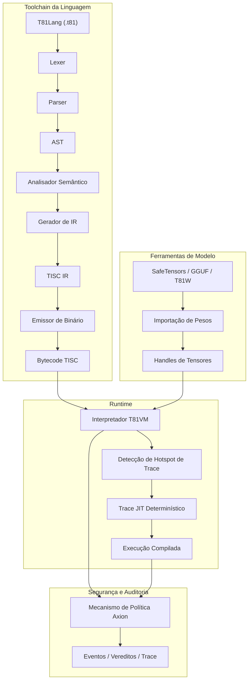

# Fundação T81

<p align="center">
<strong>Stack de computação nativa ternária determinística com tipos de dados base-81, conjunto de instruções TISC, T81VM, T81Lang, mecanismo de segurança/otimização Axion e camadas de cognição recursiva — construído para execução exata de bits, auditável e reproduzível em IA, criptografia e computação científica.</strong>
</p>

<p align="center">
  <a href="https://github.com/t81dev/t81-foundation/stargazers"></a>
  <a href="https://github.com/t81dev/t81-foundation/network/members"></a>
  <a href="https://github.com/t81dev/t81-foundation/actions/workflows/ci.yml"></a>
  <a href="https://github.com/t81dev/t81-foundation/commits/main"></a>
  <a href="https://opensource.org/licenses/MIT"></a>
  <a href="https://en.cppreference.com/w/cpp/23"></a>
</p>

<p align="center">
  <a href="README.md"></a>
  <a href="README.zh-CN.md"></a>
  <a href="README.es.md"></a>
  <a href="README.ru.md"></a>
  <a href="README.pt-BR.md"></a>
</p>

---

T81 é uma stack de computação soberana projetada para eliminar o não-determinismo de ponto flutuante e permitir uma execução totalmente auditável. Ao aproveitar a **lógica ternária balanceada** e **tipos de dados base-81**, o T81 garante **reprodutibilidade bit-a-bit** em todas as arquiteturas suportadas (x86/ARM, macOS/Linux). Ele apresenta a **T81VM**, o mecanismo de segurança **Axion** e um sistema de camadas recursivas para escalonamento desde lógica simbólica simples até formas infinitas distribuídas.

> 💡 **Por que isso importa:** Em segurança de IA, modelagem financeira e criptografia, "quase correto" não é suficiente. O T81 oferece a certeza matemática de que seu código será executado exatamente da mesma forma, em qualquer lugar, todas as vezes.

## Índice

* [Recursos](https://www.google.com/search?q=%23recursos)
* [Arquitetura](https://www.google.com/search?q=%23arquitetura)
* [Início Rápido](https://www.google.com/search?q=%23in%C3%ADcio-r%C3%A1pido)
* [Plataformas Suportadas](https://www.google.com/search?q=%23plataformas-suportadas)
* [Exemplos de CLI](https://www.google.com/search?q=%23exemplos-de-cli)
* [Screenshots e Demonstração](https://www.google.com/search?q=%23screenshots-e-demonstra%C3%A7%C3%A3o)
* [Mapa do Repositório](https://www.google.com/search?q=%23mapa-do-reposit%C3%B3rio)
* [Mapa de Autoridade de Documentos](https://www.google.com/search?q=%23mapa-de-autoridade-de-documentos)
* [Compatibilidade e Não-Objetivos](https://www.google.com/search?q=%23compatibilidade-e-n%C3%A3o-objetivos)
* [Configuração e Axion](https://www.google.com/search?q=%23configura%C3%A7%C3%A3o-e-axion)
* [Contribuição](https://www.google.com/search?q=%23contribui%C3%A7%C3%A3o)
* [Changelog](https://www.google.com/search?q=%23changelog)
* [Agradecimentos](https://www.google.com/search?q=%23agradecimentos)
* [Licença](https://www.google.com/search?q=%23licen%C3%A7a)

## Recursos

| Recurso | Status | Descrição |
| --- | --- | --- |
| **Execução Determinística** | ✨ Estável | Resultados bit-exatos em x86/ARM/Apple Silicon via `dmath` e FP customizado. |
| **Tipos Nativos Ternários** | ✨ Estável | Inteiros e floats ternários balanceados base-81 (sem bit de sinal, carry reduzido). |
| **T81VM & TISC** | ✨ Estável | VM de 81 registros com interpretador determinístico e Trace-JIT. |
| **Mecanismo Axion** | ✨ Estável | Mecanismo de política em tempo de execução, segurança, ética e otimização com rastros de auditoria. |
| **Ferramentas de Modelo** | ✨ Estável | Importação/Inspeção de SafeTensors, GGUF, T81W; suporte a quantização. |
| **Gate de Reprodutibilidade** | ✨ Estável | `t81lang_repro_gate.py` forçado por CI garante 100% de determinismo. |
| **Camadas Cognitivas** | 🚧 Beta | Camadas de execução recursivas (Simbólico → Distribuído → Infinito). |
| **Trace-JIT** | 🚧 Exp. | Otimização de hotspots preservando o determinismo estrito. |
| **Docs Multilíngues** | 📚 Ativo | Especificações completas em Inglês, Chinês, Espanhol, Português e Russo. |

## Arquitetura



## Início Rápido

Do zero à execução verificável em menos de 60 segundos.

### 1. Build

```bash
cmake -S . -B build -DCMAKE_BUILD_TYPE=Release
cmake --build build --parallel

```

### 2. Compilar e Executar Hello World

```bash
# Compilar código fonte T81 para bytecode TISC
./build/t81 compile examples/hello_world.t81 -o hello.tisc

# Executar o bytecode
./build/t81 run hello.tisc

```

### 3. Verificar Determinismo (O "Repro Gate")

Prove que sua build está em conformidade bit-exata:

```bash
python3 scripts/ci/t81lang_repro_gate.py --t81-bin build/t81 --check
# Saída: ✅  All determinism checks passed.

```

## Plataformas Suportadas

Todas as plataformas abaixo passam pelo **Determinism Gate** com hashes de saída idênticos.

| Plataforma | Arq | Compilador | Status |
| --- | --- | --- | --- |
| **Linux** | x86_64 | Clang 18+, GCC 14+ | ✅ Verificado |
| **Linux** | ARM64 | Clang 18+ | ✅ Verificado |
| **macOS** | Intel | Apple Clang / GCC | ✅ Verificado |
| **macOS** | Apple Silicon | Apple Clang | ✅ Verificado |

## Exemplos de CLI

A CLI `t81` é sua interface principal para desenvolvimento, depuração e auditoria.

```bash
# 🛠️ Desenvolvimento
t81 compile src.t81 -o out.tisc      # Compilar
t81 run out.tisc                     # Executar
t81 disasm out.tisc                  # Desmontar bytecode

# 🐞 Depuração e Auditoria
t81 debug out.tisc                   # Depurador interativo
t81 trace show trace.txt             # Inspecionar rastro de execução
t81 repro-hash tests/fixtures/       # Calcular hash de determinismo

# 🤖 IA / Tensores
t81 weights import model.safetensors -o model.t81w
t81 weights quantize model.safetensors --to-gguf model.gguf

```

## Screenshots e Demonstração

*(Espaço reservado visual: Imagine uma janela de terminal elegante mostrando um log de rastro T81 com correspondência de hash exata)*

Para ver a VM em ação com uma demonstração visual:

```bash
./build/t81_demo

```

## Mapa do Repositório

Diretórios-chave na base de código:

* **`src/`**: Código-fonte C++ principal (VM, Axion, TISC, CanonFS).
* **`include/t81/`**: Cabeçalhos públicos.
* **`book/book-en/`**: A Monografia Técnica Definitiva (Documentação).
* **`scripts/ci/`**: Integração Contínua e Gates de Reprodutibilidade.
* **`examples/`**: Programas de exemplo `.t81` e exemplos de incorporação em C++.
* **`tests/`**: Suíte abrangente de testes unitários e de integração.
* **`spec/`**: Especificações normativas (TISC, Tipos de Dados).
* **`tools/`**: Scripts utilitários e auxiliares de extensão para VSCode.

## Mapa de Autoridade de Documentos

A **Monografia Técnica Definitiva** é a única fonte da verdade para o T81. Ela é mantida em `book/book-en/` e traduzida para vários idiomas.

<details>
<summary><strong>Parte I — Fundamentos</strong></summary>

1. **[Introdução](https://www.google.com/search?q=book/book-en/01_Introduction.md)**
2. **[Princípios e Invariantes Centrais](https://www.google.com/search?q=book/book-en/02_Principles.md)**

</details>

<details>
<summary><strong>Parte II — A Máquina Determinística</strong></summary>

3. **[Arquitetura T81VM](https://www.google.com/search?q=book/book-en/03_Architecture.md)**
4. **[Tipos de Dados e Serialização Canônica](https://www.google.com/search?q=book/book-en/04_Data_Types_and_Serialization.md)**
5. **[Instalação e Verificação de Build](https://www.google.com/search?q=book/book-en/05_Installation.md)**
6. **[Uso de CLI e API](https://www.google.com/search?q=book/book-en/06_Usage.md)**
7. **[Programação em T81Lang](https://www.google.com/search?q=book/book-en/07_Programming_in_T81Lang.md)**

</details>

<details>
<summary><strong>Parte III — Governança e Verificação</strong></summary>

8. **[Verificação e Auditoria](https://www.google.com/search?q=book/book-en/08_Verification_and_Audit.md)**
9. **[O Kernel de Segurança Axion](https://www.google.com/search?q=book/book-en/09_The_Axion_Kernel.md)**
10. **[Camadas Cognitivas e Computação Distribuída](https://www.google.com/search?q=book/book-en/10_Cognitive_Tiers_and_Distributed_Compute.md)**
11. **[Apêndices](https://www.google.com/search?q=book/book-en/11_Appendices.md)**

</details>

> 📚 **Leia a monografia completa aqui:** [README.md](book/book-pt/README.md)

## Compatibilidade e Não-Objetivos

### Garantias

* **Bytecode TISC:** Compatibilidade futura garantida dentro de versões principais.
* **Determinismo:** Prioridade absoluta. Quebrar o determinismo é tratado como um bug crítico de segurança.

### Não-Objetivos

* **Velocidade Bruta a qualquer custo:** Não sacrificaremos a precisão bit-exata por otimizações de hardware específicas (fast-math).
* **Substituição de Propósito Geral:** O T81 é especializado para computação verificável, não para substituir C++ ou Python em scripts genéricos.

## Configuração e Axion

O mecanismo **Axion** impõe políticas de tempo de execução. A configuração é feita via arquivos de política ou flags de execução.

* **Segurança:** Limites de memória, profundidade de recursão (Camadas Cognitivas).
* **Ética:** Princípios codificados como restrições de tempo de execução.
* **Otimização:** Rastreamento de hotspots e limiares de JIT.

## Contribuição

Contribuições são bem-vindas! Consulte [CONTRIBUTING.md](CONTRIBUTING.md) para detalhes sobre:

* Estilo de código (Clang-Format).
* Processo de Pull Request.
* Requisitos de verificação de determinismo.

## Licença

Este projeto está licenciado sob a **Licença MIT**. Veja [LICENSE](LICENSE) para detalhes.
