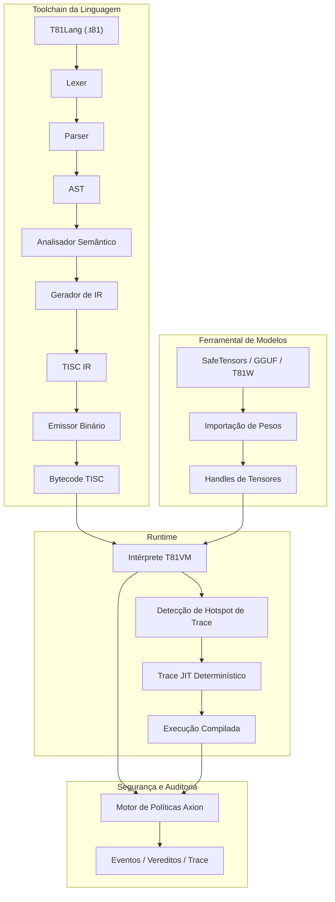

# T81 Foundation 🔥

<div align="center">
  
[](https://github.com/t81dev/t81-foundation/actions/workflows/ci.yml)
[](https://github.com/t81dev/t81-foundation/actions/workflows/ci.yml)
[](https://opensource.org/licenses/MIT)
[](https://en.cppreference.com/w/cpp/23)

[](README.md)
[](README.zh-CN.md)
[](README.es.md)
[](README.ru.md)
[-blueviolet?style=flat-square)](README.pt-BR.md)

</div>

O T81 é uma stack de computação nativa ternária e determinística 🌐 que apresenta tipos de dados de base-81, o conjunto de instruções TISC, T81VM, T81Lang, o motor de segurança e otimização Axion e níveis de cognição recursiva. Ele entrega uma execução auditável e com precisão de bit (bit-exact) ⚡ para domínios com alta carga aritmética — ideal para IA verificável, criptografia e computação científica.

> **Nota sobre Determinismo de Ponto Flutuante** ⚠️
> Funções transcendentais (`sin`, `cos`, `tan`, `log`, `exp`, `sqrt`) utilizam o backend determinístico `dmath` — bit-exact entre plataformas.
> Divisões e funções inversas/hiperbólicas podem retornar ao comportamento do hospedeiro em modo não estrito.
> O determinismo estrito total é garantido para `T81Int`, `T81BigInt`, `T81Fraction` e aritmética principal de `T81Float`. ✅

## Sumário 📑

* [Início Rápido 🚀](https://www.google.com/search?q=%23in%C3%ADcio-r%C3%A1pido-)
* [Recursos 🌟](https://www.google.com/search?q=%23recursos-)
* [Por que Ternário? 🧠](https://www.google.com/search?q=%23por-que-tern%C3%A1rio-)
* [Arquitetura 🏗️](https://www.google.com/search?q=%23arquitetura-%EF%B8%8F)
* [Plataformas Suportadas 🌍](https://www.google.com/search?q=%23plataformas-suportadas-)
* [Exemplos de CLI 🔧](https://www.google.com/search?q=%23exemplos-de-cli-)
* [Mapa do Repositório 📂](https://www.google.com/search?q=%23mapa-do-reposit%C3%B3rio-)
* [Mapa de Autoridade de Documentos 📜](https://www.google.com/search?q=%23mapa-de-autoridade-de-documentos-)
* [Garantias de Compatibilidade 🔄](https://www.google.com/search?q=%23garantias-de-compatibilidade-)
* [Não-Objetivos 🚫](https://www.google.com/search?q=%23n%C3%A3o-objetivos-)
* [Limite de Runtime 🔐](https://www.google.com/search?q=%23limite-de-runtime-)
* [Leitura Adicional 📖](https://www.google.com/search?q=%23leitura-adicional-)
* [Monografia Técnica Definitiva 📘](https://www.google.com/search?q=%23monografia-t%C3%A9cnica-definitiva-)
* [Licença 📜](https://www.google.com/search?q=%23licen%C3%A7a-)

## Início Rápido 🚀⚡

Verifique as principais funcionalidades em < 30 segundos:

1. **Compilar e Executar Hello World** 🏃‍♂️
```bash
cmake -S . -B build -DCMAKE_BUILD_TYPE=Release && cmake --build build --parallel
./build/t81 compile examples/hello_world.t81 -o hello.tisc
./build/t81 run hello.tisc

```


2. **Executar o Determinism Gate** 🔄✅
```bash
python3 scripts/ci/t81lang_repro_gate.py --t81-bin build/t81 --check

```


3. **Executar Demo da VM** ▶️🔥
```bash
./build/t81_demo

```


4. **Inspecionar Rastro (Trace)** 🔍📜
```bash
./build/t81 trace show trace.txt

```


## Recursos 🌟

| Recurso | Status | Descrição |
| --- | --- | --- |
| ✅ Execução Determinística | Estável 🔥 | Reprodutibilidade bit-exact entre plataformas |
| ✅ Tipos de Dados Nativo-Ternários | Estável 🌐 | Base-81 com aritmética ternária balanceada |
| ✅ Motor de Políticas Axion | Estável 🔐 | Segurança em tempo de execução, otimização e aplicação de ética |
| ✅ T81VM | Estável ⚙️ | VM de 81 registradores + intérprete determinístico e trace-JIT |
| ✅ TISC IR | Estável 📡 | Representação intermediária do Computador de Conjunto de Instruções Ternárias |
| ✅ Matemática Definida por Software | Estável 🧮 | Ponto flutuante consistente entre plataformas (`dmath`) |
| 🚧 Compilação Trace-JIT | Experimental ⚡ | Rastreamento de hotspots e JIT determinístico |
| 🚧 Tensores Distribuídos | Experimental 🌍 | Suporte a tensores distribuídos em larga escala |
| ✅ Ferramental de Modelos | Estável 🤖 | Importação, quantização e inspeção de SafeTensors / GGUF / T81W |

## Por que Ternário? 🧠🧮

O ternário balanceado (-1, 0, +1) e a base-81 eliminam bits de sinal, simplificam a adição/subtração (carry reduzido) e oferecem vantagens teóricas de densidade/energia — especialmente valiosas em cargas de trabalho numéricas (inferência de IA, criptografia, processamento de sinais).

O T81 traz esses benefícios para o software, priorizando o determinismo e a auditabilidade em detrimento da velocidade bruta. Veja experimentos de hardware relacionados em [ternary-memory-research](https://github.com/t81dev/ternary-memory-research) para métricas PDK SKY130. 🔬

## Arquitetura 🏗️



## Plataformas Suportadas 🌍

| Plataforma | Compilador | Status | Determinism Gate | Notas |
| --- | --- | --- | --- | --- |
| Linux x86_64 | Clang 18+, GCC 14+ | ✅ Passando 🔥 | ✅ | Portão completo passando |
| Linux ARM64 | Clang 18+ | ✅ Passando 🔥 | ✅ | Portão completo passando |
| macOS x86_64 (Intel) | Apple Clang / GCC | ✅ Passando | ✅ | Funciona nativamente |
| macOS ARM64 (Apple Silicon) | Apple Clang | ✅ Passando | ✅ | Investigação ativa (CMake/flags) |

## Exemplos de CLI 🔧🔍

```bash
# Compilar e rodar 🚀
t81 compile examples/hello_world.t81 -o hello.tisc
t81 run hello.tisc

# Depurar e inspecionar 🕵️
t81 disasm hello.tisc
t81 debug hello.tisc
t81 trace show trace.txt
t81 repro-hash tests/fixtures/t81lang_determinism

# Ferramental de modelos 🤖
t81 weights import model.safetensors -o model.t81w
t81 weights quantize model.safetensors --to-gguf model.gguf

```

Ajuda completa: `t81 --help` ou `t81 help <subcomando>` 📖

## Mapa do Repositório 📂

* `.github/`          → Workflows e templates 🛠️
* `benchmarks/`       → Medições de performance 📈
* `docs/`             → Guias de como fazer, explicações, referências 📚
* `examples/`         → Programas de exemplo (arquivos .t81) 🎯
* `include/t81/`      → Headers públicos 🧩
* `scripts/`          → Ferramentas de CI e portões de reprodutibilidade 🔄
* `spec/`             → Especificações normativas 📜
* `src/`              → Código principal (axion/, canonfs/, vm/, etc.) ⚙️
* `tests/`            → Testes unitários, de propriedade e integração 🧪
* `tools/`            → Scripts de utilidade e extensão do VSCode 🛠️

## Mapa de Autoridade de Documentos 📜

| Documento | Propósito | Autoridade |
| --- | --- | --- |
| spec/constitution.md | Princípios fundamentais | Normativo 🔒 |
| spec/determinism-profile.md | Garantias de determinismo | Normativo ✅ |
| spec/t81-data-types.md | Spec de tipos de dados e serialização | Normativo 🧮 |
| spec/tisc-spec.md | Conjunto de instruções TISC | Normativo 📡 |
| https://www.google.com/search?q=docs/index.md | Ponto de entrada da documentação | Informativo 📖 |

## Garantias de Compatibilidade 🔄

* **Estável:** Sintaxe T81Lang, formato TISC, semântica central T81VM ✅
* **Experimental:** Trace-JIT, tensores distribuídos 🚧
* **SemVer:** Mudanças na versão Major para alterações que quebrem a compatibilidade em partes estáveis ⚖️

## Não-Objetivos 🚫

O T81 **não** é:

* um acelerador de hardware ternário 🖥️
* um substituto de propósito geral para C++/Python/Rust 🛑
* otimizado para throughput máximo às custas do determinismo ⚡❌

## Limite de Runtime 🔐

Definido em especificações como [spec/t81vm-spec.md](https://www.google.com/search?q=spec/t81vm-spec.md)

## Leitura Adicional 📖

* [docs/index.md](https://www.google.com/search?q=docs/index.md)
* [spec/index.md](https://www.google.com/search?q=spec/index.md)
* [CONTRIBUTING.md](https://www.google.com/search?q=CONTRIBUTING.md)
* [SECURITY.md](https://www.google.com/search?q=SECURITY.md)

---

## 📘 Monografia Técnica Definitiva

Para uma descrição abrangente e em nível de especificação da arquitetura — incluindo semântica formal, invariantes de determinismo, modelagem adversária e design de continuidade a longo prazo — consulte:

➡️ **[A Fundação T81 — Monografia Técnica Definitiva](book-pr/README.md)**

**Caminhos para o leitor:**

* **Novo no T81?** → Comece pela Parte I, depois Parte II.
* **Implementador?** → Foque nas Partes II e III.
* **Auditor?** → Leia as Partes III e IV cuidadosamente.
* **Pesquisador?** → Dê ênfase às Partes IV e V.
* **Mantenedor de longo prazo?** → As Partes IV e V são críticas.

<details>
<summary><strong>Parte I — Fundamentos</strong></summary>

1. **[Introdução](book-pr/01_Introducao.md)**
* [1.1 Escopo e Definição](book-pr/01_Introducao.md#11-escopo-e-definicao)
* [1.2 Arquitetura do Sistema](book-pr/01_Introducao.md#12-arquitetura-do-sistema)
* [1.3 Missão de Computação Verificável](book-pr/01_Introducao.md#13-missao-de-computacao-verificavel)


2. **[Princípios Centrais e Invariantes](book-pr/02_Principios.md)**
* [2.1 O Invariante de Determinismo](book-pr/02_Principios.md#21-o-invariante-de-determinismo)
* [2.1.1 Superfícies de Determinismo e Vetores de Ataque](book-pr/02_Principios.md#211-superficies-de-determinismo-e-vetores-de-ataque)
* [2.2 Lógica Ternária (Base-3)](book-pr/02_Principios.md#22-logica-ternaria-base-3)
* [2.3 Auditabilidade e o Trace Axion](book-pr/02_Principios.md#23-auditabilidade-e-o-trace-axion)
* [2.4 Os Nove Princípios (Aplicação de Ética)](book-pr/02_Principios.md#24-os-nove-principios-aplicacao-de-etica)


</details>

<details>
<summary><strong>Parte II — A Máquina Determinística</strong></summary>

3. **[Arquitetura T81VM](book-pr/03_Arquitetura.md)**
* [3.1 Máquina de Estados Formal](book-pr/03_Arquitetura.md#31-maquina-de-estados-formal)
* [3.1.1 Definição de Estado](book-pr/03_Arquitetura.md#311-definicao-de-estado)
* [3.2 Layout de Memória](book-pr/03_Arquitetura.md#32-layout-de-memoria)
* [3.3 Arquivo de Registradores](book-pr/03_Arquitetura.md#33-arquivo-de-registradores)
* [3.4 Arquitetura do Conjunto de Instruções TISC (ISA)](book-pr/03_Arquitetura.md#34-o-conjunto-de-instrucoes-tisc)
* [3.5 Semântica de Falhas](book-pr/03_Arquitetura.md#35-semantica-de-falhas)
* [3.6 Coleta de Lixo (Garbage Collection)](book-pr/03_Arquitetura.md#36-coleta-de-lixo-garbage-collection)


4. **[Tipos de Dados e Serialização Canônica](book-pr/04_Tipos_de_Dados_e_Serializacao.md)**
* [4.1 Tipos Primitivos](book-pr/04_Tipos_de_Dados_e_Serializacao.md#41-tipos-primitivos)
* [4.2 T81Float e dmath](book-pr/04_Tipos_de_Dados_e_Serializacao.md#42-t81float-e-dmath)
* [4.3 Tensores e Layouts Canônicos](book-pr/04_Tipos_de_Dados_e_Serializacao.md#43-tensores-e-layouts-canonicos)
* [4.4 Regras de Serialização Canônica](book-pr/04_Tipos_de_Dados_e_Serializacao.md#44-regras-de-serializacao-canonica)


5. **[Instalação e Verificação de Build](book-pr/05_Instalacao.md)**
* [5.1 Pré-requisitos](book-pr/05_Instalacao.md#51-pre-requisitos)
* [5.2 Compilando a partir da Fonte](book-pr/05_Instalacao.md#52-compilando-a-partir-da-fonte)
* [5.3 Verificando o Build](book-pr/05_Instalacao.md#53-verificando-o-build)


6. **[Uso de CLI e API](book-pr/06_Uso.md)**
* [6.1 Interface de Linha de Comando](book-pr/06_Uso.md#61-a-cli-unificada)
* [6.2 Embarcando T81 (API C++)](book-pr/06_Uso.md#62-embarcando-t81-api-c)
* [6.3 Embarcando T81 (API Python)](book-pr/06_Uso.md#63-embarcando-t81-api-python)
* [6.4 Depuração](book-pr/06_Uso.md#64-depuracao)


</details>

<details>
<summary><strong>Parte III — Governança e Verificação</strong></summary>

7. **[Verificação e Auditoria](book-pr/07_Verificacao_e_Auditoria.md)**
* [7.1 Metodologia de Verificação Formal](book-pr/07_Verificacao_e_Auditoria.md#71-a-pilha-de-verificacao)
* [7.2 A Matriz de Auditoria Formal](book-pr/07_Verificacao_e_Auditoria.md#72-portao-de-determinismo-determinism-gate)
* [7.3 Testes Baseados em Propriedades](book-pr/07_Verificacao_e_Auditoria.md#73-verificacao-de-trace)
* [7.4 O Portão de Determinismo (Determinism Gate)](book-pr/07_Verificacao_e_Auditoria.md#72-portao-de-determinismo-determinism-gate)


8. **[O Kernel de Segurança Axion](book-pr/08_O_Kernel_Axion.md)**
* [8.1 Definição Formal](book-pr/08_O_Kernel_Axion.md#81-definicao-formal)
* [8.2 O Modelo de Política](book-pr/08_O_Kernel_Axion.md#82-o-modelo-de-politica)
* [8.3 Interceptação de Instruções](book-pr/08_O_Kernel_Axion.md#83-interceptacao-de-instrucao)
* [8.4 O Log de Auditoria (Trace)](book-pr/08_O_Kernel_Axion.md#84-o-log-de-auditoria-trace)
* [8.5 Promoção Cognitiva](book-pr/08_O_Kernel_Axion.md#85-promocao-cognitiva)


9. **[Níveis Cognitivos e Computação Distribuída](book-pr/09_Niveis_Cognitivos_e_Computacao_Distribuida.md)**
* [9.1 O Modelo de Nível Cognitivo](book-pr/09_Niveis_Cognitivos_e_Computacao_Distribuida.md#91-o-modelo-de-nivel-cognitivo)
* [9.2 Computação Distribuída (Nível 4)](book-pr/09_Niveis_Cognitivos_e_Computacao_Distribuida.md#92-computacao-distribuida-nivel-4)
* [9.3 Compilação JIT Baseada em Trace](book-pr/09_Niveis_Cognitivos_e_Computacao_Distribuida.md#922-relogios-logicos-ticksync)
* [9.4 Formas Infinitas (Nível 5)](book-pr/09_Niveis_Cognitivos_e_Computacao_Distribuida.md#93-formas-infinitas-nivel-5)


10. **[Apêndices](book-pr/10_Apendices.md)**

* [10.1 O Que Ainda Não Foi Implementado](book-pr/10_Apendices.md#101-o-que-ainda-nao-foi-implementado)
* [10.2 Modelo de Ameaça e Superfície de Ataque ao Determinismo](book-pr/10_Apendices.md#102-codigos-de-erro)
* [10.3 Glossário](book-pr/10_Apendices.md#103-links-uteis)

</details>

<details>
<summary><strong>Parte IV — Formalização e Endurecimento Estrutural</strong></summary>

11. **[Semântica Formal de TISC e T81VM](book-pr/11_Semantica_Formal.md)**

* [Semântica Denotacional de TISC](book-pr/11_Semantica_Formal.md#111-semantica-operacional)
* [Função de Transição Algébrica δ](book-pr/11_Semantica_Formal.md#1111-a-funcao-de-transicao)
* [Sistema de Reescrita de Canonicalização](book-pr/11_Semantica_Formal.md)
* [Esboços de Prova de Determinismo](book-pr/11_Semantica_Formal.md)
* [Equivalência entre Intérprete e Trace-JIT](book-pr/11_Semantica_Formal.md)

12. **[Modelagem Adversária e Ataques ao Determinismo](book-pr/12_Modelagem_Adversaria.md)**

* [Ataques ao Nível do Compilador](book-pr/12_Modelagem_Adversaria.md#121-modelo-de-ameaca)
* [Vetores de Ataque em VM e GC](book-pr/12_Modelagem_Adversaria.md#121-modelo-de-ameaca)
* [Ataques a CanonFS e Hash](book-pr/12_Modelagem_Adversaria.md)
* [Ataque de Viagem no Tempo em Nível Distribuído](book-pr/12_Modelagem_Adversaria.md#1212-ataques-de-viagem-no-tempo)
* [Template de Post-mortem de Violação de Determinismo](book-pr/12_Modelagem_Adversaria.md)

</details>

<details>
<summary><strong>Parte V — Continuidade e Horizonte de Pesquisa</strong></summary>

13. **[Continuidade e Resiliência](book-pr/13_Continuidade_e_Resiliencia.md)**

* [Protocolo de Reconstrução em Ambiente Limpo (Cleanroom)](book-pr/13_Continuidade_e_Resiliencia.md#131-o-protocolo-cleanroom)
* [Pontos Únicos de Falha](book-pr/13_Continuidade_e_Resiliencia.md)
* [Manifesto de Continuidade](book-pr/13_Continuidade_e_Resiliencia.md)
* [Invariantes Formais Imutáveis](book-pr/13_Continuidade_e_Resiliencia.md)

14. **[Fronteira de Pesquisa](book-pr/14_Fronteira_de_Pesquisa.md)**

* [Aceleração de Hardware Ternário](book-pr/14_Fronteira_de_Pesquisa.md)
* [Caminhos de Verificação Formal](book-pr/14_Fronteira_de_Pesquisa.md)
* [CanonFS como Substrato Merkle](book-pr/14_Fronteira_de_Pesquisa.md)
* [Inferência de IA Determinística em Escala](book-pr/14_Fronteira_de_Pesquisa.md)

</details>

---

## Licença

Licença MIT — veja [LICENSE](https://www.google.com/search?q=LICENSE).
