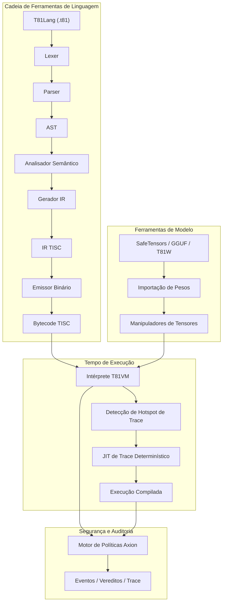

# Fundação T81

<p align="center">
  <strong>Pilha de computação nativa ternária determinística apresentando tipos de dados base-81, conjunto de instruções TISC, T81VM, T81Lang, motor de segurança/otimização Axion e níveis de cognição recursiva — construída para execução bit-exata, auditável e reproduzível em IA, criptografia e computação científica.</strong>
</p>

<p align="center">
  <a href="https://github.com/t81dev/t81-foundation/stargazers"></a>
  <a href="https://github.com/t81dev/t81-foundation/network/members"></a>
  <a href="https://github.com/t81dev/t81-foundation/actions/workflows/ci.yml"></a>
  <a href="https://github.com/t81dev/t81-foundation/commits/main"></a>
  <a href="https://opensource.org/licenses/MIT"></a>
  <a href="https://en.cppreference.com/w/cpp/23"></a>
</p>

<p align="center">
  <a href="README.md"></a>
  <a href="README.zh-CN.md"></a>
  <a href="README.es.md"></a>
  <a href="README.ru.md"></a>
  <a href="README.pt-BR.md"></a>
</p>

---

T81 é uma pilha de computação soberana projetada para eliminar o não-determinismo de ponto flutuante e permitir execução totalmente auditável. Aproveitando **lógica ternária balanceada** e **tipos de dados base-81**, o T81 garante **reprodutibilidade bit-exata** em todas as arquiteturas suportadas (x86/ARM, macOS/Linux). Possui a **T81VM**, o **motor de segurança Axion** e um sistema de níveis recursivos para escalar desde lógica simbólica simples até formas infinitas distribuídas.

> 💡 **Por que importa:** Em segurança de IA, modelagem financeira e criptografia, "quase correto" não é suficiente. T81 fornece certeza matemática de que seu código executa exatamente da mesma maneira, em todos os lugares, todas as vezes.

## Tabela de Conteúdos

- [Recursos](#recursos)
- [Arquitetura](#arquitetura)
- [Início Rápido](#início-rápido)
- [Plataformas Suportadas](#plataformas-suportadas)
- [Exemplos CLI](#exemplos-cli)
- [Capturas de Tela e Demo](#capturas-de-tela-e-demo)
- [Mapa do Repositório](#mapa-do-repositório)
- [Mapa de Autoridade Documental](#mapa-de-autoridade-documental)
- [Compatibilidade e Não-Objetivos](#compatibilidade-e-não-objetivos)
- [Configuração e Axion](#configuração-e-axion)
- [Contribuindo](#contribuindo)
- [Registro de Alterações](#registro-de-alterações)
- [Agradecimentos](#agradecimentos)
- [Licença](#licença)

## Recursos

| Recurso | Status | Descrição |
| :--- | :--- | :--- |
| **Execução Determinística** | ✨ Estável | Resultados bit-exatos em x86/ARM/Apple Silicon via `dmath` e FP personalizado. |
| **Tipos Nativos Ternários** | ✨ Estável | Inteiros e flutuantes ternários balanceados base-81 (sem bit de sinal, carry reduzido). |
| **T81VM e TISC** | ✨ Estável | VM de 81 registradores com intérprete determinístico e Trace-JIT. |
| **Motor Axion** | ✨ Estável | Motor de política, segurança, ética e otimização em tempo de execução com logs de auditoria. |
| **Ferramentas de Modelo** | ✨ Estável | Importar/Inspecionar SafeTensors, GGUF, T81W; suporte a quantização. |
| **Portão de Reprodutibilidade** | ✨ Estável | `t81lang_repro_gate.py` forzado por CI garante 100% de determinismo. |
| **Níveis Cognitivos** | 🚧 Beta | Camadas de execução recursiva (Simbólica → Distribuída → Infinita). |
| **Trace-JIT** | 🚧 Experimental | Otimização de hotspots preservando determinismo estrito. |
| **Documentação Multilíngue** | 📚 Ativo | Especificações completas em Inglês, Chinês, Espanhol, Português, Russo. |

## Arquitetura



## Início Rápido

Vá do zero à execução verificável em menos de 60 segundos.

### 1. Construir
```bash
cmake -S . -B build -DCMAKE_BUILD_TYPE=Release
cmake --build build --parallel
```

### 2. Compilar e Executar Hello World
```bash
# Compilar fonte T81 para bytecode TISC
./build/t81 compile examples/hello_world.t81 -o hello.tisc

# Executar o bytecode
./build/t81 run hello.tisc
```

### 3. Verificar Determinismo (O "Portão de Reprodução")
Prove que sua construção está em conformidade bit-exata:
```bash
python3 scripts/ci/t81lang_repro_gate.py --t81-bin build/t81 --check
# Saída: ✅  All determinism checks passed.
```

## Plataformas Suportadas

Todas as plataformas abaixo passam pelo **Portão de Determinismo** com hashes de saída idênticos.

| Plataforma | Arq | Compilador | Status |
| :--- | :--- | :--- | :--- |
| **Linux** | x86_64 | Clang 18+, GCC 14+ | ✅ Verificado |
| **Linux** | ARM64 | Clang 18+ | ✅ Verificado |
| **macOS** | Intel | Apple Clang / GCC | ✅ Verificado |
| **macOS** | Apple Silicon | Apple Clang | ✅ Verificado |

## Exemplos CLI

A CLI `t81` é sua interface principal para desenvolvimento, depuração e auditoria.

```bash
# 🛠️ Desenvolvimento
t81 compile src.t81 -o out.tisc      # Compilar
t81 run out.tisc                     # Executar
t81 disasm out.tisc                  # Desmontar bytecode

# 🐞 Depuração e Auditoria
t81 debug out.tisc                   # Depurador interativo
t81 trace show trace.txt             # Inspecionar log de execução
t81 repro-hash tests/fixtures/       # Calcular hash de determinismo

# 🤖 IA / Tensores
t81 weights import model.safetensors -o model.t81w
t81 weights quantize model.safetensors --to-gguf model.gguf
```

## Capturas de Tela e Demo

*(Marcador visual: Imagine uma janela de terminal elegante mostrando um log de trace T81 com correspondência exata de hash)*

Para ver a VM em ação com uma demonstração visual:
```bash
./build/t81_demo
```

## Mapa do Repositório

Diretórios chave na base de código:

- **`src/`**: Fonte C++ principal (VM, Axion, TISC, CanonFS).
- **`include/t81/`**: Cabeçalhos públicos.
- **`book/book-en/`**: A Monografia Técnica Definitiva (Documentação).
- **`scripts/ci/`**: Integração Contínua e Portões de Reprodutibilidade.
- **`examples/`**: Programas de exemplo `.t81` e exemplos de incorporação C++.
- **`tests/`**: Suíte abrangente de testes unitários e de integração.
- **`spec/`**: Especificações normativas (TISC, Tipos de Dados).
- **`tools/`**: Scripts utilitários e auxiliares de extensão VSCode.

## Mapa de Autoridade Documental

A **Monografia Técnica Definitiva** é a única fonte da verdade para T81. É mantida em `book/book-en/` e traduzida para múltiplos idiomas.

<details>
<summary><strong>Parte I — Fundamentos</strong></summary>

1. **[Introdução](book/book-pt/01_Introducao.md)**

   * [1.1 Escopo e Definição](book/book-pt/01_Introducao.md#11-escopo-e-definição)
   * [1.2 Arquitetura do Sistema](book/book-pt/01_Introducao.md#12-arquitetura-do-sistema)
   * [1.3 Missão de Computação Verificável](book/book-pt/01_Introducao.md#13-missão-de-computação-verificável)

2. **[Princípios Básicos e Invariantes](book/book-pt/02_Principios.md)**

   * [2.1 O Invariante de Determinismo](book/book-pt/02_Principios.md#21-o-invariante-de-determinismo)
   * [2.1.1 Superfícies de Determinismo e Vetores de Ataque](book/book-pt/02_Principios.md#211-superfícies-de-determinismo-e-vetores-de-ataque)
   * [2.2 Lógica Ternária (Base-3)](book/book-pt/02_Principios.md#22-lógica-ternária-base-3)
   * [2.3 Auditabilidade e o Trace Axion](book/book-pt/02_Principios.md#23-auditabilidade-e-o-trace-axion)
   * [2.4 Os Nove Princípios (Aplicação Ética)](book/book-pt/02_Principios.md#24-os-nove-princípios-aplicação-ética)

</details>

<details>
<summary><strong>Parte II — A Máquina Determinística</strong></summary>

3. **[Arquitetura T81VM](book/book-pt/03_Arquitetura.md)**

   * [3.1 Visão Geral](book/book-pt/03_Arquitetura.md#31-visão-geral)
   * [3.1.1 O Pipeline de Execução](book/book-pt/03_Arquitetura.md#311-o-pipeline-de-execução)
   * [3.2 O Limite de Tempo de Execução](book/book-pt/03_Arquitetura.md#32-o-limite-de-tempo-de-execução)
   * [3.3 Modelo de Memória](book/book-pt/03_Arquitetura.md#33-modelo-de-memória)
   * [3.3.1 Definição Formal de Estado](book/book-pt/03_Arquitetura.md#331-definição-formal-de-estado)
   * [3.4 O Conjunto de Instruções (TISC)](book/book-pt/03_Arquitetura.md#34-o-conjunto-de-instruções-tisc)
   * [3.5 Compilação JIT (Trace-JIT)](book/book-pt/03_Arquitetura.md#35-compilação-jit-trace-jit)

4. **[Tipos de Dados e Serialização Canônica](book/book-pt/04_Tipos_de_Dados_e_Serializacao.md)**

   * [4.1 Tipos Primitivos](book/book-pt/04_Tipos_de_Dados_e_Serializacao.md#41-tipos-primitivos)
   * [4.2 T81Float e dmath](book/book-pt/04_Tipos_de_Dados_e_Serializacao.md#42-t81float-e-dmath)
   * [4.3 Tensores e Layouts Canônicos](book/book-pt/04_Tipos_de_Dados_e_Serializacao.md#43-tensores-e-layouts-canônicos)
   * [4.4 Regras de Serialização Canônica](book/book-pt/04_Tipos_de_Dados_e_Serializacao.md#44-regras-de-serialização-canônica)

5. **[Instalação e Verificação de Build](book/book-pt/05_Instalacao.md)**

   * [5.1 Pré-requisitos](book/book-pt/05_Instalacao.md#51-pré-requisitos)
   * [5.2 Construindo a partir do Código Fonte](book/book-pt/05_Instalacao.md#52-construindo-a-partir-do-código-fonte)
   * [5.3 Verificando a Construção](book/book-pt/05_Instalacao.md#53-verificando-a-construção)

6. **[Uso de CLI e API](book/book-pt/06_Uso.md)**

   * [6.1 Interface de Linha de Comando](book/book-pt/06_Uso.md#61-interface-de-linha-de-comando)
   * [6.2 Incorporando T81 (API C++)](book/book-pt/06_Uso.md#62-incorporando-t81-api-c)
   * [6.3 Incorporando T81 (API Python)](book/book-pt/06_Uso.md#63-incorporando-t81-api-python)
   * [6.4 Depuração](book/book-pt/06_Uso.md#64-depuração)

7. **[Programação em T81Lang](book/book-pt/07_Programacao_em_T81Lang.md)**

   * [7.1 Filosofia de Design](book/book-pt/07_Programacao_em_T81Lang.md#71-filosofia-de-design)
   * [7.2 Conceitos Básicos de Sintaxe](book/book-pt/07_Programacao_em_T81Lang.md#72-conceitos-básicos-de-sintaxe)
   * [7.3 Tipos de Dados](book/book-pt/07_Programacao_em_T81Lang.md#73-tipos-de-dados)
   * [7.4 Fluxo de Controle](book/book-pt/07_Programacao_em_T81Lang.md#74-fluxo-de-controle)
   * [7.5 Funções](book/book-pt/07_Programacao_em_T81Lang.md#75-funções)
   * [7.6 Integração Axion](book/book-pt/07_Programacao_em_T81Lang.md#76-integração-axion)
   * [7.7 Exemplos](book/book-pt/07_Programacao_em_T81Lang.md#77-exemplos)

</details>

<details>
<summary><strong>Parte III — Governança e Verificação</strong></summary>

8. **[Verificação e Auditoria](book/book-pt/08_Verificacao_e_Auditoria.md)**

   * [8.1 Metodologia de Verificação Formal](book/book-pt/08_Verificacao_e_Auditoria.md#81-metodologia-de-verificação-formal)
   * [8.2 A Matriz de Auditoria Formal](book/book-pt/08_Verificacao_e_Auditoria.md#82-a-matriz-de-auditoria-formal)
   * [8.3 Testes Baseados em Propriedades](book/book-pt/08_Verificacao_e_Auditoria.md#83-testes-baseados-em-propriedades)
   * [8.4 O Portão de Determinismo](book/book-pt/08_Verificacao_e_Auditoria.md#84-o-portão-de-determinismo)

9. **[O Kernel de Segurança Axion](book/book-pt/09_O_Kernel_Axion.md)**

   * [9.1 Definição Formal](book/book-pt/09_O_Kernel_Axion.md#91-definição-formal)
   * [9.2 O Modelo de Política](book/book-pt/09_O_Kernel_Axion.md#92-o-modelo-de-política)
   * [9.3 Interceptação de Instruções](book/book-pt/09_O_Kernel_Axion.md#93-interceptação-de-instruções)
   * [9.4 O Log de Auditoria (Trace)](book/book-pt/09_O_Kernel_Axion.md#94-o-log-de-auditoria-trace)
   * [9.5 Promoção Cognitiva](book/book-pt/09_O_Kernel_Axion.md#95-promoção-cognitiva)

10. **[Níveis Cognitivos e Computação Distribuída](book/book-pt/10_Niveis_Cognitivos_e_Computacao_Distribuida.md)**

   * [10.1 O Modelo de Nível Cognitivo](book/book-pt/10_Niveis_Cognitivos_e_Computacao_Distribuida.md#101-o-modelo-de-nível-cognitivo)
   * [10.2 Computação Distribuída (Nível 4)](book/book-pt/10_Niveis_Cognitivos_e_Computacao_Distribuida.md#102-computação-distribuída-nível-4)
   * [10.3 Compilação JIT Baseada em Trace](book/book-pt/10_Niveis_Cognitivos_e_Computacao_Distribuida.md#103-compilação-jit-baseada-em-trace)
   * [10.4 Formas Infinitas (Nível 5)](book/book-pt/10_Niveis_Cognitivos_e_Computacao_Distribuida.md#104-formas-infinitas-nível-5)

11. **[Apêndices](book/book-pt/11_Apendices.md)**

* [11.1 O Que Ainda Não Está Implementado](book/book-pt/11_Apendices.md#111-o-que-ainda-não-está-implementado)
* [11.2 Glossário](book/book-pt/11_Apendices.md#112-glossário)
* [11.3 Links Úteis](book/book-pt/11_Apendices.md#113-links-úteis)

</details>

<details>
<summary><strong>Parte IV — Formalização e Endurecimento Estrutural</strong></summary>

12. **[Semântica Formal de TISC e T81VM](book/book-pt/12_Semantica_Formal.md)**

* [12.1 Semântica Operacional](book/book-pt/12_Semantica_Formal.md#121-semântica-operacional)
* [12.1.1 A Função de Transição δ](book/book-pt/12_Semantica_Formal.md#1211-a-função-de-transição)
* [12.2 Função de Transição Algébrica](book/book-pt/12_Semantica_Formal.md#122-função-de-transição-algébrica)
* [12.3 Sistema de Reescrita de Canonicalização](book/book-pt/12_Semantica_Formal.md#123-sistema-de-reescrita-de-canonicalização)
* [12.4 Esboços de Prova de Determinismo](book/book-pt/12_Semantica_Formal.md#124-esboços-de-prova-de-determinismo)
* [12.5 Equivalência Intérprete vs Trace-JIT](book/book-pt/12_Semantica_Formal.md#125-equivalência-intérprete-vs-trace-jit)

13. **[Modelagem Adversária e Ataques de Determinismo](book/book-pt/13_Modelagem_Adversaria.md)**

* [13.1 Modelo de Ameaça](book/book-pt/13_Modelagem_Adversaria.md#131-modelo-de-ameaça)
* [13.2 Ataques em Nível de Compilador](book/book-pt/13_Modelagem_Adversaria.md#132-ataques-em-nível-de-compilador)
* [13.3 Vetores de Ataque VM e GC](book/book-pt/13_Modelagem_Adversaria.md#133-vetores-de-ataque-vm-e-gc)
* [13.4 CanonFS e Ataques de Hash](book/book-pt/13_Modelagem_Adversaria.md#134-canonfs-e-ataques-de-hash)
* [13.5 Ataque de Viagem no Tempo de Nível Distribuído](book/book-pt/13_Modelagem_Adversaria.md#135-ataque-de-viagem-no-tempo-de-nível-distribuído)
* [13.6 Modelo Post-Mortem de Violação de Determinismo](book/book-pt/13_Modelagem_Adversaria.md#136-modelo-post-mortem-de-violação-de-determinismo)

</details>

<details>
<summary><strong>Parte V — Continuidade e Horizonte de Pesquisa</strong></summary>

14. **[Continuidade e Resiliência](book/book-pt/14_Continuidade_e_Resiliencia.md)**

* [14.1 O Protocolo de Sala Limpia](book/book-pt/14_Continuidade_e_Resiliencia.md#141-o-protocolo-de-sala-limpia)
* [14.2 Pontos Únicos de Falha](book/book-pt/14_Continuidade_e_Resiliencia.md#142-pontos-únicos-de-falha)
* [14.3 Manifesto de Continuidade](book/book-pt/14_Continuidade_e_Resiliencia.md#143-manifesto-de-continuidade)
* [14.4 Invariantes Formais Imutáveis](book/book-pt/14_Continuidade_e_Resiliencia.md#144-invariantes-formais-imutáveis)

15. **[Fronteira de Pesquisa](book/book-pt/15_Fronteira_de_Pesquisa.md)**

* [15.1 Aceleração de Hardware Ternário](book/book-pt/15_Fronteira_de_Pesquisa.md#151-aceleração-de-hardware-ternário)
* [15.2 Caminhos de Verificação Formal](book/book-pt/15_Fronteira_de_Pesquisa.md#152-caminhos-de-verificação-formal)
* [15.3 CanonFS como Substrato Merkle](book/book-pt/15_Fronteira_de_Pesquisa.md#153-canonfs-como-substrato-merkle)
* [15.4 Inferência de IA Determinística em Escala](book/book-pt/15_Fronteira_de_Pesquisa.md#154-inferência-de-ia-determinística-em-escala)

</details>

> 📚 **Leia a monografia completa aqui:** [book/book-pt/README.md](book/book-pt/README.md)

## Compatibilidade e Não-Objetivos

### Garantias
- **Bytecode TISC:** Compatível com versões anteriores dentro das versões principais.
- **Determinismo:** Prioridade absoluta. Quebrar o determinismo é tratado como um bug de segurança crítico.

### Não-Objetivos
- **Velocidade Bruta a todo custo:** Não sacrificaremos a exatidão bit-a-bit por otimizações matemáticas rápidas específicas de hardware.
- **Substituição de Propósito Geral:** O T81 é especializado para computação verificável, não para substituir C++ ou Python para scripts gerais.

## Configuração e Axion

O motor **Axion** impõe políticas em tempo de execução. A configuração é tratada via arquivos de política ou flags de tempo de execução.

- **Segurança:** Limites de memória, profundidade de recursão (Níveis Cognitivos).
- **Ética:** Princípios codificados como restrições de tempo de execução.
- **Otimização:** Rastreamento de hotspots e limites JIT.

Veja `src/axion/` para detalhes de implementação ou execute exemplos `axion_policy_runner`.

## Contribuindo

Congratulamo-nos com contribuições! Por favor, veja [CONTRIBUTING.md](CONTRIBUTING.md) para detalhes sobre:
- Estilo de código (Clang-Format).
- Processo de Pull Request.
- Requisitos de verificação de determinismo.

## Registro de Alterações

Veja [Releases](https://github.com/t81dev/t81-foundation/releases) para o histórico completo de versões.
- **v1.0.0-Sovereign**: Primeiro lançamento pronto para produção. VM estável, TISC e Axion.

## Agradecimentos

Obrigado à comunidade de código aberto, especificamente aos contribuidores de `LLVM`, `fmt` e aos primeiros pesquisadores em lógica de computação ternária.

## Licença

Este projeto é licenciado sob a **Licença MIT**. Veja [LICENSE](LICENSE) para detalhes.
