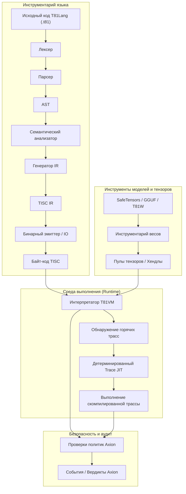

# Фонд T81

[](https://github.com/t81dev/t81-foundation/actions/workflows/ci.yml)
[](https://github.com/t81dev/t81-foundation/actions/workflows/ci.yml)
[](https://opensource.org/licenses/MIT)
[](https://en.cppreference.com/w/cpp/23)

[](/README.md)
[](/README.zh-CN.md)
[](/README.es.md)
[](/README.ru.md)
[-blueviolet?style=flat-square)](/README.pt-BR.md)

---

T81: детерминированный вычислительный стек с нативной поддержкой троичной логики. Включает типы данных по основанию 81, набор инструкций TISC, виртуальную машину T81VM, язык T81Lang, механизмы безопасности/оптимизации Axion и полные уровни рекурсивного познания.

T81 обеспечивает побитово точное и проверяемое выполнение кода в областях с интенсивными арифметическими вычислениями за счет сочетания троичных типов данных со строгим управлением средой выполнения. Идеально подходит для верифицируемого ИИ, криптографии и научных вычислений.

> **Примечание о детерминизме чисел с плавающей запятой:** > Трансцендентные функции `T81Float` (`sin`, `cos`, `tan`, `log`, `exp`, `sqrt`) реализованы через программно-определяемый детерминированный бэкенд (`dmath`) и гарантируют побитовую точность на всех платформах.
> Деление `T81Float` и обратные/гиперболические тригонометрические функции (`asin`, `sinh` и др.) могут зависеть от поведения хост-платформы в нестрогих режимах.
> Строгий побитовый детерминизм гарантируется для `T81Int`, `T81BigInt`, `T81Fraction` (канонический) и основных операций `T81Float`.

## Содержание

* [Быстрый старт](https://www.google.com/search?q=%23%D0%B1%D1%8B%D1%81%D1%82%D1%80%D1%8B%D0%B9-%D1%81%D1%82%D0%B0%D1%80%D1%82)
* [Особенности](https://www.google.com/search?q=%23%D0%BE%D1%81%D0%BE%D0%B1%D0%B5%D0%BD%D0%BD%D0%BE%D1%81%D1%82%D0%B8)
* [Почему троичная система?](https://www.google.com/search?q=%23%D0%BF%D0%BE%D1%87%D0%B5%D0%BC%D1%83-%D1%82%D1%80%D0%BE%D0%B8%D1%87%D0%BD%D0%B0%D1%8F-%D1%81%D0%B8%D1%81%D1%82%D0%B5%D0%BC%D0%B0)
* [Архитектура](https://www.google.com/search?q=%23%D0%B0%D1%80%D1%85%D0%B8%D1%82%D0%B5%D0%BA%D1%82%D1%83%D1%80%D0%B0)
* [Поддерживаемые платформы](https://www.google.com/search?q=%23%D0%BF%D0%BE%D0%B4%D0%B4%D0%B5%D1%80%D0%B6%D0%B8%D0%B2%D0%B0%D0%B5%D0%BC%D1%8B%D0%B5-%D0%BF%D0%BB%D0%B0%D1%82%D1%84%D0%BE%D1%80%D0%BC%D1%8B)
* [Примеры CLI](https://www.google.com/search?q=%23%D0%BF%D1%80%D0%B8%D0%BC%D0%B5%D1%80%D1%8B-cli)
* [Карта репозитория](https://www.google.com/search?q=%23%D0%BA%D0%B0%D1%80%D1%82%D0%B0-%D1%80%D0%B5%D0%BF%D0%BE%D0%B7%D0%B8%D1%82%D0%BE%D1%80%D0%B8%D1%8F)
* [Карта авторитетности документов](https://www.google.com/search?q=%23%D0%BA%D0%B0%D1%80%D1%82%D0%B0-%D0%B0%D0%B2%D1%82%D0%BE%D1%80%D0%B8%D1%82%D0%B5%D1%82%D0%BD%D0%BE%D1%81%D1%82%D0%B8-%D0%B4%D0%BE%D0%BA%D1%83%D0%BC%D0%B5%D0%BD%D1%82%D0%BE%D0%B2)
* [Гарантии совместимости](https://www.google.com/search?q=%23%D0%B3%D0%B0%D1%80%D0%B0%D0%BD%D1%82%D0%B8%D0%B8-%D1%81%D0%BE%D0%B2%D0%BC%D0%B5%D1%81%D1%82%D0%B8%D0%BC%D0%BE%D1%81%D1%82%D0%B8)
* [Не-цели проекта](https://www.google.com/search?q=%23%D0%BD%D0%B5-%D1%86%D0%B5%D0%BB%D0%B8-%D0%BF%D1%80%D0%BE%D0%B5%D0%BA%D1%82%D0%B0)
* [Границы среды выполнения](https://www.google.com/search?q=%23%D0%B3%D1%80%D0%B0%D0%BD%D0%B8%D1%86%D1%8B-%D1%81%D1%80%D0%B5%D0%B4%D1%8B-%D0%B2%D1%8B%D0%BF%D0%BE%D0%BB%D0%BD%D0%B5%D0%BD%D0%B8%D1%8F)
* [Дополнительные материалы](https://www.google.com/search?q=%23%D0%B4%D0%BE%D0%BF%D0%BE%D0%BB%D0%BD%D0%B8%D1%82%D0%B5%D0%BB%D1%8C%D0%BD%D1%8B%D0%B5-%D0%BC%D0%B0%D1%82%D0%B5%D1%80%D0%B8%D0%B0%D0%BB%D1%8B)
* [Лицензия](https://www.google.com/search?q=%23%D0%BB%D0%B8%D1%86%D0%B5%D0%BD%D0%B7%D0%B8%D1%8F)

## Быстрый старт

Проверьте ключевые возможности менее чем за 30 секунд:

1. **Сборка и запуск Hello World**
```bash
cmake -S . -B build -DCMAKE_BUILD_TYPE=Release && cmake --build build --parallel
./build/t81 compile examples/hello_world.t81 -o hello.tisc
./build/t81 run hello.tisc

```


2. **Запуск проверки детерминизма**
```bash
python3 scripts/ci/t81lang_repro_gate.py --t81-bin build/t81 --check

```


3. **Запуск демо-версии VM**
```bash
./build/t81_demo

```


4. **Просмотр артефактов трассировки**
```bash
./build/t81 trace show trace.txt

```


## Особенности

| Функция | Статус | Описание |
| --- | --- | --- |
| **Детерминированное выполнение** | ✅ Стабильно | Побитовая воспроизводимость на разных платформах через конвейер T81Lang → TISC → T81VM. |
| **Нативные троичные типы** | ✅ Стабильно | Типы по основанию 81 с симметричной троичной арифметикой для эффективных вычислений. |
| **Движок политик Axion** | ✅ Стабильно | Обеспечение безопасности в рантайме и применение политик оптимизации. |
| **T81VM** | ✅ Стабильно | Виртуальная машина с 81 регистром, детерминированной интерпретацией и Trace-JIT. |
| **TISC IR** | ✅ Стабильно | Промежуточное представление (IR) для троичного компьютера с набором инструкций. |
| **Программная математика** | ✅ Стабильно | Бэкенд `dmath` для согласованных операций с плавающей запятой на всех платформах. |
| **Компиляция Trace-JIT** | 🚧 Эксперим. | Обнаружение «горячих» участков кода и детерминированный JIT для повышения производительности. |
| **Распределенные тензоры** | 🚧 Эксперим. | Поддержка крупномасштабных тензорных операций в распределенных средах. |
| **Инструментарий моделей** | ✅ Стабильно | Импорт весов, квантование и инспекция для интеграции с ML (SafeTensors, GGUF). |

## Почему троичная система?

Симметричная троичная система (использование цифр -1, 0, +1) и типы данных по основанию 81 () оптимизируют арифметически нагруженные задачи, такие как обработка сигналов, логический вывод ИИ и криптография. В отличие от двоичной системы, симметричная троичная система исключает отдельный знаковый бит, упрощает сложение/вычитание без долгого распространения переноса и потенциально обеспечивает более высокую энергоэффективность в специализированном оборудовании.

T81 эмулирует эти преимущества программно для создания детерминированных и проверяемых сред. Она дополняет двоичные системы в конфигурациях со смешанным основанием, обеспечивая выигрыш в плотности данных и энергопотреблении на вычислительном уровне (например, в ядрах для квантования или тензорных вычислений). Троичная система — это не универсальная замена, а точечный инструмент для областей, где накладные расходы минимальны, а преимущества очевидны.

Для получения информации о аппаратном обеспечении см. недавние симуляции SPICE в репозитории [ternary-memory-research](https://github.com/t81dev/ternary-memory-research), показывающие реальные метрики энергии/задержки для троичных вентилей в SKY130 PDK.

## Архитектура

T81 обеспечивает строгое разделение между компиляцией и выполнением, регулируемое явными контрактами детерминизма и безопасности.



## Поддерживаемые платформы

| Платформа | Компилятор | Статус |
| --- | --- | --- |
| Linux (x86_64) | Clang 18+, GCC 14+ | ✅ Проверка детерминизма пройдена |
| Linux (ARM64) | Clang 18+ | ✅ Проверка детерминизма пройдена |
| macOS (ARM64) | Apple Clang | ✅ Поддерживается |

## Примеры CLI

CLI `t81` предоставляет единый интерфейс для компиляции, выполнения и диагностики.

* **Компиляция и запуск**
```bash
t81 compile examples/hello_world.t81 -o build/hello.tisc
t81 run build/hello.tisc

```


* **Отладка и инспекция**
```bash
t81 disasm build/hello.tisc
t81 debug build/hello.tisc
t81 check examples/hello_world.t81

```


* **Трассировка и воспроизводимость**
```bash
t81 trace show trace.txt
t81 trace diff trace_a.txt trace_b.txt
t81 trace replay build/hello.tisc trace.txt
t81 repro-hash tests/fixtures/t81lang_determinism

```


* **Управление моделями**
```bash
t81 weights import model.safetensors -o model.t81w
t81 weights info model.t81w
t81 weights quantize model.safetensors --to-gguf model.gguf

```


Полная справка: *`t81 help`*

## Карта репозитория

* [.github/](https://www.google.com/search?q=.github/) : Workflows, шаблоны issue.
* [benchmarks/](https://www.google.com/search?q=benchmarks/) : Скрипты производительности и данные.
* [contracts/](https://www.google.com/search?q=contracts/) : Контракты рантайма (например, [runtime-contract.json](https://www.google.com/search?q=contracts/runtime-contract.json)).
* [docs/](https://www.google.com/search?q=docs/) : Центр документации (explanation/, how-to/, policies/, reference/, roadmaps-plans/).
* [examples/](https://www.google.com/search?q=examples/) : Примеры (hello_world.t81, tensor_demo.t81); подкаталоги system-integration/, tisc/.
* [include/t81/](https://www.google.com/search?q=include/t81/) : Публичные заголовочные файлы.
* [scripts/](https://www.google.com/search?q=scripts/) : Инструменты CI, скрипты проверки воспроизводимости.
* [spec/](https://www.google.com/search?q=spec/) : Нормативные спецификации (например, [t81-data-types.md](https://www.google.com/search?q=spec/t81-data-types.md), [tisc-spec.md](https://www.google.com/search?q=spec/tisc-spec.md)).
* [src/](https://www.google.com/search?q=src/) : Ядро реализации (axion/, bigint/, canonfs/, cli/, frontend/, tisc/, vm/ и др.).
* [tests/](https://www.google.com/search?q=tests/) : Тестовые наборы (ci/, cpp/, fixtures/ и др.).

## Карта авторитетности документов

| Документ | Назначение | Область действия |
| --- | --- | --- |
| **[spec/constitution.md](https://www.google.com/search?q=spec/constitution.md)** | Основополагающие принципы | Нормативный |
| **[spec/determinism-profile.md](https://www.google.com/search?q=spec/determinism-profile.md)** | Гарантии детерминизма | Нормативный |
| **[spec/index.md](https://www.google.com/search?q=spec/index.md)** | Указатель спецификаций | Нормативный |
| **[docs/index.md](https://www.google.com/search?q=docs/index.md)** | Вход в документацию | Информационный |
| **[CONTRIBUTING.md](https://www.google.com/search?q=CONTRIBUTING.md)** | Правила внесения вклада | Операционный |

## Гарантии совместимости

* **Стабильно:** Синтаксис T81Lang, формат TISC, семантика T81VM.
* **Экспериментально:** Trace-JIT, распределенные тензоры.
* **SemVer:** Мажорные версии для критических изменений в стабильных компонентах.

## Не-цели проекта

🚫 T81 **не является**:

* Аппаратным ускорителем троичной логики (фокус на программном детерминизме).
* Языком общего назначения для замены C++ или Python.
* Решением «производительность любой ценой» (отказ от оптимизаций, нарушающих детерминизм).

## Границы среды выполнения

Определены в [contracts/runtime-contract.json](https://www.google.com/search?q=contracts/runtime-contract.json) и подробно описаны в спецификациях, таких как [spec/t81vm-spec.md](https://www.google.com/search?q=spec/t81vm-spec.md).

## Дополнительные материалы

* [docs/index.md](https://www.google.com/search?q=docs/index.md)
* [spec/t81-overview.md](https://www.google.com/search?q=spec/t81-overview.md)
* [CONTRIBUTING.md](https://www.google.com/search?q=CONTRIBUTING.md)
* [SECURITY.md](https://www.google.com/search?q=SECURITY.md)
* [CHANGELOG.md](https://www.google.com/search?q=CHANGELOG.md)

## Лицензия

MIT License — см. [LICENSE](https://www.google.com/search?q=LICENSE).
