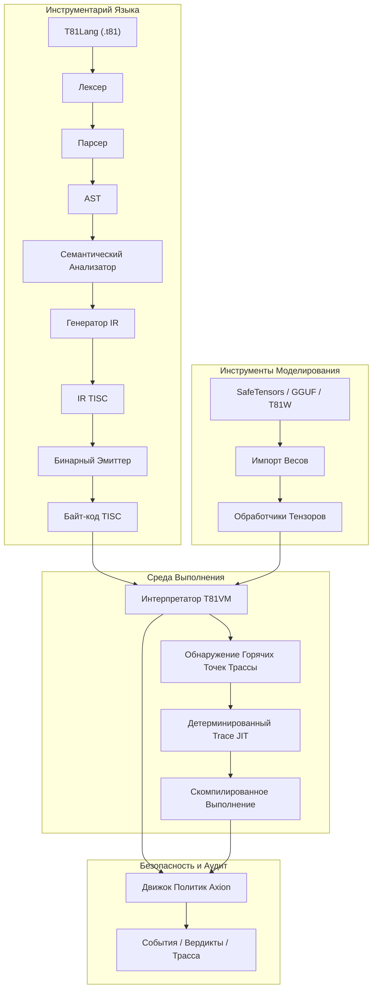

# Фонд T81

<p align="center">
  <strong>Детерминированный стек вычислений на основе троичной логики, включающий типы данных с основанием 81, набор инструкций TISC, T81VM, T81Lang, движок безопасности/оптимизации Axion и рекурсивные когнитивные уровни — созданный для побитово точного, аудируемого и воспроизводимого выполнения в ИИ, криптографии и научных вычислениях.</strong>
</p>

<p align="center">
  <a href="https://github.com/t81dev/t81-foundation/stargazers"></a>
  <a href="https://github.com/t81dev/t81-foundation/network/members"></a>
  <a href="https://github.com/t81dev/t81-foundation/actions/workflows/ci.yml"></a>
  <a href="https://github.com/t81dev/t81-foundation/commits/main"></a>
  <a href="https://opensource.org/licenses/MIT"></a>
  <a href="https://en.cppreference.com/w/cpp/23"></a>
</p>

<p align="center">
  <a href="README.md"></a>
  <a href="README.zh-CN.md"></a>
  <a href="README.es.md"></a>
  <a href="README.ru.md"></a>
  <a href="README.pt-BR.md"></a>
</p>

---

T81 — это суверенный вычислительный стек, разработанный для устранения недетерминизма плавающей запятой и обеспечения полностью аудируемого выполнения. Используя **сбалансированную троичную логику** и **типы данных с основанием 81**, T81 гарантирует **побитовую точность воспроизведения** на всех поддерживаемых архитектурах (x86/ARM, macOS/Linux). Он включает в себя **T81VM**, **движок безопасности Axion** и систему рекурсивных уровней для масштабирования от простой символьной логики до распределенных бесконечных форм.

> 💡 **Почему это важно:** В безопасности ИИ, финансовом моделировании и криптографии "почти правильно" недостаточно. T81 обеспечивает математическую уверенность в том, что ваш код выполняется абсолютно одинаково везде и всегда.

## Оглавление

- [Возможности](#возможности)
- [Архитектура](#архитектура)
- [Быстрый Старт](#быстрый-старт)
- [Поддерживаемые Платформы](#поддерживаемые-платформы)
- [Примеры CLI](#примеры-cli)
- [Скриншоты и Демо](#скриншоты-и-демо)
- [Карта Репозитория](#карта-репозитория)
- [Карта Авторитетной Документации](#карта-авторитетной-документации)
- [Совместимость и Не-цели](#совместимость-и-не-цели)
- [Конфигурация и Axion](#конфигурация-и-axion)
- [Участие в Разработке](#участие-в-разработке)
- [Журнал Изменений](#журнал-изменений)
- [Благодарности](#благодарности)
- [Лицензия](#лицензия)

## Возможности

| Возможность | Статус | Описание |
| :--- | :--- | :--- |
| **Детерминированное Выполнение** | ✨ Стабильно | Побитово точные результаты на x86/ARM/Apple Silicon через `dmath` и кастомную FP. |
| **Нативные Троичные Типы** | ✨ Стабильно | Сбалансированные троичные целые числа и числа с плавающей запятой основания 81 (без знакового бита, уменьшенный перенос). |
| **T81VM и TISC** | ✨ Стабильно | Виртуальная машина с 81 регистром, детерминированным интерпретатором и Trace-JIT. |
| **Движок Axion** | ✨ Стабильно | Движок политики, безопасности, этики и оптимизации времени выполнения с журналами аудита. |
| **Инструменты Моделирования** | ✨ Стабильно | Импорт/Инспекция SafeTensors, GGUF, T81W; поддержка квантования. |
| **Шлюз Воспроизводимости** | ✨ Стабильно | `t81lang_repro_gate.py` в CI гарантирует 100% детерминизм. |
| **Когнитивные Уровни** | 🚧 Бета | Слои рекурсивного выполнения (Символьный → Распределенный → Бесконечный). |
| **Trace-JIT** | 🚧 Экспериментально | Оптимизация горячих точек с сохранением строгого детерминизма. |
| **Мультиязычная Документация** | 📚 Живая | Полные спецификации на английском, китайском, испанском, португальском, русском. |

## Архитектура



## Быстрый Старт

Перейдите от нуля к проверяемому выполнению менее чем за 60 секунд.

### 1. Сборка
```bash
cmake -S . -B build -DCMAKE_BUILD_TYPE=Release
cmake --build build --parallel
```

### 2. Компиляция и Запуск Hello World
```bash
# Компиляция исходного кода T81 в байт-код TISC
./build/t81 compile examples/hello_world.t81 -o hello.tisc

# Запуск байт-кода
./build/t81 run hello.tisc
```

### 3. Проверка Детерминизма ("Шлюз Воспроизведения")
Докажите, что ваша сборка соответствует побитовой точности:
```bash
python3 scripts/ci/t81lang_repro_gate.py --t81-bin build/t81 --check
# Вывод: ✅  All determinism checks passed.
```

## Поддерживаемые Платформы

Все платформы ниже проходят **Шлюз Детерминизма** с идентичными хэшами вывода.

| Платформа | Архитектура | Компилятор | Статус |
| :--- | :--- | :--- | :--- |
| **Linux** | x86_64 | Clang 18+, GCC 14+ | ✅ Проверено |
| **Linux** | ARM64 | Clang 18+ | ✅ Проверено |
| **macOS** | Intel | Apple Clang / GCC | ✅ Проверено |
| **macOS** | Apple Silicon | Apple Clang | ✅ Проверено |

## Примеры CLI

CLI `t81` — это ваш основной интерфейс для разработки, отладки и аудита.

```bash
# 🛠️ Разработка
t81 compile src.t81 -o out.tisc      # Компиляция
t81 run out.tisc                     # Выполнение
t81 disasm out.tisc                  # Дизассемблирование байт-кода

# 🐞 Отладка и Аудит
t81 debug out.tisc                   # Интерактивный отладчик
t81 trace show trace.txt             # Инспекция трассы выполнения
t81 repro-hash tests/fixtures/       # Расчет хэша детерминизма

# 🤖 ИИ / Тензоры
t81 weights import model.safetensors -o model.t81w
t81 weights quantize model.safetensors --to-gguf model.gguf
```

## Скриншоты и Демо

*(Визуальный заполнитель: Представьте элегантное окно терминала, показывающее журнал трассировки T81 с точным совпадением хэша)*

Чтобы увидеть VM в действии с визуальной демонстрацией:
```bash
./build/t81_demo
```

## Карта Репозитория

Ключевые директории в кодовой базе:

- **`src/`**: Основной исходный код C++ (VM, Axion, TISC, CanonFS).
- **`include/t81/`**: Публичные заголовки.
- **`book/book-en/`**: Окончательная Техническая Монография (Документация).
- **`scripts/ci/`**: Непрерывная Интеграция и Шлюзы Воспроизводимости.
- **`examples/`**: Примеры программ `.t81` и примеры встраивания C++.
- **`tests/`**: Комплексный набор модульных и интеграционных тестов.
- **`spec/`**: Нормативные спецификации (TISC, Типы Данных).
- **`tools/`**: Утилитарные скрипты и помощники расширений VSCode.

## Карта Авторитетной Документации

**Окончательная Техническая Монография** является единственным источником истины для T81. Она поддерживается в `book/book-en/` и переведена на несколько языков.

<details>
<summary><strong>Часть I — Основы</strong></summary>

1. **[Введение](book/book-ru/01_Введение.md)**

   * [1.1 Область применения и определение](book/book-ru/01_Введение.md#11-область-применения-и-определение)
   * [1.2 Архитектура Системы](book/book-ru/01_Введение.md#12-архитектура-системы)
   * [1.3 Миссия Проверяемых Вычислений](book/book-ru/01_Введение.md#13-миссия-проверяемых-вычислений)

2. **[Основные Принципы и Инварианты](book/book-ru/02_Принципы.md)**

   * [2.1 Инвариант Детерминизма](book/book-ru/02_Принципы.md#21-инвариант-детерминизма)
   * [2.1.1 Поверхности Детерминизма и Векторы Атак](book/book-ru/02_Принципы.md#211-поверхности-детерминизма-и-векторы-атак)
   * [2.2 Троичная Логика (Основание-3)](book/book-ru/02_Принципы.md#22-троичная-логика-основание-3)
   * [2.3 Аудируемость и Трасса Axion](book/book-ru/02_Принципы.md#23-аудируемость-и-трасса-axion)
   * [2.4 Девять Принципов (Соблюдение Этики)](book/book-ru/02_Принципы.md#24-девять-принципов-соблюдение-этики)

</details>

<details>
<summary><strong>Часть II — Детерминированная Машина</strong></summary>

3. **[Архитектура T81VM](book/book-ru/03_Архитектура.md)**

   * [3.1 Обзор](book/book-ru/03_Архитектура.md#31-обзор)
   * [3.1.1 Конвейер Выполнения](book/book-ru/03_Архитектура.md#311-конвейер-выполнения)
   * [3.2 Граница Времени Выполнения](book/book-ru/03_Архитектура.md#32-граница-времени-выполнения)
   * [3.3 Модель Памяти](book/book-ru/03_Архитектура.md#33-модель-памяти)
   * [3.3.1 Формальное Определение Состояния](book/book-ru/03_Архитектура.md#331-формальное-определение-состояния)
   * [3.4 Набор Инструкций (TISC)](book/book-ru/03_Архитектура.md#34-набор-инструкций-tisc)
   * [3.5 JIT-компиляция (Trace-JIT)](book/book-ru/03_Архитектура.md#35-jit-компиляция-trace-jit)

4. **[Типы Данных и Каноническая Сериализация](book/book-ru/04_Типы_Данных_и_Сериализация.md)**

   * [4.1 Примитивные Типы](book/book-ru/04_Типы_Данных_и_Сериализация.md#41-примитивные-типы)
   * [4.2 T81Float и dmath](book/book-ru/04_Типы_Данных_и_Сериализация.md#42-t81float-и-dmath)
   * [4.3 Тензоры и Канонические Макеты](book/book-ru/04_Типы_Данных_и_Сериализация.md#43-тензоры-и-канонические-макеты)
   * [4.4 Правила Канонической Сериализации](book/book-ru/04_Типы_Данных_и_Сериализация.md#44-правила-канонической-сериализации)

5. **[Установка и Верификация Сборки](book/book-ru/05_Установка.md)**

   * [5.1 Предварительные Требования](book/book-ru/05_Установка.md#51-предварительные-требования)
   * [5.2 Сборка из Исходного Кода](book/book-ru/05_Установка.md#52-сборка-из-исходного-кода)
   * [5.3 Верификация Сборки](book/book-ru/05_Установка.md#53-верификация-сборки)

6. **[Использование CLI и API](book/book-ru/06_Использование.md)**

   * [6.1 Интерфейс Командной Строки](book/book-ru/06_Использование.md#61-интерфейс-командной-строки)
   * [6.2 Встраивание T81 (C++ API)](book/book-ru/06_Использование.md#62-встраивание-t81-c-api)
   * [6.3 Встраивание T81 (Python API)](book/book-ru/06_Использование.md#63-встраивание-t81-python-api)
   * [6.4 Отладка](book/book-ru/06_Использование.md#64-отладка)

7. **[Программирование на T81Lang](book/book-ru/07_Программирование_на_T81Lang.md)**

   * [7.1 Философия Дизайна](book/book-ru/07_Программирование_на_T81Lang.md#71-философия-дизайна)
   * [7.2 Основы Синтаксиса](book/book-ru/07_Программирование_на_T81Lang.md#72-основы-синтаксиса)
   * [7.3 Типы Данных](book/book-ru/07_Программирование_на_T81Lang.md#73-типы-данных)
   * [7.4 Поток Управления](book/book-ru/07_Программирование_на_T81Lang.md#74-поток-управления)
   * [7.5 Функции](book/book-ru/07_Программирование_на_T81Lang.md#75-функции)
   * [7.6 Интеграция с Axion](book/book-ru/07_Программирование_на_T81Lang.md#76-интеграция-с-axion)
   * [7.7 Примеры](book/book-ru/07_Программирование_на_T81Lang.md#77-примеры)

</details>

<details>
<summary><strong>Часть III — Управление и Верификация</strong></summary>

8. **[Верификация и Аудит](book/book-ru/08_Верификация_и_Аудит.md)**

   * [8.1 Методология Формальной Верификации](book/book-ru/08_Верификация_и_Аудит.md#81-методология-формальной-верификации)
   * [8.2 Матрица Формального Аудита](book/book-ru/08_Верификация_и_Аудит.md#82-матрица-формального-аудита)
   * [8.3 Тестирование на Основе Свойств](book/book-ru/08_Верификация_и_Аудит.md#83-тестирование-на-основе-свойств)
   * [8.4 Шлюз Детерминизма](book/book-ru/08_Верификация_и_Аудит.md#84-шлюз-детерминизма)

9. **[Ядро Безопасности Axion](book/book-ru/09_Ядро_Axion.md)**

   * [9.1 Формальное Определение](book/book-ru/09_Ядро_Axion.md#91-формальное-определение)
   * [9.2 Модель Политик](book/book-ru/09_Ядро_Axion.md#92-модель-политик)
   * [9.3 Перехват Инструкций](book/book-ru/09_Ядро_Axion.md#93-перехват-инструкций)
   * [9.4 Журнал Аудита (Трасса)](book/book-ru/09_Ядро_Axion.md#94-журнал-аудита-трасса)
   * [9.5 Когнитивное Продвижение](book/book-ru/09_Ядро_Axion.md#95-когнитивное-продвижение)

10. **[Когнитивные Уровни и Распределенные Вычисления](book/book-ru/10_Когнитивные_Уровни_и_Распределенные_Вычисления.md)**

   * [10.1 Модель Когнитивных Уровней](book/book-ru/10_Когнитивные_Уровни_и_Распределенные_Вычисления.md#101-модель-когнитивных-уровней)
   * [10.2 Распределенные Вычисления (Уровень 4)](book/book-ru/10_Когнитивные_Уровни_и_Распределенные_Вычисления.md#102-распределенные-вычисления-уровень-4)
   * [10.3 JIT-компиляция на Основе Трасс](book/book-ru/10_Когнитивные_Уровни_и_Распределенные_Вычисления.md#103-jit-компиляция-на-основе-трасс)
   * [10.4 Бесконечные Формы (Уровень 5)](book/book-ru/10_Когнитивные_Уровни_и_Распределенные_Вычисления.md#104-бесконечные-формы-уровень-5)

11. **[Приложения](book/book-ru/11_Приложения.md)**

* [11.1 Что Еще Не Реализовано](book/book-ru/11_Приложения.md#111-что-еще-не-реализовано)
* [11.2 Глоссарий](book/book-ru/11_Приложения.md#112-глоссарий)
* [11.3 Полезные Ссылки](book/book-ru/11_Приложения.md#113-полезные-ссылки)

</details>

<details>
<summary><strong>Часть IV — Формализация и Структурное Усиление</strong></summary>

12. **[Формальная Семантика TISC и T81VM](book/book-ru/12_Формальная_Семантика.md)**

* [12.1 Операционная Семантика](book/book-ru/12_Формальная_Семантика.md#121-операционная-семантика)
* [12.1.1 Функция Перехода δ](book/book-ru/12_Формальная_Семантика.md#1211-функция-перехода)
* [12.2 Алгебраическая Функция Перехода](book/book-ru/12_Формальная_Семантика.md#122-алгебраическая-функция-перехода)
* [12.3 Система Перезаписи Канонизации](book/book-ru/12_Формальная_Семантика.md#123-система-перезаписи-канонизации)
* [12.4 Эскизы Доказательств Детерминизма](book/book-ru/12_Формальная_Семантика.md#124-эскизы-доказательств-детерминизма)
* [12.5 Эквивалентность Интерпретатора и Trace-JIT](book/book-ru/12_Формальная_Семантика.md#125-эквивалентность-интерпретатора-и-trace-jit)

13. **[Состязательное Моделирование и Атаки на Детерминизм](book/book-ru/13_Состязательное_Моделирование.md)**

* [13.1 Модель Угроз](book/book-ru/13_Состязательное_Моделирование.md#131-модель-угроз)
* [13.2 Атаки Уровня Компилятора](book/book-ru/13_Состязательное_Моделирование.md#132-атаки-уровня-компилятора)
* [13.3 Векторы Атак VM и GC](book/book-ru/13_Состязательное_Моделирование.md#133-векторы-атак-vm-и-gc)
* [13.4 CanonFS и Хэш-Атаки](book/book-ru/13_Состязательное_Моделирование.md#134-canonfs-и-хэш-атаки)
* [13.5 Атака Путешествия во Времени Распределенного Уровня](book/book-ru/13_Состязательное_Моделирование.md#135-атака-путешествия-во-времени-распределенного-уровня)
* [13.6 Шаблон Постмортема Нарушения Детерминизма](book/book-ru/13_Состязательное_Моделирование.md#136-шаблон-постмортема-нарушения-детерминизма)

</details>

<details>
<summary><strong>Часть V — Непрерывность и Горизонт Исследований</strong></summary>

14. **[Непрерывность и Устойчивость](book/book-ru/14_Непрерывность_и_Устойчивость.md)**

* [14.1 Протокол Чистой Комнаты](book/book-ru/14_Непрерывность_и_Устойчивость.md#141-протокол-чистой-комнаты)
* [14.2 Единые Точки Отказа](book/book-ru/14_Непрерывность_и_Устойчивость.md#142-единые-точки-отказа)
* [14.3 Манифест Непрерывности](book/book-ru/14_Непрерывность_и_Устойчивость.md#143-манифест-непрерывности)
* [14.4 Неизменные Формальные Инварианты](book/book-ru/14_Непрерывность_и_Устойчивость.md#144-неизменные-формальные-инварианты)

15. **[Исследовательский Фронтир](book/book-ru/15_Исследовательский_Фронтир.md)**

* [15.1 Аппаратное Ускорение Троичной Логики](book/book-ru/15_Исследовательский_Фронтир.md#151-аппаратное-ускорение-троичной-логики)
* [15.2 Пути Формальной Верификации](book/book-ru/15_Исследовательский_Фронтир.md#152-пути-формальной-верификации)
* [15.3 CanonFS как Субстрат Меркла](book/book-ru/15_Исследовательский_Фронтир.md#153-canonfs-как-субстрат-меркла)
* [15.4 Детерминированный ИИ-инференс Масштаба](book/book-ru/15_Исследовательский_Фронтир.md#154-детерминированный-ии-инференс-масштаба)

</details>

> 📚 **Читайте полную монографию здесь:** [book/book-ru/README.md](book/book-ru/README.md)

## Совместимость и Не-цели

### Гарантии
- **Байт-код TISC:** Прямая совместимость в рамках мажорных версий.
- **Детерминизм:** Абсолютный приоритет. Нарушение детерминизма рассматривается как критическая ошибка безопасности.

### Не-цели
- **Грубая Скорость любой ценой:** Мы не будем жертвовать побитовой точностью ради оптимизаций быстрой математики, специфичных для железа.
- **Замена Общего Назначения:** T81 специализируется на проверяемых вычислениях, а не на замене C++ или Python для общего скриптинга.

## Конфигурация и Axion

Движок **Axion** обеспечивает соблюдение политик во время выполнения. Конфигурация осуществляется через файлы политик или флаги времени выполнения.

- **Безопасность:** Лимиты памяти, глубина рекурсии (Когнитивные Уровни).
- **Этика:** Принципы, закодированные как ограничения времени выполнения.
- **Оптимизация:** Трассировка горячих точек и пороги JIT.

Смотрите `src/axion/` для деталей реализации или запускайте примеры `axion_policy_runner`.

## Участие в Разработке

Мы приветствуем вклад! Пожалуйста, смотрите [CONTRIBUTING.md](CONTRIBUTING.md) для деталей о:
- Стиле кода (Clang-Format).
- Процессе Pull Request.
- Требованиях к верификации детерминизма.

## Журнал Изменений

Смотрите [Releases](https://github.com/t81dev/t81-foundation/releases) для полной истории версий.
- **v1.0.0-Sovereign**: Первый релиз, готовый к продакшну. Стабильная VM, TISC и Axion.

## Благодарности

Спасибо сообществу open-source, особенно контрибьюторам `LLVM`, `fmt` и ранним исследователям логики троичных вычислений.

## Лицензия

Этот проект лицензирован под **MIT License**. Смотрите [LICENSE](LICENSE) для деталей.
