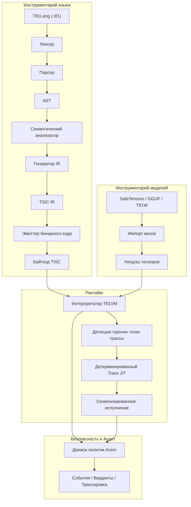

# Фонд T81🔥

<div align="center">

[](https://github.com/t81dev/t81-foundation/actions/workflows/ci.yml)
[](https://github.com/t81dev/t81-foundation/actions/workflows/ci.yml)
[](https://opensource.org/licenses/MIT)
[](https://en.cppreference.com/w/cpp/23)

[](/README.md)
[](/README.zh-CN.md)
[](/README.es.md)
[](/README.ru.md)
[-blueviolet?style=flat-square)](/README.pt-BR.md)

</div>

---


T81 — это детерминированный стек вычислений на базе троичной логики 🌐, включающий типы данных по основанию 81, набор инструкций TISC, T81VM, T81Lang, движок безопасности и оптимизации Axion, а также уровни рекурсивного познания. Система обеспечивает побитовую точность и проверяемость выполнения ⚡ для областей с интенсивными вычислениями — идеально подходит для верифицируемого ИИ, криптографии и научных расчетов.

> **Примечание о детерминизме чисел с плавающей запятой** ⚠️
> Трансцендентные функции (`sin`, `cos`, `tan`, `log`, `exp`, `sqrt`) используют детерминированный бэкенд `dmath` — побитовое соответствие гарантировано на всех платформах.
> Деление, а также обратные и гиперболические функции могут использовать поведение хоста в нестрогом режиме.
> Полный строгий детерминизм гарантирован для `T81Int`, `T81BigInt`, `T81Fraction` и основных арифметических операций `T81Float`. ✅

## Содержание 📑

* [Быстрый старт 🚀](https://www.google.com/search?q=%23%D0%B1%D1%8B%D1%81%D1%82%D1%80%D1%8B%D0%B9-%D1%81%D1%82%D0%B0%D1%80%D1%82-)
* [Возможности 🌟](https://www.google.com/search?q=%23%D0%B2%D0%BE%D0%B7%D0%BC%D0%BE%D0%B6%D0%BD%D0%BE%D1%81%D1%82%D0%B8-)
* [Почему троичная логика? 🧠](https://www.google.com/search?q=%23%D0%BF%D0%BE%D1%87%D0%B5%D0%BC%D1%83-%D1%82%D1%80%D0%BE%D0%B8%D1%87%D0%BD%D0%B0%D1%8F-%D0%BB%D0%BE%D0%B3%D0%B8%D0%BA%D0%B0-)
* [Архитектура 🏗️](https://www.google.com/search?q=%23%D0%B0%D1%80%D1%85%D0%B8%D1%82%D0%B5%D0%BA%D1%82%D1%83%D1%80%D0%B0-%EF%B8%8F)
* [Поддерживаемые платформы 🌍](https://www.google.com/search?q=%23%D0%BF%D0%BE%D0%B4%D0%B4%D0%B5%D1%80%D0%B6%D0%B8%D0%B2%D0%B0%D0%B5%D0%BC%D1%8B%D0%B5-%D0%BF%D0%BB%D0%B0%D1%82%D1%84%D0%BE%D1%80%D0%BC%D1%8B-)
* [Примеры CLI 🔧](https://www.google.com/search?q=%23%D0%BF%D1%80%D0%B8%D0%BC%D0%B5%D1%80%D1%8B-cli-)
* [Карта репозитория 📂](https://www.google.com/search?q=%23%D0%BA%D0%B0%D1%80%D1%82%D0%B0-%D1%80%D0%B5%D0%BF%D0%BE%D0%B7%D0%B8%D1%82%D0%BE%D1%80%D0%B8%D1%8F-)
* [Карта авторитетности документов 📜](https://www.google.com/search?q=%23%D0%BA%D0%B0%D1%80%D1%82%D0%B0-%D0%B0%D0%B2%D1%82%D0%BE%D1%80%D0%B8%D1%82%D0%B5%D1%82%D0%BD%D0%BE%D1%81%D1%82%D0%B8-%D0%B4%D0%BE%D0%BA%D1%83%D0%BC%D0%B5%D0%BD%D1%82%D0%BE%D0%B2-)
* [Гарантии совместимости 🔄](https://www.google.com/search?q=%23%D0%B3%D0%B0%D1%80%D0%B0%D0%BD%D1%82%D0%B8%D0%B8-%D1%81%D0%BE%D0%B2%D0%BC%D0%B5%D1%81%D1%82%D0%B8%D0%BC%D0%BE%D1%81%D1%82%D0%B8-)
* [Не-цели 🚫](https://www.google.com/search?q=%23%D0%BD%D0%B5-%D1%86%D0%B5%D0%BB%D0%B8-)
* [Граница рантайма 🔐](https://www.google.com/search?q=%23%D0%B3%D1%80%D0%B0%D0%BD%D0%B8%D1%86%D0%B0-%D1%80%D0%B0%D0%BD%D1%82%D0%B0%D0%B9%D0%BC%D0%B0-)
* [Дополнительное чтение 📖](https://www.google.com/search?q=%23%D0%B4%D0%BE%D0%BF%D0%BE%D0%BB%D0%BD%D0%B8%D1%82%D0%B5%D0%BB%D1%8C%D0%BD%D0%BE%D0%B5-%D1%87%D1%82%D0%B5%D0%BD%D0%B8%D0%B5-)
* [Техническая монография 📘](https://www.google.com/search?q=%23%D0%BE%D0%BF%D1%80%D0%B5%D0%B4%D0%B5%D0%BB%D1%8F%D1%8E%D1%89%D0%B0%D1%8F-%D1%82%D0%B5%D1%85%D0%BD%D0%B8%D1%87%D0%B5%D1%81%D0%BA%D0%B0%D1%8F-%D0%BC%D0%BE%D0%BD%D0%BE%D0%B3%D1%80%D0%B0%D1%84%D0%B8%D1%8F-)
* [Лицензия 📜](https://www.google.com/search?q=%23%D0%BB%D0%B8%D1%86%D0%B5%D0%BD%D0%B7%D0%B8%D1%8F)

## Быстрый старт 🚀⚡

Проверьте основные возможности менее чем за 30 секунд:

1. **Сборка и запуск Hello World** 🏃‍♂️
```bash
cmake -S . -B build -DCMAKE_BUILD_TYPE=Release && cmake --build build --parallel
./build/t81 compile examples/hello_world.t81 -o hello.tisc
./build/t81 run hello.tisc

```


2. **Запуск Determinism Gate** 🔄✅
```bash
python3 scripts/ci/t81lang_repro_gate.py --t81-bin build/t81 --check

```


3. **Демонстрация VM** ▶️🔥
```bash
./build/t81_demo

```


4. **Инспекция трассировки** 🔍📜
```bash
./build/t81 trace show trace.txt

```


## Возможности 🌟

| Возможность | Статус | Описание |
| --- | --- | --- |
| ✅ Детерминированное исполнение | Стабильно 🔥 | Побитовая воспроизводимость на разных платформах |
| ✅ Троичные типы данных | Стабильно 🌐 | Основание 81 с использованием сбалансированной троичной арифметики |
| ✅ Движок политик Axion | Стабильно 🔐 | Безопасность рантайма, оптимизация и соблюдение этических правил |
| ✅ T81VM | Стабильно ⚙️ | 81-регистровая виртуальная машина + детерминированный интерпретатор и trace-JIT |
| ✅ TISC IR | Стабильно 📡 | Промежуточное представление TISC (Ternary Instruction Set Computer) |
| ✅ Программно-заданная математика | Стабильно 🧮 | Согласованные на всех платформах числа с плавающей запятой (`dmath`) |
| 🚧 Trace-JIT компиляция | Эксперимент ⚡ | Трассировка "горячих точек" и детерминированный JIT |
| 🚧 Распределенные тензоры | Эксперимент 🌍 | Поддержка крупномасштабных распределенных тензоров |
| ✅ Инструментарий моделей | Стабильно 🤖 | Импорт SafeTensors / GGUF / T81W, квантование и инспекция |

## Почему троичная логика? 🧠🧮

Сбалансированная троичная логика (-1, 0, +1) и система счисления по основанию 81 исключают биты знака, упрощают сложение/вычитание (меньше переносов) и обеспечивают теоретические преимущества в плотности и энергоэффективности. Это особенно ценно в численных нагрузках (инференс ИИ, криптография, обработка сигналов).

T81 переносит эти преимущества в программное обеспечение, ставя в приоритет детерминизм и аудит выше «чистой» скорости. См. связанные аппаратные эксперименты в репозитории [ternary-memory-research](https://github.com/t81dev/ternary-memory-research) для метрик SKY130 PDK. 🔬

## Архитектура 🏗️



## Поддерживаемые платформы 🌍

| Платформа | Компилятор | Статус | Determinism Gate | Примечания |
| --- | --- | --- | --- | --- |
| Linux x86_64 | Clang 18+, GCC 14+ | ✅ Пройдено 🔥 | ✅ | Полный проход гейта |
| Linux ARM64 | Clang 18+ | ✅ Пройдено 🔥 | ✅ | Полный проход гейта |
| macOS x86_64 (Intel) | Apple Clang / GCC | ✅ Пройдено | ✅ | Работает нативно |
| macOS ARM64 (Apple Silicon) | Apple Clang | ✅ Пройдено | ✅ | Активное изучение (CMake/флаги) |

## Примеры CLI 🔧🔍

```bash
# Компиляция и запуск 🚀
t81 compile examples/hello_world.t81 -o hello.tisc
t81 run hello.tisc

# Отладка и инспекция 🕵️
t81 disasm hello.tisc
t81 debug hello.tisc
t81 trace show trace.txt
t81 repro-hash tests/fixtures/t81lang_determinism

# Инструментарий моделей 🤖
t81 weights import model.safetensors -o model.t81w
t81 weights quantize model.safetensors --to-gguf model.gguf

```

Полная справка: `t81 --help` или `t81 help <subcommand>` 📖

## Карта репозитория 📂

* `.github/`          → Воркфлоу и шаблоны 🛠️
* `benchmarks/`       → Замеры производительности 📈
* `docs/`             → Руководства, пояснения, справочники 📚
* `examples/`         → Примеры программ (файлы .t81) 🎯
* `include/t81/`      → Публичные заголовочные файлы 🧩
* `scripts/`          → Инструменты CI и гейты воспроизводимости 🔄
* `spec/`             → Нормативные спецификации 📜
* `src/`              → Основной исходный код (axion/, canonfs/, vm/ и т.д.) ⚙️
* `tests/`            → Юнит-, проперти- и интеграционные тесты 🧪
* `tools/`            → Утилиты и расширение для VSCode 🛠️

## Карта авторитетности документов 📜

| Документ | Цель | Статус |
| --- | --- | --- |
| spec/constitution.md | Основополагающие принципы | Нормативный 🔒 |
| spec/determinism-profile.md | Гарантии детерминизма | Нормативный ✅ |
| spec/t81-data-types.md | Спецификация типов и сериализации | Нормативный 🧮 |
| spec/tisc-spec.md | Система инструкций TISC | Нормативный 📡 |
| https://www.google.com/search?q=docs/index.md | Точка входа в документацию | Информационный 📖 |

## Гарантии совместимости 🔄

* **Стабильно:** Синтаксис T81Lang, формат TISC, основные семантики T81VM ✅
* **Экспериментально:** Trace-JIT, распределенные тензоры 🚧
* **SemVer:** Мажорное повышение версий при ломающих изменениях в стабильных компонентах ⚖️

## Не-цели 🚫

T81 — это **не**:

* аппаратный троичный ускоритель 🖥️
* замена общего назначения для C++/Python/Rust 🛑
* система, оптимизированная для максимальной пропускной способности в ущерб детерминизму ⚡❌

## Граница рантайма 🔐

Определена в спецификациях, таких как [spec/t81vm-spec.md](https://www.google.com/search?q=spec/t81vm-spec.md)

## Дополнительное чтение 📖

* [docs/index.md](https://www.google.com/search?q=docs/index.md)
* [spec/index.md](https://www.google.com/search?q=spec/index.md)
* [CONTRIBUTING.md](https://www.google.com/search?q=CONTRIBUTING.md)
* [SECURITY.md](https://www.google.com/search?q=SECURITY.md)

---

## 📘 Определяющая техническая монография

Для получения исчерпывающего описания архитектуры на уровне спецификации — включая формальную семантику, инварианты детерминизма, состязательное моделирование и проектирование долгосрочной непрерывности — см.:

➡️ **[T81 Foundation — Определяющая техническая монография](https://www.google.com/search?q=book/README.md)**

**Пути чтения:**

* **Впервые знакомитесь с T81?** → Начните с Части I, затем Часть II.
* **Разработчик/Имплементатор?** → Сосредоточьтесь на Частях II и III.
* **Аудитор?** → Внимательно изучите Части III и IV.
* **Исследователь?** → Уделите внимание Частям IV и V.
* **Долгосрочный сопровождающий?** → Части IV и V критически важны.

<details>
<summary><strong>Часть I — Основы</strong></summary>

1. **[Введение](https://www.google.com/search?q=book/01_Introduction.md)**
* [1.1 Область применения и определение](https://www.google.com/search?q=book/01_Introduction.md%2311-scope-and-definition)
* [1.2 Архитектура системы](https://www.google.com/search?q=book/01_Introduction.md%2312-system-architecture)
* [1.3 Миссия верифицируемых вычислений](https://www.google.com/search?q=book/01_Introduction.md%2313-verifiable-compute-mission)


2. **[Основные принципы и инварианты](https://www.google.com/search?q=book/02_Core_Principles_and_Invariants.md)**
* [2.1 Инвариант детерминизма](https://www.google.com/search?q=book/02_Core_Principles_and_Invariants.md%2321-the-determinism-invariant)
* [2.1.1 Поверхности детерминизма и векторы атак](https://www.google.com/search?q=book/02_Core_Principles_and_Invariants.md%23211-determinism-surfaces-and-attack-vectors)
* [2.2 Троичная логика (Основание-3)](https://www.google.com/search?q=book/02_Core_Principles_and_Invariants.md%2322-ternary-logic-base-3)
* [2.3 Аудируемость и трассировка Axion](https://www.google.com/search?q=book/02_Core_Principles_and_Invariants.md%2323-auditability-and-the-axion-trace)
* [2.4 Девять принципов (Этический контроль)](https://www.google.com/search?q=book/02_Core_Principles_and_Invariants.md%2324-the-nine-principles-ethics-enforcement)


</details>

<details>
<summary><strong>Часть II — Детерминированная машина</strong></summary>

3. **[Архитектура T81VM](https://www.google.com/search?q=book/03_T81VM_Architecture.md)**
* [3.1 Формальный конечный автомат](https://www.google.com/search?q=book/03_T81VM_Architecture.md%2331-formal-state-machine)
* [3.1.1 Определение состояния](https://www.google.com/search?q=book/03_T81VM_Architecture.md%23311-state-definition)
* [3.2 Схема памяти](https://www.google.com/search?q=book/03_T81VM_Architecture.md%2332-memory-layout)
* [3.3 Регистровый файл](https://www.google.com/search?q=book/03_T81VM_Architecture.md%2333-register-file)
* [3.4 Архитектура набора инструкций TISC (ISA)](https://www.google.com/search?q=book/03_T81VM_Architecture.md%2334-tisc-instruction-set-architecture-isa)
* [3.5 Семантика сбоев](https://www.google.com/search?q=book/03_T81VM_Architecture.md%2335-fault-semantics)
* [3.6 Сборка мусора](https://www.google.com/search?q=book/03_T81VM_Architecture.md%2336-garbage-collection)


4. **[Типы данных и каноническая сериализация](https://www.google.com/search?q=book/04_Data_Types_and_Canonical_Serialization.md)**
* [4.1 Примитивные типы](https://www.google.com/search?q=book/04_Data_Types_and_Canonical_Serialization.md%2341-primitive-types)
* [4.2 T81Float и dmath](https://www.google.com/search?q=book/04_Data_Types_and_Canonical_Serialization.md%2342-t81float-and-dmath)
* [4.3 Тензоры и канонические макеты](https://www.google.com/search?q=book/04_Data_Types_and_Canonical_Serialization.md%2343-tensors-and-canonical-layouts)
* [4.4 Правила канонической сериализации](https://www.google.com/search?q=book/04_Data_Types_and_Canonical_Serialization.md%2344-canonical-serialization-rules)


5. **[Установка и верификация сборки](https://www.google.com/search?q=book/05_Installation_and_Build_Verification.md)**
* [5.1 Системные требования](https://www.google.com/search?q=book/05_Installation_and_Build_Verification.md%2351-prerequisites)
* [5.2 Сборка из исходного кода](https://www.google.com/search?q=book/05_Installation_and_Build_Verification.md%2352-building-from-source)
* [5.3 Верификация сборки](https://www.google.com/search?q=book/05_Installation_and_Build_Verification.md%2353-verifying-the-build)


6. **[Использование CLI и API](https://www.google.com/search?q=book/06_CLI_and_API_Usage.md)**
* [6.1 Интерфейс командной строки](https://www.google.com/search?q=book/06_CLI_and_API_Usage.md%2361-the-t81-command-line-interface)
* [6.2 Встраивание T81 (C++ API)](https://www.google.com/search?q=book/06_CLI_and_API_Usage.md%2362-embedding-t81-c-api)
* [6.3 Встраивание T81 (Python API)](https://www.google.com/search?q=book/06_CLI_and_API_Usage.md%2363-embedding-t81-python-api)
* [6.4 Отладка](https://www.google.com/search?q=book/06_CLI_and_API_Usage.md%2364-debugging)


</details>

<details>
<summary><strong>Часть III — Управление и верификация</strong></summary>

7. **[Верификация и аудит](https://www.google.com/search?q=book/07_Verification_and_Audit.md)**
* [7.1 Методология формальной верификации](https://www.google.com/search?q=book/07_Verification_and_Audit.md%2371-formal-verification-methodology)
* [7.2 Формальная матрица аудита](https://www.google.com/search?q=book/07_Verification_and_Audit.md%2372-the-formal-audit-matrix)
* [7.3 Тестирование на основе свойств](https://www.google.com/search?q=book/07_Verification_and_Audit.md%2373-property-based-testing)
* [7.4 Гейт детерминизма (The Determinism Gate)](https://www.google.com/search?q=book/07_Verification_and_Audit.md%2374-the-determinism-gate)


8. **[Ядро безопасности Axion](https://www.google.com/search?q=book/08_The_Axion_Safety_Kernel.md)**
* [8.1 Формальное определение](https://www.google.com/search?q=book/08_The_Axion_Safety_Kernel.md%2381-formal-definition)
* [8.2 Модель политик](https://www.google.com/search?q=book/08_The_Axion_Safety_Kernel.md%2382-the-policy-model)
* [8.3 Перехват инструкций](https://www.google.com/search?q=book/08_The_Axion_Safety_Kernel.md%2383-instruction-interception)
* [8.4 Журнал аудита (Trace)](https://www.google.com/search?q=book/08_The_Axion_Safety_Kernel.md%2384-the-audit-log-trace)
* [8.5 Когнитивное продвижение](https://www.google.com/search?q=book/08_The_Axion_Safety_Kernel.md%2385-cognitive-promotion)


9. **[Когнитивные уровни и распределенные вычисления](https://www.google.com/search?q=book/09_Cognitive_Tiers_and_Distributed_Compute.md)**
* [9.1 Модель когнитивных уровней](https://www.google.com/search?q=book/09_Cognitive_Tiers_and_Distributed_Compute.md%2391-the-cognitive-tier-model)
* [9.2 Распределенные вычисления (Уровень 4)](https://www.google.com/search?q=book/09_Cognitive_Tiers_and_Distributed_Compute.md%2392-distributed-compute-tier-4)
* [9.3 Трассировочная JIT-компиляция](https://www.google.com/search?q=book/09_Cognitive_Tiers_and_Distributed_Compute.md%2393-trace-based-jit-compilation)
* [9.4 Бесконечные формы (Уровень 5)](https://www.google.com/search?q=book/09_Cognitive_Tiers_and_Distributed_Compute.md%2394-infinite-forms-tier-5)


10. **[Приложения](https://www.google.com/search?q=book/10_Appendices.md)**

* [10.1 Что еще не реализовано](https://www.google.com/search?q=book/10_Appendices.md%23101-what-is-not-yet-implemented)
* [10.2 Модель угроз и поверхность атак на детерминизм](https://www.google.com/search?q=book/10_Appendices.md%23102-threat-model-and-determinism-attack-surface)
* [10.3 Глоссарий](https://www.google.com/search?q=book/10_Appendices.md%23103-glossary)

</details>

<details>
<summary><strong>Часть IV — Формализация и структурное укрепление</strong></summary>

11. **[Формальная семантика TISC и T81VM](https://www.google.com/search?q=book/11_Formal_Semantics.md)**

* [Денотационная семантика TISC](https://www.google.com/search?q=book/11_Formal_Semantics.md%23denotational-semantics-of-tisc)
* [Алгебраическая функция перехода δ](https://www.google.com/search?q=book/11_Formal_Semantics.md%23algebraic-transition-function-%CE%B4)
* [Система перезаписи канонизации](https://www.google.com/search?q=book/11_Formal_Semantics.md%23canonicalization-rewriting-system)
* [Наброски доказательств детерминизма](https://www.google.com/search?q=book/11_Formal_Semantics.md%23determinism-proof-sketches)
* [Эквивалентность интерпретатора и Trace-JIT](https://www.google.com/search?q=book/11_Formal_Semantics.md%23interpreter-vs-trace-jit-equivalence)

12. **[Состязательное моделирование и атаки на детерминизм](https://www.google.com/search?q=book/12_Adversarial_Modeling.md)**

* [Атаки на уровне компилятора](https://www.google.com/search?q=book/12_Adversarial_Modeling.md%23compiler-level-attacks)
* [Векторы атак на VM и GC](https://www.google.com/search?q=book/12_Adversarial_Modeling.md%23vm-and-gc-attack-vectors)
* [Атаки на CanonFS и хэширование](https://www.google.com/search?q=book/12_Adversarial_Modeling.md%23canonfs-and-hash-attacks)
* [Атака «путешествие во времени» в распределенном уровне](https://www.google.com/search?q=book/12_Adversarial_Modeling.md%23distributed-tier-time-travel-attack)
* [Шаблон постмортема нарушения детерминизма](https://www.google.com/search?q=book/12_Adversarial_Modeling.md%23determinism-breach-postmortem-template)

</details>

<details>
<summary><strong>Часть V — Непрерывность и исследовательские горизонты</strong></summary>

13. **[Непрерывность и устойчивость](https://www.google.com/search?q=book/13_Continuity_Resilience.md)**

* [Протокол реконструкции в «чистой комнате»](https://www.google.com/search?q=book/13_Continuity_Resilience.md%23cleanroom-reconstruction-protocol)
* [Единые точки отказа](https://www.google.com/search?q=book/13_Continuity_Resilience.md%23single-points-of-failure)
* [Манифест непрерывности](https://www.google.com/search?q=book/13_Continuity_Resilience.md%23continuity-manifest)
* [Неизменяемые формальные инварианты](https://www.google.com/search?q=book/13_Continuity_Resilience.md%23immutable-formal-invariants)

14. **[Исследовательский фронтир](https://www.google.com/search?q=book/14_Research_Frontier.md)**

* [Троичное аппаратное ускорение](https://www.google.com/search?q=book/14_Research_Frontier.md%23ternary-hardware-acceleration)
* [Пути формальной верификации](https://www.google.com/search?q=book/14_Research_Frontier.md%23formal-verification-paths)
* [CanonFS как субстрат Меркла](https://www.google.com/search?q=book/14_Research_Frontier.md%23canonfs-as-a-merkle-substrate)
* [Детерминированный инференс ИИ в масштабе](https://www.google.com/search?q=book/14_Research_Frontier.md%23deterministic-ai-inference-at-scale)

</details>

---

## Лицензия

Лицензия MIT — см. [LICENSE](https://www.google.com/search?q=LICENSE).
