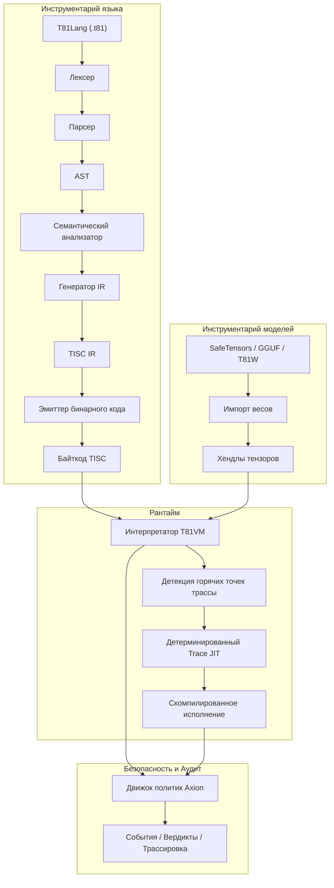

# Фонд T81🔥

<div align="center">

[](https://github.com/t81dev/t81-foundation/actions/workflows/ci.yml)
[](https://github.com/t81dev/t81-foundation/actions/workflows/ci.yml)
[](https://opensource.org/licenses/MIT)
[](https://en.cppreference.com/w/cpp/23)

[](/README.md)
[](/README.zh-CN.md)
[](/README.es.md)
[](/README.ru.md)
[-blueviolet?style=flat-square)](/README.pt-BR.md)

</div>

---


T81 — это детерминированный стек вычислений на базе троичной логики 🌐, включающий типы данных по основанию 81, набор инструкций TISC, T81VM, T81Lang, движок безопасности и оптимизации Axion, а также уровни рекурсивного познания. Система обеспечивает побитовую точность и проверяемость выполнения ⚡ для областей с интенсивными вычислениями — идеально подходит для верифицируемого ИИ, криптографии и научных расчетов.

> **Примечание о детерминизме чисел с плавающей запятой** ⚠️
> Трансцендентные функции (`sin`, `cos`, `tan`, `log`, `exp`, `sqrt`) используют детерминированный бэкенд `dmath` — побитовое соответствие гарантировано на всех платформах.
> Деление, а также обратные и гиперболические функции могут использовать поведение хоста в нестрогом режиме.
> Полный строгий детерминизм гарантирован для `T81Int`, `T81BigInt`, `T81Fraction` и основных арифметических операций `T81Float`. ✅

## Содержание 📑

* [Быстрый старт 🚀](#быстрый-старт-)
* [Возможности 🌟](#возможности-)
* [Почему троичная логика? 🧠](#почему-троичная-логика-)
* [Архитектура 🏗️](#архитектура-️)
* [Поддерживаемые платформы 🌍](#поддерживаемые-платформы-)
* [Примеры CLI 🔧](#примеры-cli-)
* [Карта репозитория 📂](#карта-репозитория-)
* [Карта авторитетности документов 📜](#карта-авторитетности-документов-)
* [Гарантии совместимости 🔄](#гарантии-совместимости-)
* [Не-цели 🚫](#не-цели-)
* [Граница рантайма 🔐](#граница-рантайма-)
* [Дополнительное чтение 📖](#дополнительное-чтение-)
* [Техническая монография 📘](#определяющая-техническая-монография)
* [Лицензия 📜](#лицензия)

## Быстрый старт 🚀⚡

Проверьте основные возможности менее чем за 30 секунд:

1. **Сборка и запуск Hello World** 🏃‍♂️
```bash
cmake -S . -B build -DCMAKE_BUILD_TYPE=Release && cmake --build build --parallel
./build/t81 compile examples/hello_world.t81 -o hello.tisc
./build/t81 run hello.tisc
```

2. **Запуск Determinism Gate** 🔄✅
```bash
python3 scripts/ci/t81lang_repro_gate.py --t81-bin build/t81 --check
```

3. **Демонстрация VM** ▶️🔥
```bash
./build/t81_demo
```

4. **Инспекция трассировки** 🔍📜
```bash
./build/t81 trace show trace.txt
```

## Возможности 🌟

| Возможность | Статус | Описание |
| --- | --- | --- |
| ✅ Детерминированное исполнение | Стабильно 🔥 | Побитовая воспроизводимость на разных платформах |
| ✅ Троичные типы данных | Стабильно 🌐 | Основание 81 с использованием сбалансированной троичной арифметики |
| ✅ Движок политик Axion | Стабильно 🔐 | Безопасность рантайма, оптимизация и соблюдение этических правил |
| ✅ T81VM | Стабильно ⚙️ | 81-регистровая виртуальная машина + детерминированный интерпретатор и trace-JIT |
| ✅ TISC IR | Стабильно 📡 | Промежуточное представление TISC (Ternary Instruction Set Computer) |
| ✅ Программно-заданная математика | Стабильно 🧮 | Согласованные на всех платформах числа с плавающей запятой (`dmath`) |
| 🚧 Trace-JIT компиляция | Эксперимент ⚡ | Трассировка "горячих точек" и детерминированный JIT |
| 🚧 Распределенные тензоры | Эксперимент 🌍 | Поддержка крупномасштабных распределенных тензоров |
| ✅ Инструментарий моделей | Стабильно 🤖 | Импорт SafeTensors / GGUF / T81W, квантование и инспекция |

## Почему троичная логика? 🧠🧮

Сбалансированная троичная логика (-1, 0, +1) и система счисления по основанию 81 исключают биты знака, упрощают сложение/вычитание (меньше переносов) и обеспечивают теоретические преимущества в плотности и энергоэффективности. Это особенно ценно в численных нагрузках (инференс ИИ, криптография, обработка сигналов).

T81 переносит эти преимущества в программное обеспечение, ставя в приоритет детерминизм и аудит выше «чистой» скорости. См. связанные аппаратные эксперименты в репозитории [ternary-memory-research](https://github.com/t81dev/ternary-memory-research) для метрик SKY130 PDK. 🔬

## Архитектура 🏗️



## Поддерживаемые платформы 🌍

| Платформа | Компилятор | Статус | Determinism Gate | Примечания |
| --- | --- | --- | --- | --- |
| Linux x86_64 | Clang 18+, GCC 14+ | ✅ Пройдено 🔥 | ✅ | Полный проход гейта |
| Linux ARM64 | Clang 18+ | ✅ Пройдено 🔥 | ✅ | Полный проход гейта |
| macOS x86_64 (Intel) | Apple Clang / GCC | ✅ Пройдено | ✅ | Работает нативно |
| macOS ARM64 (Apple Silicon) | Apple Clang | ✅ Пройдено | ✅ | Активное изучение (CMake/флаги) |

## Примеры CLI 🔧🔍

```bash
# Компиляция и запуск 🚀
t81 compile examples/hello_world.t81 -o hello.tisc
t81 run hello.tisc

# Отладка и инспекция 🕵️
t81 disasm hello.tisc
t81 debug hello.tisc
t81 trace show trace.txt
t81 repro-hash tests/fixtures/t81lang_determinism

# Инструментарий моделей 🤖
t81 weights import model.safetensors -o model.t81w
t81 weights quantize model.safetensors --to-gguf model.gguf
```

Полная справка: `t81 --help` или `t81 help <subcommand>` 📖

## Карта репозитория 📂

* `.github/`          → Воркфлоу и шаблоны 🛠️
* `benchmarks/`       → Замеры производительности 📈
* `docs/`             → Руководства, пояснения, справочники 📚
* `examples/`         → Примеры программ (файлы .t81) 🎯
* `include/t81/`      → Публичные заголовочные файлы 🧩
* `scripts/`          → Инструменты CI и гейты воспроизводимости 🔄
* `spec/`             → Нормативные спецификации 📜
* `src/`              → Основной исходный код (axion/, canonfs/, vm/ и т.д.) ⚙️
* `tests/`            → Юнит-, проперти- и интеграционные тесты 🧪
* `tools/`            → Утилиты и расширение для VSCode 🛠️

## Карта авторитетности документов 📜

| Документ | Цель | Статус |
| --- | --- | --- |
| spec/constitution.md | Основополагающие принципы | Нормативный 🔒 |
| spec/determinism-profile.md | Гарантии детерминизма | Нормативный ✅ |
| spec/t81-data-types.md | Спецификация типов и сериализации | Нормативный 🧮 |
| spec/tisc-spec.md | Система инструкций TISC | Нормативный 📡 |
| docs/index.md | Точка входа в документацию | Информационный 📖 |

## Гарантии совместимости 🔄

* **Стабильно:** Синтаксис T81Lang, формат TISC, основные семантики T81VM ✅
* **Экспериментально:** Trace-JIT, распределенные тензоры 🚧
* **SemVer:** Мажорное повышение версий при ломающих изменениях в стабильных компонентах ⚖️

## Не-цели 🚫

T81 — это **не**:

* аппаратный троичный ускоритель 🖥️
* замена общего назначения для C++/Python/Rust 🛑
* система, оптимизированная для максимальной пропускной способности в ущерб детерминизму ⚡❌

## Граница рантайма 🔐

Определена в спецификациях, таких как [spec/t81vm-spec.md](spec/t81vm-spec.md)

## Дополнительное чтение 📖

* [docs/index.md](docs/index.md)
* [spec/index.md](spec/index.md)
* [CONTRIBUTING.md](CONTRIBUTING.md)
* [SECURITY.md](SECURITY.md)

---

## 📘 Определяющая техническая монография

Для получения исчерпывающего описания архитектуры на уровне спецификации — включая формальную семантику, инварианты детерминизма, состязательное моделирование и проектирование долгосрочной непрерывности — см.:

➡️ **[T81 Foundation — Определяющая техническая монография](book-ru/README.md)**

**Пути чтения:**

* **Впервые знакомитесь с T81?** → Начните с Части I, затем Часть II.
* **Разработчик/Имплементатор?** → Сосредоточьтесь на Частях II и III.
* **Аудитор?** → Внимательно изучите Части III и IV.
* **Исследователь?** → Уделите внимание Частям IV и V.
* **Долгосрочный сопровождающий?** → Части IV и V критически важны.

<details>
<summary><strong>Часть I — Основы</strong></summary>

1. **[Введение](book-ru/01_Введение.md)**
* [1.1 Область применения и определение](book-ru/01_Введение.md#11-область-применения-и-определение)
* [1.2 Архитектура системы](book-ru/01_Введение.md#12-архитектура-системы)
* [1.3 Миссия верифицируемых вычислений](book-ru/01_Введение.md#13-миссия-верифицируемых-вычислений)


2. **[Основные принципы и инварианты](book-ru/02_Принципы.md)**
* [2.1 Инвариант детерминизма](book-ru/02_Принципы.md#21-инвариант-детерминизма)
* [2.1.1 Поверхности детерминизма и векторы атак](book-ru/02_Принципы.md#211-поверхности-детерминизма-и-векторы-атак)
* [2.2 Троичная логика (Основание-3)](book-ru/02_Принципы.md#22-троичная-логика-основание-3)
* [2.3 Аудируемость и трассировка Axion](book-ru/02_Принципы.md#23-аудируемость-и-трассировка-axion)
* [2.4 Девять принципов (Этический контроль)](book-ru/02_Принципы.md#24-девять-принципов-этический-контроль)

</details>

<details>
<summary><strong>Часть II — Детерминированная машина</strong></summary>

3. **[Архитектура T81VM](book-ru/03_Архитектура.md)**
* [3.1 Формальный конечный автомат](book-ru/03_Архитектура.md#31-обзор)
* [3.1.1 Определение состояния](book-ru/03_Архитектура.md#31-обзор)
* [3.2 Схема памяти](book-ru/03_Архитектура.md#33-модель-памяти)
* [3.3 Регистровый файл](book-ru/03_Архитектура.md#33-модель-памяти)
* [3.4 Архитектура набора инструкций TISC (ISA)](book-ru/03_Архитектура.md#34-набор-инструкций-tisc)
* [3.5 Семантика сбоев](book-ru/03_Архитектура.md#32-граница-рантайма)
* [3.6 Сборка мусора](book-ru/03_Архитектура.md#33-модель-памяти)


4. **[Типы данных и каноническая сериализация](book-ru/04_Типы_Данных_и_Сериализация.md)**
* [4.1 Примитивные типы](book-ru/04_Типы_Данных_и_Сериализация.md#41-примитивные-типы)
* [4.2 T81Float и dmath](book-ru/04_Типы_Данных_и_Сериализация.md#42-t81float-и-dmath)
* [4.3 Тензоры и канонические макеты](book-ru/04_Типы_Данных_и_Сериализация.md#43-тензоры-и-канонические-макеты)
* [4.4 Правила канонической сериализации](book-ru/04_Типы_Данных_и_Сериализация.md#44-правила-канонической-сериализации)


5. **[Установка и верификация сборки](book-ru/05_Установка.md)**
* [5.1 Системные требования](book-ru/05_Установка.md#51-требования)
* [5.2 Сборка из исходного кода](book-ru/05_Установка.md#52-процедура-сборки)
* [5.3 Верификация сборки](book-ru/05_Установка.md#53-верификация-сборки)


6. **[Использование CLI и API](book-ru/06_Использование.md)**
* [6.1 Интерфейс командной строки](book-ru/06_Использование.md#61-единый-интерфейс-командной-строки-cli)
* [6.2 Встраивание T81 (C++ API)](book-ru/06_Использование.md#61-единый-интерфейс-командной-строки-cli)
* [6.3 Встраивание T81 (Python API)](book-ru/06_Использование.md#61-единый-интерфейс-командной-строки-cli)
* [6.4 Отладка](book-ru/06_Использование.md#612-отладка-и-инспекция)

</details>

<details>
<summary><strong>Часть III — Управление и верификация</strong></summary>

7. **[Верификация и аудит](book-ru/07_Верификация_и_Аудит.md)**
* [7.1 Методология формальной верификации](book-ru/07_Верификация_и_Аудит.md#71-стек-верификации)
* [7.2 Формальная матрица аудита](book-ru/07_Верификация_и_Аудит.md#71-стек-верификации)
* [7.3 Тестирование на основе свойств](book-ru/07_Верификация_и_Аудит.md#71-стек-верификации)
* [7.4 Гейт детерминизма](book-ru/07_Верификация_и_Аудит.md#72-гейт-детерминизма)


8. **[Ядро безопасности Axion](book-ru/08_Ядро_Axion.md)**
* [8.1 Формальное определение](book-ru/08_Ядро_Axion.md#81-формальное-определение)
* [8.2 Модель политик](book-ru/08_Ядро_Axion.md#82-модель-политик)
* [8.3 Перехват инструкций](book-ru/08_Ядро_Axion.md#83-перехват-инструкций)
* [8.4 Журнал аудита (Трасса)](book-ru/08_Ядро_Axion.md#84-журнал-аудита-трасса)
* [8.5 Когнитивное продвижение](book-ru/08_Ядро_Axion.md#85-когнитивное-продвижение)


9. **[Когнитивные уровни и распределенные вычисления](book-ru/09_Когнитивные_Уровни_и_Распределенные_Вычисления.md)**
* [9.1 Модель когнитивных уровней](book-ru/09_Когнитивные_Уровни_и_Распределенные_Вычисления.md#91-модель-когнитивных-уровней)
* [9.2 Распределенные вычисления (Уровень 4)](book-ru/09_Когнитивные_Уровни_и_Распределенные_Вычисления.md#92-распределенные-вычисления-уровень-4)
* [9.3 Trace-Based JIT-компиляция](book-ru/09_Когнитивные_Уровни_и_Распределенные_Вычисления.md#92-распределенные-вычисления-уровень-4)
* [9.4 Бесконечные формы (Уровень 5)](book-ru/09_Когнитивные_Уровни_и_Распределенные_Вычисления.md#93-бесконечные-формы-уровень-5)


10. **[Приложения](book-ru/10_Приложения.md)**

* [10.1 Что еще не реализовано](book-ru/10_Приложения.md#101-что-еще-не-реализовано)
* [10.2 Модель угроз и поверхность атак на детерминизм](book-ru/10_Приложения.md#101-что-еще-не-реализовано)
* [10.3 Глоссарий](book-ru/10_Приложения.md#103-полезные-ссылки)

</details>

<details>
<summary><strong>Часть IV — Формализация и структурное укрепление</strong></summary>

11. **[Формальная семантика TISC и T81VM](book-ru/11_Формальная_Семантика.md)**

* [Денотационная семантика TISC](book-ru/11_Формальная_Семантика.md#111-операционная-семантика)
* [Алгебраическая функция перехода δ](book-ru/11_Формальная_Семантика.md#1111-функция-перехода)
* [Система перезаписи канонизации](book-ru/11_Формальная_Семантика.md#111-операционная-семантика)
* [Наброски доказательств детерминизма](book-ru/11_Формальная_Семантика.md#1111-функция-перехода)
* [Эквивалентность интерпретатора и Trace-JIT](book-ru/11_Формальная_Семантика.md#1111-функция-перехода)

12. **[Состязательное моделирование и атаки на детерминизм](book-ru/12_Состязательное_Моделирование.md)**

* [Атаки на уровне компилятора](book-ru/12_Состязательное_Моделирование.md#121-модель-угроз)
* [Векторы атак на VM и GC](book-ru/12_Состязательное_Моделирование.md#121-модель-угроз)
* [Атаки на CanonFS и хэширование](book-ru/12_Состязательное_Моделирование.md#121-модель-угроз)
* [Атака «путешествие во времени» в распределенном уровне](book-ru/12_Состязательное_Моделирование.md#1212-атаки-с-путешествием-во-времени)
* [Шаблон постмортема нарушения детерминизма](book-ru/12_Состязательное_Моделирование.md#121-модель-угроз)

</details>

<details>
<summary><strong>Часть V — Непрерывность и исследовательские горизонты</strong></summary>

13. **[Непрерывность и устойчивость](book-ru/13_Непрерывность_и_Устойчивость.md)**

* [Протокол реконструкции в «чистой комнате»](book-ru/13_Непрерывность_и_Устойчивость.md#131-протокол-чистой-комнаты)
* [Единые точки отказа](book-ru/13_Непрерывность_и_Устойчивость.md#131-протокол-чистой-комнаты)
* [Манифест непрерывности](book-ru/13_Непрерывность_и_Устойчивость.md#131-протокол-чистой-комнаты)
* [Неизменяемые формальные инварианты](book-ru/13_Непрерывность_и_Устойчивость.md#132-долгосрочное-архивирование)

14. **[Исследовательский фронтир](book-ru/14_Исследовательский_Фронтир.md)**

* [Троичное аппаратное ускорение](book-ru/14_Исследовательский_Фронтир.md)
* [Пути формальной верификации](book-ru/14_Исследовательский_Фронтир.md)
* [CanonFS как субстрат Меркла](book-ru/14_Исследовательский_Фронтир.md)
* [Детерминированный инференс ИИ в масштабе](book-ru/14_Исследовательский_Фронтир.md)

</details>

---

## Лицензия

Лицензия MIT — см. [LICENSE](LICENSE).
