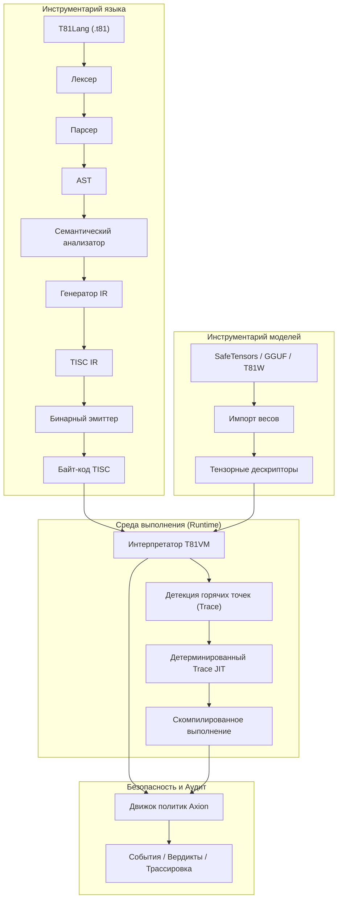

# T81 Foundation

<p align="center">
  <a href="https://github.com/t81dev/t81-foundation/stargazers"></a>
  <a href="https://github.com/t81dev/t81-foundation/network/members"></a>
  <a href="https://github.com/t81dev/t81-foundation/actions/workflows/ci.yml"></a>
  <a href="https://github.com/t81dev/t81-foundation/commits/main"></a>
  <a href="https://opensource.org/licenses/MIT"></a>
  <a href="https://en.cppreference.com/w/cpp/23"></a>
</p>

<p align="center">
  <a href="README.md"></a>
  <a href="README.zh-CN.md"></a>
  <a href="README.es.md"></a>
  <a href="README.ru.md"></a>
  <a href="README.pt-BR.md"></a>
</p>

---

T81 — это суверенный вычислительный стек, разработанный для устранения недетерминизма чисел с плавающей запятой и обеспечения полностью проверяемого выполнения. Используя **сбалансированную троичную логику** и **типы данных в системе счисления base-81**, T81 гарантирует **побитовую воспроизводимость** на всех поддерживаемых архитектурах (x86/ARM, macOS/Linux). Система включает в себя **T81VM**, движок безопасности **Axion** и систему рекурсивных уровней для масштабирования от простой символьной логики до распределенных бесконечных форм.

> 💡 **Почему это важно:** В области безопасности ИИ, финансового моделирования и криптографии точности «почти всегда» недостаточно. T81 обеспечивает математическую уверенность в том, что ваш код выполняется абсолютно одинаково везде и всегда.

## Содержание

* [Особенности](https://www.google.com/search?q=%23%D0%BE%D1%81%D0%BE%D0%B1%D0%B5%D0%BD%D0%BD%D0%BE%D1%81%D1%82%D0%B8)
* [Архитектура](https://www.google.com/search?q=%23%D0%B0%D1%80%D1%85%D0%B8%D1%82%D0%B5%D0%BA%D1%82%D1%83%D1%80%D0%B0)
* [Быстрый старт](https://www.google.com/search?q=%23%D0%B1%D1%8B%D1%81%D1%82%D1%80%D1%8B%D0%B9-%D1%81%D1%82%D0%B0%D1%80%D1%82)
* [Поддерживаемые платформы](https://www.google.com/search?q=%23%D0%BF%D0%BE%D0%B4%D0%B4%D0%B5%D1%80%D0%B6%D0%B8%D0%B2%D0%B0%D0%B5%D0%BC%D1%8B%D0%B5-%D0%BF%D0%BB%D0%B0%D1%82%D1%84%D0%BE%D1%80%D0%BC%D1%8B)
* [Примеры CLI](https://www.google.com/search?q=%23%D0%BF%D1%80%D0%B8%D0%BC%D0%B5%D1%80%D1%8B-cli)
* [Скриншоты и демо](https://www.google.com/search?q=%23%D1%81%D0%BA%D1%80%D0%B8%D0%BD%D1%88%D0%BE%D1%82%D1%8B-%D0%B8-%D0%B4%D0%B5%D0%BC%D0%BE)
* [Карта репозитория](https://www.google.com/search?q=%23%D0%BA%D0%B0%D1%80%D1%82%D0%B0-%D1%80%D0%B5%D0%BF%D0%BE%D0%B7%D0%B8%D1%82%D0%BE%D1%80%D0%B8%D1%8F)
* [Карта официальной документации](https://www.google.com/search?q=%23%D0%BA%D0%B0%D1%80%D1%82%D0%B0-%D0%BE%D1%84%D0%B8%D1%86%D0%B8%D0%B0%D0%BB%D1%8C%D0%BD%D0%BE%D0%B9-%D0%B4%D0%BE%D0%BA%D1%83%D0%BC%D0%B5%D0%BD%D1%82%D0%B0%D1%86%D0%B8%D0%B8)
* [Совместимость и не-цели](https://www.google.com/search?q=%23%D1%81%D0%BE%D0%B2%D0%BC%D0%B5%D1%81%D1%82%D0%B8%D0%BC%D0%BE%D1%81%D1%82%D1%8C-%D0%B8-%D0%BD%D0%B5-%D1%86%D0%B5%D0%BB%D0%B8)
* [Конфигурация и Axion](https://www.google.com/search?q=%23%D0%BA%D0%BE%D0%BD%D1%84%D0%B8%D0%B3%D1%83%D1%80%D0%B0%D1%86%D0%B8%D1%8F-%D0%B8-axion)
* [Участие в разработке](https://www.google.com/search?q=%23%D1%83%D1%87%D0%B0%D1%81%D1%82%D0%B8%D0%B5-%D0%B2-%D1%80%D0%B0%D0%B7%D1%80%D0%B0%D0%B1%D0%BE%D1%82%D0%BA%D0%B5)
* [Список изменений](https://www.google.com/search?q=%23%D1%81%D0%BF%D0%B8%D1%81%D0%BE%D0%BA-%D0%B8%D0%B7%D0%BC%D0%B5%D0%BD%D0%B5%D0%BD%D0%B8%D0%B9)
* [Благодарности](https://www.google.com/search?q=%23%D0%B1%D0%BB%D0%B0%D0%B3%D0%BE%D0%B4%D0%B0%D1%80%D0%BD%D0%BE%D1%81%D1%82%D0%B8)
* [Лицензия](https://www.google.com/search?q=%23%D0%BB%D0%B8%D1%86%D0%B5%D0%BD%D0%B7%D0%B8%D1%8F)

## Особенности

| Особенность | Статус | Описание |
| --- | --- | --- |
| **Детерминированное выполнение** | ✨ Стабильно | Побитово точные результаты на x86/ARM/Apple Silicon через `dmath` и кастомные FP. |
| **Тернарно-нативные типы** | ✨ Стабильно | Сбалансированные троичные целые и числа с плавающей запятой base-81 (без знакового бита, уменьшенный перенос). |
| **T81VM и TISC** | ✨ Стабильно | 81-регистровая виртуальная машина с детерминированным интерпретатором и Trace-JIT. |
| **Движок Axion** | ✨ Стабильно | Среда выполнения политик безопасности, этики и оптимизации с аудиторскими логами. |
| **Инструментарий моделей** | ✨ Стабильно | Импорт/инспекция SafeTensors, GGUF, T81W; поддержка квантования. |
| **Шлюз воспроизводимости** | ✨ Стабильно | `t81lang_repro_gate.py` в CI гарантирует 100% детерминизм. |
| **Когнитивные уровни** | 🚧 Бета | Уровни рекурсивного выполнения (Символьный → Распределенный → Бесконечный). |
| **Trace-JIT** | 🚧 Экспер. | Оптимизация «горячих» участков с сохранением строгого детерминизма. |
| **Многоязычная документация** | 📚 Доступно | Полные спецификации на английском, китайском, испанском, португальском и русском языках. |

## Архитектура



## Быстрый старт

От нуля до верифицируемого выполнения менее чем за 60 секунд.

### 1. Сборка

```bash
cmake -S . -B build -DCMAKE_BUILD_TYPE=Release
cmake --build build --parallel

```

### 2. Компиляция и запуск Hello World

```bash
# Компиляция исходного кода T81 в байт-код TISC
./build/t81 compile examples/hello_world.t81 -o hello.tisc

# Запуск байт-кода
./build/t81 run hello.tisc

```

### 3. Проверка детерминизма (The "Repro Gate")

Докажите, что ваша сборка соответствует стандартам побитовой точности:

```bash
python3 scripts/ci/t81lang_repro_gate.py --t81-bin build/t81 --check
# Вывод: ✅  All determinism checks passed.

```

## Поддерживаемые платформы

Все перечисленные платформы проходят **Шлюз детерминизма** с идентичными хэшами вывода.

| Платформа | Архитектура | Компилятор | Статус |
| --- | --- | --- | --- |
| **Linux** | x86_64 | Clang 18+, GCC 14+ | ✅ Верифицировано |
| **Linux** | ARM64 | Clang 18+ | ✅ Верифицировано |
| **macOS** | Intel | Apple Clang / GCC | ✅ Верифицировано |
| **macOS** | Apple Silicon | Apple Clang | ✅ Верифицировано |

## Примеры CLI

CLI `t81` — ваш основной интерфейс для разработки, отладки и аудита.

```bash
# 🛠️ Разработка
t81 compile src.t81 -o out.tisc      # Компиляция
t81 run out.tisc                     # Выполнение
t81 disasm out.tisc                  # Дизассемблирование байт-кода

# 🐞 Отладка и Аудит
t81 debug out.tisc                   # Интерактивный отладчик
t81 trace show trace.txt             # Инспекция трассировки выполнения
t81 repro-hash tests/fixtures/       # Расчет хэша детерминизма

# 🤖 ИИ / Тензоры
t81 weights import model.safetensors -o model.t81w
t81 weights quantize model.safetensors --to-gguf model.gguf

```

## Скриншоты и демо

*(Визуальный заполнитель: представьте стильное окно терминала с логом трассировки T81 и совпадающими хэшами)*

Чтобы увидеть VM в действии с визуальным демо:

```bash
./build/t81_demo

```

## Карта репозитория

Ключевые директории кодовой базы:

* **`src/`**: Основной исходный код на C++ (VM, Axion, TISC, CanonFS).
* **`include/t81/`**: Публичные заголовочные файлы.
* **`book/book-en/`**: Основная техническая монография (Документация).
* **`scripts/ci/`**: Непрерывная интеграция и шлюзы воспроизводимости.
* **`examples/`**: Примеры программ `.t81` и примеры встраивания на C++.
* **`tests/`**: Комплексные модульные и интеграционные тесты.
* **`spec/`**: Нормативные спецификации (TISC, типы данных).
* **`tools/`**: Вспомогательные скрипты и расширения для VSCode.

## Карта официальной документации

**Техническая монография** является единственным источником истины для T81. Она поддерживается в `book/book-en/` и переведена на несколько языков.

<details>
<summary><strong>Часть I — Основы</strong></summary>

1. **[Введение](https://www.google.com/search?q=book/book-en/01_Introduction.md)**
* [1.1 Область применения и определения](https://www.google.com/search?q=book/book-en/01_Introduction.md%2311-scope-and-definition)
* [1.2 Архитектура системы](https://www.google.com/search?q=book/book-en/01_Introduction.md%2312-system-architecture)
* [1.3 Миссия верифицируемых вычислений](https://www.google.com/search?q=book/book-en/01_Introduction.md%2313-verifiable-compute-mission)


2. **[Основные принципы и инварианты](https://www.google.com/search?q=book/book-en/02_Principles.md)**
* [2.1 Инвариант детерминизма](https://www.google.com/search?q=book/book-en/02_Principles.md%2321-the-determinism-invariant)
* [2.1.1 Поверхности детерминизма и векторы атак](https://www.google.com/search?q=book/book-en/02_Principles.md%23211-determinism-surfaces-and-attack-vectors)
* [2.2 Троичная логика (Основание 3)](https://www.google.com/search?q=book/book-en/02_Principles.md%2322-ternary-logic-base-3)
* [2.3 Аудируемость и трассировка Axion](https://www.google.com/search?q=book/book-en/02_Principles.md%2323-auditability-and-the-axion-trace)
* [2.4 Девять принципов (Соблюдение этики)](https://www.google.com/search?q=book/book-en/02_Principles.md%2324-the-nine-principles-ethics-enforcement)


</details>

<details>
<summary><strong>Часть II — Детерминированная машина</strong></summary>

3. **[Архитектура T81VM](https://www.google.com/search?q=book/book-en/03_Architecture.md)**
* [3.1 Обзор](https://www.google.com/search?q=book/book-en/03_Architecture.md%2331-overview)
* [3.1.1 Конвейер выполнения](https://www.google.com/search?q=book/book-en/03_Architecture.md%23311-the-execution-pipeline)
* [3.2 Граница среды выполнения](https://www.google.com/search?q=book/book-en/03_Architecture.md%2332-the-runtime-boundary)
* [3.3 Модель памяти](https://www.google.com/search?q=book/book-en/03_Architecture.md%2333-memory-model)
* [3.3.1 Формальное определение состояния](https://www.google.com/search?q=book/book-en/03_Architecture.md%23331-formal-state-definition)
* [3.4 Набор инструкций (TISC)](https://www.google.com/search?q=book/book-en/03_Architecture.md%2334-the-instruction-set-tisc)
* [3.5 JIT-компиляция (Trace-JIT)](https://www.google.com/search?q=book/book-en/03_Architecture.md%2335-jit-compilation-trace-jit)


4. **[Типы данных и каноническая сериализация](https://www.google.com/search?q=book/book-en/04_Data_Types_and_Serialization.md)**
* [4.1 Примитивные типы](https://www.google.com/search?q=book/book-en/04_Data_Types_and_Serialization.md%2341-primitive-types)
* [4.2 T81Float и dmath](https://www.google.com/search?q=book/book-en/04_Data_Types_and_Serialization.md%2342-t81float-and-dmath)
* [4.3 Тензоры и канонические макеты](https://www.google.com/search?q=book/book-en/04_Data_Types_and_Serialization.md%2343-tensors-and-canonical-layouts)
* [4.4 Правила канонической сериализации](https://www.google.com/search?q=book/book-en/04_Data_Types_and_Serialization.md%2344-canonical-serialization-rules)


</details>

*(Для краткости остальные разделы карты документации соответствуют англоязычной структуре: III. Управление и верификация, IV. Формализация, V. Непрерывность и исследования)*

> 📚 **Читать полную монографию:** [README.md](book/book-ru/README.md)

## Совместимость и не-цели

### Гарантии

* **Байт-код TISC:** Обратная совместимость в рамках мажорных версий.
* **Детерминизм:** Абсолютный приоритет. Нарушение детерминизма считается критической уязвимостью.

### Не-цели

* **Сырая скорость любой ценой:** Мы не жертвуем побитовой точностью ради оптимизаций `fast-math`, специфичных для конкретного железа.
* **Замена языков общего назначения:** T81 специализируется на верифицируемых вычислениях и не предназначен для замены C++ или Python в скриптах общего профиля.

## Конфигурация и Axion

Движок **Axion** обеспечивает соблюдение политик во время выполнения. Конфигурация осуществляется через файлы политик или флаги запуска.

* **Безопасность:** Лимиты памяти, глубина рекурсии (Когнитивные уровни).
* **Этика:** Принципы, закодированные как ограничения среды выполнения.
* **Оптимизация:** Трассировка горячих точек и пороги JIT.

Подробности реализации см. в `src/axion/`.

## Участие в разработке

Мы приветствуем вклад сообщества! Подробности в [CONTRIBUTING.md](CONTRIBUTING.md):

* Стиль кода (Clang-Format).
* Процесс Pull Request.
* Требования к верификации детерминизма.

## Список изменений

Полную историю версий см. в разделе [Releases](https://github.com/t81dev/t81-foundation/releases).

* **v1.0.0-Sovereign**: Первый стабильный релиз. Стабильные VM, TISC и Axion.

## Благодарности

Спасибо сообществу Open Source, особенно разработчикам `LLVM`, `fmt` и ранним исследователям троичной вычислительной логики.

## Лицензия

Этот проект распространяется под лицензией **MIT**. Подробности в файле [LICENSE](LICENSE).
