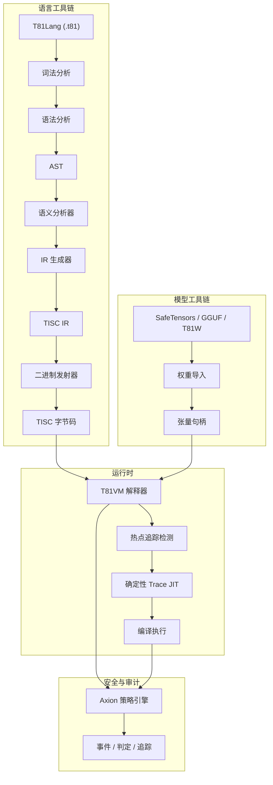

# T81 Foundation 🔥

<div align="center">
  
[](https://github.com/t81dev/t81-foundation/actions/workflows/ci.yml)
[](https://github.com/t81dev/t81-foundation/actions/workflows/ci.yml)
[](https://opensource.org/licenses/MIT)
[](https://en.cppreference.com/w/cpp/23)

[](README.md)
[](README.zh-CN.md)
[](README.es.md)
[](README.ru.md)
[-blueviolet?style=flat-square)](README.pt-BR.md)

</div>

T81 是一个具备**确定性**的**原生三进制**计算栈 🌐。其特性包括 Base-81 数据类型、TISC 指令集、T81 虚拟机 (T81VM)、T81Lang 语言、Axion 安全与优化引擎以及递归认知层。它为算力密集型领域提供位精确 (bit-exact) 且可审计的执行环境 ⚡，是可验证 AI、密码学和科学计算的理想选择。

> **关于浮点数确定性的说明** ⚠️
> 初等超越函数（`sin`, `cos`, `tan`, `log`, `exp`, `sqrt`）使用确定性的 `dmath` 后端，确保跨平台位精确一致。
> 在非严格模式下，除法、反函数及双曲函数可能会回退到宿主机的行为。
> `T81Int`、`T81BigInt`、`T81Fraction` 以及核心 `T81Float` 算术保证具备**全严格确定性**。 ✅

---

## 目录 📑

* [快速入门 🚀](https://www.google.com/search?q=%23%E5%BF%AB%E9%80%9F%E5%85%A5%E9%97%A8)
* [核心特性 🌟](https://www.google.com/search?q=%23%E6%A0%B8%E5%BF%83%E7%89%B9%E6%80%A7)
* [为何选择三进制？ 🧠](https://www.google.com/search?q=%23%E4%B8%BA%E4%BD%95%E9%80%89%E6%8B%A9%E4%B8%89%E8%BF%9B%E5%88%B6)
* [系统架构 🏗️](https://www.google.com/search?q=%23%E7%B3%BB%E7%BB%9F%E6%9E%B6%E6%9E%84)
* [支持平台 🌍](https://www.google.com/search?q=%23%E6%94%AF%E6%8C%81%E5%B9%B3%E5%8F%B0)
* [CLI 示例 🔧](https://www.google.com/search?q=%23cli-%E7%A4%BA%E4%BE%8B)
* [代码库地图 📂](https://www.google.com/search?q=%23%E4%BB%A3%E7%A0%81%E5%BA%93%E5%9C%B0%E5%9B%BE)
* [文档权威地图 📜](https://www.google.com/search?q=%23%E6%96%87%E6%A1%A3%E6%9D%83%E5%A8%81%E5%9C%B0%E5%9B%BE)
* [兼容性保证 🔄](https://www.google.com/search?q=%23%E5%85%BC%E5%AE%B9%E6%80%A7%E4%BF%9D%E8%AF%81)
* [非目标 🚫](https://www.google.com/search?q=%23%E9%9D%9E%E7%9B%AE%E6%A0%87)
* [运行时边界 🔐](https://www.google.com/search?q=%23%E8%BF%90%E8%A1%8C%E6%97%B6%E8%BE%B9%E7%95%8C)
* [延伸阅读 📖](https://www.google.com/search?q=%23%E5%BB%B6%E4%BC%B8%E9%98%85%E8%AF%BB)
* [技术专题论文 📘](https://www.google.com/search?q=%23%E6%8A%80%E6%9C%AF%E4%B8%93%E9%A2%98%E8%AE%BA%E6%96%87)
* [许可证 📜](https://www.google.com/search?q=%23%E8%AE%B8%E5%8F%AF%E8%AF%81)

---

## 快速入门 🚀⚡

在 30 秒内验证核心主张：

1. **构建并运行 Hello World** 🏃‍♂️
```bash
cmake -S . -B build -DCMAKE_BUILD_TYPE=Release && cmake --build build --parallel
./build/t81 compile examples/hello_world.t81 -o hello.tisc
./build/t81 run hello.tisc
```

2. **运行确定性网关测试** 🔄✅
```bash
python3 scripts/ci/t81lang_repro_gate.py --t81-bin build/t81 --check
```

3. **运行虚拟机演示** ▶️🔥
```bash
./build/t81_demo
```

4. **检查追踪日志** 🔍📜
```bash
./build/t81 trace show trace.txt
```


---

## 核心特性 🌟

| 特性 | 状态 | 描述 |
| --- | --- | --- |
| ✅ **确定性执行** | 稳定 🔥 | 跨平台的位精确可重现性 |
| ✅ **原生三进制数据类型** | 稳定 🌐 | 采用平衡三进制算法的 Base-81 系统 |
| ✅ **Axion 策略引擎** | 稳定 🔐 | 运行时安全、优化及伦理强制执行 |
| ✅ **T81VM** | 稳定 ⚙️ | 81 寄存器虚拟机 + 确定性解释器与 Trace-JIT |
| ✅ **TISC IR** | 稳定 📡 | 三进制精简指令集计算机中间表示 |
| ✅ **软件定义数学库** | 稳定 🧮 | 跨平台一致的浮点运算 (`dmath`) |
| 🚧 **Trace-JIT 编译** | 实验性 ⚡ | 热点追踪与确定性即时编译 |
| 🚧 **分布式张量** | 实验性 🌍 | 大规模分布式张量支持 |
| ✅ **模型工具链** | 稳定 🤖 | 支持 SafeTensors / GGUF / T81W 的导入、量化与检查 |

---

## 为何选择三进制？ 🧠🧮

平衡三进制（-1, 0, +1）和 Base-81 消除了符号位，简化了加减法（减少进位），并在理论上具有更高的密度和能效优势——这在数值负载（AI 推理、密码学、信号处理）中尤为重要。

T81 将这些优势引入软件，同时将**确定性**和**可审计性**置于纯粹的速度之上。关于硬件实验，请参阅 [ternary-memory-research](https://github.com/t81dev/ternary-memory-research) 中关于 SKY130 PDK 的指标。 🔬

---

## 系统架构 🏗️



---

## 支持平台 🌍

| 平台 | 编译器 | 状态 | 确定性网关 | 备注 |
| --- | --- | --- | --- | --- |
| Linux x86_64 | Clang 18+, GCC 14+ | ✅ 通过 🔥 | ✅ | 全网关通过 |
| Linux ARM64 | Clang 18+ | ✅ 通过 🔥 | ✅ | 全网关通过 |
| macOS Intel | Apple Clang / GCC | ✅ 通过 | ✅ | 原生支持 |
| macOS Apple Silicon | Apple Clang | ✅ 通过 | ✅ | 活跃研究中 (CMake/标志优化) |

---

## CLI 示例 🔧🔍

```bash
# 编译并运行 🚀
t81 compile examples/hello_world.t81 -o hello.tisc
t81 run hello.tisc

# 调试与检查 🕵️
t81 disasm hello.tisc
t81 debug hello.tisc
t81 trace show trace.txt
t81 repro-hash tests/fixtures/t81lang_determinism

# 模型工具 🤖
t81 weights import model.safetensors -o model.t81w
t81 weights quantize model.safetensors --to-gguf model.gguf
```

---

## 文档权威地图 📜

| 文档 | 用途 | 权威性 |
| --- | --- | --- |
| `spec/constitution.md` | 基础原则 | 规范性 (Normative) 🔒 |
| `spec/determinism-profile.md` | 确定性保证 | 规范性 (Normative) ✅ |
| `spec/t81-data-types.md` | 数据类型与序列化规范 | 规范性 (Normative) 🧮 |
| `spec/tisc-spec.md` | TISC 指令集 | 规范性 (Normative) 📡 |
| `docs/index.md` | 文档入口 | 信息性 (Informational) 📖 |

---

## 非目标 🚫

T81 **不是**：

* 硬件三进制加速器 🖥️
* C++/Python/Rust 的通用替代品 🛑
* 以牺牲确定性为代价追求最大吞吐量的系统 ⚡❌

---

## 📘 技术专题论文 (Definitive Technical Monograph)

如需了解架构的完整、规范级描述（包括形式化语义、确定性不变性、对抗建模和长期持续性设计），请参阅：

➡️ **[T81 基金会 — 技术专题论文](book-cn/README.md)**

**阅读指南：**

* **初学者？** → 从第一部分开始。
* **开发者/实现者？** → 侧重第二和第三部分。
* **审计员？** → 仔细阅读第三和第四部分。
* **研究员？** → 重点阅读第四和第五部分。

<details>
<summary><strong>第一部分 — 基础</strong></summary>

1. **[引言](book-cn/01_简介.md)**
* [1.1 范围与定义](book-cn/01_简介.md#11-范围与定义)
* [1.2 系统架构](book-cn/01_简介.md#12-系统架构)
* [1.3 可验证计算使命](book-cn/01_简介.md#13-可验证计算使命)


2. **[核心原则与不变性](book-cn/02_原则.md)**
* [2.1 确定性不变性](book-cn/02_原则.md#21-确定性不变性)
* [2.1.1 确定性表面与攻击向量](book-cn/02_原则.md#211-确定性表面与攻击向量)
* [2.2 三进制逻辑 (Base-3)](book-cn/02_原则.md#22-三进制逻辑-base-3)
* [2.3 可审计性与 Axion 追踪](book-cn/02_原则.md#23-可审计性与-axion-追踪)
* [2.4 九项原则 (伦理强制执行)](book-cn/02_原则.md#24-九项原则-伦理强制执行)


</details>

<details>
<summary><strong>第二部分 — 确定性机器</strong></summary>

3. **[T81VM 架构](book-cn/03_架构.md)**
* [3.1 形式化状态机](book-cn/03_架构.md#31-形式化状态机)
* [3.1.1 状态定义](book-cn/03_架构.md#311-状态定义)
* [3.2 内存布局](book-cn/03_架构.md#32-内存布局)
* [3.3 寄存器堆](book-cn/03_架构.md#33-寄存器堆)
* [3.4 TISC 指令集架构 (ISA)](book-cn/03_架构.md#34-指令集-tisc)
* [3.5 故障语义](book-cn/03_架构.md#35-故障语义)
* [3.6 垃圾回收](book-cn/03_架构.md#36-垃圾回收)


4. **[数据类型与规范序列化](book-cn/04_数据类型与序列化.md)**
* [4.1 原生类型](book-cn/04_数据类型与序列化.md#41-原生类型)
* [4.2 T81Float 与 dmath](book-cn/04_数据类型与序列化.md#42-t81float-和-dmath)
* [4.3 张量与规范化布局](book-cn/04_数据类型与序列化.md#43-张量与规范布局)
* [4.4 规范序列化规则](book-cn/04_数据类型与序列化.md#44-规范序列化规则)


5. **[安装与构建验证](book-cn/05_安装.md)**
* [5.1 前置条件](book-cn/05_安装.md#51-前置条件)
* [5.2 从源码构建](book-cn/05_安装.md#52-构建步骤)
* [5.3 验证构建](book-cn/05_安装.md#53-确定性网关)


6. **[CLI 与 API 用法](book-cn/06_用法.md)**
* [6.1 命令行界面](book-cn/06_用法.md#61-统一-cli)
* [6.2 嵌入 T81 (C++ API)](book-cn/06_用法.md#62-嵌入-t81-c-api)
* [6.3 嵌入 T81 (Python API)](book-cn/06_用法.md#63-嵌入-t81-python-api)
* [6.4 调试](book-cn/06_用法.md#64-调试)


</details>

<details>
<summary><strong>第三部分 — 治理与验证</strong></summary>

7. **[验证与审计](book-cn/07_验证与审计.md)**
* [7.1 形式化验证方法论](book-cn/07_验证与审计.md#71-验证栈)
* [7.2 形式化审计矩阵](book-cn/07_验证与审计.md#72-确定性网关)
* [7.3 基于属性的测试](book-cn/07_验证与审计.md#73-追踪验证)
* [7.4 确定性网关](book-cn/07_验证与审计.md#74-确定性网关)


8. **[Axion 安全内核](book-cn/08_Axion内核.md)**
* [8.1 形式化定义](book-cn/08_Axion内核.md#81-形式化定义)
* [8.2 策略模型](book-cn/08_Axion内核.md#82-策略模型)
* [8.3 指令拦截](book-cn/08_Axion内核.md#83-指令拦截)
* [8.4 审计日志 (追踪)](book-cn/08_Axion内核.md#84-审计日志-追踪)
* [8.5 认知提升](book-cn/08_Axion内核.md#85-认知提升)


9. **[认知层与分布式计算](book-cn/09_认知层与分布式计算.md)**
* [9.1 认知层模型](book-cn/09_认知层与分布式计算.md#91-认知层模型)
* [9.2 分布式计算 (第 4 层)](book-cn/09_认知层与分布式计算.md#92-分布式计算-第-4-层)
* [9.3 无限形式 (第 5 层)](book-cn/09_认知层与分布式计算.md#93-无限形式-第-5-层)
* [9.4 验证清单](book-cn/09_认知层与分布式计算.md#94-验证清单)


10. **[附录](book-cn/10_附录.md)**
* [10.1 尚未实现的功能](book-cn/10_附录.md#101-尚未实现的功能)
* [10.2 错误代码](book-cn/10_附录.md#102-错误代码)
* [10.3 有用链接](book-cn/10_附录.md#103-有用链接)


</details>

<details>
<summary><strong>第四部分 — 形式化与结构硬化</strong></summary>

11. **[TISC 与 T81VM 的形式化语义](book-cn/11_形式化语义.md)**
* [TISC 的指称语义](book-cn/11_形式化语义.md#111-操作语义)
* [代数转换函数 δ](book-cn/11_形式化语义.md#1111-转换函数)
* [规范化重写系统](book-cn/11_形式化语义.md#112-内存语义)
* [确定性证明草图](book-cn/11_形式化语义.md#112-内存语义)
* [解释器与 Trace-JIT 的等效性](book-cn/11_形式化语义.md#1111-转换函数)


12. **[对抗建模与确定性攻击](book-cn/12_对抗建模.md)**
* [编译器级攻击](book-cn/12_对抗建模.md#121-威胁模型)
* [VM 与 GC 攻击向量](book-cn/12_对抗建模.md#1211-libm-gap-向量)
* [CanonFS 与哈希攻击](book-cn/12_对抗建模.md#1212-时间旅行攻击)
* [分布式层级时间旅行攻击](book-cn/12_对抗建模.md#1212-时间旅行攻击)
* [确定性破坏事后剖析模板](book-cn/12_对抗建模.md#122-侧信道弹性)


</details>

<details>
<summary><strong>第五部分 — 持续性与研究前沿</strong></summary>

13. **[持续性与韧性](book-cn/13_持续性与韧性.md)**
* [无尘室重建协议](book-cn/13_持续性与韧性.md#131-无尘室协议)
* [单点故障](book-cn/13_持续性与韧性.md#1311-最小引导)
* [持续性宣言](book-cn/13_持续性与韧性.md#1312-验证)
* [不可变形式化不变性](book-cn/13_持续性与韧性.md#132-长期归档)


14. **[研究前沿](book-cn/14_研究前沿.md)**
* [版本历史](book-cn/14_研究前沿.md)


</details>

---

## 许可证

MIT 许可证 — 详见 [LICENSE](LICENSE)
