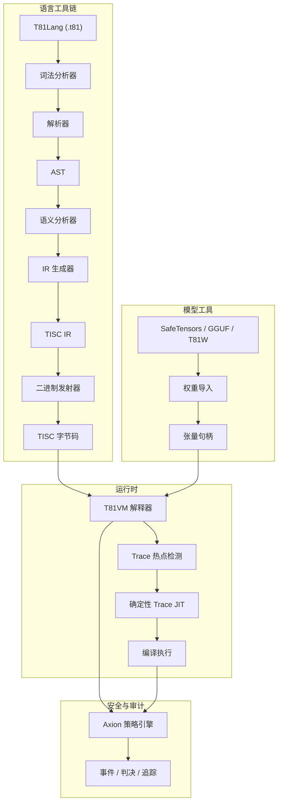

# T81 基金会

<p align="center">
  <strong>确定性三进制原生计算栈，具有81进制数据类型、TISC指令集、T81VM、T81Lang、Axion安全/优化引擎和递归认知层 — 专为AI、密码学和科学计算中的比特精确、可审计、可复现执行而构建。</strong>
</p>

<p align="center">
  <a href="https://github.com/t81dev/t81-foundation/stargazers"></a>
  <a href="https://github.com/t81dev/t81-foundation/network/members"></a>
  <a href="https://github.com/t81dev/t81-foundation/actions/workflows/ci.yml"></a>
  <a href="https://github.com/t81dev/t81-foundation/commits/main"></a>
  <a href="https://opensource.org/licenses/MIT"></a>
  <a href="https://en.cppreference.com/w/cpp/23"></a>
</p>

<p align="center">
  <a href="README.md"></a>
  <a href="README.zh-CN.md"></a>
  <a href="README.es.md"></a>
  <a href="README.ru.md"></a>
  <a href="README.pt-BR.md"></a>
</p>

---

T81 是一个主权计算栈，旨在降低浮点非确定性并在已验证表面上实现完全可审计的执行。通过利用**平衡三进制逻辑**和**81进制数据类型**，T81 目标是在由确定性注册表界定的已验证表面上实现比特精确可复现性。它具有**T81VM**、**Axion安全引擎**以及用于从简单符号逻辑扩展到分布式无限形式的递归层级系统。

> 💡 **为什么重要：** 在AI安全、金融建模和密码学中，“大部分正确”是不够的。T81优先在已验证表面上提供明确的确定性保证。

## 目录

- [特性](#特性)
- [架构](#架构)
- [快速开始](#快速开始)
- [支持平台](#支持平台)
- [CLI 示例](#cli-示例)
- [截图与演示](#截图与演示)
- [仓库地图](#仓库地图)
- [文档权威地图](#文档权威地图)
- [兼容性与非目标](#兼容性与非目标)
- [配置与 Axion](#配置与-axion)
- [贡献](#贡献)
- [变更日志](#变更日志)
- [致谢](#致谢)
- [许可证](#许可证)

## 特性

| 特性 | 状态 | 描述 |
| :--- | :--- | :--- |
| **确定性执行** | ✨ 稳定 | 在由确定性注册表界定的已验证表面上实现比特精确结果。 |
| **三进制原生类型** | ✨ 稳定 | 81进制平衡三进制整数和浮点数（无符号位，进位减少）。 |
| **T81VM 和 TISC** | 🚧 Beta | 运行时执行面已启用，仍在持续验证。 |
| **Axion 引擎** | ⚠️ Alpha | 策略引擎已启用，但对草案规范面的覆盖仍是部分状态。 |
| **模型工具** | ✨ 稳定 | 导入/检查 SafeTensors, GGUF, T81W; 量化支持。 |
| **复现性关卡** | ✨ 稳定 | CI强制执行 `t81lang_repro_gate.py`，用于在已验证表面上检测复现性回归。 |
| **认知层** | 🚧 Beta | 递归执行层（符号 → 分布式 → 无限）。 |
| **Trace-JIT** | 🚧 实验性 | 保持严格确定性的热点优化。 |
| **多语言文档** | 📚 在线 | 完整的英语、中文、西班牙语、葡萄牙语、俄语规范。 |

## 架构



## 快速开始

在60秒内从零开始实现可验证的执行。

### 1. 构建
```bash
cmake -S . -B build -DCMAKE_BUILD_TYPE=Release
cmake --build build --parallel
```

### 2. 编译并运行 Hello World
```bash
# 将 T81 源码编译为 TISC 字节码
./build/t81 compile examples/hello_world.t81 -o hello.tisc

# 运行字节码
./build/t81 run hello.tisc
```

### 3. 验证确定性（“复现关卡”）
证明您的构建符合比特精确性：
```bash
python3 scripts/ci/t81lang_repro_gate.py --t81-bin build/t81 --check
# 输出: ✅  All determinism checks passed.
```

## 支持平台

以下所有平台均通过**确定性关卡**，输出哈希完全相同。

| 平台 | 架构 | 编译器 | 状态 |
| :--- | :--- | :--- | :--- |
| **Linux** | x86_64 | Clang 18+, GCC 14+ | ✅ 已验证 |
| **Linux** | ARM64 | Clang 18+ | ✅ 已验证 |
| **macOS** | Intel | Apple Clang / GCC | ✅ 已验证 |
| **macOS** | Apple Silicon | Apple Clang | ✅ 已验证 |

## CLI 示例

`t81` CLI 是您开发、调试和审计的主要接口。

```bash
# 🛠️ 开发
t81 compile src.t81 -o out.tisc      # 编译
t81 run out.tisc                     # 执行
t81 disasm out.tisc                  # 反汇编字节码

# 🐞 调试与审计
t81 debug out.tisc                   # 交互式调试器
t81 trace show trace.txt             # 检查执行追踪
t81 repro-hash tests/fixtures/       # 计算确定性哈希

# 🤖 AI / 张量
t81 weights import model.safetensors -o model.t81w
t81 weights quantize model.safetensors --to-gguf model.gguf
```

## 截图与演示

*(视觉占位符：想象一个时尚的终端窗口显示 T81 追踪日志，哈希完全匹配)*

要观看带有视觉演示的 VM 运行：
```bash
./build/t81_demo
```

## 仓库地图

代码库中的关键目录：

- **`src/`**: 核心 C++ 源码 (VM, Axion, TISC, CanonFS)。
- **`include/t81/`**: 公共头文件。
- **`book/book-en/`**: 权威技术专著（文档）。
- **`scripts/ci/`**: 持续集成与复现性关卡。
- **`examples/`**: 示例 `.t81` 程序和 C++ 嵌入示例。
- **`tests/`**: 全面的单元和集成测试套件。
- **`spec/`**: 规范性规格说明（TISC, 数据类型）。
- **`tools/`**: 实用脚本和 VSCode 扩展助手。

## 文档权威地图

**权威技术专著**是 T81 的唯一真理来源。它维护在 `book/book-en/` 中，并翻译成多种语言。

<details>
<summary><strong>第一部分 — 基础</strong></summary>

1. **[简介](book/book-cn/01_简介.md)**

   * [1.1 范围与定义](book/book-cn/01_简介.md#11-范围与定义)
   * [1.2 系统架构](book/book-cn/01_简介.md#12-系统架构)
   * [1.3 可验证计算使命](book/book-cn/01_简介.md#13-可验证计算使命)

2. **[核心原则与不变量](book/book-cn/02_原则.md)**

   * [2.1 确定性不变量](book/book-cn/02_原则.md#21-确定性不变量)
   * [2.1.1 确定性表面与攻击向量](book/book-cn/02_原则.md#211-确定性表面与攻击向量)
   * [2.2 三进制逻辑（3进制）](book/book-cn/02_原则.md#22-三进制逻辑3进制)
   * [2.3 可审计性与 Axion 追踪](book/book-cn/02_原则.md#23-可审计性与-axion-追踪)
   * [2.4 九项原则（伦理执行）](book/book-cn/02_原则.md#24-九项原则伦理执行)

</details>

<details>
<summary><strong>第二部分 — 确定性机器</strong></summary>

3. **[T81VM 架构](book/book-cn/03_架构.md)**

   * [3.1 概览](book/book-cn/03_架构.md#31-概览)
   * [3.1.1 执行管线](book/book-cn/03_架构.md#311-执行管线)
   * [3.2 运行时边界](book/book-cn/03_架构.md#32-运行时边界)
   * [3.3 内存模型](book/book-cn/03_架构.md#33-内存模型)
   * [3.3.1 形式化状态定义](book/book-cn/03_架构.md#331-形式化状态定义)
   * [3.4 指令集 (TISC)](book/book-cn/03_架构.md#34-指令集-tisc)
   * [3.5 JIT 编译 (Trace-JIT)](book/book-cn/03_架构.md#35-jit-编译-trace-jit)

4. **[数据类型与规范序列化](book/book-cn/04_数据类型与序列化.md)**

   * [4.1 原始类型](book/book-cn/04_数据类型与序列化.md#41-原始类型)
   * [4.2 T81Float 和 dmath](book/book-cn/04_数据类型与序列化.md#42-t81float-和-dmath)
   * [4.3 张量与规范布局](book/book-cn/04_数据类型与序列化.md#43-张量与规范布局)
   * [4.4 规范序列化规则](book/book-cn/04_数据类型与序列化.md#44-规范序列化规则)

5. **[安装与构建验证](book/book-cn/05_安装.md)**

   * [5.1 先决条件](book/book-cn/05_安装.md#51-先决条件)
   * [5.2 从源码构建](book/book-cn/05_安装.md#52-从源码构建)
   * [5.3 验证构建](book/book-cn/05_安装.md#53-验证构建)

6. **[CLI 和 API 用法](book/book-cn/06_用法.md)**

   * [6.1 命令行接口](book/book-cn/06_用法.md#61-命令行接口)
   * [6.2 嵌入 T81 (C++ API)](book/book-cn/06_用法.md#62-嵌入-t81-c-api)
   * [6.3 嵌入 T81 (Python API)](book/book-cn/06_用法.md#63-嵌入-t81-python-api)
   * [6.4 调试](book/book-cn/06_用法.md#64-调试)

7. **[T81Lang 编程](book/book-cn/07_T81Lang编程.md)**

   * [7.1 设计哲学](book/book-cn/07_T81Lang编程.md#71-设计哲学)
   * [7.2 语法基础](book/book-cn/07_T81Lang编程.md#72-语法基础)
   * [7.3 数据类型](book/book-cn/07_T81Lang编程.md#73-数据类型)
   * [7.4 控制流](book/book-cn/07_T81Lang编程.md#74-控制流)
   * [7.5 函数](book/book-cn/07_T81Lang编程.md#75-函数)
   * [7.6 Axion 集成](book/book-cn/07_T81Lang编程.md#76-axion-集成)
   * [7.7 示例](book/book-cn/07_T81Lang编程.md#77-示例)

</details>

<details>
<summary><strong>第三部分 — 治理与验证</strong></summary>

8. **[验证与审计](book/book-cn/08_验证与审计.md)**

   * [8.1 形式化验证方法论](book/book-cn/08_验证与审计.md#81-形式化验证方法论)
   * [8.2 形式化审计矩阵](book/book-cn/08_验证与审计.md#82-形式化审计矩阵)
   * [8.3 基于属性的测试](book/book-cn/08_验证与审计.md#83-基于属性的测试)
   * [8.4 确定性关卡](book/book-cn/08_验证与审计.md#84-确定性关卡)

9. **[Axion 安全内核](book/book-cn/09_Axion内核.md)**

   * [9.1 形式化定义](book/book-cn/09_Axion内核.md#91-形式化定义)
   * [9.2 策略模型](book/book-cn/09_Axion内核.md#92-策略模型)
   * [9.3 指令拦截](book/book-cn/09_Axion内核.md#93-指令拦截)
   * [9.4 审计日志 (追踪)](book/book-cn/09_Axion内核.md#94-审计日志-追踪)
   * [9.5 认知晋升](book/book-cn/09_Axion内核.md#95-认知晋升)

10. **[认知层与分布式计算](book/book-cn/10_认知层与分布式计算.md)**

   * [10.1 认知层模型](book/book-cn/10_认知层与分布式计算.md#101-认知层模型)
   * [10.2 分布式计算 (第4层)](book/book-cn/10_认知层与分布式计算.md#102-分布式计算-第4层)
   * [10.3 基于 Trace 的 JIT 编译](book/book-cn/10_认知层与分布式计算.md#103-基于-trace-的-jit-编译)
   * [10.4 无限形式 (第5层)](book/book-cn/10_认知层与分布式计算.md#104-无限形式-第5层)

11. **[附录](book/book-cn/11_附录.md)**

* [11.1 尚未实现的内容](book/book-cn/11_附录.md#111-尚未实现的内容)
* [11.2 词汇表](book/book-cn/11_附录.md#112-词汇表)
* [11.3 有用链接](book/book-cn/11_附录.md#113-有用链接)

</details>

<details>
<summary><strong>第四部分 — 形式化与结构硬化</strong></summary>

12. **[TISC 和 T81VM 的形式化语义](book/book-cn/12_形式化语义.md)**

* [12.1 操作语义](book/book-cn/12_形式化语义.md#121-操作语义)
* [12.1.1 转换函数 δ](book/book-cn/12_形式化语义.md#1211-转换函数)
* [12.2 代数转换函数](book/book-cn/12_形式化语义.md#122-代数转换函数)
* [12.3 规范化重写系统](book/book-cn/12_形式化语义.md#123-规范化重写系统)
* [12.4 确定性证明草图](book/book-cn/12_形式化语义.md#124-确定性证明草图)
* [12.5 解释器 vs Trace-JIT 等价性](book/book-cn/12_形式化语义.md#125-解释器-vs-trace-jit-等价性)

13. **[对抗建模与确定性攻击](book/book-cn/13_对抗建模.md)**

* [13.1 威胁模型](book/book-cn/13_对抗建模.md#131-威胁模型)
* [13.2 编译器级攻击](book/book-cn/13_对抗建模.md#132-编译器级攻击)
* [13.3 VM 和 GC 攻击向量](book/book-cn/13_对抗建模.md#133-vm-和-gc-攻击向量)
* [13.4 CanonFS 和哈希攻击](book/book-cn/13_对抗建模.md#134-canonfs-和哈希攻击)
* [13.5 分布式层时间旅行攻击](book/book-cn/13_对抗建模.md#135-分布式层时间旅行攻击)
* [13.6 确定性违规事后分析模板](book/book-cn/13_对抗建模.md#136-确定性违规事后分析模板)

</details>

<details>
<summary><strong>第五部分 — 连续性与研究视野</strong></summary>

14. **[连续性与韧性](book/book-cn/14_持续性与韧性.md)**

* [14.1 净室协议](book/book-cn/14_持续性与韧性.md#141-净室协议)
* [14.2 单点故障](book/book-cn/14_持续性与韧性.md#142-单点故障)
* [14.3 连续性宣言](book/book-cn/14_持续性与韧性.md#143-连续性宣言)
* [14.4 不可变形式化不变量](book/book-cn/14_持续性与韧性.md#144-不可变形式化不变量)

15. **[研究前沿](book/book-cn/15_研究前沿.md)**

* [15.1 三进制硬件加速](book/book-cn/15_研究前沿.md#151-三进制硬件加速)
* [15.2 形式化验证路径](book/book-cn/15_研究前沿.md#152-形式化验证路径)
* [15.3 CanonFS 作为 Merkle 基底](book/book-cn/15_研究前沿.md#153-canonfs-作为-merkle-基底)
* [15.4 大规模确定性 AI 推理](book/book-cn/15_研究前沿.md#154-大规模确定性-ai-推理)

</details>

> 📚 **阅读完整专著：** [book/book-cn/README.md](book/book-cn/README.md)

## 兼容性与非目标

### 保证
- **TISC 字节码：** 主版本内向前兼容。
- **确定性：** 绝对优先级。破坏确定性被视为严重的安全漏洞。

### 非目标
- **不惜一切代价的原始速度：** 我们不会为了硬件特定的快速数学优化而牺牲比特精确性。
- **通用替代：** T81 专为可验证计算而设计，并非为了替代 C++ 或 Python 进行通用脚本编写。

## 配置与 Axion

**Axion** 引擎强制执行运行时策略。配置通过策略文件或运行时标志进行处理。

- **安全：** 内存限制，递归深度（认知层）。
- **伦理：** 编码为运行时约束的原则。
- **优化：** 热点追踪和 JIT 阈值。

查看 `kernel/axion/` 了解实现细节或运行 `axion_policy_runner` 示例。

## 贡献

我们欢迎贡献！请参阅 [CONTRIBUTING.md](CONTRIBUTING.md) 了解详情：
- 代码风格 (Clang-Format).
- Pull Request 流程。
- 确定性验证要求。

## 变更日志

查看 [Releases](https://github.com/t81dev/t81-foundation/releases) 了解完整版本历史。
- **v1.0.0-Sovereign**: 首个生产就绪版本。稳定的 VM, TISC 和 Axion。

## 致谢

感谢开源社区，特别是 `LLVM`, `fmt` 的贡献者以及三进制计算逻辑的早期研究人员。

## 许可证

本项目基于 **MIT License** 许可。查看 [LICENSE](LICENSE) 了解详情。
