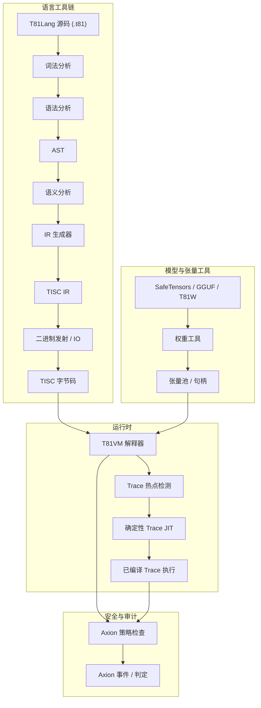

# T81 Foundation

[](https://github.com/t81dev/t81-foundation/actions/workflows/ci.yml)
[](https://opensource.org/licenses/MIT)
[](https://en.cppreference.com/w/cpp/23)

[](README.md)
[](README.zh-CN.md)
[](README.es.md)
[](README.ru.md)
[-blueviolet?style=flat-square)](README.pt-BR.md)

T81：一个确定的、三进制原生的计算栈。其特性包括 Base-81 数据类型、TISC 指令集、T81VM、T81Lang、Axion 安全/优化引擎以及完整的递归认知层级。

T81 通过将三进制原生类型与严格的运行时治理相结合，在算术密集型领域提供位精确（bit-exact）且可审计的执行。它是可验证 AI、密码学和科学计算的理想选择。

> **关于浮点数确定性的说明：** > `T81Float` 的超越函数（`sin`, `cos`, `tan`, `log`, `exp`, `sqrt`）通过确定的软件定义后端（`dmath`）实现，并保证在跨平台时实现位精确。
> `T81Float` 的除法和反三角/双曲函数（`asin`, `sinh` 等）在非严格模式下可能会依赖宿主平台的行为。
> `T81Int`, `T81BigInt`, `T81Fraction`（规范化）以及核心 `T81Float` 操作均保证严格的位精确确定性。

## 目录

* [快速入门](https://www.google.com/search?q=%23%E5%BF%AB%E9%80%9F%E5%85%A5%E9%97%A8)
* [核心特性](https://www.google.com/search?q=%23%E6%A0%B8%E5%BF%83%E7%89%B9%E6%80%A7)
* [为什么选择三进制？](https://www.google.com/search?q=%23%E4%B8%BA%E4%BB%80%E4%B9%88%E9%80%89%E6%8B%A9%E4%B8%89%E8%BF%9B%E5%88%B6)
* [系统架构](https://www.google.com/search?q=%23%E7%B3%BB%E7%BB%9F%E6%9E%B6%E6%9E%84)
* [支持的平台](https://www.google.com/search?q=%23%E6%94%AF%E6%8C%81%E7%9A%84%E5%B9%B3%E5%8F%B0)
* [CLI 示例](https://www.google.com/search?q=%23cli-%E7%A4%BA%E4%BE%8B)
* [仓库地图](https://www.google.com/search?q=%23%E4%BB%93%E5%BA%93%E5%9C%B0%E5%9B%BE)
* [文档权威指南](https://www.google.com/search?q=%23%E6%96%87%E6%A1%A3%E6%9D%83%E5%A8%81%E6%8C%87%E5%8D%97)
* [兼容性保证](https://www.google.com/search?q=%23%E5%85%BC%E5%AE%B9%E6%80%A7%E4%BF%9D%E8%AF%81)
* [非项目目标](https://www.google.com/search?q=%23%E9%9D%9E%E9%A1%B9%E7%9B%AE%E7%9B%AE%E6%A0%87)
* [运行时边界](https://www.google.com/search?q=%23%E8%BF%90%E8%A1%8C%E6%97%B6%E8%BE%B9%E7%95%8C)
* [延伸阅读](https://www.google.com/search?q=%23%E5%BB%B6%E4%BC%B8%E9%98%85%E8%AF%BB)
* [开源协议](https://www.google.com/search?q=%23%E5%BC%80%E6%BA%90%E5%8D%8F%E8%AE%AE)

## 快速入门

在 30 秒内验证核心功能：

1. **编译并运行 Hello World**
```bash
cmake -S . -B build -DCMAKE_BUILD_TYPE=Release && cmake --build build --parallel
./build/t81 compile examples/hello_world.t81 -o hello.tisc
./build/t81 run hello.tisc

```


2. **运行确定性检测门禁 (Gate)**
```bash
python3 scripts/ci/t81lang_repro_gate.py --t81-bin build/t81 --check

```


3. **运行 VM 演示**
```bash
./build/t81_demo

```


4. **查看追踪产物 (Trace Artifact)**
```bash
./build/t81 trace show trace.txt

```


## 核心特性

| 特性 | 状态 | 描述 |
| --- | --- | --- |
| **确定性执行** | ✅ 稳定 | 通过 T81Lang → TISC → T81VM 流水线实现跨平台的位精确可复现性。 |
| **三进制原生数据类型** | ✅ 稳定 | 基于平衡三进制算术的 Base-81 类型，旨在实现高效计算。 |
| **Axion 策略引擎** | ✅ 稳定 | 运行时安全强制执行与优化策略。 |
| **T81VM** | ✅ 稳定 | 拥有 81 个寄存器的虚拟机，支持确定性解释执行和 Trace-JIT。 |
| **TISC IR** | ✅ 稳定 | 三进制指令集计算机（TISC）中间表示。 |
| **软件定义数学库** | ✅ 稳定 | `dmath` 后端，确保跨平台一致的浮点运算。 |
| **Trace-JIT 编译** | 🚧 实验性 | 热点检测与确定性即时编译（JIT），用于提升性能。 |
| **分布式张量** | 🚧 实验性 | 支持分布式环境中的大规模张量操作。 |
| **模型工具链** | ✅ 稳定 | 权重导入、量化及检查工具，支持 ML 集成（SafeTensors, GGUF）。 |

## 为什么选择三进制？

平衡三进制（使用数字 -1, 0, +1）和 Base-81 () 数据类型优化了信号处理、AI 推理和密码学等算术密集型工作负载。与二进制不同，平衡三进制消除了单独的符号位，在没有广泛进位传播的情况下简化了加/减法，并在专用硬件中具备潜在的能效优势。

T81 在软件中模拟这些优势，以实现确定性、可审计的环境。它在混合进制设置中补充了二进制系统，在数值底层（如量化引擎、张量核心）提供密度和能效增益。三进制不是通用替代方案，而是针对开销极小且收益明确的领域而设计的利器。

关于硬件方面的深入见解，请参阅相关仓库 [ternary-memory-research](https://github.com/t81dev/ternary-memory-research) 中的最新 SPICE 仿真，该仿真展示了 SKY130 PDK 中三进制逻辑门的真实功耗/延迟指标。

## 系统架构

T81 强制执行编译与执行的严格分离，并由关于确定性和安全性的显式契约进行治理。



## 支持的平台

| 平台 | 编译器 | 状态 |
| --- | --- | --- |
| Linux (x86_64) | Clang 18+, GCC 14+ | ✅ 确定性门禁测试通过 |
| Linux (ARM64) | Clang 18+ | ✅ 确定性门禁测试通过 |
| macOS (ARM64) | Apple Clang | ✅ 已支持 |

## CLI 示例

`t81` CLI 为编译、执行和诊断提供了统一的接口。

* **编译与运行**
```bash
t81 compile examples/hello_world.t81 -o build/hello.tisc
t81 run build/hello.tisc

```


* **调试与检查**
```bash
t81 disasm build/hello.tisc
t81 debug build/hello.tisc
t81 check examples/hello_world.t81

```


* **追踪与复现性**
```bash
t81 trace show trace.txt
t81 trace diff trace_a.txt trace_b.txt
t81 trace replay build/hello.tisc trace.txt
t81 repro-hash tests/fixtures/t81lang_determinism

```


* **模型管理**
```bash
t81 weights import model.safetensors -o model.t81w
t81 weights info model.t81w
t81 weights quantize model.safetensors --to-gguf model.gguf

```


查看完整用法：*`t81 help`*

## 仓库地图

* [.github/](https://www.google.com/search?q=.github/) : 工作流，问题模板。
* [benchmarks/](https://www.google.com/search?q=benchmarks/) : 性能评估脚本和数据。
* [contracts/](https://www.google.com/search?q=contracts/) : 运行时契约（如 [runtime-contract.json](https://www.google.com/search?q=contracts/runtime-contract.json)）。
* [docs/](https://www.google.com/search?q=docs/) : 文档中心，包含 explanation/, how-to/, policies/, reference/, roadmaps-plans/ 等子目录。
* [examples/](https://www.google.com/search?q=examples/) : 示例代码如 hello_world.t81, tensor_demo.t81；子目录包括 system-integration/, tisc/。
* [include/t81/](https://www.google.com/search?q=include/t81/) : 公共头文件。
* [scripts/](https://www.google.com/search?q=scripts/) : CI 工具，确定性复现门禁脚本。
* [spec/](https://www.google.com/search?q=spec/) : 规范标准（如 [t81-data-types.md](https://www.google.com/search?q=spec/t81-data-types.md), [tisc-spec.md](https://www.google.com/search?q=spec/tisc-spec.md)）。
* [src/](https://www.google.com/search?q=src/) : 核心实现（子目录：axion/, bigint/, canonfs/, cli/, frontend/, tisc/, vm/ 等）。
* [tests/](https://www.google.com/search?q=tests/) : 测试套件（子目录：ci/, cpp/, fixtures/ 等）。

## 文档权威指南

| 文档 | 用途 | 权威范围 |
| --- | --- | --- |
| **[spec/constitution.md](https://www.google.com/search?q=spec/constitution.md)** | 基础原则 | 规范性 |
| **[spec/determinism-profile.md](https://www.google.com/search?q=spec/determinism-profile.md)** | 确定性保证 | 规范性 |
| **[spec/index.md](https://www.google.com/search?q=spec/index.md)** | 核心规范索引 | 规范性 |
| **[docs/index.md](https://www.google.com/search?q=docs/index.md)** | 文档入口 | 资料性 |
| **[CONTRIBUTING.md](https://www.google.com/search?q=CONTRIBUTING.md)** | 贡献指南 | 运营性 |

## 兼容性保证

* **稳定 (Stable):** T81Lang 语法, TISC 格式, T81VM 语义。
* **实验性 (Experimental):** Trace-JIT, 分布式张量。
* **语义化版本 (SemVer):** 稳定组件发生重大更改时将更新主版本号。

## 非项目目标

🚫 T81 **不是**：

* 硬件三进制加速器（侧重于软件实现确定性）。
* 用于替代 C++ 或 Python 的通用语言。
* “不惜一切代价追求性能”的系统（拒绝任何破坏确定性的优化）。

## 运行时边界

定义于 [contracts/runtime-contract.json](https://www.google.com/search?q=contracts/runtime-contract.json)，并在 [spec/t81vm-spec.md](https://www.google.com/search?q=spec/t81vm-spec.md) 等规范中进行了详细说明。

## 延伸阅读

* [docs/index.md](https://www.google.com/search?q=docs/index.md)
* [spec/t81-overview.md](https://www.google.com/search?q=spec/t81-overview.md)
* [CONTRIBUTING.md](https://www.google.com/search?q=CONTRIBUTING.md)
* [SECURITY.md](https://www.google.com/search?q=SECURITY.md)
* [CHANGELOG.md](https://www.google.com/search?q=CHANGELOG.md)

## 开源协议

MIT 协议 — 详见 [LICENSE](https://www.google.com/search?q=LICENSE)。

---

需要我为你将这些翻译应用到具体的 `README.zh-CN.md` 文件中，或者针对某个术语进行更深入的解释吗？
