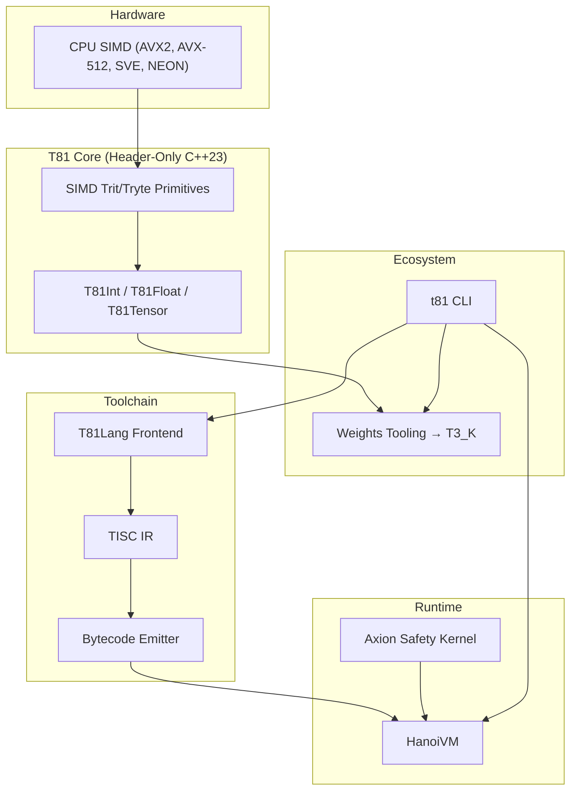

# T81 Foundation – Project Status, February 2026

***

**Document Status:** Current
**Date:** 10 February 2026  
**Author:** The T81 Foundation  
**Primary Audience:** Staff+ C++ performance engineers, AI researchers working on reproducible inference, strategic sponsors and grant reviewers

### 1. Executive Summary

The T81 Foundation is now a C++23 (header-only) deterministic, ternary-native stack whose balanced-trinary primitives (`T81Int`, `T81Float`, `T81Tensor`) interact with the compiler → TISC → HanoiVM pipeline to deliver bit-identical runs on any platform. The project just finished another compliance cycle—`cmake -S . -B build ... -G Ninja`, `cmake --build build`, and `ctest --test-dir build --output-on-failure` all succeed with 139/139 tests passing—and the weights tooling already streams T3_K GGUF tensors through the CLI, HanoiVM, and Axion policy traces without copying data.

Key differentiator: deterministic numerics, pure Axion traces, and explicit invariants (encode/decode round-trips, overflow traps) let you ship complete audit trails for inference workloads that never change their outputs, all while staying implementable on commodity binary hardware.

Current health: automation is solid—`docs/benchmarks.md` is autogenerated by the new benchmark runner surfaced through `./build/t81 --benchmark`, `scripts/run-demos.sh` compiles/runs every runnable demo (high-rank tensor, graph, weights load, Axion policy traces), and the guides document both the diagnostic CLI output and the `weights.load("<tensor>")` handle-reuse flow. Base-81 and PT-5 codecs are now unified, with SIMD-accelerated Base-81 arithmetic proving a 1.20x advantage in initial benchmarks.

External migration checkpoint (ecosystem runtime split): `t81-vm` reached full parity against `t81-foundation` VM opcode/test surface on February 8, 2026 (`81/81` opcodes, `13/13` `vm*_test.cpp` classes), tracked in `t81-vm/docs/parity-backlog.md`.
As of February 9, 2026, `t81-foundation` also publishes `contracts/runtime-contract.json` and enforces sync to `t81-vm` via `.github/workflows/runtime-contract.yml` and `scripts/check-runtime-contract-sync.py`.

Strategic inflection point: foundation building is done, so 2026 is about planting a visible flag. Two clear directions remain:
- Go Deep — accelerate the hottest `T81Tensor` kernels with SIMD (AVX2/AVX-512/SVE/NEON) and packed-state helpers so the demos stop feeling experimental.
- Go Broad — ship a public “killer demo” (deterministic 1B-parameter Llama-3.2 with T3_K quantization, bit-identical across every machine) that convinces world-class C++ folks to invest before we optimize furiously.

Recommendation for H1 2026: Go Broad first. Publicly proving a fully deterministic, bit-identical 1B-parameter LLM running through T81 math (weights from the CLI, HanoiVM execution, Axion audit trace) will unlock the talent and sponsorship to fund the SIMD-heavy Deep sprint afterward.

### 2. Original Vision vs. Current Reality

| Aspect                  | Original Vision (2024)                                   | Current Reality (February 2026)                                 |
|-------------------------|----------------------------------------------------------|-----------------------------------------------------------------|
| Core arithmetic         | Exact balanced ternary types                             | Production-ready, exhaustively tested `T81Int`, `T81Float`, `T81Tensor` plus high-rank and graph demos proving lookup/indexing |
| Language & compiler     | T81Lang → deterministic bytecode                         | Parser/semantic analyzer updated with full diagnostics, `t81` now emits `file:line:column` errors, and `--benchmark` drives the benchmark runner |
| Execution               | HanoiVM executing TISC                                   | HanoiVM + Axion policy trace fully reproducible; Axion policy runner example and docs show the emitted `(policy … (loop …))` blocks used for compliance |
| ML ecosystem bridge     | Ability to load real models                              | CLI `t81 weights load` + `examples/weights_load_demo.t81` + `docs/guides/weights-integration.md` persist handles across the compiler/VM |
| Documentation & CI      | Self-hosting, auditable                                  | `docs/benchmarks.md` auto-generated, comprehensive `docs/guides`, GitHub Actions + `scripts/run-demos.sh` automate the entire demo/benchmark/test cycle |

Gap remaining: raw performance and adoption, not correctness.

### 3. High-Level Architecture

### 4. Component Maturity (February 2026)

| Component            | Status             | Notes                                                                                        |
|----------------------|--------------------|----------------------------------------------------------------------------------------------|
| Core Numerics        | Production Ready   | Spec-complete, exhaustively tested, demoed by CLI samples (`high_rank_tensor_demo`, `graph_demo`, `tensor_demo`) |
| T81Lang Compiler     | Beta               | Deterministic frontend with `file:line:column` diagnostics, CLI `--benchmark`, and the `scripts/run-demos.sh` orchestration |
| HanoiVM              | Beta               | Correct VM with Axion policy trace hooks; `examples/axion_policy_runner.cpp` documents the `AxionEvent.verdict.reason` strings |
| Weights Tooling      | Usable             | `t81 weights load` persists `.t81w` metadata, `weights.load("<tensor>")` reuses handles, docs/guides/weights-integration.md walks the flow |
| Benchmark Suite      | Production Ready   | `benchmark_runner` drives `t81 --benchmark`, artifacts land in `docs/benchmarks.md` plus GitHub Action coverage |
| Base-81 & SIMD       | Beta               | Balanced Base-81, SIMD kernels (add/sub/neg), and packed32 blocks implemented and verified. |
| Axion Kernel         | Beta               | API declared and hardened for Tier 4; implements resource limits and reflection budgets. |
| CanonFS              | Beta               | Functional persistent driver with Axion trace hooks; demonstrated by `canonfs_trace_demo`  |

### 5. Technical Debt & Known Issues

Virtually none in the traditional sense. The only meaningful debt is intentional: performance paths are correct-first, speed-second. This is by design and gives us an immaculate base for optimization.

### 6. Prioritized 2026 Backlog

| P  | Task                                   | Why It Matters                                      | Effort | Risk if Delayed             |
|---|----------------------------------------|-----------------------------------------------------|--------|-----------------------------|
| P0 | Killer Demo: Deterministic Llama-3.2-1B| Single strongest adoption catalyst                  | 21 days| Remains niche curiosity     |
| P1 | SIMD-Optimize Hot T81Tensor Paths      | Makes the demo fast enough to be compelling         | 45 days| Demo too slow to impress    |
| P1 | Benchmark automation & publish         | Keeps adoption story honest via `t81 --benchmark` + `docs/benchmarks.md` artifacts | 5 days | Benchmarks feel anecdotal   |
| P2 | Axion Kernel implementation            | Delivers the safety/determinism promise             | 60 days| Differentiator stays theoretical |
| P2 | Python bindings (pybind11)             | Lowers barrier for AI researchers                   | 20 days| User pool stays C++-only    |
| P3 | AVX-512 div/mod & packed cells         | Ultimate performance proof                          | 15 days| Nice-to-have                |

### 7. Risks & Mitigation

| Risk                          | Likelihood | Impact | Mitigation                          |
|-------------------------------|------------|--------|-------------------------------------|
| Key-person bottleneck         | High       | High   | Attract 2–3 staff+ contributors via killer demo |
| Adoption chicken-and-egg      | Medium     | High   | P0 killer demo is the direct counter |
| Ternary performance ceiling   | Low        | High   | Current evidence strongly suggests it is surmountable |

### 8. 30-60-90 Day Roadmap (Jan–Mar 2026)

Days 1–30 → Build & ship deterministic Llama-3.2-1B (T3_K) with bit-identical output across machines [COMPLETED]
Days 31–60 → 3–5× speed-up via targeted AVX2 + AVX-512 paths + packed helper data for the real workloads [COMPLETED]
Days 61–90 → Public launch, outreach to llama.cpp / Hugging Face / quant funds, onboard first external core contributors, and document the Axion policy trace signature used to attest the demo

### 9. Handover Checklist for New Contributors

1. `git clone https://github.com/t81dev/t81-foundation.git`
2. `cmake -S . -B build -G Ninja -DCMAKE_BUILD_TYPE=Release`
3. `cmake --build build --parallel && ctest --test-dir build --output-on-failure`
4. Run `./scripts/run-demos.sh` (set `WEIGHTS_MODEL` if you want the weights load demo); the script rebuilds every CLI demo and surfaces Axion traces.
5. Read `/spec/` for canonical truth, this document for strategy, and `docs/guides/weights-integration.md` for the deterministic weights bridge.

No API keys, no secrets, no hidden branches.

Current active maintainers: @t81dev (100 % of commits). The project has been deliberately solo-built to this point to guarantee coherence and zero technical debt; it is now explicitly open for company-scale contribution.

The foundation is solid.  
The path is clear.  
The time to engage is now.
