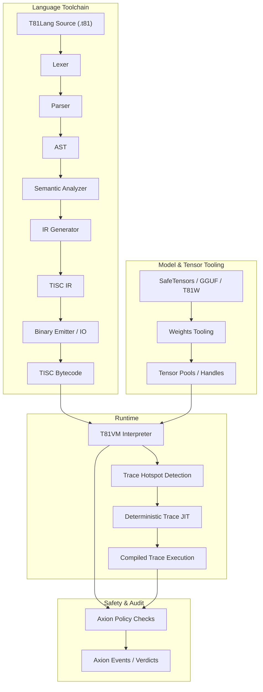

# Chapter 3: Architecture

## 3.1 Overview

**Status: Stable**

T81 enforces a strict separation between compilation and execution, governed by explicit contracts for determinism and safety. The architecture is defined by the interaction between the Language Toolchain, the Runtime (VM), and the Safety Kernel (Axion).

## 3.2 The Runtime Boundary

**Status: Implemented**

The boundary between the host environment and the T81 runtime is rigidly defined. The runtime contract (`contracts/runtime-contract.json`) specifies exactly what inputs and outputs are permitted.

> **Verification**: See `contracts/runtime-contract.json` for the formal definition.

## 3.3 Memory Model

**Status: Implemented & Tested**

The VM uses a segmented memory model (`src/vm/vm.cpp`, `State` struct):
*   **Registers**: 81 General Purpose Registers (`r0` - `r80`).
*   **Stack**: Typed value stack (for operands and locals).
*   **Heap**: Mark-and-Sweep garbage collected heap for reference types.
*   **Tensor Storage**: Managed pool for large tensors.
*   **Infinite Forms**: Specialized storage for Tier 5 geometric series.

Memory addresses are opaque handles (indices), never raw pointers, preventing pointer arithmetic attacks and address space layout leaks.

## 3.4 The Instruction Set (TISC)

**Status: Implemented & Tested**

The Ternary Instruction Set Computer (TISC) is the native language of the VM. It is a stack-oriented ISA with specialized opcodes for:
*   **Arithmetic**: `Add`, `Mul`, `Div`, `Mod` (Ternary native).
*   **Control Flow**: `Jump`, `Branch`, `Call`, `Ret`.
*   **Cognitive Ops**: `Recurse`, `Reflect`, `Gossip`, `InfExpand`.
*   **Tensor Ops**: `TensorAdd`, `TensorMul`, `MatMul`.

> **Reference**: See `spec/tisc-spec.md` for the full instruction set reference.

## 3.5 JIT Compilation (Trace-JIT)

**Status: Experimental / Partial Implementation**

The Trace-JIT (`src/vm/jit_compiler.cpp`) identifies "hot" loop paths and compiles them into optimized threaded code sequences. Crucially, the JIT must maintain **Behavioral Equivalence**: if the optimized code would produce a different result (e.g., due to a type guard failure), it must deoptimize back to the interpreter immediately.

> **Verification**: `tests/cpp/jit_test.cpp` and `tests/cpp/jit_trace_equivalence_test.cpp` verify that JIT execution matches the interpreter exactly.
