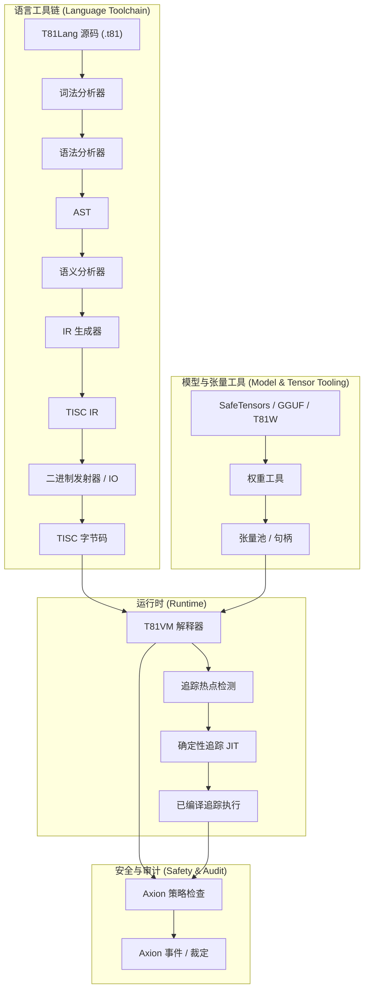

# 第 3 章：架构

## 3.1 概览

**状态：稳定**

T81 强制执行编译与执行的严格分离，并受确定性和安全性的显式契约管理。该架构由语言工具链、运行时 (VM) 和安全内核 (Axion) 之间的交互定义。

## 3.2 运行时边界

**状态：已实现**

宿主环境与 T81 运行时之间的边界有着严格的定义。运行时契约 (`contracts/runtime-contract.json`) 明确指定了允许的输入和输出。

> **验证**：正式定义参见 `contracts/runtime-contract.json`。

## 3.3 内存模型

**状态：已实现并已测试**

虚拟机使用分段内存模型（`src/vm/vm.cpp`，`State` 结构体）：

* **寄存器**：81 个通用寄存器 (`r0` - `r80`)。
* **栈**：类型化值栈（用于操作数和局部变量）。
* **堆**：用于引用类型的标记-清除（Mark-and-Sweep）垃圾回收堆。
* **张量存储**：用于大型张量的管理池。
* **无限形式 (Infinite Forms)**：专用于第 5 层几何级数的存储。

内存地址是不透明的句柄（索引），绝非原始指针。这防止了指针算术攻击和地址空间布局泄露。

## 3.4 指令集 (TISC)

**状态：已实现并已测试**

三进制指令集计算机 (TISC) 是虚拟机的原生语言。它是一种面向栈的指令集架构 (ISA)，具有针对以下方面的专门操作码：

* **算术**：`Add`（加）、`Mul`（乘）、`Div`（除）、`Mod`（取模）（三进制原生）。
* **控制流**：`Jump`（跳转）、`Branch`（分支）、`Call`（调用）、`Ret`（返回）。
* **认知操作**：`Recurse`（递归）、`Reflect`（反射）、`Gossip`（闲话/传播）、`InfExpand`（无限扩张）。
* **张量操作**：`TensorAdd`、`TensorMul`、`MatMul`（矩阵乘法）。

> **参考**：完整指令集参考请参见 `spec/tisc-spec.md`。

## 3.5 JIT 编译 (Trace-JIT)

**状态：实验性 / 部分实现**

追踪 JIT (Trace-JIT, `src/vm/jit_compiler.cpp`) 识别“热点”循环路径，并将其编译为优化的线程化代码序列。至关重要的一点是，JIT 必须保持**行为等效性**：如果优化后的代码会产生不同的结果（例如，由于类型保护失败），它必须立即去优化（deoptimize）回解释器状态。

> **验证**：`tests/cpp/jit_test.cpp` 和 `tests/cpp/jit_trace_equivalence_test.cpp` 验证了 JIT 执行结果与解释器完全匹配。