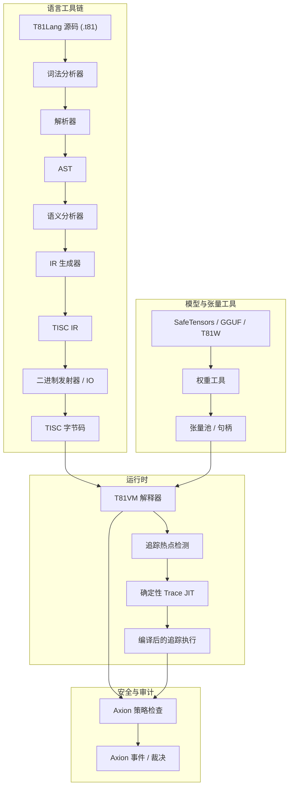

# 第 3 章：架构

## 3.1 概述

**状态：稳定**

T81 强制执行编译与执行之间的严格分离，受明确的确定性和安全合约管辖。该架构由语言工具链、运行时 (VM) 和安全内核 (Axion) 之间的交互定义。

## 3.2 运行时边界

**状态：已实现**

宿主环境与 T81 运行时之间的边界被严格定义。运行时合约 (`contracts/runtime-contract.json`) 确切规定了允许的输入和输出。

> **验证**：参见 `contracts/runtime-contract.json` 获取形式化定义。

## 3.3 内存模型

**状态：已实现并测试**

VM 使用分段内存模型（`src/vm/vm.cpp`，`State` 结构体）：
*   **寄存器**：81 个通用寄存器 (`r0` - `r80`)。
*   **栈**：类型化值栈（用于操作数和局部变量）。
*   **堆**：用于引用类型的标记-清除垃圾回收堆。
*   **张量存储**：用于大型张量的托管池。
*   **无限形式**：用于第 5 层几何级数的专用存储。

内存地址是不透明的句柄（索引），绝不是原始指针，从而防止指针算术攻击和地址空间布局泄露。

## 3.4 指令集 (TISC)

**状态：已实现并测试**

三进制精简指令集计算机 (TISC) 是 VM 的原生语言。它是一种面向栈的 ISA，具有专门的操作码用于：
*   **算术**：`Add`, `Mul`, `Div`, `Mod` (三进制原生)。
*   **控制流**：`Jump`, `Branch`, `Call`, `Ret`。
*   **认知操作**：`Recurse`, `Reflect`, `Gossip`, `InfExpand`。
*   **张量操作**：`TensorAdd`, `TensorMul`, `MatMul`。

> **参考**：参见 `spec/tisc-spec.md` 获取完整的指令集参考。

## 3.5 JIT 编译 (Trace-JIT)

**状态：实验性 / 部分实现**

Trace-JIT (`src/vm/jit_compiler.cpp`) 识别“热”循环路径并将它们编译成优化的线程化代码序列。至关重要的是，JIT 必须保持 **行为等效性**：如果优化后的代码会产生不同的结果（例如，由于类型守卫失败），它必须立即去优化回解释器。

> **验证**：`tests/cpp/jit_test.cpp` 和 `tests/cpp/jit_trace_equivalence_test.cpp` 验证 JIT 执行与解释器完全匹配。
