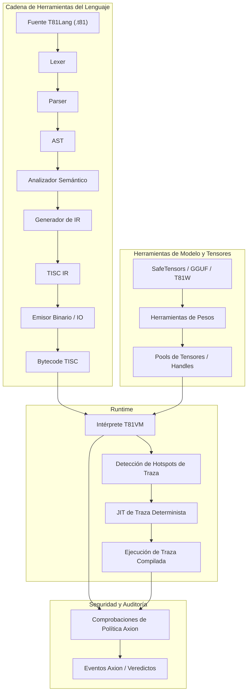

# Capítulo 3: Arquitectura

## 3.1 Visión General

**Estado: Estable**

T81 impone una separación estricta entre compilación y ejecución, gobernada por contratos explícitos para el determinismo y la seguridad. La arquitectura se define por la interacción entre la Cadena de Herramientas del Lenguaje, el Runtime (VM) y el Kernel de Seguridad (Axion).

## 3.2 El Límite del Runtime

**Estado: Implementado**

El límite entre el entorno host y el runtime T81 está rígidamente definido. El contrato del runtime (`contracts/runtime-contract.json`) especifica exactamente qué entradas y salidas están permitidas.

> **Verificación**: Ver `contracts/runtime-contract.json` para la definición formal.

## 3.3 Modelo de Memoria

**Estado: Implementado y Probado**

La VM utiliza un modelo de memoria segmentado (`src/vm/vm.cpp`, struct `State`):
*   **Registros**: 81 Registros de Propósito General (`r0` - `r80`).
*   **Pila**: Pila de valores tipados (para operandos y locales).
*   **Montón (Heap)**: Montón recolectado por basura (Mark-and-Sweep) para tipos de referencia.
*   **Almacenamiento de Tensores**: Pool gestionado para tensores grandes.
*   **Formas Infinitas**: Almacenamiento especializado para series geométricas de Nivel 5.

Las direcciones de memoria son manejadores opacos (índices), nunca punteros crudos, previniendo ataques de aritmética de punteros y fugas del diseño del espacio de direcciones.

## 3.4 El Conjunto de Instrucciones (TISC)

**Estado: Implementado y Probado**

La Computadora con Conjunto de Instrucciones Ternarias (TISC) es el lenguaje nativo de la VM. Es una ISA orientada a pila con opcodes especializados para:
*   **Aritmética**: `Add`, `Mul`, `Div`, `Mod` (Nativo ternario).
*   **Flujo de Control**: `Jump`, `Branch`, `Call`, `Ret`.
*   **Ops Cognitivos**: `Recurse`, `Reflect`, `Gossip`, `InfExpand`.
*   **Ops de Tensores**: `TensorAdd`, `TensorMul`, `MatMul`.

> **Referencia**: Ver `spec/tisc-spec.md` para la referencia completa del conjunto de instrucciones.

## 3.5 Compilación JIT (Trace-JIT)

**Estado: Experimental / Implementación Parcial**

El Trace-JIT (`src/vm/jit_compiler.cpp`) identifica rutas de bucles "calientes" y las compila en secuencias de código enhebrado optimizadas. Crucialmente, el JIT debe mantener la **Equivalencia de Comportamiento**: si el código optimizado produjera un resultado diferente (por ejemplo, debido a un fallo en la guardia de tipos), debe desoptimizar de vuelta al intérprete inmediatamente.

> **Verificación**: `tests/cpp/jit_test.cpp` y `tests/cpp/jit_trace_equivalence_test.cpp` verifican que la ejecución JIT coincida exactamente con el intérprete.
