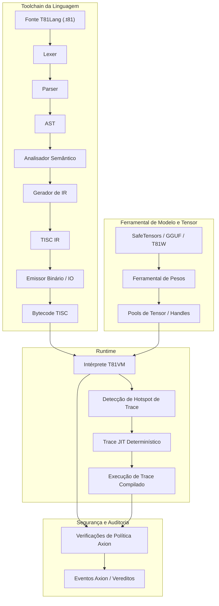

# Capítulo 3: Arquitetura

## 3.1 Visão Geral

**Status: Estável**

O T81 impõe uma estrita separação entre compilação e execução, governada por contratos explícitos para determinismo e segurança. A arquitetura é definida pela interação entre a Toolchain da Linguagem, o Runtime (VM) e o Kernel de Segurança (Axion).

## 3.2 A Fronteira de Runtime

**Status: Implementado**

A fronteira entre o ambiente hospedeiro e o runtime T81 é rigidamente definida. O contrato de runtime (`contracts/runtime-contract.json`) especifica exatamente quais entradas e saídas são permitidas.

> **Verificação**: Veja `contracts/runtime-contract.json` para a definição formal.

## 3.3 Modelo de Memória

**Status: Implementado e Testado**

A VM usa um modelo de memória segmentado (`src/vm/vm.cpp`, struct `State`):
*   **Registradores**: 81 Registradores de Propósito Geral (`r0` - `r80`).
*   **Pilha (Stack)**: Pilha de valores tipados (para operandos e locais).
*   **Heap**: Heap com coleta de lixo Mark-and-Sweep para tipos de referência.
*   **Armazenamento de Tensor**: Pool gerenciado para grandes tensores.
*   **Formas Infinitas**: Armazenamento especializado para séries geométricas de Nível 5.

Endereços de memória são handles opacos (índices), nunca ponteiros brutos, prevenindo ataques de aritmética de ponteiro e vazamentos de layout de espaço de endereço.

## 3.4 O Conjunto de Instruções (TISC)

**Status: Implementado e Testado**

O Computador de Conjunto de Instruções Ternárias (TISC) é a linguagem nativa da VM. É uma ISA orientada a pilha com opcodes especializados para:
*   **Aritmética**: `Add`, `Mul`, `Div`, `Mod` (Nativo Ternário).
*   **Fluxo de Controle**: `Jump`, `Branch`, `Call`, `Ret`.
*   **Ops Cognitivas**: `Recurse`, `Reflect`, `Gossip`, `InfExpand`.
*   **Ops de Tensor**: `TensorAdd`, `TensorMul`, `MatMul`.

> **Referência**: Veja `spec/tisc-spec.md` para a referência completa do conjunto de instruções.

## 3.5 Compilação JIT (Trace-JIT)

**Status: Experimental / Implementação Parcial**

O Trace-JIT (`src/vm/jit_compiler.cpp`) identifica caminhos de loop "quentes" e os compila em sequências de código threaded otimizadas. Crucialmente, o JIT deve manter **Equivalência Comportamental**: se o código otimizado produziria um resultado diferente (ex: devido a uma falha de guarda de tipo), ele deve desotimizar de volta para o intérprete imediatamente.

> **Verificação**: `tests/cpp/jit_test.cpp` e `tests/cpp/jit_trace_equivalence_test.cpp` verificam se a execução JIT corresponde exatamente ao intérprete.
