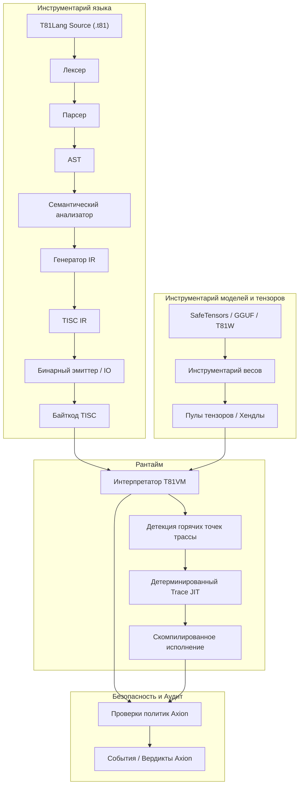

# Глава 3: Архитектура

## 3.1 Обзор

**Статус: Стабильно**

T81 обеспечивает строгое разделение между компиляцией и выполнением, регулируемое явными контрактами на детерминизм и безопасность. Архитектура определяется взаимодействием между Инструментарием Языка (Language Toolchain), Рантаймом (VM) и Ядром Безопасности (Axion).

## 3.2 Граница рантайма

**Статус: Реализовано**

Граница между средой хоста и рантаймом T81 жестко определена. Контракт рантайма (`contracts/runtime-contract.json`) точно указывает, какие входные и выходные данные разрешены.

> **Верификация**: См. `contracts/runtime-contract.json` для формального определения.

## 3.3 Модель памяти

**Статус: Реализовано и протестировано**

VM использует сегментированную модель памяти (`src/vm/vm.cpp`, структура `State`):
*   **Регистры**: 81 регистр общего назначения (`r0` - `r80`).
*   **Стек**: Типизированный стек значений (для операндов и локальных переменных).
*   **Куча**: Куча с сборкой мусора (Mark-and-Sweep) для ссылочных типов.
*   **Хранилище тензоров**: Управляемый пул для больших тензоров.
*   **Бесконечные формы**: Специализированное хранилище для геометрических рядов Уровня 5.

Адреса памяти представляют собой непрозрачные дескрипторы (индексы), а не сырые указатели, что предотвращает атаки через адресную арифметику и утечки схемы адресного пространства.

## 3.4 Набор инструкций (TISC)

**Статус: Реализовано и протестировано**

Компьютер с троичным набором инструкций (TISC) — это нативный язык VM. Это стековая ISA со специализированными опкодами для:
*   **Арифметики**: `Add`, `Mul`, `Div`, `Mod` (нативная троичная).
*   **Потока управления**: `Jump`, `Branch`, `Call`, `Ret`.
*   **Когнитивных операций**: `Recurse`, `Reflect`, `Gossip`, `InfExpand`.
*   **Тензорных операций**: `TensorAdd`, `TensorMul`, `MatMul`.

> **Ссылка**: См. `spec/tisc-spec.md` для полного справочника набора инструкций.

## 3.5 JIT-компиляция (Trace-JIT)

**Статус: Экспериментально / Частичная реализация**

Trace-JIT (`src/vm/jit_compiler.cpp`) идентифицирует "горячие" пути циклов и компилирует их в оптимизированные последовательности кода. Важно, что JIT должен поддерживать **Поведенческую Эквивалентность**: если оптимизированный код даст другой результат (например, из-за сбоя проверки типа), он должен немедленно деоптимизироваться обратно в интерпретатор.

> **Верификация**: `tests/cpp/jit_test.cpp` и `tests/cpp/jit_trace_equivalence_test.cpp` проверяют, что выполнение JIT точно соответствует интерпретатору.
