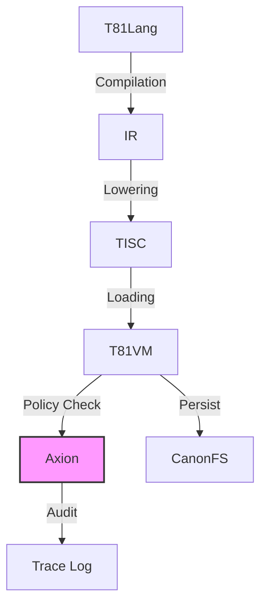

# Chapter 1: Introduction

## 1.1 Scope and Definition

The **T81 Foundation** project implements a deterministic, ternary-native virtual machine architecture designed for verifiable computation. Unlike general-purpose execution environments that prioritize throughput or hardware abstraction, T81 prioritizes **bit-exact reproducibility** and **auditability**.

The system is defined by the following core invariants:
1.  **Strict Determinism**: Execution of a valid TISC (Ternary Instruction Set Computer) program $P$ on input $I$ produces state transition sequence $S_0 \to S_1 \to \dots \to S_n$ that is identical across all compliant host architectures (x86_64, ARM64, RISC-V).
2.  **Ternary Native**: The architecture operates on balanced ternary logic (trits $\in \{-1, 0, 1\}$), utilizing a custom arithmetic stack (`dmath`) to avoid binary floating-point non-determinism.
3.  **Policy Enforced**: All execution is governed by the **Axion Kernel**, a capability-based supervisor that enforces safety policies (recursion limits, memory bounds, ethical constraints) before instruction retirement.

> **Verification Anchor**: The deterministic execution loop is implemented in `src/vm/vm.cpp` (see `Interpreter::step()`). The ternary arithmetic primitives are defined in `include/t81/ternary.hpp` and `include/t81/core/T81Float.hpp`.

## 1.2 System Architecture

The T81 stack consists of four primary layers, each with distinct responsibilities and verification boundaries.

### 1.2.1 The TISC Virtual Machine (T81VM)

The T81VM is a stack-based interpreter for the **Ternary Instruction Set Computer (TISC)** ISA. It manages a segmented memory model comprising:
*   **Code**: Read-only instruction segment.
*   **Stack**: LIFO storage for local variables and return addresses.
*   **Heap**: Dynamic allocation for complex objects (Tensors, Graphs).
*   **Tensor**: Specialized storage for high-dimensional numeric data.
*   **Meta**: Reflection and introspection capabilities.

The VM state is formally defined as a tuple $S = (R, PC, SP, M_{seg}, \Phi)$, where $R$ represents the register file (81 registers), $PC$ the program counter, $SP$ the stack pointer, $M_{seg}$ the memory segments, and $\Phi$ the status flags.

> **Reference**: See `src/vm/vm.cpp`, struct `State`.

### 1.2.2 The Axion Safety Kernel
Axion acts as a hypervisor for the T81VM. It intercepts every instruction dispatch to verify compliance with the active **Policy**. Policies are declarative rulesets that constrain:
*   **Resource Usage**: Memory allocation limits, cycle counts.
*   **Control Flow**: Recursion depth, branching complexity.
*   **Capabilities**: Access to I/O, network, or filesystem syscalls.

If an instruction violates a policy, Axion issues a `Deny` verdict, causing the VM to trap with a `SecurityFault`.

> **Reference**: Policy logic is implemented in `src/axion/policy_engine.cpp` and `src/axion/ethics.cpp`.

### 1.2.3 Canonical Filesystem (CanonFS)
CanonFS is a content-addressable storage layer that guarantees **structural immutability**. Objects (weights, code, data) are identified by their SHA3-256 hash (`CanonHash81`). Loading an object from CanonFS ensures that the data in memory is bit-for-bit identical to the artifact that was signed and published, eliminating "dependency drift" attacks.

> **Reference**: Implemented in `src/canonfs/` and defined in `spec/canonfs-spec.md`.

### 1.2.4 The Cognitive Tiers
T81 organizes computational complexity into **Cognitive Tiers**, ranging from pure arithmetic (Tier 1) to infinite recursive forms (Tier 5).
*   **Tier 1 (Symbolic)**: Basic arithmetic and logic.
*   **Tier 2 (Reflective)**: Self-inspection and trace capture.
*   **Tier 3 (Recursive)**: Bounded recursion and proof generation.
*   **Tier 4 (Distributed)**: Gossip protocols and state merging.
*   **Tier 5 (Infinite)**: Geometric series and non-terminating forms.

> **Reference**: Tier logic is located in `src/cog/`.

## 1.3 Verifiable Compute Mission

The primary application of T81 is **Sovereign Compute**: the ability to execute code and verify the result without trusting the hardware operator. By combining strict software-defined arithmetic (`dmath`) with a cryptographic audit log (Axion Trace), T81 enables:
*   **Trustless AI Inference**: Verifying that a specific model produced a specific output.
*   **Smart Contracts**: Executing logic where consensus depends on bit-exact state transitions.
*   **Scientific Reproducibility**: guaranteeing that simulations run in 2025 produce the same results in 2050.

## 1.4 Terminology

| Term | Definition |
| :--- | :--- |
| **Trit** | A base-3 digit: $\{-1, 0, 1\}$. |
| **Tryte** | A sequence of trits, typically 3 or 9. |
| **TISC** | Ternary Instruction Set Computer (the ISA). |
| **Axion** | The safety and policy enforcement kernel. |
| **CanonRef** | A canonical reference (hash) to an immutable object. |
| **promotion** | The act of escalating privileges or tier capabilities. |

## 1.5 Verification Checklist

*   [ ] **determinism**: Does the VM produce identical traces on x86 and ARM?
*   [ ] **isolation**: Does Axion correctly intercept prohibited instructions?
*   [ ] **persistence**: Does CanonFS retrieve objects by hash correctly?

See `tests/cpp/` for implementation proofs.
