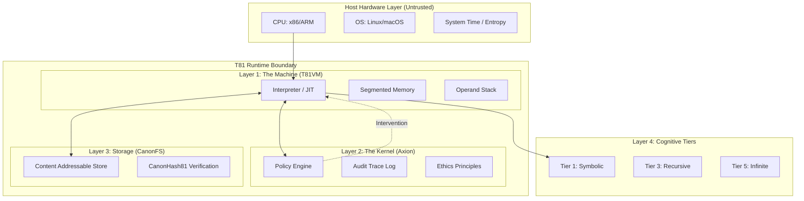

# Chapter 1: Introduction

## 1.1 Scope and Definition

**Status: Implemented & Tested**

The **T81 Foundation** project implements a deterministic, ternary-native virtual machine architecture designed for verifiable computation. Unlike general-purpose execution environments that prioritize throughput, hardware abstraction, or developer convenience, T81 prioritizes **bit-exact reproducibility**, **auditability**, and **structural honesty**.

The system is defined formally as a tuple $\mathfrak{S} = (\mathcal{M}, \mathcal{A}, \mathcal{C}, \Phi)$, where:
- $\mathcal{M}$ is the **TISC Virtual Machine**, a stack-based automaton operating on balanced ternary logic.
- $\mathcal{A}$ is the **Axion Safety Kernel**, a capability-based supervisor enforcing runtime policies.
- $\mathcal{C}$ is the **Canonical Filesystem**, a content-addressable storage layer ensuring immutable artifact resolution.
- $\Phi$ is the set of **Invariants** that must hold true for any valid transition of the system.

The core axiom of T81 is that computation is a deterministic function mapping an initial state $S_0$ and an input $I$ to a final state $S_n$ via a sequence of discrete, well-defined transitions:
$$
\forall \text{hardware } H_1, H_2: \text{Exec}(S_0, I)_{H_1} \equiv \text{Exec}(S_0, I)_{H_2}
$$
This identity must hold across different processor architectures (x86_64, ARM64, RISC-V), operating systems, and time. If a computation yields $X$ today, it must yield precisely $X$ in a century, regardless of the underlying silicon.

### 1.1.1 Core Invariants

The architecture enforces the following non-negotiable invariants:

1.  **Strict Determinism**: Execution of a valid TISC (Ternary Instruction Set Computer) program $P$ on input $I$ produces a state transition sequence $S_0 \to S_1 \to \dots \to S_n$ that is identical across all compliant host architectures. This precludes the use of host hardware floating-point units (FPU) for any operation that affects the architectural state. Instead, T81 mandates soft-float arithmetic via `dmath`, ensuring that operations like `sin(x)` or `x / y` are bit-exact regardless of the host's `libm` or FMA (Fused Multiply-Add) behavior.
2.  **Ternary Native**: The architecture operates on balanced ternary logic (trits $\in \{-1, 0, 1\}$), utilizing a custom arithmetic stack (`dmath`) to avoid binary floating-point non-determinism and to align with the information-theoretic optimality of radix 3. This native support extends from the instruction set to the memory layout, where data is packed into efficient "Trytes".
3.  **Policy Enforced**: All execution is governed by the **Axion Kernel**, a capability-based supervisor that enforces safety policies (recursion limits, memory bounds, ethical constraints) *before* instruction retirement. The kernel function $\alpha: (S, \text{Op}) \to \{\text{Allow, Deny}\}$ is evaluated for every instruction dispatch. This "check-before-exec" model guarantees that the machine never enters a forbidden state.
4.  **Structural Honesty**: The system does not synthesize information. If a result is approximate, it is typed as such (e.g., a converging series rather than a rounded float). If a process is non-terminating, it is categorized in a higher cognitive tier (Tier 5). The system rejects "best-effort" execution in favor of explicit failure or explicit approximation.

> **Verification Anchor**: The deterministic execution loop is implemented in `src/vm/vm.cpp` (see `Interpreter::step()`). The ternary arithmetic primitives are defined in `include/t81/ternary.hpp` and `include/t81/core/T81Float.hpp`.

## 1.2 System Architecture

The T81 stack consists of four primary layers, each with distinct responsibilities and verification boundaries. The architecture is designed to minimize the "Trusted Computing Base" (TCB) by treating the host hardware as an adversarial entity that provides raw cycles but not semantic correctness.

### 1.2.1 The TISC Virtual Machine (T81VM)

**Status: Implemented & Tested**

The T81VM is a stack-based interpreter for the **Ternary Instruction Set Computer (TISC)** ISA. It manages a segmented memory model designed to prevent pointer aliasing and buffer overflows by construction. The VM acts as the sole interface between T81 code and the outside world, abstracting away the host's endianness, pointer size, and memory layout.

The VM state is formally defined as a tuple $S = (R, PC, SP, M_{seg}, \Phi)$, where:
*   $R$: The register file consisting of 81 general-purpose registers (`r0` through `r80`), each storing a typed `T81Value`. These registers are "virtual", mapped to the host's memory, but exposed to the TISC program as direct storage.
*   $PC$: The program counter, pointing to the next instruction in the Code segment.
*   $SP$: The stack pointer, indicating the top of the operand stack.
*   $M_{seg}$: The memory segments (Code, Stack, Heap, Tensor, Meta). Each segment is isolated; a stack overflow cannot corrupt the heap or code.
*   $\Phi$: The status flags register, encoding the result of the last comparison or arithmetic operation ($\{<, =, >\}$). Unlike binary flags (Zero, Sign, Carry), ternary flags naturally represent the three states of comparison.

The memory segments are:
*   **Code**: Read-only instruction segment. Modification is impossible after load, enforcing W^X (Write XOR Execute) security.
*   **Stack**: LIFO storage for local variables and return addresses. Deep recursion is bounded by policy.
*   **Heap**: Dynamic allocation for complex objects (Tensors, Graphs). Managed by a deterministic Mark-and-Sweep garbage collector that runs based on allocation counts, not wall-clock time.
*   **Tensor**: Specialized storage for high-dimensional numeric data, aligned to 64-byte boundaries for SIMD optimization (where safe). Tensors are immutable once created.
*   **Meta**: Reflection and introspection capabilities, storing symbol tables and debug information. Accessible only via specific Tier 2 opcodes.

> **Reference**: See `src/vm/vm.cpp`, struct `State`.

### 1.2.2 The Axion Safety Kernel

**Status: Implemented & Tested**

Axion acts as a hypervisor for the T81VM. It intercepts every instruction dispatch to verify compliance with the active **Policy**. Unlike traditional operating systems where security is often a check at the syscall boundary, Axion enforces fine-grained capability checks at the *instruction* level. This creates a "defense in depth" architecture where malicious bytecode cannot bypass safety checks.

Policies are declarative rulesets that constrain:
*   **Resource Usage**: Total memory allocation, maximum stack depth, instruction cycle count (Gas), and maximum tensor dimensions.
*   **Control Flow**: Recursion depth (Tier 3), branching complexity (Tier 2), and loop iterations.
*   **Capabilities**: Access to I/O, network, filesystem syscalls, or high-tier cognitive functions like `Gossip` or `InfExpand`.

If an instruction violates a policy (e.g., attempting `Recurse` when the policy is `recursion_limit=0`), Axion issues a `Deny` verdict. This causes the VM to trap immediately with a `SecurityFault`, ensuring that no unauthorized state transition ever occurs. The event is logged to the Audit Trace for forensic analysis.

> **Reference**: Policy logic is implemented in `src/axion/policy_engine.cpp` and `include/t81/axion/api.hpp`.

### 1.2.3 Canonical Filesystem (CanonFS)

**Status: Partial Implementation**

CanonFS is a content-addressable storage layer that guarantees **structural immutability**. It rejects the concept of mutable file paths like `/usr/bin/python`. Instead, objects (weights, code, data) are identified solely by their SHA3-256 hash (`CanonHash81`).

When the VM requests to load a module or a tensor model, it provides a hash. CanonFS locates the blob (either locally or via a content delivery network), verifies its hash matches the request, and only then permits it to be loaded into memory. This mechanism ensures that the data in memory is bit-for-bit identical to the artifact that was signed and published, eliminating "dependency drift" attacks, "DLL hell", and "works on my machine" discrepancies. It effectively creates a global, immutable namespace for all T81 software.

> **Reference**: Implemented in `src/canonfs/` and defined in `spec/canonfs-spec.md`. Currently supports basic hash verification and loading.

### 1.2.4 The Cognitive Tiers

**Status: Implemented (Tiers 1-5)**

T81 organizes computational complexity into **Cognitive Tiers**. This taxonomy allows the system to bound the "danger" or "cost" of a computation. A simple arithmetic script should not have the capability to consume infinite resources or perform unbounded recursion. This tiered model allows safe execution of untrusted code by default (Tier 1).

*   **Tier 1 (Symbolic)**: Basic arithmetic, logic, and fixed-bound loops. Deterministic in $O(1)$ or $O(N)$ time. Safe for all contexts. Ideal for smart contracts and simple configuration logic.
*   **Tier 2 (Reflective)**: Self-inspection, trace capture, and dynamic dispatch. Allows code to analyze its own structure or memory usage.
*   **Tier 3 (Recursive)**: Bounded recursion and proof generation. Capable of expressing general recursive functions (like Ackermann function) but subject to strict stack depth policies to prevent stack overflow DoS attacks.
*   **Tier 4 (Distributed)**: Consensus-based state transitions, gossip protocols, and state merging across nodes. Enables networked intelligence and distributed ledgers.
*   **Tier 5 (Infinite)**: Geometric series, non-terminating forms, and "Halting Problem" candidates. Allowed only with explicit `InfExpand` privileges. This tier deals with mathematical concepts that are "conceptually" infinite but must be collapsed to finite approximations for results.

> **Reference**: Tier logic is located in `src/cog/`. See `src/cog/tier3/recursive.cpp` and `src/cog/tier5/infinite.cpp`.

## 1.3 Verifiable Compute Mission

The primary application of T81 is **Sovereign Compute**: the ability to execute code and verify the result without trusting the hardware operator. By combining strict software-defined arithmetic (`dmath`) with a cryptographic audit log (Axion Trace), T81 enables a new class of applications where the *integrity* of the computation is paramount.

### 1.3.1 Trustless AI Inference
In a world of opaque AI models, T81 allows for **Provable Inference**. A user can run a model on a remote node and receive not just the output, but a cryptographic proof (the Axion Trace) that:
1.  The specific model (identified by `CanonHash81`) was used.
2.  The input was exactly as specified.
3.  The inference process followed the deterministic rules of T81 arithmetic.
This prevents "model switching" attacks where a provider claims to use a large model but serves results from a cheaper, smaller one.

### 1.3.2 Smart Contracts and Consensus
T81's deterministic nature makes it an ideal substrate for smart contract execution. Unlike EVM or WASM, which rely on binary logic and often struggle with floating-point determinism (forcing them to use fixed-point math), T81 provides native support for high-precision decimal (ternary) math. This eliminates rounding errors in financial computations and allows for complex financial modeling directly on-chain.

### 1.3.3 Scientific Reproducibility
The "Crisis of Reproducibility" in science is partly a crisis of computational stability. A simulation run on a supercomputer in 2024 should yield the exact same results on a laptop in 2050. T81 guarantees this by abstracting away the hardware floating-point unit and system time, ensuring that the simulation is an invariant mathematical object. This allows researchers to verify results bit-for-bit, decades later.

## 1.4 Terminology

The following terms are used precisely throughout this monograph.

| Term | Definition |
| :--- | :--- |
| **Trit** | A base-3 digit: $\{-1, 0, 1\}$. The fundamental atom of T81 logic. |
| **Tryte** | A sequence of trits. A standard Tryte is 4 trits ($3^4 = 81$ values), typically packed into a `uint8_t`. |
| **TISC** | Ternary Instruction Set Computer. The ISA of the T81VM. |
| **Axion** | The safety, policy enforcement, and audit kernel of the T81 runtime. |
| **CanonRef** | A canonical reference (SHA3-256 hash) to an immutable object in CanonFS. |
| **Promotion** | The act of escalating privileges or moving a computation to a higher Cognitive Tier. |
| **dmath** | Deterministic Math. The software library implementing bit-exact ternary arithmetic and transcendental functions. |
| **Verifiable Trace** | A cryptographically signed log of all state transitions and policy checks performed during an execution. |
| **Structural Honesty** | The principle that the system must explicitly declare the nature of its results (exact, approximate, non-terminating) rather than hiding complexity. |
| **Determinism Gate** | A CI/CD pipeline check that verifies that changes to the codebase do not alter the output of canonical reference programs. |
| **Sovereign Compute** | Computation where the user can verify the correctness of execution independent of the hardware operator. |

## 1.5 Verification Checklist

The following checklist defines the acceptance criteria for a compliant T81 implementation.

*   [ ] **Determinism**: Does the VM produce identical traces on x86, ARM, and RISC-V architectures? (Verified by `scripts/ci/t81lang_repro_gate.py`)
*   [ ] **Isolation**: Does Axion correctly intercept prohibited instructions and enforce resource limits? (Verified by `tests/cpp/test_ethics.cpp` and `tests/cpp/test_resource_monitoring.cpp`)
*   [ ] **Persistence**: Does CanonFS retrieve objects by hash correctly and reject corrupted data? (Verified by `tests/cpp/canonfs_driver_test.cpp`)
*   [ ] **Arithmetic**: Does `dmath` satisfy the mathematical identities of balanced ternary logic? (Verified by `tests/cpp/ternary_arith_test.cpp`)
*   [ ] **Policy**: Do Tier restrictions correctly prevent lower-tier code from executing higher-tier opcodes? (Verified by `tests/cpp/test_tier3_opcodes.cpp`)
*   [ ] **Trace Integrity**: Is the generated audit trace cryptographically linked and verifiable? (Verified by `tests/cpp/test_trace_integrity.cpp`)

## Author's Note for Next Revision

*   **Open Questions**: The formal proof of equivalence between the JIT compiler's trace optimization and the interpreter's step function needs to be rigorized in Section 11.
*   **Suggested Figures**: A sequence diagram showing the interaction between the Interpreter, Axion Policy Engine, and the Trace Logger during a single instruction cycle would be beneficial in Section 1.2.
*   **Cross-References**: Ensure that the "Research Frontier" (Chapter 15) is updated to reflect recent progress on the Tier 5 Infinite Forms implementation.
