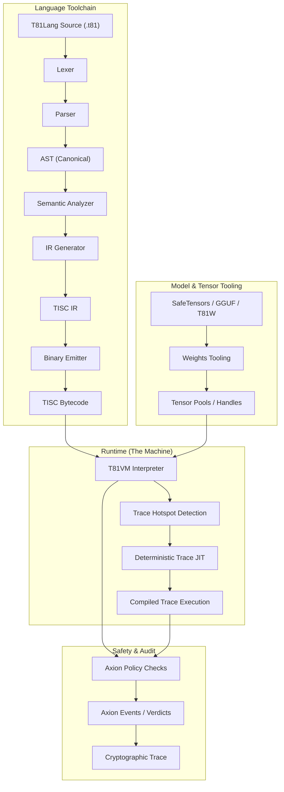

# Chapter 3: T81VM Architecture

## 3.1 Overview

**Status: Stable**

The **T81 Virtual Machine (T81VM)** is the execution engine of the T81 stack. It enforces a strict separation between compilation and execution, governed by explicit contracts for determinism and safety. The architecture is defined by the interaction between the Language Toolchain, the Runtime (VM), and the Safety Kernel (Axion).

### 3.1.1 The Execution Pipeline

The flow of a program from source code to verified execution involves multiple stages of canonicalization and verification.

## 3.2 The Runtime Boundary

**Status: Implemented**

The boundary between the host environment and the T81 runtime is rigidly defined. The runtime acts as a **hermetic seal**.
- **Input**: Bytecode (the program), Canonical Inputs (arguments), Policy Configuration (limits).
- **Output**: Canonical Result (return value), Audit Trace (proof), Error/Trap (failure mode).
- **Side Effects**: Strictly prohibited unless explicitly allowed by the Policy (e.g., `MetaWrite` or `Gossip`).

The runtime contract (`contracts/runtime-contract.json`) specifies exactly what inputs and outputs are permitted, ensuring that no hidden state (like environment variables `LD_PRELOAD` or file descriptors) leaks into the execution context.

## 3.3 Memory Model

**Status: Implemented & Tested**

The VM uses a **Segmented Memory Model** to guarantee memory safety and prevent control-flow hijacking. Unlike flat address spaces where code and data are intermingled, T81 enforces strict separation.

### 3.3.1 Formal State Definition
The state of the machine at any tick $t$ is defined as a tuple $S_t = (\mathbf{R}, \mathbf{M}, \mathbf{K}, \mathbf{\Phi})$, where:

*   **Registers ($\mathbf{R}$)**: A bank of 243 general-purpose registers ($R_0 \dots R_{242}$). Each register holds a typed 64-bit value (integer payload or handle) and a corresponding `ValueTag` (e.g., `Type::Int`, `Type::Float`, `Type::TensorRef`).
*   **Memory ($\mathbf{M}$)**: A collection of disjoint segments. Addresses are pairs `(SegmentID, Offset)`.
*   **Control Stack ($\mathbf{K}$)**: A stack of call frames, managing function invocation and return addresses. Each frame stores the return PC and the base pointer for local variables.
*   **Flags ($\mathbf{\Phi}$)**: Status flags $\{Z, N, P\}$ indicating the result of the last arithmetic operation (Zero, Negative, Positive). These flags drive conditional branches.

### 3.3.2 Memory Segments
Memory is divided into logical regions. Accessing memory across segment boundaries without specific opcodes is impossible.

| Segment | Access | Purpose |
| :--- | :--- | :--- |
| **Code** | Read-Only | Stores the immutable instruction stream. The PC points here. Writes trigger `SegFault`. |
| **Stack** | Read/Write | LIFO storage for local variables. Grows downward. Overflow triggers `StackOverflow`. |
| **Heap** | Managed | Dynamic allocation for complex objects (Tensors, Graphs). Managed by GC. Fragmentation is handled by compaction (future work). |
| **Tensor** | Managed | Specialized pool for `T81Tensor` objects. Aligned for SIMD. Access via handles only. |
| **Meta** | Read-Only | Reflection data, symbol tables, and debugging metadata. Can be inspected by Tier 2 code. |

### 3.3.3 Handles and Indirection
To prevent memory corruption and pointer arithmetic attacks, the VM uses **Opaque Handles**.
- A register does not store a raw pointer `0x7fff...` which could vary between runs.
- Instead, it stores a handle `TensorHandle(42)`.
- The VM resolves `Index[42]` in the Tensor Segment table to the actual host memory location.
- Attempting to access `TensorHandle(43)` if only 42 tensors exist results in an immediate `Trap::SegFault`.
- This ensures that memory addresses are never exposed to the guest program, maintaining determinism even if the host allocator places objects at different addresses.

## 3.4 The Instruction Set (TISC)

**Status: Implemented & Tested**

The **Ternary Instruction Set Computer (TISC)** is the native language of the VM. It is a stack-oriented ISA with specialized support for ternary logic and high-level cognitive operations.

### 3.4.1 The Instruction Cycle
For every instruction, the VM performs a rigorous cycle:

1.  **Fetch**: Retrieve the opcode at `Code[PC]`.
2.  **Decode**: Parse operands (registers, immediates).
3.  **Policy Check**: The Axion Kernel evaluates $\alpha(S, \text{Op})$. If `Deny`, raise `SecurityFault`.
4.  **Execute**: Perform the state transition $S' = \delta(S, \text{Op})$.
5.  **Retire**: Increment `PC`, update Trace, and run Garbage Collection if the allocation trigger is met.

### 3.4.2 Opcode Categories
*   **Arithmetic**: `Add`, `Mul`, `Div` (Ternary), `FAdd`, `FMul` (Soft-Float).
*   **Control Flow**: `Jump`, `Branch` (Conditional), `Call`, `Ret`.
*   **Data Movement**: `Load` (Immediate), `Store` (Register), `Move` (Reg-to-Reg).
*   **Cognitive Ops**:
    *   `Recurse`: Enter a recursive scope (Tier 3).
    *   `Reflect`: Snapshot current state (Tier 2).
    *   `Gossip`: Exchange state with peers (Tier 4).
    *   `InfExpand`: Instantiate an infinite form (Tier 5).
*   **Tensor Ops**: `TensorAdd`, `TensorMul`, `MatMul`, `BroadCast`.

> **Reference**: See `spec/tisc-spec.md` for the full instruction set reference.

## 3.5 JIT Compilation (Trace-JIT)

**Status: Experimental / Partial Implementation**

To reconcile the conflict between "Strict Determinism" and "High Performance", T81 employs a **Deterministic Trace JIT**. Unlike traditional JITs which optimize based on hot paths and speculative assumptions that might vary (e.g., branch prediction), the T81 JIT must produce identical behavior.

### 3.5.1 The Tracing Process
1.  **Profiling**: The interpreter counts loop iterations. When a loop exceeds a threshold (`kHotThreshold`), it triggers tracing.
2.  **Recording**: The VM enters "Recording Mode", logging every executed opcode and the *values* of any guards (branches and type checks).
3.  **Optimization**: The recorded trace is optimized (constant folding, dead code elimination, common subexpression elimination) *assuming* the guard conditions hold.
4.  **Compilation**: The trace is compiled to machine code (or threaded code).

### 3.5.2 Behavioral Equivalence
The JIT must strictly adhere to the **Equivalence Invariant**:
$$
\text{Exec}_{\text{JIT}}(S) \equiv \text{Exec}_{\text{Interp}}(S)
$$
If the optimized code encounters a state where a guard fails (e.g., a variable changes type from `Int` to `Float`), it must **Deoptimize**—transfer control back to the interpreter at the exact point of failure, reconstructing the full interpreter state (registers, stack). This ensures that optimization never alters the semantics or the result of the program.

> **Verification**: `tests/cpp/jit_test.cpp` and `tests/cpp/jit_trace_equivalence_test.cpp` verify that JIT execution matches the interpreter exactly for randomized inputs.
