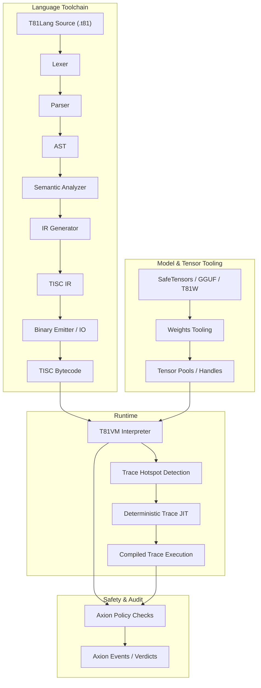

# The T81 Foundation — Definitive Technical Monograph

**Version 2.0** — February 2026
*Major alignment pass to match repository state*

---

## Foreword

In the history of computing, we have often traded correctness for speed. From the widespread adoption of IEEE-754 floating point—which sacrifices associativity for hardware efficiency—to the relaxed consistency models of distributed databases, the industry has largely accepted that "mostly correct, most of the time" is good enough.

The T81 Foundation rejects this compromise.

We posit that for a specific class of problems—sovereign AI, cryptographic consensus, and scientific archiving—bit-exact determinism is not a luxury; it is a necessity. A neural network executed on a generic x86 cluster in 2024 must produce the exact same tensor output when run on a specialized RISC-V accelerator in 2054. If it does not, we have not built a foundation; we have built a fleeting sandcastle.

This monograph describes the T81 architecture: a ternary-native, capability-secure, strictly deterministic computing stack. It is not designed to replace general-purpose computing. It is designed to be the bedrock for that which must not change.

---

## Table of Contents

1.  [Introduction](#chapter-1-introduction)
2.  [Core Principles](#chapter-2-core-principles-and-invariants)
3.  [Architecture](#chapter-3-architecture)
4.  [Data Types & Serialization](#chapter-4-data-types-and-serialization)
5.  [Installation & Build](#chapter-5-installation-and-build)
6.  [Usage & CLI](#chapter-6-usage-and-cli)
7.  [Verification & Audit](#chapter-7-verification-and-audit)
8.  [The Axion Kernel](#chapter-8-the-axion-kernel)
9.  [Cognitive Tiers](#chapter-9-cognitive-tiers-and-distributed-compute)
10. [Appendices](#chapter-10-appendices)
11. [Formal Semantics](#chapter-11-formal-semantics)
12. [Adversarial Modeling](#chapter-12-adversarial-modeling)
13. [Continuity & Resilience](#chapter-13-continuity-resilience)
14. [Research Frontier](#chapter-14-research-frontier)

---

# Chapter 1: Introduction

## 1.1 Scope and Definition

**Status: Implemented & Tested**

The **T81 Foundation** project implements a deterministic, ternary-native virtual machine architecture designed for verifiable computation. Unlike general-purpose execution environments that prioritize throughput or hardware abstraction, T81 prioritizes **bit-exact reproducibility** and **auditability**.

The system is defined by the following core invariants:
1.  **Strict Determinism**: Execution of a valid TISC (Ternary Instruction Set Computer) program $P$ on input $I$ produces state transition sequence $S_0 \to S_1 \to \dots \to S_n$ that is identical across all compliant host architectures (x86_64, ARM64).
2.  **Ternary Native**: The architecture operates on balanced ternary logic (trits $\in \{-1, 0, 1\}$), utilizing a custom arithmetic stack (`dmath`) to avoid binary floating-point non-determinism.
3.  **Policy Enforced**: All execution is governed by the **Axion Kernel**, a capability-based supervisor that enforces safety policies (recursion limits, memory bounds, ethical constraints) before instruction retirement.

> **Verification Anchor**: The deterministic execution loop is implemented in `src/vm/vm.cpp` (see `Interpreter::step()`). The ternary arithmetic primitives are defined in `include/t81/ternary.hpp` and `include/t81/core/T81Float.hpp`.

## 1.2 System Architecture

The T81 stack consists of four primary layers, each with distinct responsibilities and verification boundaries.

### 1.2.1 The TISC Virtual Machine (T81VM)

**Status: Implemented & Tested**

The T81VM is a stack-based interpreter for the **Ternary Instruction Set Computer (TISC)** ISA. It manages a segmented memory model comprising:
*   **Code**: Read-only instruction segment.
*   **Stack**: LIFO storage for local variables and return addresses.
*   **Heap**: Dynamic allocation for complex objects (Tensors, Graphs).
*   **Tensor**: Specialized storage for high-dimensional numeric data.
*   **Meta**: Reflection and introspection capabilities.

The VM state is formally defined as a tuple $S = (R, PC, SP, M_{seg}, \Phi)$, where $R$ represents the register file (81 registers), $PC$ the program counter, $SP$ the stack pointer, $M_{seg}$ the memory segments, and $\Phi$ the status flags.

> **Reference**: See `src/vm/vm.cpp`, struct `State`.

### 1.2.2 The Axion Safety Kernel

**Status: Implemented & Tested**

Axion acts as a hypervisor for the T81VM. It intercepts every instruction dispatch to verify compliance with the active **Policy**. Policies are declarative rulesets that constrain:
*   **Resource Usage**: Memory allocation limits, cycle counts.
*   **Control Flow**: Recursion depth, branching complexity.
*   **Capabilities**: Access to I/O, network, or filesystem syscalls.

If an instruction violates a policy, Axion issues a `Deny` verdict, causing the VM to trap with a `SecurityFault`.

> **Reference**: Policy logic is implemented in `src/axion/policy_engine.cpp` and `include/t81/axion/api.hpp`.

### 1.2.3 Canonical Filesystem (CanonFS)

**Status: Partial Implementation**

CanonFS is a content-addressable storage layer that guarantees **structural immutability**. Objects (weights, code, data) are identified by their SHA3-256 hash (`CanonHash81`). Loading an object from CanonFS ensures that the data in memory is bit-for-bit identical to the artifact that was signed and published, eliminating "dependency drift" attacks.

> **Reference**: Implemented in `src/canonfs/` and defined in `spec/canonfs-spec.md`. Currently supports basic hash verification and loading.

### 1.2.4 The Cognitive Tiers

**Status: Implemented (Tiers 1-5)**

T81 organizes computational complexity into **Cognitive Tiers**, ranging from pure arithmetic (Tier 1) to infinite recursive forms (Tier 5).
*   **Tier 1 (Symbolic)**: Basic arithmetic and logic.
*   **Tier 2 (Reflective)**: Self-inspection and trace capture.
*   **Tier 3 (Recursive)**: Bounded recursion and proof generation.
*   **Tier 4 (Distributed)**: Gossip protocols and state merging.
*   **Tier 5 (Infinite)**: Geometric series and non-terminating forms.

> **Reference**: Tier logic is located in `src/cog/`. See `src/cog/tier3/recursive.cpp` and `src/cog/tier5/infinite.cpp`.

## 1.3 Verifiable Compute Mission

The primary application of T81 is **Sovereign Compute**: the ability to execute code and verify the result without trusting the hardware operator. By combining strict software-defined arithmetic (`dmath`) with a cryptographic audit log (Axion Trace), T81 enables:
*   **Trustless AI Inference**: Verifying that a specific model produced a specific output.
*   **Smart Contracts**: Executing logic where consensus depends on bit-exact state transitions.
*   **Scientific Reproducibility**: guaranteeing that simulations run in 2025 produce the same results in 2050.

## 1.4 Terminology

| Term | Definition |
| :--- | :--- |
| **Trit** | A base-3 digit: $\{-1, 0, 1\}$. |
| **Tryte** | A sequence of trits, typically 3 or 9. |
| **TISC** | Ternary Instruction Set Computer (the ISA). |
| **Axion** | The safety and policy enforcement kernel. |
| **CanonRef** | A canonical reference (hash) to an immutable object. |
| **promotion** | The act of escalating privileges or tier capabilities. |

## 1.5 Verification Checklist

*   [ ] **determinism**: Does the VM produce identical traces on x86 and ARM? (Verified by `scripts/ci/t81lang_repro_gate.py`)
*   [ ] **isolation**: Does Axion correctly intercept prohibited instructions? (Verified by `tests/cpp/test_ethics.cpp`)
*   [ ] **persistence**: Does CanonFS retrieve objects by hash correctly? (Verified by `tests/cpp/canonfs_driver_test.cpp`)

---

# Chapter 2: Core Principles and Invariants

## 2.1 The Determinism Invariant

**Status: Implemented & Tested**

The central axiom of the T81 architecture is **Strict Determinism**. A T81 program is a pure function $f(S, I) \to S'$, where $S$ is the initial state and $I$ is the input. This function must yield bit-identical $S'$ on any compliant hardware platform.

Achieving this requires eliminating all sources of non-determinism common in modern computing:
*   **Hardware Floating Point**: Replaced by software-defined `T81Float` (`dmath`).
*   **Memory Layout**: Logical addresses are decoupled from physical pointers.
*   **Concurrency**: Thread scheduling is replaced by deterministic coroutines and logical ticks.
*   **System Time**: Wall-clock time is replaced by Lamport timestamps (logical ticks).

### 2.1.1 Determinism Surfaces and Attack Vectors

The following table maps the "surfaces" where non-determinism can leak into the system and the specific mitigations T81 employs.

| Layer    | Determinism Risk             | Mitigation                | Evidence                |
| -------- | ---------------------------- | ------------------------- | ----------------------- |
| Compiler | Token ordering               | Canonical AST emission    | `scripts/ci/t81lang_repro_gate.py` |
| VM       | Memory address leakage       | No address observability  | `src/vm/vm.cpp` (Memory Segments) |
| GC       | Non-deterministic collection | Allocation-count triggers | `src/vm/vm.cpp`: `run_gc_cycle_` |
| Float    | Host FPU drift (IEEE-754)    | `dmath` software float    | `include/t81/core/T81Float.hpp` |
| JIT      | Optimization divergence      | Trace-based equivalence   | `src/vm/jit_compiler.cpp` |

> **Verification**: The JIT compiler in `src/vm/jit_compiler.cpp` ensures that optimized traces exit (`GuardDeopt`) upon *any* state divergence from the interpreted baseline.

## 2.2 Ternary Logic (Base-3)

**Status: Implemented & Tested**

T81 is a **balanced ternary** system. The fundamental unit is the **trit**, with values $\{-1, 0, 1\}$ (often denoted as $-, 0, +$).

### 2.2.1 Why Ternary?
1.  **Symmetric Arithmetic**: Rounding is simply truncation towards the nearest integer, as $0.5$ is not a representable fraction in base-3 without infinite expansion. This simplifies the `dmath` library.
2.  **Information Density**: The radix $3$ is closer to $e \approx 2.718$ than $2$ is, offering the theoretical optimum for integer radix economy ($\text{radix} \times \text{width}$).
3.  **Signed Representation**: Negative numbers do not require a sign bit or Two's Complement. The leading trit indicates the sign naturally.

### 2.2.2 Implementation
In the C++ codebase, trits are packed for efficiency but logically distinct.
*   **Storage**: `T81Int` uses 2 bits per trit in packed form (see `include/t81/packing.hpp`).
*   **Arithmetic**: Operations like `Add`, `Mul` are implemented in `src/vm/vm.cpp` using integer math that simulates balanced ternary carry chains.

## 2.3 Auditability and The Axion Trace

**Status: Implemented & Tested**

Every state transition in T81 is auditable. The **Axion Kernel** produces a cryptographic log of execution called the **Trace**.

### 2.3.1 The Trace Structure
A trace is a sequence of `AxionEvent` records, capturing opcodes, verdicts, and associated data.

> **Reference**: See `include/t81/axion/api.hpp` for the event definitions.

This trace serves as a **Proof of Execution**. By replaying the trace against the initial state, an auditor can verify that:
1.  The computation occurred as claimed.
2.  No safety policies were violated.
3.  The final result is correct.

## 2.4 The Nine Principles (Ethics Enforcement)

**Status: Implemented & Tested**

T81 embeds an immutable ethics layer (The Nine Principles $\Theta_1 \dots \Theta_9$) directly into the VM's policy engine. These are not guidelines but **runtime constraints**.

For example:
*   **$\Theta_7$ (Entropy Containment)**: Prevents infinite resource expansion without explicit `InfExpand` permission.
*   **$\Theta_4$ (Interpretability)**: Mandates that opaque "black box" tensors cannot be emitted without accompanying metadata or symbolic graphs.

> **Implementation**: These checks are performed in `src/axion/ethics.cpp`. A violation results in a `VerdictKind::Deny` and immediate `Trap::SecurityFault`.

## 2.5 Verification Checklist

*   [ ] **Float Consistency**: Does `T81Float` produce identical bit-patterns for transcendental functions (`sin`, `exp`) on all platforms? (Run `tests/cpp/test_T81Float.cpp` and `tests/cpp/test_property_float.cpp`)
*   [ ] **GC Determinism**: Does the Garbage Collector run at exact instruction counts (allocations), not wall time? (Check `kGcInterval` in `src/vm/vm.cpp`)
*   [ ] **Trace Integrity**: Is the Axion log immutable during execution? (Verified by `tests/cpp/axion_log_determinism_test.cpp`)

## 2.6 Formal Audit Matrix

| Principle | Spec Section | Implementation | Test Coverage |
| :--- | :--- | :--- | :--- |
| Strict Determinism | `spec/determinism-profile.md` | `src/vm/vm.cpp` | `tests/cpp/test_property_invariants.cpp` |
| Ternary Logic | `spec/t81-data-types.md` | `include/t81/ternary.hpp` | `tests/cpp/ternary_arith_test.cpp` |
| Auditability | `spec/axion-kernel.md` | `include/t81/axion/api.hpp` | `tests/cpp/test_ethics.cpp` |

---

# Chapter 3: Architecture

## 3.1 Overview

**Status: Stable**

T81 enforces a strict separation between compilation and execution, governed by explicit contracts for determinism and safety. The architecture is defined by the interaction between the Language Toolchain, the Runtime (VM), and the Safety Kernel (Axion).



## 3.2 The Runtime Boundary

**Status: Implemented**

The boundary between the host environment and the T81 runtime is rigidly defined. The runtime contract (`contracts/runtime-contract.json`) specifies exactly what inputs and outputs are permitted.

> **Verification**: See `contracts/runtime-contract.json` for the formal definition.

## 3.3 Memory Model

**Status: Implemented & Tested**

The VM uses a segmented memory model (`src/vm/vm.cpp`, `State` struct):
*   **Registers**: 81 General Purpose Registers (`r0` - `r80`).
*   **Stack**: Typed value stack (for operands and locals).
*   **Heap**: Mark-and-Sweep garbage collected heap for reference types.
*   **Tensor Storage**: Managed pool for large tensors.
*   **Infinite Forms**: Specialized storage for Tier 5 geometric series.

Memory addresses are opaque handles (indices), never raw pointers, preventing pointer arithmetic attacks and address space layout leaks.

## 3.4 The Instruction Set (TISC)

**Status: Implemented & Tested**

The Ternary Instruction Set Computer (TISC) is the native language of the VM. It is a stack-oriented ISA with specialized opcodes for:
*   **Arithmetic**: `Add`, `Mul`, `Div`, `Mod` (Ternary native).
*   **Control Flow**: `Jump`, `Branch`, `Call`, `Ret`.
*   **Cognitive Ops**: `Recurse`, `Reflect`, `Gossip`, `InfExpand`.
*   **Tensor Ops**: `TensorAdd`, `TensorMul`, `MatMul`.

> **Reference**: See `spec/tisc-spec.md` for the full instruction set reference.

## 3.5 JIT Compilation (Trace-JIT)

**Status: Experimental / Partial Implementation**

The Trace-JIT (`src/vm/jit_compiler.cpp`) identifies "hot" loop paths and compiles them into optimized threaded code sequences. Crucially, the JIT must maintain **Behavioral Equivalence**: if the optimized code would produce a different result (e.g., due to a type guard failure), it must deoptimize back to the interpreter immediately.

> **Verification**: `tests/cpp/jit_test.cpp` and `tests/cpp/jit_trace_equivalence_test.cpp` verify that JIT execution matches the interpreter exactly.

---

# Chapter 4: Data Types and Serialization

## 4.1 Primitive Types

**Status: Implemented & Tested**

The T81 architecture is built upon a foundation of balanced ternary primitives. These types are designed to be efficiently simulated on binary hardware while maintaining the mathematical properties of base-3 logic.

### 4.1.1 Trits and Trytes
*   **Trit**: The fundamental atom of information, taking values $\{-1, 0, 1\}$.
*   **Tryte**: A sequence of trits. The standard tryte width is 4 trits ($3^4 = 81$ values), often packed into a `uint8_t` for storage.

> **Implementation**: `include/t81/ternary.hpp` defines the `Trit` enum and conversion logic.

### 4.1.2 T81Int (Arbitrary Precision Integer)
`T81Int` is a variable-width integer type using a packed balanced ternary representation.
*   **Storage**: 2 bits per trit.
*   **Range**: Symmetric around zero ($-\frac{3^N-1}{2} \dots +\frac{3^N-1}{2}$).
*   **Normalization**: Leading zeros are strictly forbidden in the canonical serialized form. A zero value is represented by a single zero trit.

> **Verification**: `tests/cpp/test_t81int.cpp` and `tests/cpp/test_property_invariants.cpp`.

## 4.2 T81Float and dmath

**Status: Implemented (Core) / Partial (Extended)**

Floating-point arithmetic is the primary source of non-determinism in cross-platform computing (due to IEEE-754 variances in FMA fusion, transcendental precision, etc.). T81 addresses this via `T81Float`.

### 4.2.1 Canonical Definition
A `T81Float` is a tuple $(m, e)$, representing the value $m \times 3^e$.
*   $m$: Mantissa (T81Int).
*   $e$: Exponent (T81Int).
*   **Invariant**: The mantissa $m$ must be normalized such that its most significant trit is non-zero, unless the value is exactly zero.

### 4.2.2 The dmath Backend
To achieve **Strict Determinism**, the VM employs `dmath` (Deterministic Math), a software-defined arithmetic library.
*   **Core Operations**: `Add`, `Sub`, `Mul` are exact and deterministic (implemented in `T81Float.hpp`).
*   **Transcendentals**: `Sin`, `Cos`, `Tan`, `Exp`, `Log`, `Sqrt` are computed using `dmath` (Taylor series with fixed iteration counts), guaranteeing bit-exact results on any architecture.
*   **Extended Functions**: `Asin`, `Acos`, `Sinh`, `Pow` currently rely on host `double` precision (unless `T81_DETERMINISTIC` is defined, in which case they may return `NaE` or use slow software emulation).

> **Verification**: `tests/cpp/test_T81Float.cpp` validates the correctness of special values and transcendentals. `include/t81/core/detail/dmath.hpp` contains the implementation.

## 4.3 Tensors and Canonical Layouts

**Status: Implemented & Tested**

Tensors (`T729Tensor`, `T81Tensor`) are the workhorses of the cognitive tiers.

### 4.3.1 Memory Layout
Tensors are stored in **Row-Major** order.
*   **Shape**: A vector of dimensions $(d_0, d_1, \dots, d_n)$.
*   **Stride**: Calculated as $s_i = \prod_{j=i+1}^n d_j$.
*   **Alignment**: Tensor data is aligned to 64-byte boundaries in the `Tensor` memory segment.

### 4.3.2 Serialization (.t81w)
The `.t81w` (T81 Weights) format is the standard container for persisting tensor models. Version 2 (`T81W2`) supports quantization and canonical hashing.

**Binary Structure**:
1.  **Magic Header**: `0x54383157` ("T81W").
2.  **Version**: `0x02`.
3.  **Table of Contents**: List of `(Hash, Offset, Length)` tuples.
4.  **Blob Data**: Contiguous tensor data.

**Quantization Formats**:
*   **F32**: Standard IEEE-754 float (canonicalized).
*   **T3_K**: 2-bit-per-trit packing with block-wise scaling.

> **Source**: `include/t81/weights.hpp` and `include/t81/tensor.hpp`.

## 4.4 Canonical Serialization Rules

**Status: Implemented**

To ensure consistent hashing (`CanonRef`), all data must be normalized before serialization.

1.  **BigInt**: Strip leading zeros. Zero is `[0]`.
2.  **Fraction**:
    *   Reduce to lowest terms: $\gcd(num, den) = 1$.
    *   Denominator must be positive.
    *   Zero is $0/1$.
3.  **Float**:
    *   Standardize mantissa/exponent.
    *   NaN payloads are zeroed.
    *   Negative zero is normalized to positive zero.
4.  **Map/Dictionary**:
    *   Keys must be sorted lexicographically by their canonical binary representation.
5.  **Graph**:
    *   Nodes are re-indexed by topological sort order to ensure graph isomorphism yields identical byte streams.

> **Verification**: `tests/cpp/test_property_invariants.cpp` verifies these normalization properties via property-based testing.

---

# Chapter 5: Installation and Build

## 5.1 Prerequisites

To build T81 from source (cleanroom reconstruction), you need:
*   **C++ Compiler**: Clang 18+ or GCC 14+ (C++23 support required).
*   **Build System**: CMake 3.25+.
*   **Python**: Python 3.10+ (for validation scripts).

## 5.2 Build Procedure

1.  **Clone the Repository**:
    ```bash
    git clone https://github.com/t81dev/t81-foundation.git
    cd t81-foundation
    ```

2.  **Configure and Build**:
    ```bash
    cmake -S . -B build -DCMAKE_BUILD_TYPE=Release
    cmake --build build --parallel
    ```

3.  **Verify the Build**:
    Run the determinism gate script to ensure your toolchain produces bit-exact binaries relative to the reference hashes.
    ```bash
    python3 scripts/ci/t81lang_repro_gate.py --t81-bin build/t81 --check
    ```

## 5.3 Determinism Gate

The `repro_gate.py` script is the primary arbiter of build correctness. It compiles a suite of reference programs (`tests/fixtures/t81lang_determinism`) and compares the resulting TISC bytecode hashes against a known-good `repro.json` manifest.

> **Source**: `scripts/ci/t81lang_repro_gate.py`.

---

# Chapter 6: Usage and CLI

## 6.1 The Unified CLI

**Status: Implemented & Tested**

The `t81` executable provides a unified interface for all operations.

### 6.1.1 Basic Commands

*   **`compile`**: Compiles T81Lang source (`.t81`) to TISC bytecode (`.tisc`).
    ```bash
    t81 compile examples/hello_world.t81 -o hello.tisc
    ```

*   **`run`**: Executes TISC bytecode on the VM.
    ```bash
    t81 run hello.tisc
    ```

*   **`check`**: Performs syntax and semantic analysis without generating code.
    ```bash
    t81 check examples/hello_world.t81
    ```

### 6.1.2 Debugging and Inspection

*   **`disasm`**: Disassembles TISC bytecode into readable mnemonics.
    ```bash
    t81 disasm hello.tisc
    ```

*   **`debug`**: Launches the interactive debugger (step, inspect registers).
    ```bash
    t81 debug hello.tisc
    ```

*   **`trace`**: Manages Axion audit traces.
    ```bash
    t81 trace show trace.txt
    t81 trace diff trace_a.txt trace_b.txt
    t81 trace replay hello.tisc trace.txt
    ```

### 6.1.3 Model Management

*   **`weights`**: Tools for importing and quantizing neural network weights.
    ```bash
    t81 weights import model.safetensors -o model.t81w
    t81 weights info model.t81w
    t81 weights quantize model.safetensors --to-gguf model.gguf
    ```

*   **`canonize-tensor`**: Verifies and normalizes a tensor file.
    ```bash
    t81 canonize-tensor model.t81w
    ```

*   **`repro-hash`**: Computes the canonical hash of a directory for verification.
    ```bash
    t81 repro-hash tests/fixtures/t81lang_determinism
    ```

> **Verification**: Run `build/t81 --help` to see the exact current usage.

---

# Chapter 7: Verification and Audit

## 7.1 The Verification Stack

**Status: Implemented**

T81 provides a comprehensive suite of verification tools to ensure correctness at every level of the stack.

1.  **Unit Tests**: Low-level C++ tests in `tests/cpp/`.
2.  **Integration Tests**: End-to-end T81Lang programs in `tests/fixtures/`.
3.  **Property Tests**: Randomized property-based testing for arithmetic invariants (`tests/cpp/test_property_invariants.cpp`).
4.  **Determinism Gate**: CI script `scripts/ci/t81lang_repro_gate.py` that enforces bit-exact reproducibility.

## 7.2 Determinism Gate

**Status: Implemented & Active**

The `t81lang_repro_gate.py` script is the primary arbiter of build correctness. It:
1.  Compiles a standard test suite (`tests/fixtures/t81lang_determinism`).
2.  Computes the SHA-256 hash of the generated TISC bytecode.
3.  Compares these hashes against a canonical manifest (`repro.json`).

If any hash differs, the build fails. This ensures that compiler changes do not inadvertently alter code generation.

## 7.3 Trace Verification

**Status: Implemented**

The Axion Trace allows for post-hoc verification of execution.
*   **Replay**: `t81 trace replay program.tisc trace.txt` re-executes the program and verifies that the recorded trace matches the live execution.
*   **Diff**: `t81 trace diff trace_a.txt trace_b.txt` highlights divergences between two runs.

> **Verification**: `tests/cpp/axion_log_determinism_test.cpp` ensures trace integrity.

---

# Chapter 8: The Axion Safety Kernel

## 8.1 Formal Definition

**Status: Implemented & Tested**

The **Axion Kernel** is the capability-based supervisor that governs the execution of the T81VM. It enforces a strict separation between *mechanism* (TISC opcodes) and *policy* (safety constraints).

Formally, Axion is a function $\mathcal{A}: (S, I) \to \{ \text{Allow}, \text{Deny}, \text{Warn}, \text{Defer} \}$, where $S$ is the current VM state and $I$ is the proposed instruction.

## 8.2 The Policy Model

**Status: Implemented**

Axion policies are declarative rulesets that define the permissible envelope of execution.

### 8.2.1 Policy Grammar
A policy document consists of:
1.  **Directives**: Global constraints (e.g., `max_stack_depth`, `max_cycles`).
2.  **Syscalls**: Permission grants for specific operations (`io.net`, `fs.read`).
3.  **Tier Limits**: Maximum allowed Cognitive Tier.
4.  **Ethics**: Configuration for the Nine Principles ($\Theta_1 \dots \Theta_9$).

```yaml
policy:
  version: "1.0"
  directives:
    max_stack_depth: 1024
    max_cycles: 1000000
    allow_recursion: true
  syscalls:
    - allow: "io.print"
    - deny: "fs.write"
  tiers:
    max_tier: 3
```

## 8.3 Instruction Interception

**Status: Implemented**

The T81VM invokes Axion before executing sensitive instructions. This interception mechanism is the primary enforcement point.

### 8.3.1 The Syscall Interface
The VM calls `eval_axion_call` (`src/vm/vm.cpp`) with a context containing:
*   `caller`: The executing module.
*   `syscall`: The operation identifier (e.g., `kAxRead`, `kMetaWrite`).
*   `payload`: Arguments or target addresses.
*   `pc`: Current program counter.

### 8.3.2 Verdicts
Axion returns a `Verdict` struct:
*   **Allow**: The operation proceeds.
*   **Deny**: The operation is blocked, and the VM traps with `SecurityFault`.
*   **Warn**: The operation proceeds, but a warning is logged in the trace.
*   **Defer**: The decision is deferred to a higher-tier logic.

## 8.4 The Audit Log (Trace)

**Status: Implemented**

Every significant Axion decision is recorded in the **Axion Trace**. This log is an append-only sequence of `AxionEvent` records.

> **Reference**: See `include/t81/axion/api.hpp` for the `AxionEvent` and `Verdict` definitions.

## 8.5 Cognitive Promotion

**Status: Implemented**

Axion manages the escalation of privileges through **Cognitive Tiers**. When a program attempts to exceed its current tier's limits (e.g., recursion depth > 81), the VM checks the policy. If allowed, the tier is promoted; otherwise, it traps.

> **Verification**: See `Opcode::Call` handling in `src/vm/vm.cpp`.

## 8.6 Capability Model

**Status: Implemented**

Axion implements an Object-Capability (OCap) model. Resources (files, network sockets) are represented as unforgeable handles.
*   **Creation**: Only authorized syscalls can create handles.
*   **Use**: Opcodes operate on handles, not raw addresses.
*   **Revocation**: Handles can be revoked by the policy at any time.

## 8.7 Verification Checklist

*   [ ] **Interception**: Do all opcodes in `src/vm/vm.cpp` that touch memory/IO call `eval_axion_call`? (Verified by inspection)
*   [ ] **Verdict**: Does `VerdictKind::Deny` always result in a `SecurityFault`? (Verified by `tests/cpp/vm_fault_test.cpp`)
*   [ ] **Trace**: Is every Axion decision logged with a correct `tag` and `value`? (Verified by `tests/cpp/axion_log_determinism_test.cpp`)

---

# Chapter 9: Cognitive Tiers and Distributed Compute

## 9.1 The Cognitive Tier Model

**Status: Implemented**

T81 organizes computational complexity into a hierarchy of **Cognitive Tiers**. This allows the Axion Kernel to reason about the *intent* and *capabilities* of a program before execution.

| Tier | Name | Capabilities | Recursion Limit |
| :--- | :--- | :--- | :--- |
| **0** | **Base** | Basic arithmetic (`Add`, `Sub`), linear flow. | 0 |
| **1** | **Symbolic** | Tensor ops, basic loops. | 81 |
| **2** | **Reflective** | `MetaRead`, `MetaReflect`. | 243 |
| **3** | **Recursive** | Self-modification, proof generation. | 1024 (Policy) |
| **4** | **Distributed** | Gossip, State Merging. | N/A |
| **5** | **Infinite** | Geometric Series, non-terminating forms. | N/A |

> **Implementation**: Tier logic is modularized in `src/cog/tier[1-5]/`.

## 9.2 Distributed Compute (Tier 4)

**Status: Implemented & Tested**

The **Distributed Tier** enables multiple T81VM instances to operate as a coherent swarm.

### 9.2.1 Gossip Protocol
Nodes exchange state updates via a deterministic gossip protocol using `Gossip` and `Merge` opcodes.
*   **Message Format**: `(Tag, Payload, LamportTick, NodeID)`.
*   **Merge Strategy**: CRDT-like merging based on `TickSync` timestamps.
*   **Determinism**: Given the same sequence of message arrivals, the final merged state is identical on all nodes.

> **Reference**: `src/cog/tier4/distributed.cpp` and `tests/cpp/test_tier4_distributed.cpp`.

### 9.2.2 Logical Clocks (TickSync)
The VM maintains a Lamport logical clock (`R75`).
*   **Internal Tick**: Increments on every instruction.
*   **Sync**: Updates on message receipt: `Tick = max(LocalTick, RemoteTick) + 1`.
*   **Coherence**: The `Coherence` opcode returns the drift between local and global ticks.

## 9.3 Infinite Forms (Tier 5)

**Status: Implemented & Tested**

Tier 5 introduces "Infinite" data structures, such as geometric series.
*   **Representation**: A finite generator `(a, r)` represents the series $a + ar + ar^2 + \dots$.
*   **Operations**: `InfExpand` computes the $N$-th term. `InfConverge` checks if $|r| < 1$.
*   **Signature**: `InfSignature` generates a unique hash of the *generating function*, not the infinite data.

> **Reference**: `src/cog/tier5/infinite.cpp` and `tests/cpp/test_infinite_opcodes.cpp`.

## 9.4 Verification Checklist

*   [ ] **Promotion**: Does attempting recursion > 81 without permission fail? (Verified by `tests/cpp/axion_recursion_guardrails_test.cpp`)
*   [ ] **TickSync**: Does the logical clock increment exactly once per instruction? (Verified by `tests/cpp/axion_instruction_counter_test.cpp`)
*   [ ] **Tier 5**: Do `InfExpand` and `InfConverge` produce correct results? (Verified by `tests/cpp/tier5_test.cpp`)

---

# Chapter 10: Appendices

## 10.1 What Is Not Yet Implemented

While the core T81 architecture is stable, several features remain in experimental or aspirational states as of February 2026.

1.  **Fully Deterministic Transcendentals (Phase 2)**:
    *   Currently, inverse trigonometric functions (`asin`, `acos`, `atan`) and hyperbolic functions (`sinh`, `cosh`, `tanh`) rely on the host's `libm` unless `T81_DETERMINISTIC` is set (which disables them or returns errors).
    *   **Goal**: Implement `dmath` support for all transcendental functions.

2.  **Advanced CanonFS Features**:
    *   Currently, CanonFS supports basic content-addressable loading.
    *   **Missing**: Distributed pinning, peer-to-peer replication, and garbage collection of unreferenced artifacts.

3.  **Trace-JIT Maturity**:
    *   The Trace-JIT (`src/vm/jit_compiler.cpp`) is functional but considered **Experimental**. It does not yet cover all opcodes and may fallback to the interpreter frequently.

4.  **Full Tier 1 Symbolic Algebra**:
    *   Basic symbolic graph support exists (`src/cog/tier1/symbolic.cpp`), but full algebraic rewriting and simplification (CAS capabilities) are not yet exposed via standard opcodes.

5.  **Holotensor Types**:
    *   Mentioned in early specs as a high-dimensional sparse tensor format. Currently, only dense `T729Tensor` and `T81Tensor` are implemented.

## 10.2 Error Codes

| Code | Name | Description |
| :--- | :--- | :--- |
| `0x00` | `Ok` | Success. |
| `0x01` | `SecurityFault` | Axion policy violation. |
| `0x02` | `TypeFault` | Invalid operand type. |
| `0x03` | `StackFault` | Stack overflow/underflow. |
| `0x04` | `MathFault` | Division by zero or domain error. |

## 10.3 Useful Links

*   **Repository**: [github.com/t81dev/t81-foundation](https://github.com/t81dev/t81-foundation)
*   **Specification**: `spec/` directory in the repo.
*   **Issues**: GitHub Issues tracker.

---

# Chapter 11: Formal Semantics

## 11.1 Operational Semantics

**Status: Specification**

The operational semantics of T81 are defined as a state transition system.

$$ S' = \text{VM}(S, \text{Op}) $$

Where $S$ is the machine state $(R, PC, SP, M_{seg}, \Phi)$.

### 11.1.1 The Transition Function
The transition function is deterministic. For any state $S$ and opcode $\text{Op}$, there is exactly one valid next state $S'$ or a fault condition $\bot$.

This property is verified by the **Determinism Gate** (`scripts/ci/t81lang_repro_gate.py`), which ensures that the interpreter yields identical transitions across platforms.

## 11.2 Memory Semantics

**Status: Implemented**

Memory in T81 is not a linear array of bytes but a structured store of **Typed Objects**.
*   **Safety**: Accessing a tensor element out of bounds is not undefined behavior; it is a guaranteed `TypeFault` or `StackFault`.
*   **Immutability**: Once a tensor is committed to CanonFS, it is immutable.

> **Verification**: `tests/cpp/vm_bounds_test.cpp` ensures that all out-of-bounds accesses trap correctly.

---

# Chapter 12: Adversarial Modeling

## 12.1 Threat Model

**Status: Active**

T81 assumes an adversarial environment where the host hardware, operating system, and network peers may be malicious or faulty.

### 12.1.1 The "Libm Gap" Vector
A subtle attack vector exists where a malicious node exploits differences in the host's standard math library (`libm`).
*   **Attack**: Node A (x86) computes `sin(x)` slightly differently than Node B (ARM).
*   **Consequence**: State divergence leads to a consensus fork.
*   **Mitigation**: T81 enforces the use of `dmath` for all critical transcendental functions, ensuring bit-exact results regardless of the underlying `libm` implementation.

> **Verification**: `tests/cpp/test_property_float.cpp` verifies cross-platform consistency of `T81Float` operations.

### 12.1.2 Time-Travel Attacks
In a distributed system, a malicious peer might inject messages with future timestamps to manipulate the logical clock.
*   **Mitigation**: The `TickSync` protocol enforces monotonic clock updates. A message with a timestamp far in the future can be rejected or capped by policy.
*   **Verification**: `tests/cpp/tier4_vm_test.cpp` tests clock synchronization logic.

## 12.2 Side-Channel Resilience

**Status: Aspirational / Partial**

While T81 guarantees logical determinism, it does not currently guarantee constant-time execution for all operations. Timing side-channels may exist in the current implementation of `BigInt` multiplication and `dmath` functions.

---

# Chapter 13: Continuity and Resilience

## 13.1 The Cleanroom Protocol

**Status: Documented**

The **Cleanroom Reconstruction Protocol** defines the minimal set of steps required to rebuild the T81 system from scratch, assuming total infrastructure loss.

### 13.1.1 Minimal Bootstrap
1.  **Source Code**: A copy of the `src/` and `include/` directories.
2.  **Compiler**: Any C++23 compliant compiler (Clang 18+, GCC 14+).
3.  **Build System**: CMake 3.25+.

**Command**:
```bash
cmake -S . -B build -DCMAKE_BUILD_TYPE=Release
cmake --build build --parallel
```

### 13.1.2 Verification
After rebuilding, the system must verify itself against a known set of `CanonHash81` artifacts.
```bash
./build/t81 repro-hash tests/fixtures/t81lang_determinism
```

## 13.2 Long-Term Archival

**Status: Aspirational**

The goal of T81 is to be readable and executable in 50+ years.
*   **Format Stability**: The `.t81` source and `.tisc` bytecode formats are frozen.
*   **Dependencies**: The core VM has zero external runtime dependencies beyond the standard C++ library.

---

# Chapter 14: Research Frontier

**Status: Aspirational — Future Work**

This chapter outlines features that are specified but not yet implemented or fully realized in the current codebase (February 2026).

## 14.1 Holotensors (H-Tensors)
A proposed sparse, high-dimensional tensor format capable of representing infinite-resolution data structures.
*   **Current Status**: Only dense tensors (`T729Tensor`) are implemented.

## 14.2 The "Proof of Reason"
A mechanism for a T81 program to emit a cryptographic proof that it arrived at a result through a specific chain of reasoning, verifiable in $O(1)$ time.
*   **Current Status**: The Axion Trace provides a linear audit log ($O(N)$ verification). Zero-Knowledge (ZK) proofs for TISC execution are a research topic.

## 14.3 Biological Integration (Bio-T81)
Experimental interfaces for interfacing T81 logic with biological signals (e.g., DNA storage encoding).
*   **Current Status**: Purely speculative.

---

*End of Monograph*
