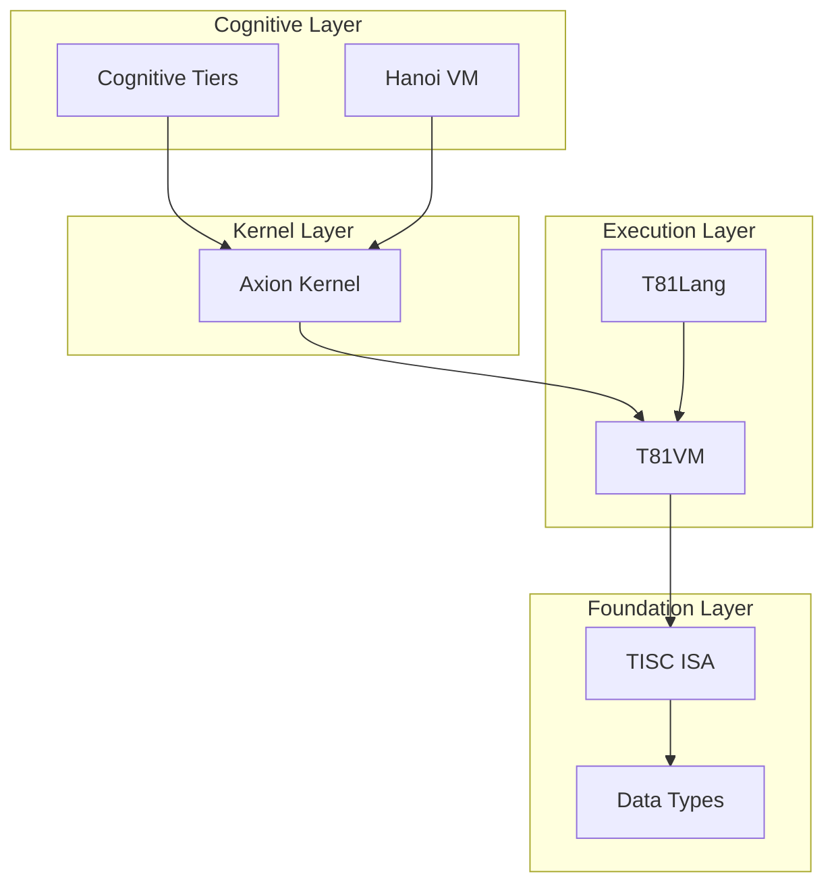
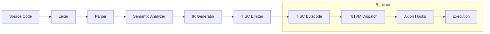

# T81 Architecture Overview

## 1. Purpose and Scope

This document serves as the canonical "north star" architecture reference for the T81 platform. It defines the system layers, execution pipeline, determinism guarantees, and governance boundaries. It is intended for contributors and auditors who need to understand the structural integrity and verified capabilities of the system.

This is not a marketing document. It strictly reflects implemented reality and frozen specifications as defined in the [Implementation Matrix](../status/IMPLEMENTATION_MATRIX.md).

In case of conflict, this document supersedes README summaries and narrative materials.

---

## 2. System Layers

The T81 stack is organized into vertical layers, from foundational data representation to higher-level execution models.

---

### Data Types

**Responsibility**
Core ternary data representation (`Trit`, `Tryte`) and base-81 arithmetic.

**Normative Spec**
[`/spec/t81-data-types.md`](../../spec/t81-data-types.md)

**Code**
`src/data_types/`

**Verification Surfaces**

* Unit tests under `tests/`
* Determinism slices executed in CI
* Cross-platform reproducibility gates

**Status**
**Implemented** (Frozen)

---

### TISC ISA

**Responsibility**
Defines the Ternary Instruction Set Computer architecture: opcodes, semantics, and register model.

**Normative Spec**
[`/spec/tisc-spec.md`](../../spec/tisc-spec.md)

**Code**
`src/tisc/`, `src/vm/`

**Verification Surfaces**

* Opcode freeze integrity checks
* VM execution tests
* Deterministic cross-architecture validation

**Status**
**Implemented** (Frozen)

---

### T81VM

**Responsibility**
Virtual machine runtime executing TISC bytecode. Handles dispatch, memory model, and IO surfaces.

**Normative Spec**
[`/spec/t81vm-spec.md`](../../spec/t81vm-spec.md)

**Code**
`src/vm/`

**Verification Surfaces**

* VM behavioral tests under `tests/`
* Determinism slices in CI
* Cross-platform execution consistency checks

**Status**
**Partial** (Beta)

---

### T81Lang

**Responsibility**
High-level language frontend and compiler targeting TISC bytecode.

**Normative Spec**
[`/spec/t81lang-spec.md`](../../spec/t81lang-spec.md)

**Code**
`src/lang/`

**Compiler Pipeline Components**

* Lexer
* Parser
* Semantic Analyzer
* IR Generator
* TISC Emitter

**Verification Surfaces**

* Compiler tests under `tests/`
* Reproducibility gate (e.g., `t81lang_repro_gate.py`)

**Status**
**Stubbed** (Experimental)

---

### Axion Kernel

**Responsibility**
Policy enforcement, capability control, and runtime governance.

**Normative Spec**
[`/spec/axion-kernel.md`](../../spec/axion-kernel.md)

**Code**
`src/axion/`

**Verification Surfaces**

* Runtime contract checks
* Policy engine unit tests

**Status**
**Partial** (Alpha)

**Capability Model Clarification**
Axion is designed to enforce capability-based access control. Current enforcement coverage is partial and evolving. Full sandbox guarantees are not yet formally verified.

---

### Cognitive Tiers

**Responsibility**
Higher-level recursive or agentic execution constructs.

**Normative Spec**
[`/spec/cognitive-tiers.md`](../../spec/cognitive-tiers.md)

**Code**
`src/tiers/`

**Status**
**Stubbed** (Concept)

---

### Hanoi VM

**Responsibility**
Higher-level VM abstraction for recursive operations and tier coordination.

**Normative Spec**
[`/spec/hanoi-kernel-spec.md`](../../spec/hanoi-kernel-spec.md)

**Code**
`src/hanoi/`

**Status**
**Concept**

---

## 3. Execution Pipeline

The system transforms source into deterministic bytecode and executes it under governance supervision.

### Determinism Boundaries

Determinism is expected at:

1. Bytecode emission (compiler reproducibility)
2. Instruction execution (VM dispatch)
3. Cross-architecture execution validation

Governance hooks (Axion) must not introduce nondeterministic behavior within verified surfaces.

---

## 4. Determinism Model

T81 defines determinism as:

> For a given source input and configuration, emitted TISC bytecode and verified execution traces must be bit-identical across supported platforms.

See `../governance/DETERMINISM_SURFACE_REGISTRY.md` for formal surface enumeration.

### Determinism Surfaces

| Surface                         | Guarantee                 | Status       | Evidence                                |
| ------------------------------- | ------------------------- | ------------ | --------------------------------------- |
| **TISC Execution**              | Bit-Exact                 | **Verified** | VM tests + cross-platform CI validation |
| **Data Types**                  | Bit-Exact Encoding        | **Verified** | Unit tests + determinism slices         |
| **Floating Point (Soft-Float)** | Strict deterministic math | **Verified** | dmath tests + CI reproducibility        |
| **Compiler Emission**           | Bit-Identical Bytecode    | **Partial**  | Reproducibility gate scripts            |
| **JIT Compilation**             | Trace Equivalence         | **Planned**  | Spec only                               |
| **Distributed Tiers**           | Consensus Determinism     | **Planned**  | Spec only                               |

Non-goals:

* Hardware FPU nondeterminism
* Unordered parallel reduction drift
* Undefined instruction semantics

---

## 5. Governance and Capability Boundaries

The system maintains guarantees through layered governance.

### Stability Guarantees

* **TISC ISA**: Frozen. Breaking changes require major version.
* **Public APIs**: Semantically versioned.
* **Determinism Gates**: Enforced through CI validation surfaces.

### Capability Model

* Axion Kernel is designed to enforce capability-based access control.
* Enforcement coverage is currently partial and evolving.
* No claim of fully hardened sandboxing beyond implemented surfaces.

### Governance Documentation

* `/docs/governance/`
* `/docs/status/`
* `/docs/spec/INDEX.md`

---

## 6. Canonical Documentation Map

Documentation authority is structured as follows:

**Normative Specs**
`/spec/` — Authoritative technical specifications.

**Spec Index / Cross-Reference Layer**
`/docs/spec/INDEX.md`

**System Status and Reality Mapping**

* `/docs/status/SYSTEM_STATUS.md`
* `/docs/status/IMPLEMENTATION_MATRIX.md`

**Governance and Contracts**

* `/docs/governance/`

**Narrative / Monograph**

* `/book/`

**Exploratory / Experimental**

* `/notebooks/`

**Generated Artifacts**

* `/artifacts/` (ignored from version control)

---

## 7. Development Workflow (Minimal)

1. Start with this document.
2. Read `/docs/spec/INDEX.md` to locate the relevant normative spec in `/spec/`.
3. Align code changes in `src/` with that specification.
4. Ensure corresponding tests exist under `tests/`.
5. Maintain root hygiene — no new files in repository root.

### Structural Rules

* `/spec/` defines standards.
* `/docs/` explains and maps.
* `/book/` narrates.
* `/notebooks/` experiments.
* `/artifacts/` contains generated outputs.
