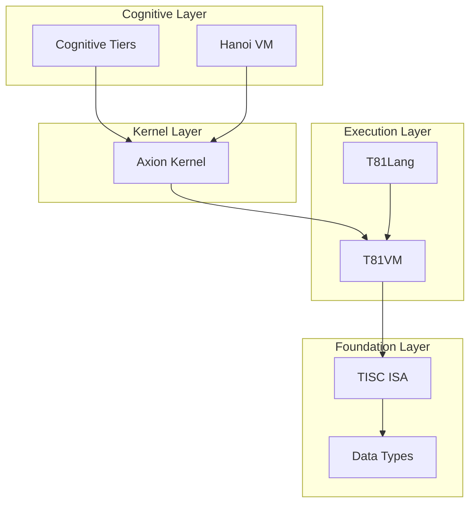
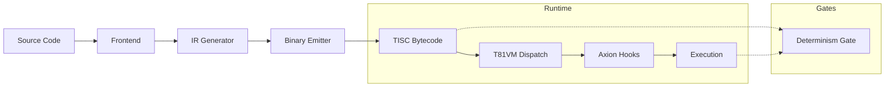

# T81 Architecture Overview

## 1. Purpose and Scope

This document serves as the canonical "north star" architecture reference for the T81 platform. It defines the system layers, execution pipeline, determinism guarantees, and governance boundaries. It is intended for contributors and auditors who need to understand the structural integrity and verified capabilities of the system.

This is not a marketing document. It strictly reflects the implemented reality and the frozen specifications as defined in the [Implementation Matrix](../status/IMPLEMENTATION_MATRIX.md).

## 2. System Layers

The T81 stack is organized into vertical layers, from data representation to high-level cognitive models.

### Data Types
*   **Responsibility**: Core ternary data representation (`Trit`, `Tryte`) and base-81 arithmetic.
*   **Spec**: [t81-data-types.md](../spec/t81-data-types.md)
*   **Code**: `src/data_types`
*   **Status**: **Implemented** (Frozen)

### TISC ISA
*   **Responsibility**: The Ternary Instruction Set Computer architecture. Defines the opcodes and register file.
*   **Spec**: [tisc-spec.md](../spec/tisc-spec.md)
*   **Code**: `src/tisc`, `src/vm`
*   **Status**: **Implemented** (Frozen)

### T81VM
*   **Responsibility**: The virtual machine runtime for executing TISC bytecode. Handles dispatch, memory, and IO.
*   **Spec**: [t81vm-spec.md](../spec/t81vm-spec.md)
*   **Code**: `src/vm`
*   **Status**: **Partial** (Beta)

### T81Lang
*   **Responsibility**: The high-level language compiler and standard library.
*   **Spec**: [t81lang-spec.md](../spec/t81lang-spec.md)
*   **Code**: `src/lang`
*   **Status**: **Stubbed** (Experimental)

### Axion Kernel
*   **Responsibility**: Safety, policy enforcement, and resource management kernel.
*   **Spec**: [axion-kernel.md](../spec/axion-kernel.md)
*   **Code**: `src/axion`
*   **Status**: **Partial** (Alpha)

### Cognitive Tiers
*   **Responsibility**: Recursive execution models for scaling intelligence.
*   **Spec**: [cognitive-tiers.md](../spec/cognitive-tiers.md)
*   **Code**: `src/tiers`
*   **Status**: **Stubbed** (Concept)

### Hanoi VM
*   **Responsibility**: High-level virtual machine layer for recursive operations.
*   **Spec**: [hanoi-kernel-spec.md](../spec/hanoi-kernel-spec.md)
*   **Code**: `src/hanoi`
*   **Status**: **Concept**

## 3. Execution Pipeline

The flow from source code to verified execution involves several stages, with explicit determinism gates.

## 4. Determinism Model

T81 guarantees bit-exact reproducibility for verified surfaces.

| Surface | Guarantee | Status | Evidence pointer |
| :--- | :--- | :--- | :--- |
| **TISC Execution** | Bit-Exact | **Verified** | `tests/fixtures/t81lang_determinism` |
| **Data Types** | Bit-Exact | **Verified** | `src/data_types` |
| **Floating Point** | Strict (Soft-Float) | **Verified** | `src/data_types` (dmath) |
| **JIT Compilation** | Trace Equivalence | **Planned** | `spec/determinism-profile.md` |
| **Distributed Tiers** | Consensus | **Planned** | `spec/cognitive-tiers.md` |

**Note on Reproducibility**: In this project, "reproducible" means that for a given input and configuration, the binary output (hash) is identical across all supported architectures (x86/ARM, macOS/Linux). We actively avoid hardware floating-point units for normative calculations.

## 5. Governance and Capability Boundaries

The project operates under strict governance to maintain its guarantees.

*   **Stability Guarantees**:
    *   **TISC ISA**: Frozen. Breaking changes require a major version bump.
    *   **Public APIs**: Semantically versioned.
*   **Sandbox Model**:
    *   **Axion Kernel**: Enforces capability-based access control. All execution is sandboxed by default.
    *   **Current Status**: Basic policy engine exists; kernel features are partial.
*   **Governance Documentation**:
    *   See [Governance](../governance/CAPABILITY_CONTRACT.md) for the full capability contract.

## 6. Canonical Documentation Map

The documentation is organized by function and authority.

*   **Specs** (`/docs/spec/INDEX.md`): The authoritative technical specifications.
*   **System Status** (`/docs/status/SYSTEM_STATUS.md`): Current health and maintenance status.
*   **Implementation Matrix** (`/docs/status/IMPLEMENTATION_MATRIX.md`): Mapping of specs to code reality.
*   **Governance** (`/docs/governance/`): Policy and process documents.
*   **The Book** (`/book/book-en/`): The narrative technical monograph.

**Directory Roles**:
*   `/docs`: Canonical reference and architecture.
*   `/book`: Educational and narrative content.
*   `/spec`: Normative standards.
*   `/notebooks`: Exploratory data and examples.
*   `/artifacts`: Build outputs and reports (ignored).

## 7. Development Workflow (Minimal)

1.  **Start Here**: Read [CONTRIBUTING.md](../../CONTRIBUTING.md) in the root.
2.  **Spec-Driven**: All code changes must trace back to a specification in `docs/spec`.
3.  **Root Hygiene**: Do not add new files to the root directory.
4.  **Experiments**: Place experimental code in `examples/` or create a feature branch. Do not commit stubs to `src/` without a corresponding spec update.
