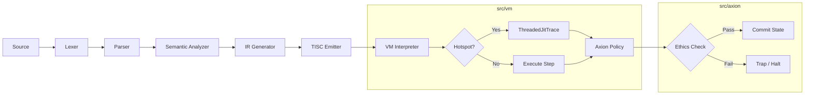
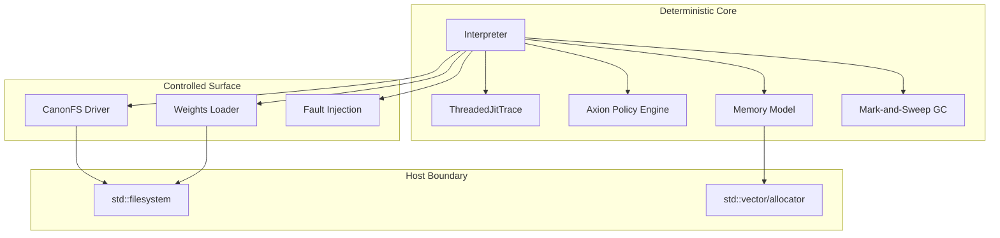
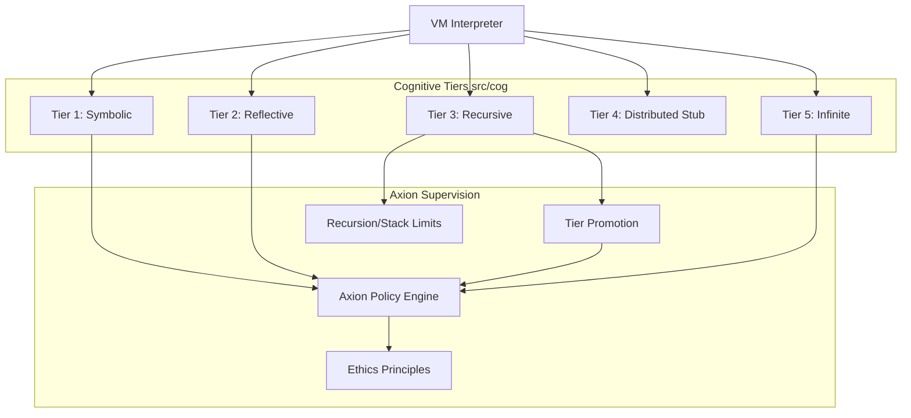

# T81 Canonical Architecture

This document defines the authoritative architecture of the T81 system as implemented in the current codebase.

## 1. Execution Pipeline

The execution pipeline transforms source code into TISC bytecode, which is then executed by the T81 VM under strict Axion policy supervision.



## 2. Runtime Boundary

The system strictly separates the deterministic core logic from the host-dependent surface and experimental features.



## 3. Cognitive Tier Escalation

The Cognitive Tier model defines the capabilities available to the runtime, escalating from basic symbolic manipulation to infinite series expansion, all supervised by Axion.



## Coverage Notes

- **Tier 4 (Distributed)**: The implementation files exist (`src/cog/tier4/distributed.cpp`), but the opcodes (`Merge`, `Gossip`, etc.) are currently stubs in `src/vm/vm.cpp` that log events but perform no network operations.
- **JIT**: The "JIT" is implemented as a tracing interpreter (`ThreadedJitTrace`), not a machine-code emitting JIT. It resides entirely within the deterministic core.
- **Network I/O**: Network opcodes (`NSend`, `NRecv`) are placeholders returning dummy values or strictly logging events, ensuring no nondeterministic network interaction occurs in the current implementation.
- **Weights**: Supported formats are GGUF and SafeTensors (via conversion), and the native T81W format.
```
