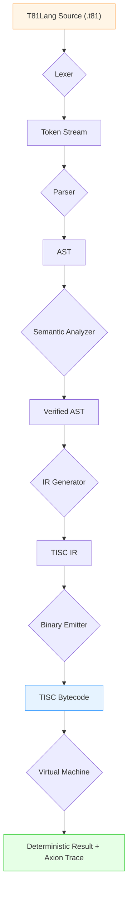
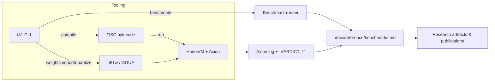

# T81 Foundation User Manual

> This manual mirrors the manifesto portal: determinism, reproducibility, and Axion transparency form the ledger for every artifact we ship.

## Purpose & Principles

- Balanced ternary arithmetic (`T81Int`, `T81Fraction`, `T81Float`, `T81Tensor`) anchors every deterministic payload—we enforce `encode(decode(x)) ≡ x`, Axion traps on ±∞, and `../../spec/` is the immutable ledger (RFCs via `../../spec/rfcs/template.md`).
- Axion oversees every execution, policy, and trace (`../guides/axion-trace.md`, `../../spec/axion-kernel.md`); artifact bundles must include Axion logs (`build/artifacts/*axion*.log`) so future reviewers can replay every verdict.
- Public APIs live in `../../include/t81/` under `t81::v1`; implementation lives in `../../src/`; `../../legacy/hanoivm/` remains a read-only oracle for behavior matching.

## Getting Started

### Prerequisites
+ Clone the repo and gather the tools (C++23 compiler, CMake ≥3.16, Ninja/Make, Python ≥3.9, Node.js) listed in `ai-quickstart.md`/`cpp-quickstart.md`; the manifest pipeline depends on reproducible host tooling.
+ Align `git` with your identity and read `../../AGENTS.md` before editing; it encodes the deterministic rituals, Axion axioms, and portal guardrails.

### Build & Test Ritual
```bash
cmake -S . -B build -DCMAKE_BUILD_TYPE=Release
cmake --build build --parallel
ctest --test-dir build --output-on-failure
```
Optionally run the property/fuzz suite:
```bash
ctest --test-dir build -R "fuzz|property|axion" --schedule-random
```
This exact pipeline is mandated by `../../AGENTS.md` and reiterated in `../../README.md`/`onboarding.md` — it must run before publishing changes or citing benchmark numbers.

### First Actions
1. Read `../../spec/index.md` for the layered specification (Data Types, TISC, T81VM, T81Lang, Axion, Cognitive Tiers) so you can align new work with the formal contract.
2. Review `onboarding.md` for the first diagnostic steps and `ai-quickstart.md` for agent-friendly workflows.
3. Generate docs with `cmake --build build --target docs` and open `build/api/html/index.html` if you need API context.

## Core Workflows

### Deterministic Workloads
- Compile source: `t81 compile <source.t81> [-o <output>.tisc]` (embed Axion policies with `-P policy/<name>.axion`, enable guard traces with `--verbose`).
- Execute: `t81 run <program>.tisc` (Axion policy comes from the binary; use `AXTRACE=full` for verbose guard/segment logs).
- Validate: `t81 check <file.t81>` gives file:line:column diagnostics; `t81 repl [--policy ...]` lets you inspect `:trace`, `:rules`, and `:load` for Axion state.
- Use `../guides/cli-user-manual.md` and `../guides/cli-toolkit.md` for every flag, trace pattern, and automation recipe.

### Reproducibility Handshake
Run the following sequence between two different CPU architectures to prove deterministic parity:
```bash
t81 run model.tisc --check-sum output.bin
sha3sum output.bin reference/output.bin
```
If the SHA3-512 hash of `output.bin` does not match the reference artifact, Axion raises a `VERDICT_DIVERGENCE` trap. Keep the paired Axion log (`build/artifacts/axion_policy_runner.log`) with the artifact so auditors can replay the divergence path.

### Ternary Tensor & Weight Pipelines
- Import SafeTensors/GGUF: `t81 weights import <file>` (produces `.t81w` bundles with SHA3-512 metadata, bits/trit stats, and CanonFS hints).
- Quantize: `t81 weights quantize <path> --to-gguf <out.gguf>` to emit T3_K blocks compatible with `llama.cpp` while preserving ternary invariants.
- Inspect: `t81 weights info <model.t81w>` reports tensor counts, sparsity, limb layout, and canonical hashes. See `../guides/weights-integration.md` for integrating these artifacts into HanoiVM programs (e.g., `weights.load("model.t81w")`).

### Ternary Debugging Cheat Sheet
| Decimal | Balanced Ternary (4 trits) | Notes |
| --- | --- | --- |
| 0 | `0 0 0 0` | canonical zero, no carries.
| 1 | `0 0 0 1` | positive unit, easiest to reason about.
| -1 | `0 0 0 -1` | negative unit, observe Axion guard sign bits.
| 4 | `0 1 0 -1` | 4-trit bias example: decompose as `+3 +1`.
| -4 | `0 -1 0 1` | mirror to enforce canonical form.
This table is a quick reference when translating between decimal research notes, 4-trit bias values, and balanced ternary constants during debugging.

### Benchmarks & Instrumentation
- Regenerate benchmarks after arithmetic, compiler, or tensor changes by running `t81 benchmark` (or `./build/t81 benchmark`).
- `benchmarks/benchmark_runner` generates `docs/reference/benchmarks.md`, which is the canonical report for throughput/latency/density comparisons.
- Capture Axion traces with `scripts/capture-axion-trace.sh` to produce `axion_policy_runner.log` and `vm_bounds_trace.log` for auditors; pair these logs with findings from `../guides/axion-trace.md` and `../guides/axion-policy-manual.md`.

## Architecture & Specification Map

### Logical Layers
- `include/t81/` (`t81::v1`) holds public, header-only data types and APIs.
- `src/` hosts implementations grouped into libraries (`t81_core`, `t81_io`, `t81_tisc`, `t81_frontend`, `t81_vm`) described in `../explanation/ARCHITECTURE.md`.
- `t81` binary orchestrates CLI, compiler, Axion, and VM behavior.

### Architecture Diagram


### Workflow Diagram


### Directory Roles (per README + onboarding.md)
| Path | Role |
| --- | --- |
| `/spec/` | Immutable constitution (updates require RFCs in `spec/rfcs/`). |
| `/include/t81/` | Public contract; add APIs without breaking existing declarations. |
| `/src/` | Core implementations; obey ternary invariants from `AGENTS.md`. |
| `/tests/` | Regression proofs; every public change needs coverage. |
| `/benchmarks/` | Benchmark runners and report generators. |
| `/docs/` | Guides, quickstarts, release notes, and assets. |
| `/examples/` | Sample T81Lang programs, including `examples/weights_load_demo.t81`. |
| `/legacy/hanoivm/` | Read-only reference implementation for behavior matching. |

### Specification Documents
Consult these in order for any behavior change: `../../spec/t81-data-types.md`, `../../spec/tisc-spec.md`, `../../spec/t81vm-spec.md`, `../../spec/t81lang-spec.md`, `../../spec/axion-kernel.md`, `../../spec/cognitive-tiers.md`. The layered expectation is spelled out in `../../spec/index.md`.

## CLI, Tools, and Observability

- `./build/t81 --help` lists subcommands such as `compile`, `run`, `repl`, `benchmark`, `weights import`, and `weights quantize` (see `../guides/cli-user-manual.md`).
- Use advanced switches (`--trace-guards`, `--emit-axion-log`, `--profile`) to populate Axion trace profiles from `../../tools/axion-profiler` and match the traces in `../guides/runtime-observability-manual.md`.
- Policy tooling includes the `axion_policy_trace` and `axion_policy_runner` targets; rerun `scripts/capture-axion-trace.sh` to log guard events referenced by `spec/axion-kernel.md`.

### Axion Modes
Clarify how Axion treats policy violations:
1. **Enforcement Mode (Production)** – Axion halts execution on the first policy violation or semantic divergence, returning `VERDICT_FAILURE`. Use this for release builds that must never continue past a fault.
2. **Observability Mode (Research/Profiling)** – Axion logs every violation (matching `docs/guides/axion-trace.md` samples) but lets execution proceed, allowing researchers to gather guard coverage data before fixing the issue. Toggle it via `AXION_MODE=observability` or similar switches described in `policy/README`.
Consult `policy/README` for the exact CLI flag or environment variable syntax; many scripts in `scripts/` already set `AXION_MODE=observability` when running long-trace captures so you can compare enforcement logs against relaxed profiles.

## Documentation & Artifact Strategy

- Docs live under `../` (benchmarks, onboarding, quickstarts, guides, search index). Update `../reference/benchmarks.md` after benchmark runs and describe new features in `../guides/*` or `../notes.md`.
- Auto-generated API docs live under `build/api/html` (build via `cmake --build build --target docs`).
- Use `../guides/demo-gallery.md`, `../guides/match-patterns.md`, and `../guides/vector-literals.md` to illustrate language patterns in publications.
- Keep release notes synchronized with `../roadmaps-plans/RELEASING.md` and `../roadmaps-plans/hardware-roadmap.md` when shipping new behavior.

## Governance & Contribution Expectations

- All agents must follow `../../AGENTS.md`: read-only spec, no hidden nondeterminism, encode/decode invariants, Axion traps on overflow, and zero global mutable state.
- New features touching semantics require spec changes via RFC: copy `../../spec/rfcs/template.md` → `../../spec/rfcs/00xx-title.md`, fill in motivation/proposal/impact/alternatives, and open a PR titled “RFC: Your Title.”
- Every new public API or behavioral change must add tests under `/tests/` and obey the testing doctrine in `../../AGENTS.md` (property-based tests preferred).
- Document architectural decisions in `../explanation/ARCHITECTURE.md`, `../explanation/DESIGN.md`, or `../explanation` as appropriate; update `docs/tools`, `docs/benchmarks`, or `docs/notes.md` when introducing new observable behavior.
- Report status/issues via `../reference/system-status.md`, `../../CLAUDE.md`, and `../explanation/ANALYSIS.md` before claiming readiness.

## Troubleshooting & Next Steps

- If the build is stale, delete `build/` and rerun CMake (noted in `docs/onboarding.md`).
- On heterogeneous hardware (e.g., Apple Silicon), expect AVX2 warnings—focus on functionality, not noise.
- When Axion policies trap, use `t81 repl` → `:trace` to expose the missing `verdict.reason` string referenced by `../guides/axion-policy-manual.md`.
- Keep metrics deterministic by always pairing `weights.load` demos with recorded Axion logs and canonical `../reference/benchmarks.md` tables.

### Additional Resources
- Guides: `../guides/cli-user-manual.md`, `../guides/weights-integration.md`, `../guides/axion-trace.md`, `../guides/runtime-observability-manual.md`, `../guides/public-api-overview.md`.
- Specs: `../../spec/index.md`, `../../spec/axion-kernel.md`, `../../spec/tisc-spec.md`, `../../spec/t81vm-spec.md`, `../../spec/t81lang-spec.md`, `../../spec/t81-data-types.md`.
- Onboarding & AI agent playbooks: `onboarding.md`, `ai-quickstart.md`.
- Release & governance: `../roadmaps-plans/RELEASING.md`, `../reference/system-status.md`, `../../spec/rfcs/` rubric, `../../AGENTS.md`.

Small contributions should follow the deterministic, Axion-traced path laid out here, ensuring every artifact is verifiable and every behavior matches the constitution.
