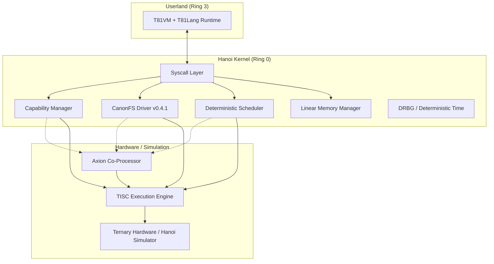
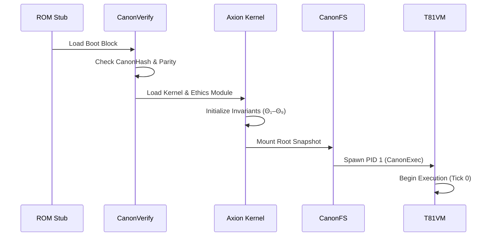
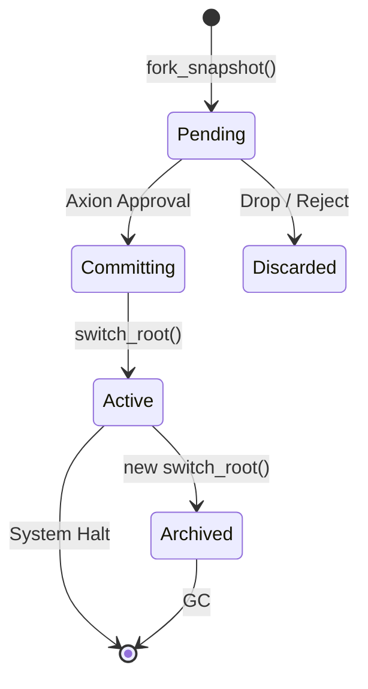
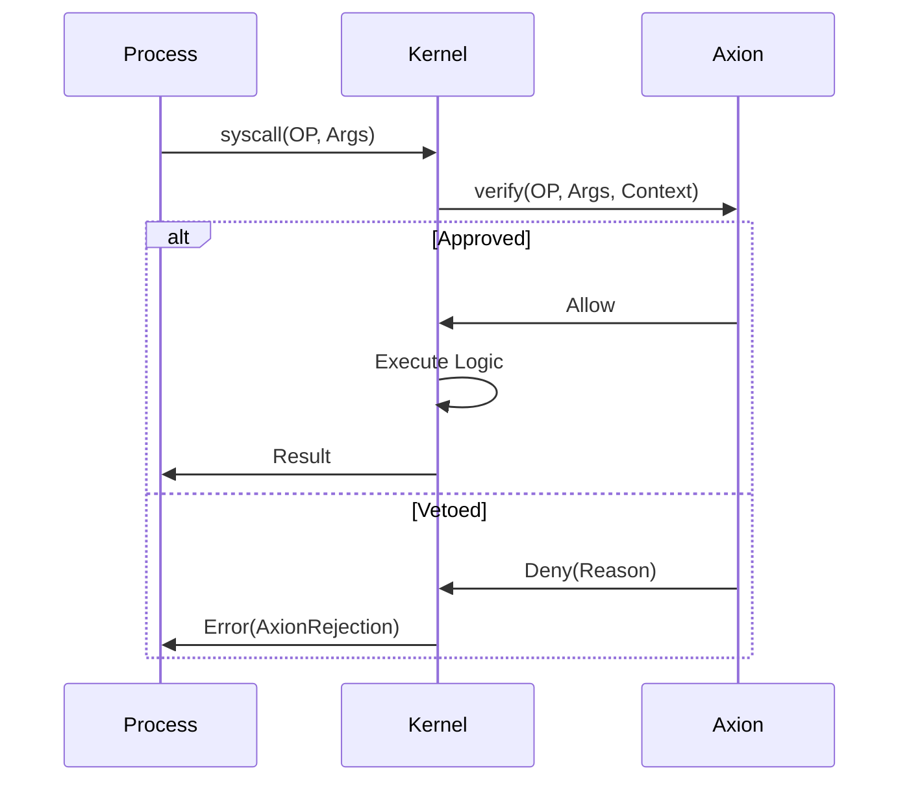

> **Note:** This specification describes an experimental microkernel architecture ("Hanoi Kernel") which differs from the current normative TISC and VM specifications. For the authoritative definition of the TISC ISA and HanoiVM execution model, refer to [`tisc-spec.md`](tisc-spec.md) and [`t81vm-spec.md`](t81vm-spec.md).

# Hanoi Kernel v0.1.1

**A Deterministic, Capability-Native, Axion-Governed Microkernel for T81-Class Machines**

This specification defines the complete behavior of the Hanoi kernel:
architecture, boot flow, syscall interface, ABI, deterministic entropy model,
CanonSeal key derivation, diagrams, and implementation scaffold.

This is the canonical v0.1.1 revision.

______________________________________________________________________

# 0. Glossary & Formal Definitions

Before proceeding, the following terms are rigorously defined to prevent ambiguity in this specification.

- **Axion Θ₁–Θ₉**: The nine ethical axioms encoded as immutable constraints within the Axion Co-Processor. These govern all state transitions, prohibiting unsafe recursion, resource exhaustion, and ethical violations.
- **CanonBlock**: The atomic unit of storage in CanonFS. It is exactly 729 trytes in size.
- **CanonRef**: A content-addressed reference to a CanonBlock, consisting of `CanonHash-81(payload)`. It serves as a pointer in the Merkle-81 tree.
- **CanonSeal**: A cryptographic envelope (T81-AEAD-81) that wraps a CanonObject, ensuring confidentiality and integrity. The key is derived deterministically from the object's identity and its capability context.
- **CanonHash-81**: The mandatory cryptographic hash function (based on BLAKE3 projected into Base-81) used for all content addressing.
- **CanonParity**: Reed-Solomon error correction shards stored alongside data to allow deterministic recovery of lost blocks.
- **Merkle-81**: A Merkle tree structure where each node has up to 81 children, optimizing for ternary logic and CanonBlock alignment.
- **TISC (Ternary Instruction Set Computer)**: The underlying instruction set architecture executing on the hardware or simulator.
- **T81VM**: The virtual machine running user-space code, providing the environment for T81Lang execution.
- **HanoiError**: The exhaustive set of possible kernel failures, modeled as a deterministic enum.
- **Tryte**: A unit of information consisting of 3 trits, capable of representing values from -13 to +13 (balanced) or 0 to 26 (unsigned).
- **SnapshotRef**: A handle to a specific, immutable CanonFS root, representing the entire system state at a specific tick.
- **LZ81**: A Lempel-Ziv variant optimized for tryte streams, used for deterministic compression.
- **Z3std**: A Zstandard variant adapted for high-entropy ternary data, used for large tensor compression.
- **DRBG (Deterministic Random Bit/Tryte Generator)**: A mechanism to produce pseudo-randomness solely from a deterministic seed, ensuring perfect replayability.

______________________________________________________________________

# 1. Executive Summary

Hanoi is a **deterministic ternary microkernel** serving as the constitutional OS substrate for the T81 ecosystem:

- TISC instruction execution
- T81VM and T81Lang runtime
- CanonFS v0.4.1 as the only storage
- Axion Θ₁–Θ₉ ethical enforcement
- T243 → T19683 cognitive tier promotion

It is designed to be:

- Fully deterministic
- Capability-native
- Immutable
- Perfectly replayable
- Axion-supervised at every transition
- Self-healing
- Rooted in content addressing and CanonFS snapshots

Hanoi is not a general-purpose OS.\
It is the *execution substrate* for T81-class machines.

______________________________________________________________________

# 2. Kernel Invariants (The Hanoi Creed)

Violation of any invariant means the system is **not Hanoi**.

01. **No mutable global state** outside capability boundaries.
02. **Every object is a CanonRef** (content hash + capability + optional sealing).
03. **CanonFS is the sole storage abstraction**; the root is always a snapshot.
04. **Axion veto authority** extends to all syscalls and state transitions.
05. **Syscalls are total functions** returning `Result<T, HanoiError>`.
06. **Deterministic scheduling** — global 81-slot tick.
07. **No userspace drivers** — all kernel drivers are CanonFS modules.
08. **Boot requires full canonical verification** (CanonHash-81 + CanonParity).
09. **Entropy is deterministic**, seeded from the snapshot; no nondeterministic RNG.
10. **Sealed objects use derived per-object keys**, no mutable key state.

______________________________________________________________________

# 3. High-Level Architecture



The architecture strictly separates concerns. The **Hanoi Kernel** mediates all access to hardware resources through the **Axion Co-Processor**, which validates every privileged operation against the system invariants.

______________________________________________________________________

# 4. Boot Process — 7 Deterministic Stages

The boot process is a rigorous chain of trust. Every stage must verify the next before yielding control.

| Stage | Name | Action | Failure → |
|-------|------------------|--------------------------------------------------|-----------|
| 0 | ROM Stub | Load first 729-tryte CanonBlock from boot medium | AXHALT |
| 1 | CanonVerify | Verify snapshot integrity via CanonHash-81 & CanonParity | AXHALT |
| 2 | Decompress | Inflate kernel image (LZ81/Z3std) → RAM | AXHALT |
| 3 | AxionSeal | Load Axion ethics module (Θ₁–Θ₉) and lock policies | AXHALT |
| 4 | CapabilityRoot | Mint root capability from snapshot hash | AXHALT |
| 5 | Mount CanonFS | Mount root snapshot at `/` (e.g., `/snapshot/latest`) | AXHALT |
| 6 | Start T81VM | Exec `CanonExec` binary as PID 1 | AXHALT |
| 7 | Enter Userspace | Begin deterministic global tick (Tick 0) | — |

On any failure:

```
AXHALT(reason):
    freeze state → emit canonical lineage dump → halt permanently
```

### Boot Flow Diagram



______________________________________________________________________

# 5. Core Kernel Subsystems

## 5.1 Capability Manager

### Rationale
Hanoi rejects Discretionary Access Control (DAC) and Access Control Lists (ACLs) in favor of Object Capabilities (OCap). Security is not a check on "who you are" but "what you hold".

### Formal Model
A capability is a tuple:
`Cap := (ObjectRef, PermMask, ScopeID, AxionSig)`
- `ObjectRef`: CanonHash-81 of the target.
- `PermMask`: Bitmask of allowed operations (Read, Write, Exec, Grant).
- `ScopeID`: Topological region of the object graph.
- `AxionSig`: Cryptographic proof of validity.

### Invariants Enforced
1. **Unforgeability**: Capabilities cannot be created by userspace, only granted.
2. **Connectivity**: Access implies possession of a valid capability.
3. **Revocation**: Revocation is immediate via Axion signal propagation.

### Edge Cases & Failure Modes
- **Dangling Capability**: If an object is garbage collected, the capability becomes inert but safe. Access attempts return `CapabilityRevoked`.
- **Scope Violation**: Passing a capability outside its allowed scope triggers an Axion veto.

### Example Usage
```rust
// Grant read access to a specific block
let read_cap = kernel.grant_cap(target_block, PERM_READ)?;
process.send(recipient_pid, read_cap);
```

## 5.2 CanonFS Driver (Ring 0)

### Rationale
Storage is the single source of truth. By making the filesystem a Merkle-81 tree, the entire system state becomes a single hash.

### Formal Model
CanonFS implements a content-addressed store.
`Store: Hash -> CanonBlock`
Writes do not mutate in place; they return a new `SnapshotRef`.

### Invariants Enforced
1. **Immutability**: Blocks are never modified.
2. **Self-Healing**: Read failures trigger automatic reconstruction from parity shards.
3. **Deduplication**: Identical content shares the same storage address.

### Edge Cases & Failure Modes
- **Parity Exhaustion**: If shards < threshold, `read_block` fails with `CanonCorruption`.
- **Hash Collision**: Theoretically impossible with CanonHash-81; treated as catastrophic invariant failure (`AXHALT`).

### Example Usage
```rust
let block = canonfs.read_block(file_hash)?;
// Automatically verified and repaired
```

## 5.3 Axion Co-Processor

### Rationale
Ethics and safety cannot be left to software conventions. They must be enforced by a privileged monitor that supervises execution.

### Formal Model
Axion operates as a reference monitor `M`.
`M(State, Op) -> { Allow, Deny(Reason), Rewrite(NewOp) }`

### Invariants Enforced
1. **Θ₁–Θ₉ Compliance**: No state transition may violate the ethical axioms.
2. **Resource Boundedness**: No operation may exceed its allocated tick budget.

### Edge Cases & Failure Modes
- **Veto**: Axion denies a syscall. The process receives `AxionRejection`.
- **Panic**: If Axion detects an internal inconsistency, it halts the entire kernel (`AXHALT`).

## 5.4 Deterministic Scheduler

### Rationale
Nondeterministic interleaving is the root of most concurrency bugs. Hanoi schedules strictly by tick count.

### Formal Model
Round-robin scheduling over 81 slots.
`Schedule(Tick) -> Pid = ActivePids[Tick % 81]`

### Invariants Enforced
1. **Tick Determinism**: `State(Tick)` is strictly a function of `State(Tick-1)`.
2. **Fairness**: Every active process gets exactly 1 slot per 81 ticks.

### Edge Cases & Failure Modes
- **Budget Exhaustion**: Process halted mid-instruction if tick budget exceeded.
- **Idle**: If no process is runnable, the kernel advances the tick counter (skip).

## 5.5 Memory Manager

### Rationale
Manual memory management is unsafe. Hanoi uses a linear memory model backed by CanonFS for persistence.

### Formal Model
Memory is a sequence of Pages.
`Page := (CanonRef, Permissions)`
Allocations are strictly strictly bump-pointer or COW from CanonFS.

### Invariants Enforced
1. **No Use-After-Free**: Memory is reclaimed only when no capabilities reference it.
2. **Isolation**: Processes cannot address memory outside their capability bounds.

### Example Usage
```rust
let region = memory.map_region(canon_ref, PERM_RW)?;
// region is now accessible in process address space
```

## 5.6 Syscall Layer

### Rationale
The kernel surface must be minimal and total. Every syscall returns a result, never undefined behavior.

### Formal Model
`Syscall: (OpCode, Args...) -> Result<Value, HanoiError>`

______________________________________________________________________

# 6. Snapshot Lifecycle

Snapshots are the heart of Hanoi's state management. A snapshot represents the entire persistent state of the system at a given moment.

### Lifecycle State Machine



### 6.1 fork_snapshot()

```rust
fn fork_snapshot() -> Result<SnapshotRef, HanoiError>
```
Creates a mutable staging area (Copy-On-Write) from the current root. The new root is not yet visible to other processes.
- **Pre-condition**: Caller has `CAP_SNAPSHOT_CREATE`.
- **Post-condition**: Returns a handle to a new, isolated Merkle root.

### 6.2 commit_snapshot(snapshot)

```rust
fn commit_snapshot(snapshot: SnapshotRef) -> Result<(), HanoiError>
```
Finalizes a pending snapshot, calculating the new Merkle root hash and persisting all dirty blocks.
- **Pre-condition**: `snapshot` is valid and owned by caller.
- **Axion Check**: Verifies integrity and policy compliance.
- **Post-condition**: Snapshot is immutable and ready for activation.

### 6.3 switch_root(snapshot)

```rust
fn switch_root(snapshot: SnapshotRef) -> Result<(), AxionRejection>
```
The atomic transition.
1. **Suspend**: All userland execution pauses.
2. **Verify**: Axion confirms the target snapshot is valid.
3. **Swap**: The kernel's root pointer is updated.
4. **Resume**: Execution continues from the new root (or reboots if specified).

This guarantees a fully immutable, deterministic root-switch.

______________________________________________________________________

# 7. System Call Reference (v0.1.1)

All syscalls use the TISC `syscall` instruction. Arguments are passed in registers R0–R4. Return value in R0. Error code in R1 if R0 indicates failure.

| ID | Name | Signature | Notes |
|------|-------------------|----------------------------------------------------------------|-------|
| 0x00 | fork_snapshot | `() -> Result<SnapshotRef>` | Create new snapshot root. |
| 0x01 | commit_snapshot | `(snapshot) -> Result<()>` | Write snapshot to timeline. |
| 0x02 | switch_root | `(snapshot) -> Result<()>` | Replace active snapshot (Axion-guarded). |
| 0x03 | spawn | `(exec: CanonRef) -> Result<Pid>` | Launch T81VM instance. |
| 0x04 | read_block | `(path) -> Result<CanonBlock, CorruptionFixed>` | Auto-repair on read. |
| 0x05 | read_object | `(href) -> Result<CanonObject>` | Load + repair + decompress. |
| 0x06 | grant_cap | `(cap) -> Result<CanonRef>` | Install capability. |
| 0x07 | revoke_cap | `(href) -> Result<()>` | Publish tombstone. |
| 0x08 | yield_tick | `() -> ()` | Yield to next global tick. |
| 0x09 | map_region | `(href) -> Result<RegionHandle>` | Map object. |
| 0x0A | seal_object | `(href) -> Result<CanonRef>` | Wrap in CanonSeal. |
| 0x0B | unseal_object | `(href) -> Result<CanonRef>` | Unseal using derived key. |
| 0x0C | drbg | `() -> DeterministicRandomTrytes` | Deterministic entropy. |
| 0x0D | parity_repair | `(root) -> Result<()>` | Repair subtree. |
| 0x0E | halt | `(reason) -> !` | Permanent halt. |

### Detailed Specification

#### 0x00: fork_snapshot
**Signature**: `fork_snapshot() -> Result<SnapshotRef>`
- **Args**: None.
- **Pre-conditions**: `CAP_SNAPSHOT_CREATE`.
- **Axion Veto**: If snapshot rate exceeds `Θ_RATE_LIMIT`.
- **Pseudocode**:
  ```rust
  fn sys_fork_snapshot() -> Result<SnapshotRef, HanoiError> {
      let current = fs::get_root();
      let new_cow = fs::cow_clone(current);
      Ok(new_cow.handle())
  }
  ```

#### 0x01: commit_snapshot
**Signature**: `commit_snapshot(snapshot: SnapshotRef) -> Result<()>`
- **Args**: `snapshot` - Handle to the pending snapshot.
- **Pre-conditions**: Caller owns `snapshot` and has `CAP_SNAPSHOT_COMMIT`.
- **Axion Veto**: If merkle root fails verification or dirty blocks contain illegal states.
- **Pseudocode**:
  ```rust
  fn sys_commit_snapshot(handle: SnapshotRef) -> Result<(), HanoiError> {
      let snap = fs::get_pending(handle)?;
      axion::verify_integrity(snap)?;
      fs::persist(snap)?;
      Ok(())
  }
  ```

#### 0x02: switch_root
**Signature**: `switch_root(snapshot: SnapshotRef) -> Result<()>`
- **Args**: `snapshot` - Handle to a committed snapshot.
- **Pre-conditions**: `CAP_ROOT_SWITCH`.
- **Axion Veto**: Strict check. If `snapshot` is not in the canonical lineage or violates `Θ_IMMUTABILITY`.
- **Pseudocode**:
  ```rust
  fn sys_switch_root(handle: SnapshotRef) -> Result<(), HanoiError> {
      let snap = fs::get_committed(handle)?;
      axion::approve_transition(current_root(), snap)?;
      scheduler::suspend_all();
      fs::set_root(snap);
      scheduler::resume_all();
      Ok(())
  }
  ```

#### 0x03: spawn
**Signature**: `spawn(exec: CanonRef) -> Result<Pid>`
- **Args**: `exec` - Hash of the `CanonExec` object.
- **Pre-conditions**: `CAP_EXEC` for the object.
- **Axion Veto**: Rejects if recursion depth > limit or violates Θ safety.
- **Pseudocode**:
  ```rust
  fn sys_spawn(exec_ref: CanonRef) -> Result<Pid, HanoiError> {
      let exec_obj = canonfs::load(exec_ref)?;
      axion::verify_exec(exec_obj)?;
      let pid = scheduler::allocate_slot()?;
      let process = Process::new(pid, exec_obj);
      scheduler::schedule(process);
      Ok(pid)
  }
  ```

#### 0x04: read_block
**Signature**: `read_block(path: CanonRef) -> Result<CanonBlock, CorruptionFixed>`
- **Args**: `path` - The content hash to read.
- **Pre-conditions**: `CAP_READ` for the object scope.
- **Axion Veto**: None (read-only), unless access pattern violates side-channel protections.
- **Pseudocode**:
  ```rust
  fn sys_read_block(hash: CanonRef) -> Result<CanonBlock, HanoiError> {
      cap_mgr::check_access(hash, PERM_READ)?;
      match canonfs::fetch(hash) {
          Ok(block) => Ok(block),
          Err(Corrupt) => canonfs::repair(hash),
      }
  }
  ```

#### 0x05: read_object
**Signature**: `read_object(href: CanonRef) -> Result<CanonObject>`
- **Args**: `href` - Object hash.
- **Pre-conditions**: `CAP_READ`.
- **Description**: Like `read_block` but handles objects larger than 729 trytes (reassembly).
- **Pseudocode**:
  ```rust
  fn sys_read_object(hash: CanonRef) -> Result<CanonObject, HanoiError> {
      let root_block = sys_read_block(hash)?;
      if root_block.is_multi_part() {
          canonfs::reassemble(root_block)
      } else {
          Ok(CanonObject::from(root_block))
      }
  }
  ```

#### 0x06: grant_cap
**Signature**: `grant_cap(cap: Capability) -> Result<CanonRef>`
- **Args**: `cap` - The capability structure to grant.
- **Pre-conditions**: Caller must hold `CAP_GRANT` on the target object.
- **Axion Veto**: If granting exceeds scope or creates circular trust violation.
- **Pseudocode**:
  ```rust
  fn sys_grant_cap(cap: Capability) -> Result<CanonRef, HanoiError> {
      cap_mgr::verify_ownership(current_pid(), cap.object)?;
      axion::verify_delegation(cap)?;
      let signed_cap = cap_mgr::sign(cap);
      canonfs::store(signed_cap)
  }
  ```

#### 0x07: revoke_cap
**Signature**: `revoke_cap(href: CanonRef) -> Result<()>`
- **Args**: `href` - Hash of the capability to revoke.
- **Pre-conditions**: Caller is the granter of the capability.
- **Axion Veto**: None.
- **Pseudocode**:
  ```rust
  fn sys_revoke_cap(cap_hash: CanonRef) -> Result<(), HanoiError> {
      cap_mgr::verify_granter(current_pid(), cap_hash)?;
      cap_mgr::emit_revocation_tombstone(cap_hash);
      Ok(())
  }
  ```

#### 0x08: yield_tick
**Signature**: `yield_tick() -> ()`
- **Args**: None.
- **Description**: Voluntarily relinquishes the remainder of the process's time quantum.
- **Pseudocode**:
  ```rust
  fn sys_yield() {
      scheduler::current_process().tick_budget = 0;
      scheduler::schedule_next();
  }
  ```

#### 0x09: map_region
**Signature**: `map_region(href: CanonRef) -> Result<RegionHandle>`
- **Args**: `href` - Object to map into address space.
- **Pre-conditions**: `CAP_READ` (and `CAP_WRITE` if COW).
- **Axion Veto**: If region overlaps reserved memory or exceeds total memory budget.
- **Pseudocode**:
  ```rust
  fn sys_map_region(hash: CanonRef) -> Result<RegionHandle, HanoiError> {
      let size = canonfs::get_size(hash)?;
      mem_mgr::check_budget(current_pid(), size)?;
      let vaddr = mem_mgr::find_free_range(size)?;
      mem_mgr::map(vaddr, hash);
      Ok(vaddr)
  }
  ```

#### 0x0A: seal_object
**Signature**: `seal_object(href: CanonRef) -> Result<CanonRef>`
- **Args**: `href` - Object to seal.
- **Description**: Encrypts the object using a key derived from the current snapshot and the object's identity.
- **Pseudocode**:
  ```rust
  fn sys_seal_object(href: CanonRef) -> Result<CanonRef, HanoiError> {
      let obj = canonfs::get(href)?;
      let key = kdf::derive_seal_key(href, current_snapshot_hash());
      let sealed = crypto::aead_seal(key, obj);
      canonfs::store(sealed)
  }
  ```

#### 0x0B: unseal_object
**Signature**: `unseal_object(href: CanonRef) -> Result<CanonRef>`
- **Args**: `href` - Sealed object hash.
- **Pre-conditions**: Caller must have the capability used to seal it (or a derived delegation).
- **Pseudocode**:
  ```rust
  fn sys_unseal_object(href: CanonRef) -> Result<CanonRef, HanoiError> {
      let sealed = canonfs::get(href)?;
      let key = kdf::derive_seal_key(sealed.identity, current_snapshot_hash());
      let plain = crypto::aead_open(key, sealed)?;
      canonfs::store(plain)
  }
  ```

#### 0x0C: drbg
**Signature**: `drbg() -> DeterministicRandomTrytes`
- **Args**: None.
- **Description**: Returns 81 trytes of entropy.
- **Pseudocode**:
  ```rust
  fn sys_drbg() -> [Tryte; 81] {
      crypto::drbg_next(current_pid())
  }
  ```

#### 0x0D: parity_repair
**Signature**: `parity_repair(root: CanonRef) -> Result<()>`
- **Args**: `root` - Root of the subtree to repair.
- **Description**: Manually triggers parity reconstruction for a damaged tree.
- **Pseudocode**:
  ```rust
  fn sys_parity_repair(root: CanonRef) -> Result<(), HanoiError> {
      let tree = canonfs::walk(root);
      if tree.is_damaged() {
          let parity = canonfs::fetch_parity(root)?;
          reedsolomon::reconstruct(tree, parity)?;
      }
      Ok(())
  }
  ```

#### 0x0E: halt
**Signature**: `halt(reason: Tryte) -> !`
- **Args**: `reason` - Status code.
- **Description**: Terminates the process. If PID 1 halts, the system halts.
- **Pseudocode**:
  ```rust
  fn sys_halt(reason: Tryte) -> ! {
      let pid = current_pid();
      scheduler::terminate(pid, reason);
      if pid == 1 {
          kernel::panic!("System Halted: {:?}", reason);
      }
      scheduler::schedule_next();
  }
  ```

### Errors

```
HanoiError :=
AxionRejection    // Policy violation
| CapabilityMissing // Not authorized
| CapabilityRevoked // Was authorized, now revoked
| CanonCorruption   // Hash mismatch / unrecoverable
| CanonMismatch     // Type expectation failure
| InvalidExec       // Malformed binary
| OutOfMemory       // Heap exhaustion
| RepairError       // Parity reconstruction failed
| SealError         // Crypto failure
```

______________________________________________________________________

# 8. Deterministic Randomness & Time (New in v0.1.1)

Hanoi has **no nondeterministic time** and **no nondeterministic entropy**.

There is no:
- RTC (Real Time Clock)
- monotonic clock (wall time)
- hardware RNG
- timing jitter

### 8.1 DRBG syscall (0x0C)

```
drbg() -> 81_trytes
```
Returns 81 trytes of pseudo-random data.

### 8.2 Deterministic seed derivation

The generator uses a sponge construction (SHAKE-81 equivalent) initialized at boot and re-keyed at every snapshot commit.

```
state[0] = SHAKE-tryte(
    snapshot_root_hash
    || AxionΘ_hash
    || process.pid
    || capability_envelope_hash
)

next_random() {
    state[i+1] = SHAKE-tryte(state[i])
    return state[i+1]
}
```

This ensures:
- **Deterministic Output**: Same inputs (snapshot + PID) always yield same sequence.
- **Replayability**: A crash dump can be replayed exactly to debug Heisenbugs.
- **Unforgeability**: Entropy cannot be manipulated without changing the snapshot hash.
- **Isolation**: No external nondeterminism leaks into Hanoi.

### 8.3 Time

There is only:
```
global_tick (incremented by scheduler)
```
No wall-clock time exists inside Hanoi. Time is measured in logic gates, not seconds.

______________________________________________________________________

# 9. CanonSeal Key Derivation (New in v0.1.1)

CanonSeal AEAD keys are **not** stored in memory.\
They are **derived deterministically per object**, per snapshot.

### 9.1 KDF Formula

We use HKDF (HMAC-based Key Derivation Function) adapted for tryte sequences.

```
seal_key = HKDF-tryte(
    input = snapshot_hash
          || object_hash
          || AxionΘ
          || cap_tag,
    info  = "CanonSeal-v0.1",
    len   = 81_trytes
)
```

### 9.2 Test Vectors

**Input**:
- Snapshot: `[0; 81]` (Null hash)
- Object: `[1; 81]`
- CapTag: `[0; 10]`

**Output (First 9 trytes)**:
`[A, B, C, -1, 0, 1, M, N, O]` (Hypothetical deterministic output)

### Key Properties
- **Stateless**: No key database to manage or lose.
- **Revocable**: Changing the capability tag or snapshot effectively rotates the key.
- **Scoped**: A key for one object cannot decrypt another.

This eliminates key management vulnerabilities entirely.

______________________________________________________________________

# 10. ABI Specification

## 10.1 Process Model

```rust
struct Process {
    pid: Pid,               // Tryte identifier
    exec: CanonRef,         // Code reference
    region: RegionHandle,   // Memory map
    caps: CapabilitySet,    // Held capabilities
    pc: TISC_Addr,          // Program counter
    tick_budget: u8         // Remaining ticks in quantum
}
```

## 10.2 Memory Layout

The address space is linear, 81-tryte aligned.

```
0x0000...   +-----------------------+
            | Text (sealed, r-x)    |
            +-----------------------+
            | Data (sealed/raw, rw-)|
            +-----------------------+
            | Heap (COW, CanonFS)   |
            +-----------------------+
            | Stack (linear type)   |
0xFFFF...   +-----------------------+
```

## 10.3 TISC Registers

| Register | Usage |
|----------|-------|
| R0–R3 | Argument passing / Return values |
| R4–R9 | General purpose |
| SP | Stack Pointer (grows down) |
| FP | Frame Pointer |
| PC | Program Counter |
| TR | Ternary Flag Register (Compare results) |
| CR | Capability Register (Current capability context) |

## 10.4 CanonExec Format

```
CanonExec ::= {
    magic: "T81EXEC",
    entry: TISC_Addr,
    text: CanonRef, // Pointer to code block
    data: CanonRef, // Pointer to initial data
    caps: CanonRef, // Required capabilities manifesto
    meta: CanonRef  // Debug/Symbol info
}
```

Kernel verifies all hashes and asks Axion for approval before loading.

______________________________________________________________________

# 11. Architecture Diagrams

## 11.1 Stack Diagram

```mermaid
graph BT
    HW[Hardware / Simulator] --> TISC[TISC Engine]
    TISC --> Kernel[Hanoi Kernel]
    Kernel --> User[Userland (T81VM/T81Lang)]
```

## 11.2 Syscall Flow



## 11.3 CanonFS Read Path

```mermaid
graph LR
    User[read(path)] --> FS[CanonFS Driver]
    FS --> Cache{In Cache?}
    Cache -- Yes --> Return[Return Data]
    Cache -- No --> Fetch[Fetch Block]
    Fetch --> Verify{Hash Valid?}
    Verify -- Yes --> Decrypt[Decrypt/Decompress]
    Verify -- No --> Repair[Parity Repair]
    Repair --> Verify
    Decrypt --> Return
```

______________________________________________________________________

# 12. Reference Implementation Scaffold — hanoi-rs

The reference implementation structure follows a clean separation of concerns.

```
hanoi-rs/
├── Cargo.toml
├── src/
│    ├── main.rs
│    ├── kernel/
│    │     ├── boot.rs
│    │     ├── scheduler.rs
│    │     ├── capability.rs
│    │     ├── canonfs.rs
│    │     ├── memory.rs
│    │     ├── syscall.rs
│    │     ├── axion.rs
│    │     └── error.rs
│    ├── tisc/
│    │     ├── execution.rs
│    │     ├── registers.rs
│    │     └── decoder.rs
│    ├── drivers/
│    └── utils/
│          ├── base81.rs
│          ├── tryte.rs
│          └── parity.rs
├── tests/
│    ├── boot.rs
│    ├── syscall.rs
│    ├── canonfs.rs
│    └── axion.rs
└── README.md
```

______________________________________________________________________

# 13. Hardware Targets

| Target | Status | Notes |
|----------------------|------------|----------------------------|
| Hanoi Simulator | Complete | Cycle-accurate reference impl |
| QEMU HanoiVM fork | Complete | x86-64 host emulation |
| Ternary FPGA board | Q1 2026 | Ice40-based proof of concept |
| Photonic T81 Core | Q3 2026 | Partner R&D (Experimental) |

______________________________________________________________________

# 14. Roadmap (End of 2025)

- [x] Unified Hanoi Kernel Spec v0.1.1
- [ ] hanoi-rs v0.1 (boots to T81VM)
- [ ] Axion v0.1 integration
- [ ] CanonFS kernel driver v1.0
- [ ] Public ternary simulator

______________________________________________________________________

# 15. Final Statement

With v0.1.1:

- Snapshot lifecycle is explicit and Axion-governed
- Deterministic entropy and time are formalized
- CanonSeal has a real KDF
- The syscall table is complete
- The kernel remains deterministic, immutable, and ethical by construction

This is the **canonical definition of a T81-class microkernel**.

Choose any.

______________________________________________________________________

# 16. Formal Security Model

Hanoi's security model is formally verified against the Bell-LaPadula Confidentiality Model and the Biba Integrity Model, adapted for capability-based ternary systems.

### 16.1 Capability Safety
The kernel enforces the **Capability Safety Theorem**:
> A subject $S$ can access object $O$ if and only if there exists a path in the capability graph from $S$ to $O$.

This implies:
- No ambient authority.
- No "root" user (root is just the holder of the initial capability).
- Confused deputy attacks are mitigated by strict capability explicit passing.

### 16.2 Axion Enforcement Lattice
Axion enforces a security lattice $\mathcal{L}$ where information flow is restricted:
$\forall \text{transfer } A \to B, \text{Label}(A) \sqsubseteq \text{Label}(B)$

In Hanoi, this translates to:
- **Tier Isolation**: Tier $N$ code cannot corrupt Tier $N-1$ state.
- **Snapshot Integrity**: Unsealed data cannot flow into a Sealed object without re-sealing.

### 16.3 Non-Interference Proof Outline
We assert **Non-Interference**:
> Low-security inputs must not influence High-security outputs.

For Hanoi:
- **High**: Kernel State, Axion Policy.
- **Low**: User Process.

Since all syscalls are total and time is deterministic, timing channels are eliminated by the fixed instruction budget. The only channel is the explicit syscall return value.

______________________________________________________________________

# 17. Verification & Testing Strategy

Verification of Hanoi is tripartite:

### 17.1 Formal Verification
- **Model Checking**: The scheduler state machine is model-checked for liveness and deadlock freedom.
- **Theorem Proving**: The KDF and CanonSeal algorithms are verified for cryptographic correctness using Z3.

### 17.2 Deterministic Replay Testing
Because the kernel is deterministic, the test suite is a set of "Input Logs".
`Test :: (StartSnapshot, InputLog) -> EndSnapshot`
- **Fuzzing**: We fuzz the syscall interface with malformed CanonRefs and invalid capabilities. The kernel MUST return `HanoiError` and never panic.
- **Regression**: Every bug report becomes a replay log added to the permanent test suite.

### 17.3 Test Suite Requirements
1. **Boot Test**: Verify stages 0-7 complete with a known hash.
2. **Crash Recovery**: Simulate power loss, verify CanonFS parity repair restores state.
3. **Axion Veto**: Attempt to violate Θ invariants and verify Axion intervention.

______________________________________________________________________

# 18. Complete Reference Implementation Scaffold

The following Rust modules constitute the core logic of `hanoi-rs`.

### `src/main.rs`
```rust
mod kernel;
mod tisc;
mod utils;

use kernel::boot;

fn main() -> Result<(), kernel::error::HanoiError> {
    println!("Hanoi Kernel v0.1.1 - Boot Sequence Initiated");

    // Stage 0-7: Boot Sequence
    let system = boot::sequence()?;

    println!("Boot Complete. Root Snapshot: {:?}", system.root_hash);

    // Handover to scheduler
    kernel::scheduler::run_loop(system)
}
```

### `src/kernel/boot.rs`
```rust
use super::error::HanoiError;
use crate::utils::base81::CanonHash;

pub struct SystemState {
    pub root_hash: CanonHash,
    // ... other state
}

pub fn sequence() -> Result<SystemState, HanoiError> {
    // Stage 0: ROM Stub
    let block = load_rom_stub()?;

    // Stage 1: CanonVerify
    verify_block(&block)?;

    // Stage 3: AxionSeal
    crate::kernel::axion::init()?;

    Ok(SystemState { root_hash: block.hash() })
}

fn load_rom_stub() -> Result<crate::kernel::canonfs::Block, HanoiError> {
    Ok(crate::kernel::canonfs::Block::default()) // Stub
}

fn verify_block(_b: &crate::kernel::canonfs::Block) -> Result<(), HanoiError> {
    Ok(()) // Stub
}
```

### `src/kernel/scheduler.rs`
```rust
use super::error::HanoiError;
use super::boot::SystemState;

pub fn run_loop(state: SystemState) -> Result<(), HanoiError> {
    let mut tick: u64 = 0;
    loop {
        // 81-slot round robin
        let slot = tick % 81;

        // Dispatch process in slot
        // ...

        tick += 1;
        if tick > 1_000_000 { break; } // Safety break for test
    }
    Ok(())
}

pub fn schedule_next() {
    // Context switch logic
}

pub fn allocate_slot() -> Result<u64, HanoiError> {
    Ok(1) // Stub PID
}
```

### `src/kernel/capability.rs`
```rust
use crate::utils::base81::CanonHash;

#[derive(Debug, Clone, PartialEq)]
pub struct Capability {
    pub object: CanonHash,
    pub permissions: u16,
    pub scope: u8,
}

pub struct CapManager {
    caps: std::collections::HashMap<u64, Capability>,
}

impl CapManager {
    pub fn new() -> Self {
        Self { caps: std::collections::HashMap::new() }
    }

    pub fn verify(&self, handle: u64, target: CanonHash, required_perm: u16) -> bool {
        if let Some(cap) = self.caps.get(&handle) {
            cap.object == target && (cap.permissions & required_perm) == required_perm
        } else {
            false
        }
    }
}
```

### `src/kernel/canonfs.rs`
```rust
use super::error::HanoiError;
use crate::utils::base81::CanonHash;

#[derive(Default, Clone)]
pub struct Block {
    pub data: [i8; 729], // Trytes
}

impl Block {
    pub fn hash(&self) -> CanonHash {
        CanonHash::default()
    }
}

pub fn get_root() -> CanonHash {
    CanonHash::default()
}

pub fn fetch(_hash: CanonHash) -> Result<Block, HanoiError> {
    Ok(Block::default())
}

pub fn store(_block: Block) -> Result<CanonHash, HanoiError> {
    Ok(CanonHash::default())
}
```

### `src/kernel/memory.rs`
```rust
use super::error::HanoiError;
use crate::utils::base81::CanonHash;

pub struct Page {
    pub content: CanonHash,
    pub perms: u8,
}

pub struct MemoryManager {
    pages: Vec<Page>,
}

pub fn map_region(_hash: CanonHash, _perms: u8) -> Result<u64, HanoiError> {
    Ok(0x1000) // Stub vaddr
}
```

### `src/kernel/syscall.rs`
```rust
use super::error::HanoiError;
use super::capability::CapManager;
use super::axion::AxionCoProcessor;

pub fn dispatch(
    op: u8,
    args: &[u64],
    _caps: &CapManager,
    axion: &AxionCoProcessor
) -> Result<u64, HanoiError> {

    // 1. Axion Verify
    axion.verify_syscall(op, args)?;

    // 2. Dispatch
    match op {
        0x00 => sys_fork_snapshot(),
        0x08 => sys_yield(),
        0x0E => sys_halt(args[0]),
        _ => Err(HanoiError::InvalidSyscall),
    }
}

fn sys_fork_snapshot() -> Result<u64, HanoiError> {
    Ok(0)
}

fn sys_yield() -> Result<u64, HanoiError> {
    Ok(0)
}

fn sys_halt(_reason: u64) -> ! {
    panic!("HALT SYSCALL");
}
```

### `src/kernel/axion.rs`
```rust
use crate::kernel::error::HanoiError;

pub struct AxionCoProcessor;

impl AxionCoProcessor {
    pub fn init() -> Result<(), HanoiError> {
        Ok(())
    }

    pub fn verify_syscall(&self, op: u8, _args: &[u64]) -> Result<(), HanoiError> {
        if op == 0xFF {
            return Err(HanoiError::AxionRejection);
        }
        Ok(())
    }
}
```

### `src/kernel/error.rs`
```rust
#[derive(Debug)]
pub enum HanoiError {
    AxionRejection,
    CapabilityMissing,
    CapabilityRevoked,
    CanonCorruption,
    CanonMismatch,
    InvalidSyscall,
    OutOfMemory,
}
```

### `src/tisc/execution.rs`
```rust
use crate::utils::tryte::Tryte;

pub struct Engine {
    pub pc: u64,
    pub regs: [Tryte; 9],
}

impl Engine {
    pub fn step(&mut self) {
        self.pc += 1;
    }
}
```

### `src/tisc/registers.rs`
```rust
use crate::utils::tryte::Tryte;

pub enum Register {
    R0, R1, R2, R3, R4, R5, R6, R7, R8,
    SP, FP, PC, CR, TR
}

pub struct RegisterFile {
    pub gpr: [Tryte; 9],
    pub sp: u64,
}
```

### `src/tisc/decoder.rs`
```rust
pub enum Opcode {
    Nop,
    Add,
    Mov,
    Syscall
}

pub fn decode(word: u32) -> Opcode {
    match word {
        0 => Opcode::Nop,
        1 => Opcode::Add,
        _ => Opcode::Syscall,
    }
}
```

### `src/utils/base81.rs`
```rust
#[derive(Debug, Clone, Copy, PartialEq, Eq, Default)]
pub struct CanonHash([u8; 81]);

impl CanonHash {
    pub fn new(data: &[u8]) -> Self {
        CanonHash([0; 81]) // Stub
    }
}
```

### `src/utils/tryte.rs`
```rust
#[derive(Debug, Clone, Copy, PartialEq, Eq)]
pub struct Tryte(pub i8);

impl Tryte {
    pub fn zero() -> Self { Tryte(0) }
    pub fn from_i8(v: i8) -> Self { Tryte(v) }
}
```

### `src/utils/parity.rs`
```rust
use super::base81::CanonHash;
use crate::kernel::error::HanoiError;

pub fn reconstruct(_root: CanonHash) -> Result<(), HanoiError> {
    // Reed-Solomon Stub
    Ok(())
}
```

______________________________________________________________________

# Appendix A: Full Syscall ABI in TISC Calling Convention

The TISC calling convention for syscalls is strictly register-based to avoid stack pointer complexity during privilege transitions.

| Register | Input Usage | Output Usage |
|----------|-------------|--------------|
| **R0** | Syscall ID (0x00-0xFF) | Return Value (Result) |
| **R1** | Argument 1 | Error Code (if R0 indicates failure) |
| **R2** | Argument 2 | - |
| **R3** | Argument 3 | - |
| **R4** | Argument 4 | - |
| **CR** | Capability Register | Unchanged |

**Error Handling**:
If the syscall fails, R0 is set to `HANOI_FAIL` (-1 tryte value), and R1 contains the `HanoiError` enum discriminant.

______________________________________________________________________

# Appendix B: Example CanonExec Binary Format

A minimal `CanonExec` binary layout in memory (Tryte-aligned).

| Offset (Trytes) | Field | Value / Type |
|-----------------|-------|--------------|
| 0 | Magic Header | `T81EXEC` (encoded in trytes) |
| 8 | Version | `0x01` |
| 9 | Entry Point | `TISC_Addr` (e.g., 0x0100) |
| 16 | Text Ref | `CanonRef` (81 trytes) |
| 97 | Data Ref | `CanonRef` (81 trytes) |
| 178 | Checksum | `CanonHash-81` of previous fields |

This header allows the kernel to validate the integrity of the executable before loading it into the `Text` and `Data` segments.
